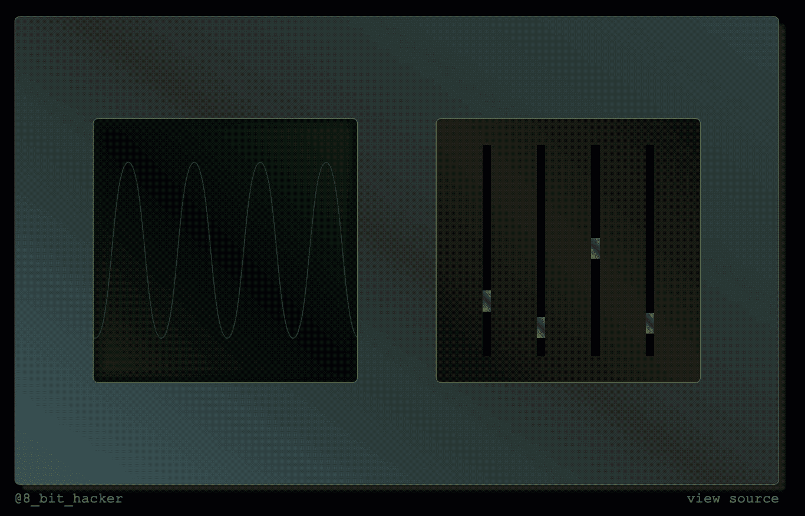

# CSS 动画简介

> 原文：<https://itnext.io/intro-to-css-animations-ca016d57db9c?source=collection_archive---------4----------------------->

## 如何在 CSS3 中创建动画和过渡效果



动画的屏幕截图

## 介绍

CSS3 提供了各种强大的功能来设计网站的外观，并为浏览者创造良好的用户体验。CSS3 中更有趣的特性之一是能够创建视觉上吸引人的动画，利用浏览器的渲染引擎来实现高性能的结果，没有延迟或抖动。

在本文中，我们将了解如何在 CSS3 中从头开始创建自定义动画，以创建一个很酷的硬件控制面板效果，移动滑块并在示波器上绘制模拟波形。

要使用这个项目，唯一的要求是一个现代的网络浏览器和一个编辑器。GitHub 上的[提供了源代码的副本。](https://github.com/kenreilly/css-animation-example)

## HTML 布局

这个项目的标记在通常的**index.html**中:

`head`包含典型的标题和描述，以及用于[开放图](https://www.google.com/search?client=safari&rls=en&q=open+graph&ie=UTF-8&oe=UTF-8)协议的元数据。布局非常标准和简单，有`main`和`footer`部分，一个用于模拟设备屏幕的`output`元素，一个正弦波的 SVG 绘图，以及滑块的定义。注意在 SVG 上设置了*preserve spectra ratio*和 *viewBox* ，以确保它能够正确渲染和缩放。SVG 本身的长度是其显示长度的两倍，然后它的视图框纵横比设置为 1:1，这导致只显示 SVG 宽度的一半，允许它通过使用 CSS 中定义的动画属性沿 x 轴平移其内容来进行动画显示。

这就是 HTML，在这个例子中保持了简洁明了。

## CSS 样式

我们要检查的第一个 CSS 文件是 **style.css** :

第一行导入动画关键帧，我们稍后将对此进行研究。首先，让我们看看主布局的样式。`html`和`body`元素采用标准边距/填充重置和全高度和全宽度设置，而`output`和`section`元素采用 CSS3 Flexbox 设计，以允许它们与屏幕成比例缩放。

svg 被设置为 100%的高度和宽度来填充其父容器，而包含正弦波路径本身的`g`元素没有被填充，笔画宽度为 1。笔画颜色由为此元素定义的动画驱动。让我们来看看这一行以及它是如何构造的:

```
animation: sinewave 2s linear infinite, crt 2s linear infinite;
```

这应用了由逗号分隔符分隔的两个动画:持续时间为两秒的关键帧动画和将永远运行的线性动画曲线[和具有相同属性的 crt 动画。可以添加额外的动画，如上用逗号分隔。](https://developer.mozilla.org/en-US/docs/Web/CSS/animation-timing-function)

滑块使用了`slider`和`slider > thumb`的样式，thumb 元素集被赋予了自己的动画属性:

```
animation: slider 0s linear infinite forwards;
```

`0s`持续时间的原因是我们将为每个滑块设置不同的持续时间，如下所示:

```
slider:nth-child(1) > thumb { animation-duration: 2s; }slider:nth-child(2) > thumb { animation-duration: 5s; }slider:nth-child(3) > thumb { animation-duration: 3s; }slider:nth-child(4) > thumb { animation-duration: 4s; }
```

每个拇指都有不同的动画时长，这意味着每个拇指将以不同的速度在轨道上上下滑动，模拟控制面板上的控制(如自动数字混音控制台)。

## 关键帧

最后，我们将检查 **keyframes.css** 中的关键帧定义:

该文件包含上一个文件中引用的动画关键帧。`sinewave`动画只是用 [translateX](https://developer.mozilla.org/en-US/docs/Web/CSS/transform-function/translateX) 函数平移它所应用的元素。由于只显示 SVG 正弦波宽度的一半，第二半是第一半的精确副本，一旦动画完成，它将重置从`-100%`到`0`的转换，没有可见的变化(因为到动画完成时，渲染的图形看起来与开始时完全一样，允许无缝重置)。`crt`动画为 SVG 的笔画颜色制作动画，给它一个很酷的发光效果。

`slider`动画将滑块拇指沿其轨迹垂直定位在`90%`和`0%`之间，使它们上下滑动。选择值 90%是因为拇指的高度是轨迹的 10%，当定位在 90%时，它将位于滑块的最底部。

## 结论

这个简单的例子演示了 CSS3 中控制样式和动画的一些功能。利用浏览器自己的动画渲染引擎通常优于在 JavaScript 中实现它们，因为渲染引擎是专门为此目的而构建和微调的，并且浏览器可以使用 C++中构建的强大引擎来适当地调度和管理用于渲染的资源，而不是通过 JavaScript VM 来运行动画以进行解释等等。

请继续关注关于 CSS3 和其他主题的更多高级教程。感谢您的阅读，并祝您在 CSS3 中制作出令人惊叹的动画！

> 肯尼斯·雷利( [8_bit_hacker](https://twitter.com/8_bit_hacker) )是 [LevelUP](https://lvl-up.tech) 的 CTO