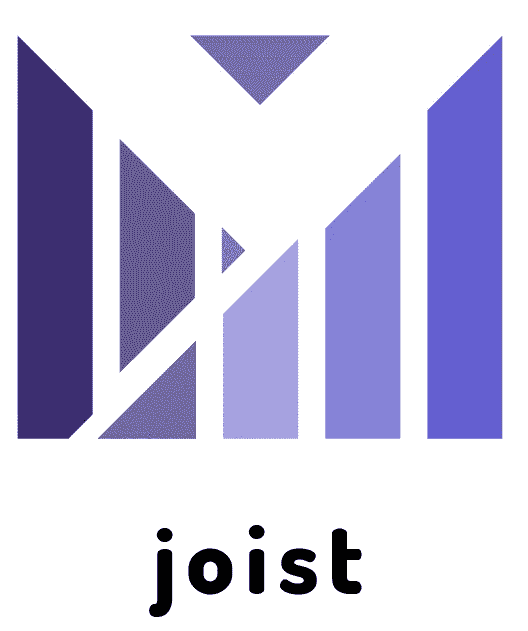

# 引入托梁

> 原文：<https://itnext.io/introducing-joist-313f111a428?source=collection_archive---------2----------------------->



我已经做到了。我做了一件每个人都告诉你作为开发者不要直接遵循“不要构建自己的 cms(我也做过)”的事情。我自己搭建了框架，[托梁](https://github.com/joist-framework/joist)。

在过去的 2 年左右的时间里，我一直在思考我个人是如何喜欢编写应用程序和构建组件的，但我找不到任何东西能完全按照我想要的方式来做。所以我建了托梁，一个我想用的我不介意你也想用的框架:)。

我想要的一些东西:

*   依赖注入
*   小的
*   固执己见的状态管理
*   与框架无关的组件(web 组件)
*   视图层不可知(你可以随时在无视图库、lit-html 和 lighterhtml 之间切换。)

在我看来，托梁符合我的所有标准。它在某些方面固执己见，而在另一些方面却很灵活。在它自己的**@托梁/组件**和**@托梁/di** 一起在 **~2kb** gzipped 和**~ 5kb**lit-html 中称重。

# 入门指南

开始使用托梁最简单的方法是转到 [webcomponents.dev](https://webcomponents.dev/new/) 并使用托梁启动器。Webcomponents.dev 是一个优秀的站点，它允许您使用各种库来构建和发布组件。(说真的，即使你不关心托梁，你也应该去看看。)

如果你想建立一个应用程序，你可以使用创建 Snowpack 应用程序(CSP)。

```
npx create-snowpack-app my-app --template @joist/starter-snowpack
```

这将为您设置一个开发服务器，通过[汇总](https://rollupjs.org/)进行生产构建，通过 [web-test-runner](https://github.com/modernweb-dev/web/tree/master/packages/test-runner) 进行单元测试。

# 元素

托梁与视图库无关，但内置了对 lit-html 的支持，我们将在所有示例中使用它。现在让我们看看托梁元素是什么样子的。

通过扩展 JoistElement 基本定制元素并添加一些组件元数据来定义一个托梁组件。元数据包括新元素的标签名、元素的默认状态和呈现功能。一个托梁渲染函数被传递一个名为 RenderCtx 的对象。

# 组件样式

当您使用阴影 dom 时，您可以使用组件“styles”属性应用样式。当可用时，托梁将利用[可构造样式 sheets](https://developers.google.com/web/updates/2019/02/constructable-stylesheets) ,但是允许渲染器退回到没有支持的浏览器。

# 依赖注入

托梁的核心是依赖注入器。依赖注入器本身完全独立于组件，并且在它自己的包中。每个托梁组件都有自己的注入器，这些注入器继承自单个全局注入器。这允许托梁组件构建它们自己的本地范围的服务以及共享全局单例。用“服务”装饰器装饰的服务将被视为单件。

服务可以通过“注入”装饰器注入到其他服务的构造函数中。

定制元素可以用“get”装饰器注入服务。这将服务映射到实现 InjectorBase 接口的任何类上的属性。你甚至可以将它与其他 web 组件库一起使用，比如微软的 FASTElement。

带有 get decorator 的基于属性的 DI 是“懒惰的”，这意味着服务直到第一次被请求时才会被实例化。

# 状态

托梁构件区分了图元属性和内部状态。更新内部状态将导致组件视图更新。这是为了使状态更新显式。状态的任何变化都会导致视图的变化。通过状态服务可以访问托梁的组件状态。您可以使用 setValue 和 patchValue 方法更新状态，并使用 onChange 观察状态变化。

组件状态是异步更新的，这意味着您可以向 setValue 和 patchValue 传递一个解析到新状态的承诺。

# 性能

由于托梁元素是自定义元素，因此属性的行为与 HTMLElement 的行为相同。用“property”装饰器来装饰您的属性，这将导致每当属性被更新时，您的 elements onPropChanges 方法被用一个 PropChangs 列表调用。您可以使用该反馈来确定元素应该何时更新。

属性也有一个用于运行时验证的挂钩。属性装饰器可以接受一个或多个验证函数，这些函数将在设置属性时运行。如果您正在分发组件，这尤其有用。验证器函数要么返回 null(表示没有错误),要么返回错误消息。

# 经理人

处理程序是托梁更独特的特性之一。处理程序是将“动作”映射到相应方法的方式。多个方法可以映射到一个操作。多个操作可以映射到一个方法。处理程序也可以基于正则表达式匹配操作。一般流程是**事件- >处理程序- >状态改变**。[查看这篇文章，更深入地了解处理程序。](/how-to-handle-yourself-in-joist-fa4b52b2b085)

# 结束语

这是一个快速和肮脏的托梁概述。托梁是为固执己见而建造的，但也可以按菜单使用。我在这里没有提到的包是[@托梁/路由器](https://github.com/joist-framework/joist/tree/master/packages/router)，它是稳定的，但仍在开发中。托梁是一个我已经考虑了很久的项目，我想我对结果很满意！试试看，让我知道你的想法。