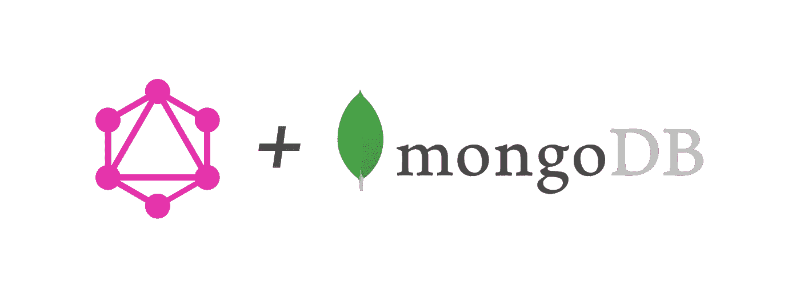

# GraphQL Mongo 助手简介

> 原文：<https://itnext.io/introduction-to-graphql-mongo-helpers-a457944d4c8a?source=collection_archive---------4----------------------->



> 本故事移至:[https://jonathancardoso . com/en/blog/introduction-graph QL-mongo-helpers/](https://jonathancardoso.com/en/blog/introduction-graphql-mongo-helpers/)

如果您正在使用 MongoDB 和 GraphQL，那么您可能在解析器上有一些参数来过滤从 MongoDB 返回的数据。使用这些助手，您可以减少代码重复的数量！

[](https://github.com/entria/graphql-mongo-helpers) [## entria/graphql-mongo-helpers

### graphql-mongo-helpers。在 GitHub 上创建一个帐户，为 entria/graphql-mongo-helpers 的开发做出贡献。

github.com](https://github.com/entria/graphql-mongo-helpers) 

## 安装

`yarn install @entria/graphql-mongo-helpers`

现在，这个包有两个助手，`createMongoConditionsFromFilters`和`buildSortFromArg`。在这篇文章中，我们将研究第一个问题。

## createMongoConditionsFromFilters(filter arg，映射，上下文)

这个助手的基本思想是，如果你有一个如下所示的解析器:

您可以为`filter`参数定义一个映射:

在解析器里做这样的事情:

如果客户端提供了以下查询:

```
query ExampleQuery {
  users(filter: {
    username: "Blah"
    age: 19
  })
}
```

`filterResult`将具有以下价值:

如您所见，username 变成了一个正则表达式，而 age 作为 in 传递，因为我们还没有映射它。

默认情况下，未映射的字段被视为具有`MATCH_1_TO_1`的`type`和与传递的字段相同的`key`。

## 经营者

您也可以使用 [MongoDB 比较运算符](https://docs.mongodb.com/manual/reference/operator/query/#comparison)，您只需要在 GraphQL 输入类型中用它作为字段名的后缀。请记住，在映射中，您不需要指定后缀，只需指定字段名即可，例如，如果我们没有使用`age: Int`，而是使用了`age_gte: Int`，那么上面的`filterResult`将如下所示:

## 高级过滤器类型

除了`MATCH_1_TO_1`之外，还有`AGGREGATE_PIPELINE`和`CUSTOM_CONDITION`，`CUSTOM_CONDITION`基本上是一个`MATCH_1_TO_1`，但是需要使用`format`函数来返回一些条件，这些条件将被合并到结果对象中。

例如，以下内容:

会将`$or`添加到最终的`conditions`对象中。

> 注意:如果你想让客户像上面那样指定`OR`条件，也有支持:

## 聚合 _ 管道

如果您的过滤器依赖于某些只能通过 [MongoDB 聚合管道](https://docs.mongodb.com/manual/core/aggregation-pipeline/)获得的数据，那么这就是您想要使用的类型:

从上面的例子可以看出，我们可以将两种类型结合在一起。

> 注意:如果你有一个`AGGREGATE_PIPELINE`类型的过滤器，你不能使用`AND`或`OR`，就像前面的例子一样

就这样，另一个叫做`[buildSortAr](https://github.com/entria/graphql-mongo-helpers/commit/a9f59ecbf01d4613c14702316b93ef5ea871b932)g`的助手是另一个职位的材料，而且简单得多:

[](https://medium.com/@jonathancardoso/client-supplied-custom-sorting-using-graphql-54e4b87f6011) [## 使用 GraphQL 的客户端提供的自定义排序

### 根据客户端发送的参数，对从 API 返回的数据进行排序的需求并不少见。休息一下，我们可以…

medium.com](https://medium.com/@jonathancardoso/client-supplied-custom-sorting-using-graphql-54e4b87f6011) 

你也可以在推特上找到我: [@_jonathancardos](https://twitter.com/_jonathancardos)