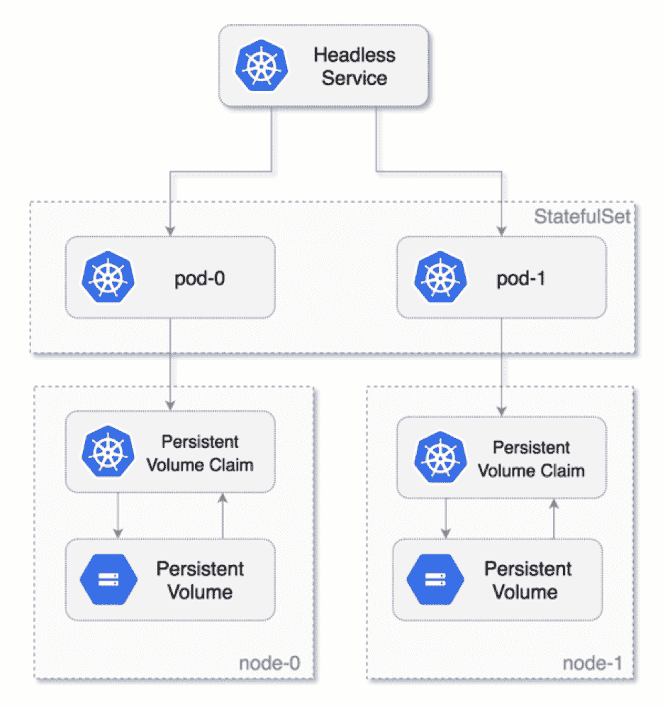

# 有状态服务简介

> 原文：<https://itnext.io/introduction-to-stateful-services-kubernetes-6018fd99338d?source=collection_archive---------3----------------------->


Kubernetes 标志

ubernetes 是一个容器编排工具，用于扩展、部署和管理容器化的应用程序。这些是 Kubernetes 中部署 pod 的方法:ReplicaSet、Deployments、StatefulSets 和 DeamonSet。

一个问题出现了，为什么我们需要有状态集合？

在写这篇博客的时候，我假设你熟悉 Kubernetes 的基础知识。而且，您以前知道容器、pod、持久性卷等术语的含义。

# 状态集

ReplicaSet、Deployments 和 DaemonSet 可以与无状态应用程序无缝协作，但它们不适合有状态应用程序，如 MySQL、Kafka 等。这就是 StatefulSets 发挥作用的地方。想象一个场景，你想按顺序部署你的容器，这是可能的。这个博客是关于有状态集合的，因为我们正在讨论有状态应用程序。

Kubernetes 中的 StatefulSets 用于有状态应用程序。状态集中的 pod 使用唯一的身份和稳定的主机名来命名。它将状态信息和其他弹性数据存储在永久卷中。这个持久卷附加到基于云的存储。它将负责维护应用程序的状态。

StatefulSet 上下文中的持久卷声明，因此当创建 StatefulSet 和每个副本时，Kubernetes 将继续为 StatefulSet 中的每个副本创建不同的磁盘。

现在，当 Kubernetes 开始的时候，你能做复制的唯一方法是使用一个复制集。有了副本集，每个副本都被完全相同地对待。他们在应用程序名称的末尾有随机散列。如果发生缩放事件，例如缩小，则随机选择一个容器并删除。这些特征使得 ReplicaSet 很难映射到有状态的应用程序。许多有状态的应用程序希望它们的主机名保持不变。因此，使用复制集和有状态应用程序的复杂性导致了有状态集的最终发展。Kubernetes 中的 StatefulSets 类似于 ReplicaSet，但是它增加了一些保证，使得在 Kubernetes 内部管理有状态应用程序更加容易。

```
apiVersion: apps/v1
kind: StatefulSet
metadata:
  name: mysql
spec:
  selector:
    matchLabels:
      app: mysql
  serviceName: mysql
  replicas: 3
  template:
    metadata:
      labels:
        app: mysql
    spec:
      initContainers:
      - name: init-mysql
        image: mysql:5.7
        command:
        - bash
        - "-c"
        - *|
          set -ex
          # Generate mysql server-id from pod ordinal index.
          [[ `hostname` =~ -([0-9]+)$ ]] || exit 1
          ordinal=${BASH_REMATCH[1]}
          echo [mysqld] > /mnt/conf.d/server-id.cnf
          # Add an offset to avoid reserved server-id=0 value.
          echo server-id=$((100 + $ordinal)) >> /mnt/conf.d/server-id.cnf
          # Copy appropriate conf.d files from config-map to emptyDir.
          if [[ $ordinal -eq 0 ]]; then
            cp /mnt/config-map/master.cnf /mnt/conf.d/
          else
            cp /mnt/config-map/slave.cnf /mnt/conf.d/
          fi*
        volumeMounts:
        - name: conf
          mountPath: /mnt/conf.d
        - name: config-map
          mountPath: /mnt/config-map
  volumeClaimTemplates:
  - metadata:
      name: data
    spec:
      accessModes: ["ReadWriteOnce"]
      resources:
        requests:
          storage: 10Gi
```

stateful set 的工作方式类似于部署，但是在 stateful set 中，容器的部署是按顺序进行的。它不是一次性部署所有容器，而是一个接一个地顺序部署。一旦第一个 pod 部署完毕并准备就绪，那么只有第二个 pod 可以启动。为了有正确的参考，这些 pod 有一个带有唯一 ID 的名称，以显示其唯一的身份。因此，举例来说，如果有 3 个 MySQL 的豆荚，名称将是 mysql-0，mysql-1 和 mysql-2。而且，如果这些 pod 中的任何一个出现故障，StatefulSets 将部署一个同名的新 pod。StatefulSets 需要无头服务来管理唯一标识。下图显示了 StatefulSets 的体系结构:



# 在状态集中缩放

当 Kubernetes 决定扩大或缩小一个 StatefulSet 时，它以一种很好理解的方式来做。例如，当您最初创建 StatefulSet 时，会创建第一个副本，Kubernetes 会等待它变得健康和可用，然后再创建第二个副本。这意味着当创建第二个副本时，您可以依赖第零个索引(第一个副本)可供您连接。它可以指向 StatefulSet 的原始成员。这使得在创建有状态应用程序时声明初始领导者和许多其他必要的事情变得更加容易。

同样，当您缩小规模时，Kubernetes 将从最高的索引开始删除。因此，如果您从三个副本缩减到两个副本，将从删除索引 2 处的副本开始。

# 结论

因此，希望这能给你一个有状态应用程序是如何在 Kubernetes 中部署的，以及你如何为这样的应用程序使用 StatefulSets 的例子。这篇博客之后的下一步是建立一个 StatefulSet。

— — — — —

我在 Kubernetes 做咨询，如果你有任何疑问，请随时联系我。(https://danielckv.com | | contact@danielckv.com)