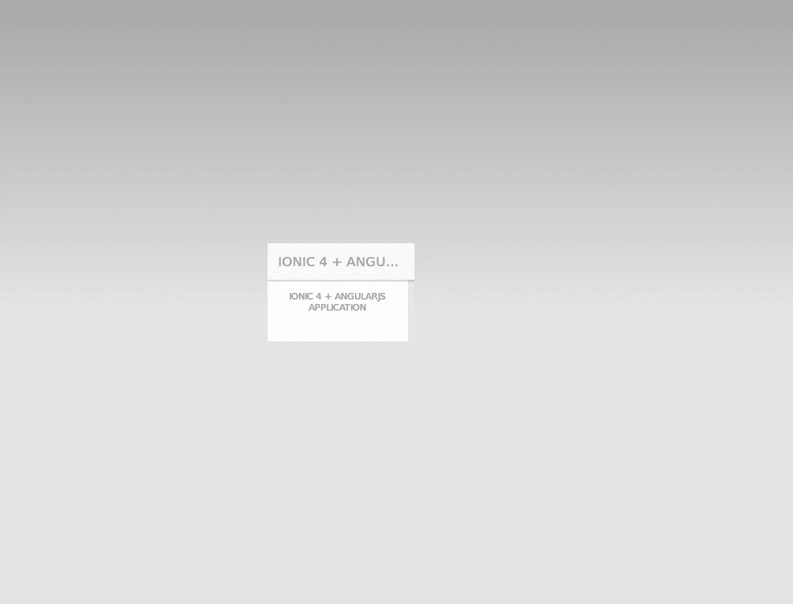
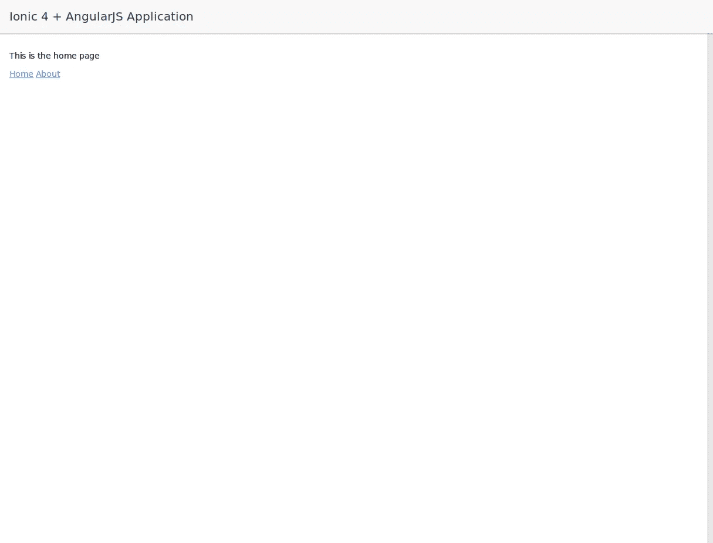

# AngularJS 和 Cordova 的 Ionic 4 教程

> 原文：<https://itnext.io/ionic-4-tutorial-with-angularjs-and-cordova-982b951ce8f9?source=collection_archive---------7----------------------->

你喜欢用 Angular.js 构建 Ionic 1.x 应用吗？但被迫迁移到 TypeScript/Angular 2+以使用不再支持 AngularJS 的最新 Ionic 版本(2+)，还是因为不想使用 TypeScript 而仍然使用 Ionic 1.x 版本？如果是的话，那么幸运的是，你现在可以在 Ionic (4+)的最新和未来版本中使用 JavaScript 和 AngularJS，因为 Ionic 从版本 4 开始就是框架不可知的。

由于 Ionic CLI 还不支持生成框架无关的应用程序，我们将手动执行 Ionic CLI 在幕后为我们做的不同任务(主要是与集成 Cordova 相关的事情)

所以现在你需要生成一个新的 Cordova 项目

# 先决条件

不言而喻，你需要在 Node、NPM 和 Cordova 上安装你需要的目标平台(比如 Android 或 iOS)的 SDK，以及一台用于构建 iOS 应用的 MAC。

# 安装 Cordova

如果您没有安装 Cordova，您可以简单地运行以下命令

根据您的 npm 配置，您可能需要添加 *sudo* 来全局安装软件包。

# 生成新的科尔多瓦项目

现在，让我们通过运行以下命令来生成一个新的 Cordova 项目:

```
cordova create ionic4-cordova-angularjs
```

# 安装 AngularJS 和 Ionic 4 核心组件

在您的 Cordova 项目中导航，然后从 npm 安装 AngularJS 和 Ionic 4 核心包(其中包含 Ionic 4 的已编译模板组件/Web 组件)

```
cd ionic4-cordova-angularjs npm install angular npm install @ionic/core
```

你现在可以在你的 Cordova 应用中使用 AngularJS 和 Ionic 4 组件，但是由于它们安装在`node_modules`中，你需要使用钩子脚本或者手动将它们复制到`www`中。为了简单起见，我将手动把它们复制到`www/js`文件夹中。

请注意，您需要整个`@ionic`文件夹才能让 Ionic 正常工作。

然后你可以用一个`<script>`标签来包含它们，所以打开`www/index.html`，然后添加下面的代码:

```
<script src="js/angular.min.js"></script> <script src='js/@ionic/core/dist/ionic.js'></script>
```

# 添加浏览器平台

接下来让我们添加[浏览器平台](https://github.com/apache/cordova-browser)，它允许您构建运行在浏览器中的 Cordova 应用程序(以及 PWAs)

所以回到您的终端，确保您在您的 Cordova 应用程序中，然后运行以下命令:

```
cordova platform add browser
```

然后您可以使用运行您的应用程序

您的应用将使用您的默认浏览器启动，并从`[http://localhost:8000/](http://localhost:8000/.)` [开始提供服务。](http://localhost:8000/.)

# 使用 UI 路由器添加路由

在添加任何页面之前，让我们首先使用 [UI-Router](https://ui-router.github.io/ng1/) 在 Cordova 应用程序中设置路由

> *UI-Router 是 AngularJS 中路由的事实标准。受核心 angular router $route 和 Ember Router 的影响，UI-Router 已经成为 AngularJS (1.x)中路由非平凡应用的标准选择。*

所以回到您的终端，然后运行以下命令从 npm 安装路由器:

```
npm install --save @uirouter/angularjs
```

再次将`angular-ui-router.js`从`node_modules`文件夹中的`@uirouter`复制到`www/js`文件夹中，然后添加一个`<script>`将其包含在`www/index.html`文件中

```
<script src="js/angular-ui-router.js"></script>
```

# 创建 AngularJS 应用程序并添加状态

接下来，您需要创建一个 AngularJS 应用程序，因此在`www`中创建一个`app.js`，然后添加以下代码:

```
var myApp = angular.module('app', ['ui.router']); myApp.config(function($stateProvider,$urlRouterProvider) { var homeState = { name: 'home', url: '/home', component: 'home' } var aboutState = { name: 'about', url: '/about', component: 'about' } $stateProvider.state(homeState) $stateProvider.state(aboutState); $urlRouterProvider.otherwise('/home'); });
```

# 创建你的离子页面

让我们创建我们的第一个离子页面。创建一个名为 pages 的文件夹。在它里面创建一个包含文件`home.html`和`home.js`的`home`文件夹

```
mkdir pages cd pages mkdir home touch home.html touch home.js
```

打开`home.html`然后添加以下内容

```
<ion-page class="show-page"> <ion-header> <ion-toolbar> <ion-title>Ionic 4 + AngularJS Application </ion-title> </ion-toolbar> </ion-header> <ion-content class="content" padding> <p>This is the home page</p> <a ui-sref="home" ui-sref-active="active">Home</a> <a ui-sref="about" ui-sref-active="active">About</a> </ion-content> </ion-page>
```

接下来打开`home.js`并添加以下代码

```
angular.module('app').component('home', { templateUrl: './pages/home/home.html', controller: function() { console.log("home component"); } })
```

现在让我们创建关于页面。创建 about 文件夹，然后在其中添加`about.html`和`about.js`

打开`about.html`然后添加以下代码

```
<ion-app> <ion-page class="show-page"> <ion-header> <ion-toolbar> <ion-title>Ionic 4 + AngularJS Application </ion-title> </ion-toolbar> </ion-header> <ion-content class="content" padding> <p>This is the about page</p> <a ui-sref="home" ui-sref-active="active">Home</a> <a ui-sref="about" ui-sref-active="active">About</a> </ion-content> </ion-page> </ion-app>
```

接下来打开`about.js`并添加以下代码:

```
angular.module('app').component('about', { templateUrl: './pages/about/about.html', controller: function() { console.log("about component"); } })
```

您需要在`index.html`中包含这些组件

```
<script src="./app.js"></script> <script src="./pages/home/home.js"></script> <script src="./pages/about/about.js"></script>
```

接下来更改`<body>`以添加这些更改

```
<body ng-app="app"> <ion-app> <ui-view></ui-view> </ion-app> <script type="text/javascript" src="cordova.js"></script> </body>
```

如果您遇到如下屏幕截图所示的缩放问题



你只需要在你的`index.html`文件的`<head>`中添加以下从 Ionic 应用程序复制的标签

```
<meta name="viewport" content="width=device-width,initial-scale=1.0"> <meta http-equiv="Content-Security-Policy" content="default-src 'self' data: gap: https://ssl.gstatic.com 'unsafe-eval'; style-src 'self' 'unsafe-inline'; media-src *; img-src 'self' data: content:;"> <meta name="viewport" content="width=device-width, initial-scale=1.0, minimum-scale=1.0, maximum-scale=1.0, user-scalable=no"> <meta name="format-detection" content="telephone=no"> <meta name="msapplication-tap-highlight" content="no">
```

现在，如果你使用`cordova run`运行你的应用程序，你应该会看到下面的页面



您可以使用链接在主页和“关于”页面之间导航

# 添加目标 Cordova 平台

您可以使用添加目标平台

```
cd ionic4-cordova-angularjs cordova platform add ios --save cordova platform add android --save
```

这将在 Android 和 iOS 平台投放广告

# 在真实设备中运行应用

您也可以使用真实设备运行您的应用程序，首先连接一个设备，然后运行以下命令

```
cordova run android --device
```

还是为了 iOS

# 结论

在本教程中，我们已经看到了如何使用 AngularJS 离子 4 组件。

*最初发表于*[*【www.techiediaries.com】*](https://www.techiediaries.com/ionic-angularjs/)*。*