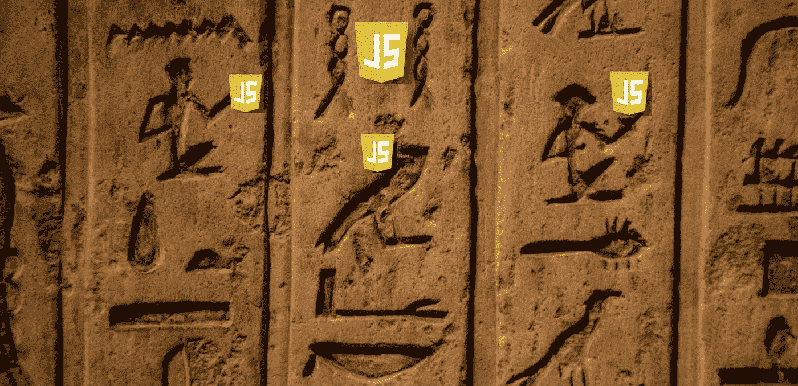

# JavaScript 中的符号真的有用吗？

> 原文：<https://itnext.io/is-symbol-really-useful-6ada04ca858f?source=collection_archive---------6----------------------->



## 符号，ES2015 中引入的被低估的功能。除了面试问题还有其他目的吗？

# 快速回顾一下，那些“符号”到底是什么？

> *代表唯一的非字符串对象属性关键字的原始值*

这是当前[规范](http://www.ecma-international.org/ecma-262/#sec-symbol-value)中的符号定义。但这意味着什么呢？你大概知道 JS 里其他的原语类型(`Undefined`、`Null`、`Boolean`、`Number`、`BigInt`或者`String`)。符号是另一个。我知道这并不多，听起来像是定义递归:

> 为了理解递归，你必须首先理解递归

在编程语言中，所有的基本类型都只是存储在内存中的一堆字节。不管它是字符串还是数字，从数据的角度来看，它仍然只是字节。在符号的情况下，它们是用作唯一 id 的`tokens`。

## 如何使用符号

```
// string "id" is a Symbol's description
const id = Symbol('id');

// you can also create Symbol without description
const noDescriptionId = Symbol();
```

我们刚刚创建了一个符号`id`。但重要的是`id !== Symbol('id')`。就像我说过的，早期的符号是独一无二的。

## 除非他们不是…

还有另一种创造符号的方法，叫做

```
Symbol.for('id');

assert(Symbol.for('id') === Symbol.for('id')); // true
```

好吧，这里发生了什么？我们刚刚使用了`global Symbol registry`来存储我们的符号。顾名思义，它是一个`global`注册表，在这种情况下，global 也是跨领域的(在 JS 中，这意味着在 iframe 中创建的符号，与当前执行上下文中的符号相同)。

旁注:你可以检查符号是否唯一。为此，您可以使用`Symbol.keyFor(yourSymbol)`。如果`yourSymbol`是全局的，那么它返回符号的描述(`id`)作为字符串，否则它返回`undefined`。

```
assert(Symbol.keyFor(Symbol.for('id')) === 'id');
assert(Symbol.keyFor(Symbol('id')) === undefined);
```

## 你需要知道的属性

*   符号永远不会与对象键冲突。您可以使用符号作为对象键`store[Symbol.for('id')] = 42`。
*   使用符号创建的密钥是不可迭代的。所以当你调用`Object.values(store)`时，你不会得到`42`，除非有另一个键(不是符号键)有那个值。这是一个非常有用的属性，因为当你添加另一个属性时，它不会改变库的行为。
*   要从对象中提取符号，可以使用`Object.getOwnPropertySymbols()`。
*   符号被复制到其他对象。当`Object.assign(a, b)`被调用时，每个可枚举的符号都从 obj `a`复制到 obj `b`中。

# 符号的有用性

现在当你知道什么是符号，我们可以讨论为什么你应该认为符号有用？让我们假设您正在创建一个库，并想让您的用户有可能扩展您的库。

你的库叫做`stateOfTheArtValidation`(简称`stav`)。它导出您可以分配给对象的可用扩展列表。

```
export const extensibleSymbols = {
  VALIDATION: Symbol('validationFun'),
  REQUIRED: Symbol('required'),
};
```

现在我们可以在我们的对象中使用任何这些符号。

```
const myObj = {
  someProp: 'anyValue',
  [stav.Symbols.VALIDATION]: element => element.hasOwnProperty('someProp'),
};
```

在我们讨论它之前，让我先向您展示一下您的库是如何处理它的。

```
// somewhere in our library
validate: (...objectsToValidate) => {
  const validations = [];

  for (const objToValidate of objectsToValidate) {
    if (typeof objToValidate[this.Symbols.VALIDATION] === 'function') {
      validations.push({
        result: objToValidate[this.Symbols.VALIDATION](objToValidate),
      });
    } else {
      validations.push({
        result: this.standardValidation(objToValidate),
      });
    }
  }

  return validations;
};
```

`validate`是您库中的一个方法。但是在某些情况下，您想让用户选择应用他们的验证，而不是您的`standardValidation`方法。您没有定义用户可以用来附加验证方法的字符串属性列表，而是为它定义了 Symbol。这样，与该对象上的任何现有键发生冲突的可能性为 0%,因此用户不会意外地覆盖您想要使用的属性。

那个例子并不是很有用，但是你可以得到一个想法。

# [知名符号](https://tc39.es/ecma262/#sec-well-known-symbols)

> *公知符号是本规范的算法明确引用的内置符号值。*

已经有人通过在 JS 中创建内置符号来考虑这个问题了。这些符号对于覆盖对象或向对象添加功能非常有用。例如，您可以使用`Symbol.iterator`来定义迭代器，并使您的对象以您想要的方式可迭代。

```
const myObj = {
  test: 'test',
};

myObj[Symbol.iterator] = function* myGenerator() {
  yield this.test;
  yield 'See ya!';
};

for (const val of myObj) {
  console.log(val);
}
```

印刷品:

```
test
See ya!
```

# 结论

现在你明白符号是多么强大和有用了。也许你会更多地使用内置符号，而不是定义自己的符号。但是库的创建者(像你:P)有另一种方法让用户扩展库的功能。

*最初发布于*[*https://erdem . pl*](https://erdem.pl/2019/07/is-symbol-really-useful)*。*