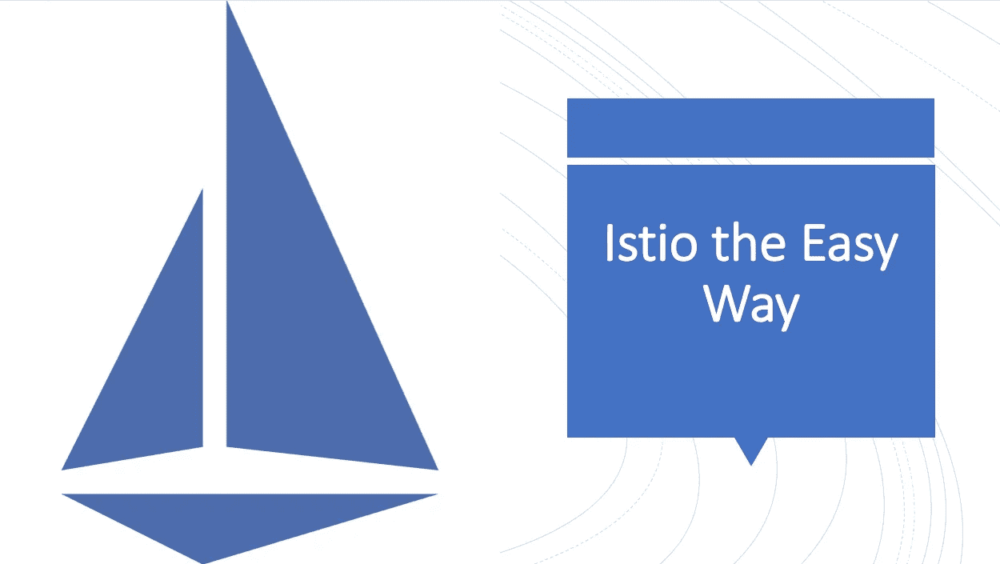

# 这是最简单的方法

> 原文：<https://itnext.io/istio-the-easy-way-8ddcea6f947d?source=collection_archive---------7----------------------->



我目前正在为[曼宁出版社](https://www.manning.com)写一本书，书名为 [Istio in Action](https://www.manning.com/books/istio-in-action) ，这本书的目标是帮助人们了解并从 [Istio](https://istio.io) 中获得最大利益，这是一个开源服务网格。我正试图将我从社区中获得的知识和经验，以及那些已经踏上服务网格采用之旅的其他人的知识和经验，汇集到服务网格社区的其他人身上。

在那些成功采用 Istio 的组织中，一个有趣的观察结果似乎是正确的，那就是他们倾向于在转向更广泛的问题之前专注于解决一组特定的和集中的问题。换句话说，他们倾向于渐进地采用 Istio，并展示特定问题的价值，而不是全身心投入并采用 Istio 能做的一切。

例如，组织可能需要加密入口网关和终端服务之间的流量。或者，他们可能正在进行更紧迫的指标收集和跟踪工作。逐步采用 Istio 可以为这些用例带来很多价值，而不会陷入复杂性，也不会将一大群利益相关者带入一个可能会拖上几个月甚至几年的过程。

# 服务网格入门

在这一点上，如果你想快速开始使用任何服务网格( [Istio](https://istio.io) 、 [Linkerd](https://linkerd.io) 、 [AWS AppMesh](https://aws.amazon.com/app-mesh/) 等)，你应该看看 Solo.io 的一个开源项目，名为 [SuperGloo](https://supergloo.solo.io) 。有了 SuperGloo，你可以用一组统一的命令[快速引导一个网格](https://supergloo.solo.io/mesh/tutorials/istio/tutorials-1-trafficshifting/)，并根据需要探索和比较/对比它们。这样做的一个很好的例子是 [Shopify 最近的 Istio vs Linkerd perf 基准测试文章](https://t.co/Gs1Sk2kE5x)，由 [SuperGloo](https://supergloo.solo.io) 促成。例如，要使用 SuperGloo 安装 Istio:

```
$ supergloo install istio --name istio
```

或者安装 Linkerd:

```
$ supergloo install linkerd --name linkerd
```

# 增量组织

为了逐步采用 Istio，我们可以使用以下预定义的 Istio 概要文件。例如，要开始安装 Istio 的[基本、最小安装，请运行以下命令:](https://github.com/istioinaction/book-source-code/tree/update-to-latest-istio/istio-1.1/install)

```
$ kubectl create ns istio-system
$ kubectl apply -f kubectl apply -f \
https://raw.githubusercontent.com/istioinaction/book-source-code/update-to-latest-istio/istio-1.1/install/10-istio-minimal.yaml
```

这种最小安装将只安装两个组件:

```
$ kubectl get pod -n istio-systemNAME READY STATUS RESTARTSistio-ingressgateway-744b97db5b-wd55k 1/1 Running 0istio-pilot-6f58c66f4d-9bsbd 1/1 Running 0
```

有了这两个组件，您就可以创建一个服务网格，[收集重要的网络指标](https://istio.io/docs/tasks/telemetry/metrics/)(请求/秒、延迟、错误率等)，增加弹性，如[重试、超时和断路器](https://istio.io/docs/tasks/traffic-management/circuit-breaking/)，以及为流量整形提供[请求级控制。您可以使用`istioctl` CLI 来插入适当的 sidecar 代理，它们构成了网格的数据平面。例如，从 Istio 引导](https://istio.io/docs/tasks/traffic-management/request-routing/) [hello-world 示例](https://github.com/istio/istio/tree/master/samples/helloworld)

```
$ kubectl apply -f <(istioctl kube-inject -f \
 samples/helloworld/helloworld.yaml)
```

仅通过这两个 Istio 组件，您就可以获得许多开箱即用的功能。

当你准备好了，你可以采用 Istio 的“中等”配置文件。例如，[使用下面的概要文件](https://github.com/istioinaction/book-source-code/tree/update-to-latest-istio/istio-1.1/install)，我们可以介绍 Istio Citadel 的安全性:

```
$ kubectl apply -f \
https://raw.githubusercontent.com/istioinaction/book-source-code/update-to-latest-istio/istio-1.1/install/40-istio-medium.yaml
```

在这次安装中，您可以看到我们添加了两个新组件:Istio Citadel 和 Istio sidecar 注射器。

```
$ kubectl get pod -n istio-systemNAME READY STATUS RESTARTSistio-citadel-5589dfdf7b-k6jhl 1/1 Running 0istio-ingressgateway-744b97db5b-wd55k 1/1 Running 0istio-pilot-59f5795597-pdzqt 2/2 Running 0istio-sidecar-injector-6f6f78645f-snpgn 1/1 Running 0
```

您现在可以利用[自动边车注射](https://istio.io/docs/setup/kubernetes/additional-setup/sidecar-injection/#automatic-sidecar-injection)、 [JWT 验证](https://istio.io/help/ops/security/end-user-auth/)和[透明 mTLS](https://istio.io/docs/tasks/security/mutual-tls/) 。有了这样一个细长的控制平面，我们可以利用我们需要的功能，而不会陷入复杂性。

# 将 Istio 与您的环境集成

在这一点上你有一个细长的 Istio 控制平面，你可能想集成(或 [gloo](https://gloo.solo.io) ？)到 Istio 服务网格的真实环境。例如，您可能希望将您的安装与 [Prometheus](https://prometheus.io) 的*集成在一起(一个 Prometheus 开箱即用 Istio 的例子，但是您必须对其配置进行逆向工程以获得正确的作业设置)。此时，我们可以利用 SuperGloo 来帮助“Gloo”我们的环境。例如，[如果我们想要配置我们自己的 Prometheus 服务器](https://supergloo.solo.io/mesh/tutorials/istio/tutorials-3-prometheus-metrics/)，名为`prometheus-server`，位于`prometheus-test`名称空间中，我们可以像这样利用 SuperGloo:*

```
$ supergloo set mesh stats**\ ** 
 --target-mesh supergloo-system.istio **\ ** 
 --prometheus-configmap prometheus-test.prometheus-server
```

这将[在 Prometheus configmap](https://supergloo.solo.io/mesh/tutorials/istio/tutorials-3-prometheus-metrics/) 中设置正确的作业，以抓取您的 Istio 的数据平面和控制平面。不要再试图挖掘正确的配置来为 Istio 安装设置您的抓取作业。

与 Istio 的另一个相当常见的集成是[建立您自己的根 CA，Istio 可以使用它来签署证书](https://supergloo.solo.io/mesh/tutorials/istio/tutorials-2-root-cert/)，它将证书分发给 sidecar 代理以建立 MTL。使用 SuperGloo，您可以运行以下命令来自动完成这项工作:

```
$ supergloo set mesh rootcert \
 --target-mesh supergloo-system.istio **\ ** 
 --tls-secret supergloo-system.my-root-ca
```

即使您没有使用 SuperGloo 安装您的 Istio，SuperGloo 也可以自动发现一个 Istio 安装并“做正确的事情”。为了[安装 SuperGloo](https://supergloo.solo.io/installation/) 并开始使用其工具来[简化 Istio 与您的环境的集成](https://supergloo.solo.io/mesh/tutorials/istio/) ( [就像配置您的 Prometheus 服务器](https://supergloo.solo.io/mesh/tutorials/istio/tutorials-3-prometheus-metrics/))，请查看 [SuperGloo 文档](https://supergloo.solo.io)。

对于《Istio in Action》这本书，我正在编写一套用于采用 Istio 的资料。你可以在 GitHub 上看到其余的。要自己生成它们，您可以在股票 Istio 舵图中调整这些不同的设置:

```
helm template $ISTIO_RELEASE/install/kubernetes/helm/istio \
 --name istio \ 
 --namespace istio-system \ 
 --set gateways.enabled=true \ 
 --set security.enabled=false \ 
 --set global.mtls.enabled=false \ 
 --set galley.enabled=false \ 
 --set global.useMCP=false \ 
 --set sidecarInjectorWebhook.enabled=false \ 
 --set mixer.enabled=false \ 
 --set mixer.policy.enabled=false \ 
 --set mixer.telemetry.enabled=false \ 
 --set prometheus.enabled=false \ 
 --set grafana.enabled=false \ 
 --set tracing.enabled=false \ 
 --set kiali.enabled=false \ 
 --set pilot.sidecar=false
```

# 追踪

在接下来的博客中，我们将看到如何以类似的方式采用其他服务网格，例如 [Linkerd](https://linkerd.io) 和 [AWS 应用网格](https://aws.amazon.com/app-mesh/)。要了解更多关于 [Solo.io 的信息，请访问我们的网站](http://www.solo.io)或通过电子邮件联系@solo.io。

*原载于 2019 年 4 月 23 日*[*https://medium.com*](https://medium.com/solo-io/istio-the-easy-way-de66e6eba4a1)*。*