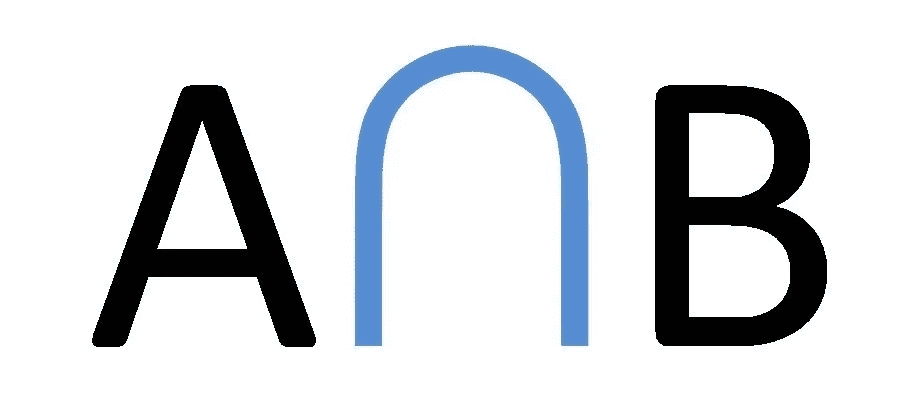

# Java 泛型:交集类型

> 原文：<https://itnext.io/java-generics-intersection-types-23b2fbdddfbb?source=collection_archive---------3----------------------->

## Java 5 中的未知特性以及 Java 8 和 10 中的一些改进

泛型是在**Java 5**(2004 年)中作为杀手级特性引入的，从那以后被 Java 开发人员广泛使用，但是泛型中有一个特性叫做`Intersection Types`，很多 Java 开发人员都不知道。在本文中，我将介绍这一特性及其在泛型类和方法中的用法，以及它在用于类型推断的 **Java 8** lambda 表达式和 **Java 10** `var`关键字中的用法和改进。

# 到底什么是交集类型？

让我们假设我们想要设计一个新的日志聚合器系统作为数据类型，以便它可以读取和流式传输日志，根据[接口分离原则(ISP)](https://en.wikipedia.org/wiki/Interface_segregation_principle) 在[固体原则](https://en.wikipedia.org/wiki/SOLID)中，最好将这两个概念定义到两个单独的接口中，而不是一个接口中:

现在我们想实现一个名为`streamLog`的方法，它只接受同时实现 LogReader 和 LogStreamer 接口的日志聚合器系统。我们做什么呢

## 第一种方法:定义新的接口

通过定义一个名为`LogReaderStreamer`的新接口，我们可以将输入参数限制为我们想要的类型:

现在我们可以这样实现`streamLog`方法:

## 第二种方法:使用交叉点类型

定义一个新的接口并不是一个好主意，而且会产生大量的样板代码。交集类型是 Java 中泛型类型的一种形式，它在泛型类型参数中使用`&`语法，看起来像这个`<T extends TypeA & TypeB>`，其中`T`是一个类型参数，`TypeA`和`TypeB`是两种类型。这个泛型类型表示`T`应该扩展`TypeA`和`TypeB`。通过使用交集类型，我们不需要定义新的接口，可以像这样实现`streamLog`方法:

第二种方法更具可扩展性和可维护性。

# 使用 Java 8 中的交集类型强制转换 lambda 表达式

在 Java 8 中，我们可以使用交集类型将 lambda 表达式转换为几种类型，并向其添加其他行为。在我们之前的例子中`LogReader`和`LogStreamer`是函数接口，假设我们需要使它们可序列化，为此我们可以这样使用交集类型:

通过使用交集类型强制转换 lambda 表达式，我们使`LogReader` lambda 表达式可序列化，但在使用交集类型声明变量时有一个小问题，logReader 变量类型应该是`LogReader`或`Serializable`，然后当我们想要将它发送给仅获得`Serializable`类型的`serializeIt`方法时，我们应该将其强制转换为`Serializable`。

# *使用 Java 10 var 捕捉交集类型*

由于在 Java 10 中引入了局部变量类型推断，我们可以在局部变量级别做同样的事情，让编译器推断类型:

现在，我们可以将 logger 变量发送给`serializeIt`方法，而无需强制转换。

# 结论

交集类型是泛型特性的一部分，是在**Java 5**(2004 年)中引入的，但是一些 Java 开发人员并不知道它。在需要从两种或更多种类型扩展，但又不想为此定义新的接口或类的情况下，这可能是一个很好的解决方案。

通过在 Java 8 中引入 lambda 表达式和在 Java 10 中引入局部变量类型推断，交集类型的使用得到了很大的改进。