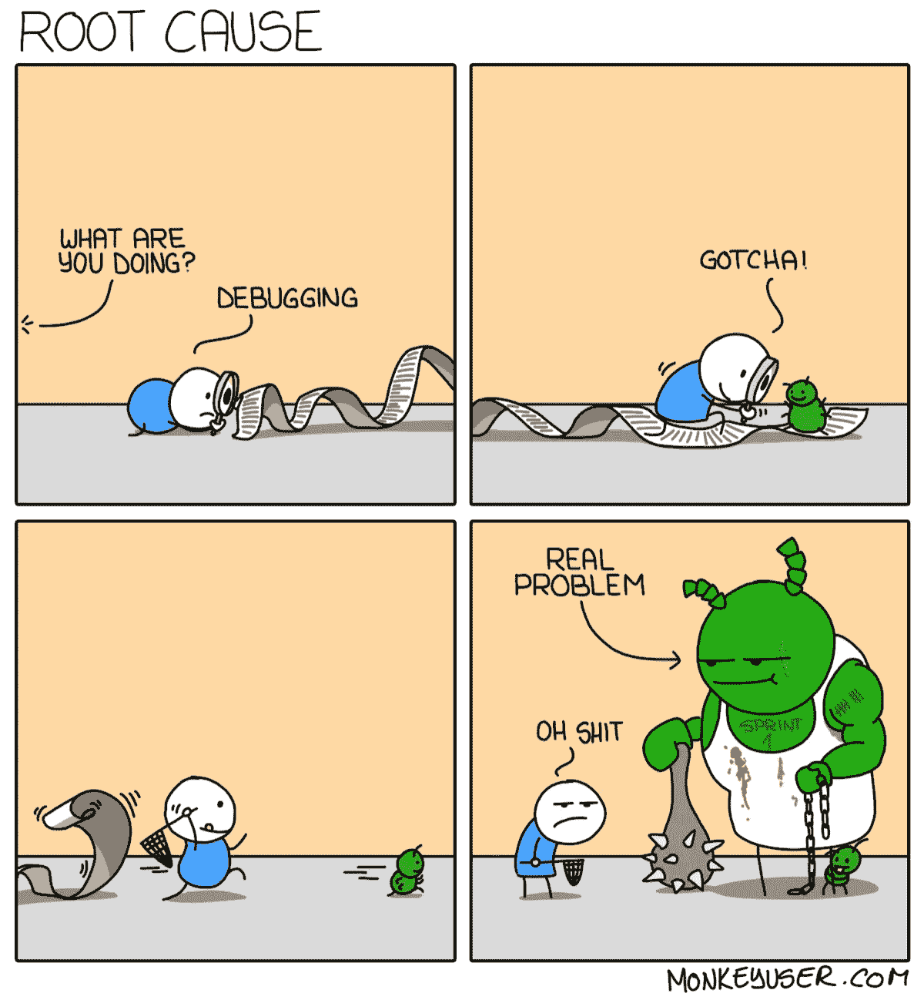
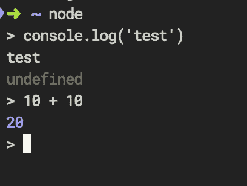
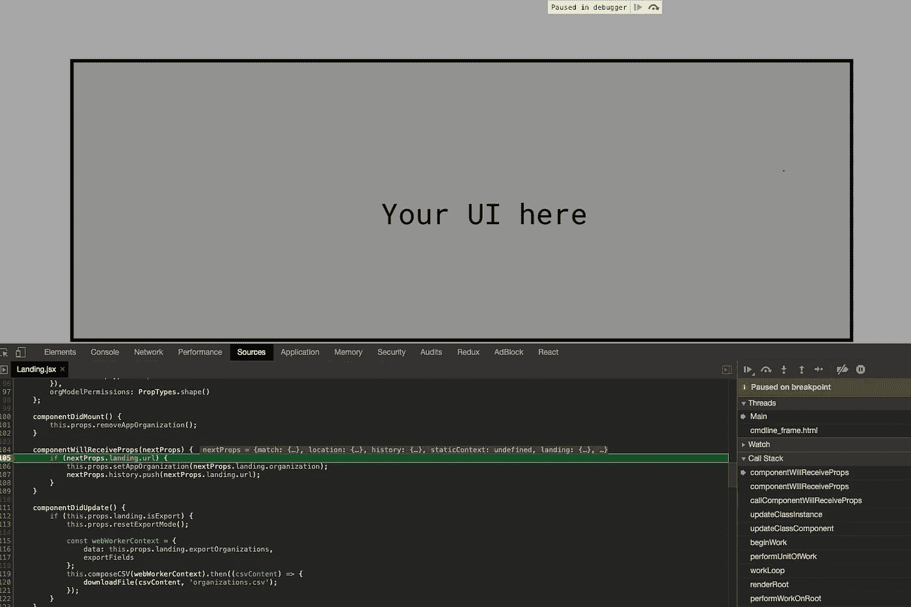
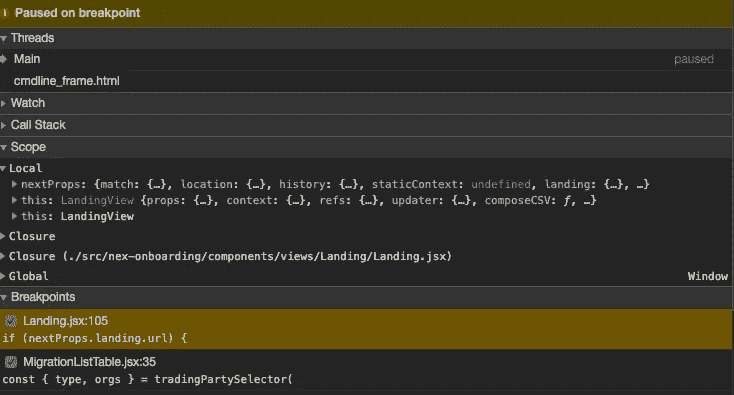
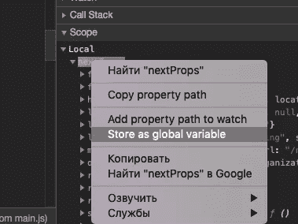
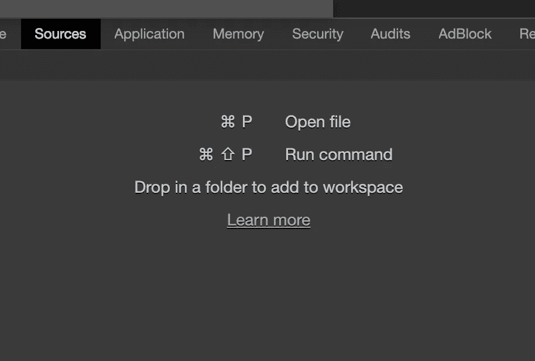
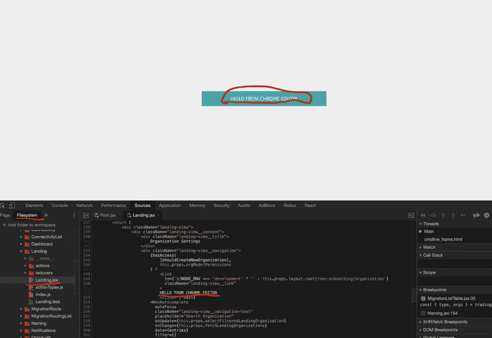
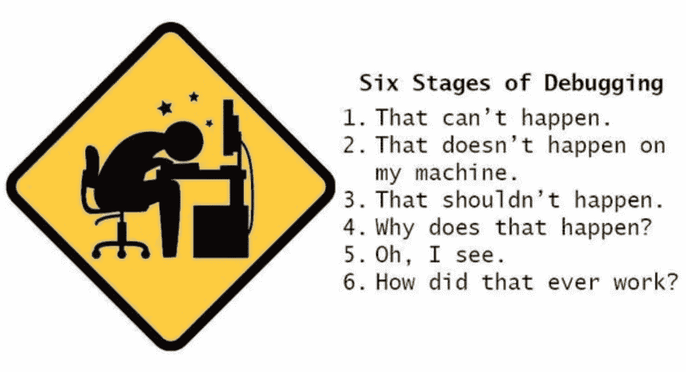

# 前端 JavaScript 调试技术

> 原文：<https://itnext.io/javascript-debugging-techniques-at-frontend-side-ae6d5110ad81?source=collection_archive---------6----------------------->

有很多策略可以调试代码中的问题。从我的经验来看，没有一个简单的策略可以解决所有问题。总的来说，我发现三种主要的策略，从最流行到最不流行。

1.  **蛮力法**。这种方法最常见，效率最低。在这里，开发人员只是打印出所有相关的内存堆栈，并观察与预期数据不一致的潜在位置。
2.  **回溯法**。这种方法适用于相当小的应用程序。该过程从检测到特定症状的地方开始。从那里开始，对整个源代码进行反向跟踪。这里的步骤是:观察谁是特定函数的调用者，找到它的调用者，检查与该函数相关的问题是否出现在那里。如果没有，则转到该函数的调用方，依此类推。
3.  **原因消除方法**。这种方法很少使用。也叫**归纳演绎**。与错误发生相关的数据被组织起来以隔离潜在的原因。开发人员创建一个错误原因假设，并组成一个特殊的数据形状传递给函数，该函数将证明或否定该假设。
4.  **自己的经验方法**。它需要对产品及其潜在的弱点有很好的了解。在这种情况下，开发人员已经知道所报告的错误的原因，因为他们知道 API 可能会被意外更改，并且源代码对这种更改非常敏感。或者数据类型已更改，但源代码没有相应的失败检查。

让我们概述一些调试过程的实用方法。

# 带有日志输出的简单调试方法

在这种方法中，开发人员只需在代码中添加打印输出(console.log、alert 等)。这有助于理解与代码相关的一些中间状态。这种方法介于蛮力和回溯方法之间(不过更接近蛮力)。在处于开发模式的系统中，已经有大量的日志消息，添加额外的日志并将这些日志与代码中的具体位置相匹配变得非常困难。当然，所有这些信息都应该记在开发人员的脑子里，并且很有可能将注意力从解决问题转移到记住`console.logs`的位置，并在最后让你的思维溢出。在这种情况下，开发人员应该已经依靠[源映射](https://www.html5rocks.com/en/tutorials/developertools/sourcemaps/)工具来避免处理精简代码。

# 用 REPL 调试

[REPL](https://www.tutorialspoint.com/nodejs/nodejs_repl_terminal.htm) 代表读取评估打印循环。这样的工具代表了一个类似外壳的计算机环境，可以在其中输入命令，系统以交互模式输出响应。如果开发人员能够访问源代码模块，就很容易建立原因消除方法策略。例如，开发人员已经定位了错误代码的潜在位置，通过 REPL 可以传递一个假设数据来证明这是一个正确的错误位置。

node.js 的 REPL

# 使用开发人员工具调试

开发者工具是从系统获得详细反馈的好地方。例如 [Chrome Developer Tools](https://developers.google.com/web/tools/chrome-devtools/) 不仅可以帮助调试 JS 代码本身，还可以调试网络调用、内存堆、闭包、在感兴趣的函数调用上设置断点、调试浏览器 DOM 以及与之相关的 css 计算。

但主要是我想继续用断点[功能](http://How To Pause Your Code With Breakpoints In Chrome DevTools)暂停代码。这是回溯法策略的完美例子。它有助于在感兴趣的地方停止代码，观察其调用堆栈(并导航到直接或间接调用方)，检查它们等等。

调试器暂停时的源模块视图

在图片的右下角，你可以看到**调用栈**，在它的帮助下，你可以导航到父调用者并观察他们的代码。这个部分还有**范围**部分，它有助于研究闭包范围。

关于调试器暂停状态的部分:线程、监视、调用堆栈、范围、断点

在 Scope 部分的帮助下，很容易观察当前的[词法环境](https://hackernoon.com/javascript-execution-context-and-lexical-environment-explained-528351703922)并分析内部传递的数据是否正确。这给了开发人员一个应用原因消除方法策略的机会。为此，您可以将作用域的某个部分存储为一个全局变量，并在此基础上进行一些操作。

将作用域中的某个对象保存为全局变量

之后，这些数据将在控制台部分以相应的名称(通常命名为 temp1、temp2、…)访问，开发人员可以对其进行一些操作。

为了从代码中的当前断点开始导航，使用了特殊的导航面板或相应的热键。

从当前断点处开始导航

然而，如果系统没有一个保存状态的地方，调试过程就相当困难。有时需要放一堆断点来发现不一致。但即使在这种情况下，Chrome Dev Tools 也有一个名为 Breakpoints 的特殊部分，它描述了你已经放在源代码中的所有断点。

另一个帮助你免费调试的有趣方法是不离开 Chrome 直接修改你的代码(称为工作区的特性)。

Chrome 中的工作空间管理

所有需要做的就是把具体的文件夹和源代码放到这个源代码标签中，你的代码映射就会出现在这里。现在，您可以直接编辑本地文件，而无需离开浏览器。

有时候感觉很多余，因为你的编辑器甚至 IDE 可以做更酷的事情。但对于一些代码哇效果保证刮的例子:)

# 结论

根据所选择的调试方法，市场上有多种工具可供选择。例如，每个大的库都有一些由社区发布的调试最佳实践和工具。

WebStorm IDE 提供了一个很棒的工具包，可以使用各种预置进行安装调试。但是总体思路、外观和感觉体验与 Chrome 开发工具中的非常相似。在我们公司，我们积极使用它来调试 NodeJS 代码库。

为你的应用程序编写单元或行为测试已经可以帮助避免大多数潜在的问题，甚至有助于提高作者对功能的关键部分以及这些部分应该做什么的理解。在这种情况下，原因排除法可以应用于编写测试的阶段，在这个阶段，您假设一些定义的输入属性应该导致函数的一些定义的输出…

如果您觉得这篇文章有帮助，请点击👏按钮并在下面随意评论！