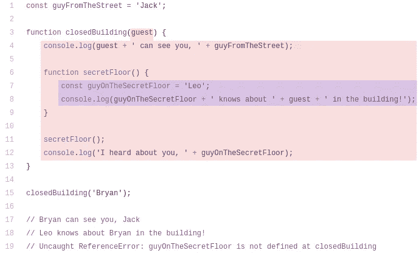

# JavaScript 向导:这是怎么回事？

> 原文：<https://itnext.io/javascript-wizard-whats-up-with-this-92ca309172d6?source=collection_archive---------2----------------------->

臭名昭著的`this`关键字 JavaScript 最让开发人员困惑的事情之一。通常情况下，`this`看起来既不可预测又不合逻辑，而且它肯定不像在大多数其他编程语言中那样。如果你曾经因为`this`而揪自己的头发，你肯定不是一个人。

你能从上面的片段中找出打印出来的内容吗？
这里有一个剧透:
`Hi, I'm undefined, and I'm a undefined`
从代码的外观来看大概不是这个意思。
为什么会这样？因为`this`在路上的某个地方迷路了。

那么`this`是怎么回事呢？

在这篇文章中，我将解释`this`是如何被绑定的，以及在任何给定的上下文中，如何问自己 4 个问题，从中你总能确定`this`指向什么。

# 词法范围与动态范围

首先，我们需要理解 JavaScript 中的作用域是如何工作的。
和大多数编程语言一样，JavaScript 使用*词法范围。*

这意味着变量或函数只能在声明它的范围内被引用。
作用域严格地相互嵌套，这也意味着可以从内部作用域引用变量或函数。
最重要的是，作用域是在*编译时确定的，*因此作用域的结构在执行过程中不会改变。
JavaScript 中最外层的作用域被称为*全局作用域*，并且引用了*窗口*对象。

使用动态作用域，我们可以引用的声明变量或函数的作用域是动态变化的。

让我们试着用这个伪 JavaScript 做一个例子，假设它现在使用了*动态范围*

从`dynamicBuilding()`我们试图引用一个变量，它既没有在自己的作用域中声明，也没有在包装它的作用域中声明；全球范围。
当我们刚刚调用这个函数的时候，这会返回`undefined`或者抛出一个引用错误。但是，如果我们在调用函数的同一个作用域中声明变量，突然之间我们就不会再遇到引用错误了。
这里关键的一点是，`dynamicBuilding()`的行为因调用它的位置而异。
调用函数的作用域——或*执行上下文* —称为函数的*调用点*。

*NB。上面的例子是伪 JavaScript。这不是 JavaScript 的工作方式，也不会像示例中那样执行。*

# “这”的 4 种绑定方式

在这一点上，你可能想知道为什么我在谈论 JavaScript 中的作用域，而这篇文章是关于`this`关键字的。
原因是，JavaScript 中的*词法作用域*原则——我们大多数人都习惯了，并且觉得非常自然——是我们在谈到`this`时感到困惑的主要原因。

JavaScript 不使用*动态范围，*并且它从来没有使用过，但是考虑到 JavaScript 使用绑定的方式，我们实际上已经非常接近于使用动态范围了。

于是就来了:
用 JavaScript，`this`是由引用`this`的函数的*调用点*决定的。
也就是说，当`this`在一个函数中使用时，`this`将是对*执行上下文*的引用，该函数从该上下文执行。

在 JavaScript 中有 4 种不同的方式绑定`this`,它们的行为都不同:

*   **`**new**`**关键词****
*   ****显式绑定****
*   ****隐式绑定****
*   ****默认绑定****

**这也意味着，在任何给定的环境中，这是你将自问的 4 个关键问题，以确定`this`指向什么。让我们一个接一个地过一遍。**

# **“新”关键字**

**当在函数中使用`this`时，你需要问自己的第一件事是在调用函数时是否使用了`new`关键字。**

**当应用`new`关键字时，将创建一个用户自定义对象的实例，并且`this`将被绑定到该对象。
关键字`new`将做[以下 4 件事](https://developer.mozilla.org/en-US/docs/Web/JavaScript/Reference/Operators/new):**

1.  **创建一个空白的普通 JavaScript 对象。**
2.  **将此对象链接到另一个对象。**
3.  **将从*步骤 1* 中新创建的对象作为`this`上下文进行传递。**
4.  **如果函数不返回自己的对象，则返回`this`。**

**正如我们在上面的例子中看到的，`this`将是一个对象的引用，该对象将通过用`new`关键字调用`thisGuard()`函数来创建。**

**在 ES6 中，*类*被引入。澄清一下:在 JavaScript 中，没有类这样的东西——这只不过是语法上的糖，做我们上面看到的事情。因此，`this`的绑定方式与类完全一样。
下面是上面代码片段的等效内容:**

# **显式绑定**

**如果你没有应用`new`关键字，那么接下来你要问自己的是你是否使用了*显式绑定。* 有几种方法可以调用一个函数，并明确定义`this`在该函数中使用时应该引用什么。**

**在上面的例子中，我们通过调用`thisGuard()`函数来使用*显式绑定*，因此使用了属于`Function.prototype.`的`apply()`方法**

**这是在调用函数，并把一个对象作为参数传入。从被调用的函数中，`this`将被绑定到作为参数传递的对象。这是确保`this`可预测地绑定到我们想要的对象的有效方法。**

**非常相似的方法`call()`会导致相同的行为。
`apply()`和`call()`的主要区别在于，如果我们想给函数传入额外的参数，我们可以用两种不同的方式来实现:
使用`apply()`时，第二个参数将是额外参数的列表，而使用`call()`时，额外参数将像我们通常所做的那样列出。**

***显式绑定*的另一种情况是通过使用方法`bind()`，这是在 ES5 中引入的。我们一会儿会回到这个例子。**

# **隐式结合**

**如果您在调用函数时没有使用`new`关键字，也没有应用*显式绑定，那么*接下来要查看的是`this`是否被隐式绑定。**

**当引用`this`的函数是对象的方法时，会发生隐式绑定。**

**让我们回顾一下这篇文章的第一个例子，但是没有`setTimeout()`**

**在这种情况下，`identify()`是`thisGuard`对象的方法，`this`将被隐式绑定到该对象。**

**值得注意的是*显式绑定*如何优先于*隐式绑定*，以及*硬绑定*如何优先于*显式绑定*。**

# **默认绑定**

**最后，如果以上情况都不存在，您可以期望`this`默认绑定到全局范围。也就是说，当引用`this`时，你可以期待对`window`对象的引用。
如果你正在使用*严格模式*，你可以预期`this`是未定义的。**

**如果我们回顾一下本文的第一个例子，您可能会明白为什么它打印的是`undefined`，而不是预期的`firstName`和`rank`**

**当我们将函数作为参数传递给`setTimeout`时，我们不是调用函数，而是传递一个引用。
一秒钟后，该函数将作为回调函数被调用，执行上下文将是全局范围，因此`this`不会像我们预期的那样隐式绑定到`thisGuard`。**

**有了关于`this`在 JavaScript 中如何工作的知识，我们知道可以通过将`this`硬绑定到`thisGuard`对象来轻松解决这个问题。**

# **箭头函数表达式**

**最后，我想提一下*箭头函数表达式的使用。* 在 ES6 中，引入了箭头功能。
与常规函数表达式相比，使用箭头函数表达式的一个主要优点是`this`，从箭头函数内部，将总是指向封闭的词法上下文。**

**让我们看一个正则函数表达式的例子**

**我们在这里看到对`regularFunction()`的第一次调用如何使用*默认绑定*，第二次调用如何使用*隐式绑定*。
结果是`this`根据*调用站点*指向两个不同的上下文，正如我们所料。**

**如果我们想确定`this`将被*词汇绑定*，而不是*动态绑定*，我们可以使用一个箭头函数。**

**现在函数的*调用位置*不再影响`this`在`arrowFunction()`中使用时将要引用的内容。**

# **结论**

**`this`的值让我们困惑的主要原因是，JavaScript 中的引用通常遵循*词法范围模型*，而`this`是对调用函数的*执行上下文*的引用。从而`this`被动态*确定，打破了 JavaScript 中引用的一般概念。***

**然而，我们总是可以通过查看`this`可以绑定的 4 种方式来确定`this`指向什么。
或者，我们可以使用箭头函数来确保`this`不会被动态绑定。**

**想了解更多关于 JavaScript 的知识，我建议你也浏览一下我的另一篇文章， [*JavaScript 向导:技巧&窍门*](/javascript-wizard-tips-and-tricks-1b91025a0d62)**

****就是这样！如果您有任何问题或反馈，请随时在下面评论。如果你喜欢这篇文章，请鼓掌👏扣几下吧！
你也可以在**[**Twitter**](https://twitter.com/silindsoftware)**上找到我，我会在那里发布更多类似的内容。****