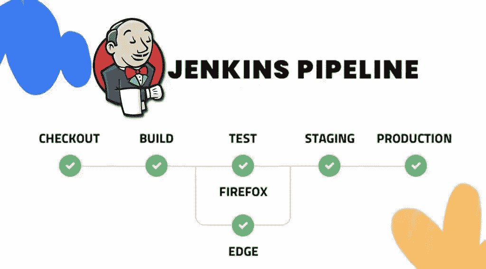

# Jenkins 教程—第 8 部分—触发管道

> 原文：<https://itnext.io/jenkins-tutorial-part-8-triggering-pipeline-d53dbba539d6?source=collection_archive---------0----------------------->



手动运行 CI/CD 作业不是启动管道流程的好方法，因为手动完成的所有工作都会与自动化竞争。Jenkins 提供了各种自动启动作业的方法。这些方法在**构建触发器**部分进行了分类。在 Jenkins 教程的这一部分，我将解释触发管道的常用方法。请注意，一些方法由于安装插件而存在，可能在 Jenkins bare 安装中找不到。所以，我建议你使用下面的 Jenkins 栈，它有你需要的所有东西。

[](https://github.com/ssbostan/jenkins-stack-kubernetes) [## GitHub-ssbo stan/jenkins-stack-kubernetes:在 Kubernetes 上部署 Jenkins 的脚本和清单

### 如果你觉得有用，就看星星。在 Kubernetes 上部署 Jenkins containers CI/CD 堆栈的脚本和清单。的…

github.com](https://github.com/ssbostan/jenkins-stack-kubernetes) 

如果你发现这一系列的文章是有帮助的，请查看教程的官方资源库。您也可以在这个资源库中找到所有示例。

[](https://github.com/ssbostan/jenkins-tutorial) [## GitHub-ssbo stan/jenkins-tutorial:完整的 Jenkins 教程，参考，牛逼，示例

### 如果你觉得有用，就看星星。Jenkins 系列教程的参考和示例库。版权所有 2021…

github.com](https://github.com/ssbostan/jenkins-tutorial) 

# Jenkins 构建触发器:

我说过，Jenkins 有各种构建触发方式，cron，webhook，URL，upstream 等。我来解释一下流行的。所有触发器都应在管道的**触发器**块中定义。

`**cron**`是 Unix/Linux cron 之类的东西。要编写 cron 触发器，请使用`cron "MINUTE HOUR DOM MONTH DOW"`语法。您应该注意到，许多不同的触发器可以用于相同的作业。

**DOM** 是一个月中的某一天，而 **DOW** 是一周中的某一天。

这里有一个简单的例子:

`**cron "0 * * * *"**`在每小时的 0 分钟运行。

`**cron "0 0 * * *"**`00:00 运行(每天一次)。

`**cron "0 0 * 2,4,6,8,10,12 *"**`双月每天运行一次。

`**cron "* 1-7 * * *"**`从 1 小时到 7 小时每分钟运行一次。

`**cron "*/10 * * * *"**`每 10 分钟运行一次。

**重要提示(H "hash" magic keyword):** 如果您有许多使用触发器的作业`cron "0 0 * * *"`，所有作业都将在午夜(00:00)开始。同时开始大量的工作会给 Jenkins 带来很大的压力，并可能导致失败。为了解决这种应变，我们可以使用 **H** 符号。这个符号告诉 Jenkins 对给定的 cron 触发器使用散列模型。因此，为了解决我们的例子，我们应该使用`cron "H H * * *"`而不是`cron "0 0 * * *"`。这个 cron 将像前一个一样每天运行一次作业，但不是同时运行。

`**cron "H H * * *"**`每天运行一次。

`**cron "H H(0-4) * * *"**`运行时间为 00:00 至 04:59(一次)。

`**pollSCM**`接受 cron 风格的模式，并在项目版本控制系统中寻找源代码变更，例如 Git。cron 样式的模式用于定义所需的时间间隔。您应该注意到，它仅在从 SCM 源读取管道脚本时起作用。

以下触发器每 10 分钟检查一次源代码更改。如果检测到任何变化，管道将被触发。

`**upstream**`接受上游项目的逗号分隔列表，当其中任何一个项目完成时，当前作业被触发。除了项目列表，你可以设置上游项目的期望状态，不稳定，失败等。**默认**为**成功**构建状态。

下面是一个关于阈值的示例:

**Hudson . model . result . aborted**:构建被手动中止。

**Hudson . model . result . failure**:构建出现致命错误。

Hudson . model . result . success:构建没有错误。

**Hudson . model . result . unstable**:构建结果不稳定。

# Jenkins 通用 Webhook 触发器:

通用 Webhook 触发器是一个允许从 webhook 触发管道的插件。这个插件对于将 Jenkins 与 SCM、脚本、小程序等外部应用程序集成非常有用。

若要从命令行触发管道，请运行以下命令:

```
curl -i http://**YOUR_JENKINS_URL**/generic-webhook-trigger/invoke?token=**unique-token-to-start-the-current-pipeline**
```

要了解更多信息，请参见[插件](https://plugins.jenkins.io/generic-webhook-trigger)文档。

# 一体化示例:

以下管道每 10 分钟检查一次源更改，并在检测到任何更改时运行。每一小时定期运行一次。当上游项目 my-base-project 成功构建时运行，并且可以由带有给定令牌的 webhook 触发。

# 结尾字母:

构建触发器对于自动化管道非常有帮助。通用的 Webhook 触发器是一个很棒的触发器，我将在后面详细解释。有了触发器，我们可以为我们的环境创建一个非凡的生命周期。您可以在下面的资源库中找到所有使用的示例。祝你好运。

关注我的 LinkedIn[https://www.linkedin.com/in/ssbostan](https://www.linkedin.com/in/ssbostan)

[](https://github.com/ssbostan/jenkins-tutorial) [## GitHub-ssbo stan/jenkins-tutorial:完整的 Jenkins 教程，参考，牛逼，示例

### 如果你觉得有用，就看星星。Jenkins 系列教程的参考和示例库。版权所有 2021…

github.com](https://github.com/ssbostan/jenkins-tutorial)