# Kubernetes 世界的微服务应用之旅

> 原文：<https://itnext.io/journey-of-a-microservice-application-in-the-kubernetes-world-d9493b19edff?source=collection_archive---------0----------------------->

## 使用 GitOps 和 Argo CD 进行连续部署


在 [Unsplash](https://unsplash.com/s/photos/loop?utm_source=unsplash&utm_medium=referral&utm_content=creditCopyText) 上由[Tine ivani](https://unsplash.com/@tine999?utm_source=unsplash&utm_medium=referral&utm_content=creditCopyText)拍摄的照片

## TL；速度三角形定位法(dead reckoning)

在[的上一篇文章](/journey-of-a-microservice-application-in-the-kubernetes-world-e800579f0be3)中，我们将 [webhooks](https://webhooks.app/) 应用程序部署到由 [Civo](https://civo.com) 管理的 Kubernetes 集群中。我们现在将更接近应用程序工作流，并使用 GitOps 来设置 CI/CD 管道的持续部署部分。

## 本系列文章

*   [web hooks . app 展示](/journey-of-a-microservice-application-in-the-kubernetes-world-bdfe795532ef)
*   [使用 Helm 在本地单节点 Kubernetes 上运行应用](/journey-of-a-microservice-application-in-the-kubernetes-world-3c2a9e701e9f)
*   [在 Civo Kubernetes 集群上运行应用](/journey-of-a-microservice-application-in-the-kubernetes-world-e800579f0be3#0174-87b0e3c1fcd3)
*   使用 GitOps 和 Argo CD 进行连续部署(本文)
*   [使用 Loki 堆栈的可观察性](/journey-of-a-microservice-application-in-the-kubernetes-world-876f72ce1681)
*   [使用 Acorn 定义应用](/journey-of-a-microservice-application-in-the-kubernetes-world-e2f6475ddde1)
*   [安全注意事项:安全相关工具](/journey-of-a-microservice-application-in-the-kubernetes-world-6abd625c60fe)
*   [安全考虑:修复错误配置](/journey-of-a-microservice-application-in-the-kubernetes-world-eb0fb52e1bf0)
*   [安全考虑:策略实施](/journey-of-a-microservice-application-in-the-kubernetes-world-f760cba7600f)
*   安全考虑:漏洞扫描(即将推出)

## 什么是 GitOps

GitOps 的概念是几年前由 Weaveworks 创建的。此后，它经历了一个日益增长的热潮。

> GitOps 是一种持续交付的方式。它通过使用 ***Git 作为声明性基础设施和应用程序的真理来源*** *来工作。当对 Git 进行更改时，自动化交付管道会对您的基础设施进行更改。*
> 
> *—织布*

**将更改部署到集群:推 vs 拉**

在典型的 CI/CD 管道中，CI 工具(可以是 GitLab CI、GitHub actions、Tekton 等)负责运行测试、构建映像、检查 CVE 并将新映像重新部署到集群中。因此，配置项需要访问群集。


来自 [gitops.tech](https://gitops.tech) 的基于推送的部署

GitOps 方法有所不同，因为部署部分不是由 CI 工具完成的，而是由操作员完成的，操作员是在 Pod 中运行的应用程序:


来自 [gitops.tech](https://gitops.tech) 的基于拉的部署

在集群内部运行的 Pod 不断检查 Git 存储库(通常称为 *config* repo)。它比较了应用程序当前运行的方式(*当前状态*)和它应该如何运行(*期望状态*)。如果它检测到一些差异，它将使应用向*期望状态*收敛。

在 GitOps 中，没有在集群之外运行的进程与 API 服务器通信。一切都是在内部完成的，当 Git 的配置报告发生变化时就会触发。

[Argo CD](https://argoproj.github.io/) 和 [Flux](https://fluxcd.io/) 是两个众所周知的解决方案，遵循 GitOps 范例，可用于 Kubernetes。

现在我们对 GitOps 有了稍微好一点的了解，我们将在集群中安装和配置 Argo CD。通过这种方式，我们将确保应用程序始终保持最新的状态*和期望的状态*。

## Argo 光盘安装

Argo CD 可以像我们在 Kubernetes 中使用的许多应用程序一样安装为舵图。

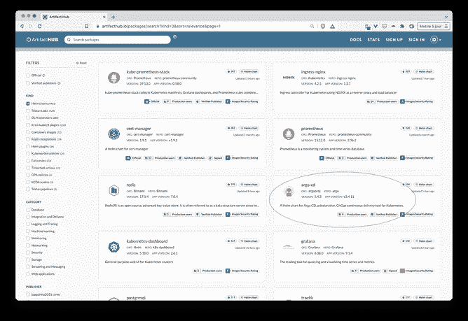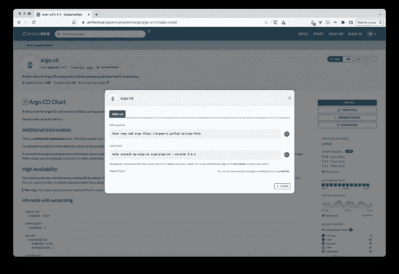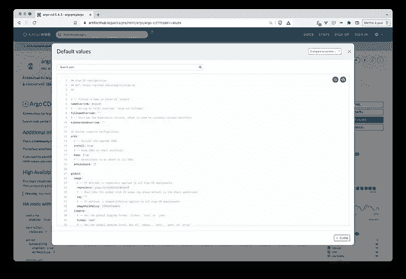

阿尔戈 CD 舵图可从 [artifacthub](https://artifacthub.io/) 获得

从我们从 [artifacthub](https://artifacthub.io/) 得到的信息，我们可以创建一个 Helmfile，以声明的方式指定应用程序(我真的很喜欢 Helmfile BTW)。

至于 webhooks 和 Traefik 应用程序，已经在*配置*存储库中创建了一个新的 [argocd 文件夹](https://gitlab.com/web-hook/config/-/tree/main/apps/argocd)。这个文件夹包含下面的 *helmfile.yaml* ，它定义了 Argo CD Helm chart 将被安装到集群中的方式:

```
# config/apps/argocd/helmfile.yamlrepositories:
- name: argo
  url: https://argoproj.github.io/argo-helmreleases:
- name: argo
  namespace: argo
  labels:
    app: argo
  chart: argo/argo-cd
  version: ~5.4.3
  values:
  - ./values.yaml
```

该文件引用了一个包含 Argo CD 的一些配置选项的 *values.yaml* 文件:

*   配置库:Argo CD 将连接到的 Git 库
*   应用:阿尔戈将不断监测的应用的定义。应用程序资源是安装 Argo CD 时创建的 CRD(自定义资源定义)。它基本上告诉 Argo 观察应用程序定义的 *apps/webhooks* 文件夹的*配置*库的变化。

```
configs:
  repositories:
    config-repo:
    url: [https://gitlab.com/web-hook/config.git](https://gitlab.com/web-hook/config.git)
    name: webhooks
    type: gitextraObjects:
- apiVersion: argoproj.io/v1alpha1
  kind: Application
  metadata:
    name: webhooks
    namespace: argo
  spec:
    project: default
    source:
      repoURL: [https://gitlab.com/web-hook/config.git](https://gitlab.com/web-hook/config.git)
      targetRevision: main
      path: apps/webhooks
      helm:
        releaseName: webhooks
        valueFiles:
        - "values.yaml"
    destination:
      server: [https://kubernetes.default.svc](https://kubernetes.default.svc)
      namespace: webhooks
    syncPolicy:
      automated: {}
      syncOptions:
      - CreateNamespace=true
```

从 *config/apps/argocd* 我们用 Helmfile 安装 argocd 舵图:

```
$ helmfile apply
```

接下来，我们验证 Argo CD 盒运行正常:

```
**$ kubectl -n argo get po** NAME                                                     READY   STATUS    RESTARTS   AGE
argo-argocd-applicationset-controller-7bb6b48b75-jrkvp   1/1     Running   0          25s
argo-argocd-redis-8594c4656f-sf7nb                       1/1     Running   0          24s
argo-argocd-notifications-controller-6f7b8cfbf6-f7jqz    1/1     Running   0          25s
argo-argocd-dex-server-77cf4fc7bc-5klcp                  1/1     Running   0          25s
argo-argocd-repo-server-668c7f8cf7-cg4gj                 1/1     Running   0          25s
argo-argocd-server-5687b98d77-z7pqp                      1/1     Running   0          25s
argo-argocd-application-controller-0                     1/1     Running   0          24s
```

为了访问 Argo CD 仪表板，我们首先需要检索名为*Argo CD-initial-admin-Secret*的密码中生成的密码:

```
kubectl -n argo get secret argocd-initial-admin-secret -o jsonpath="{.data.password}" | base64 -d
```

接下来，我们使用*端口转发*来公开仪表板:

```
kubectl port-forward service/argo-argocd-server -n argo 8080:443
```

然后，我们可以使用 *admin* 作为用户名和上面检索到的密码登录 Argo CD web 界面:

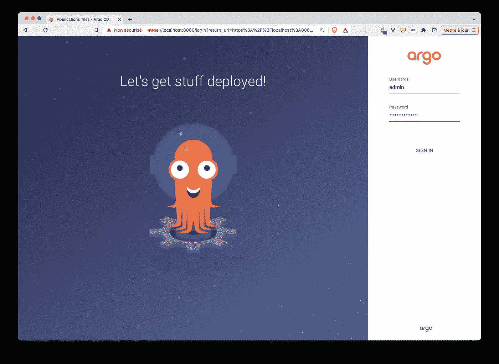

Argo CD 登录屏幕

登录后，我们可以看到 webhooks 应用程序资源的详细信息:

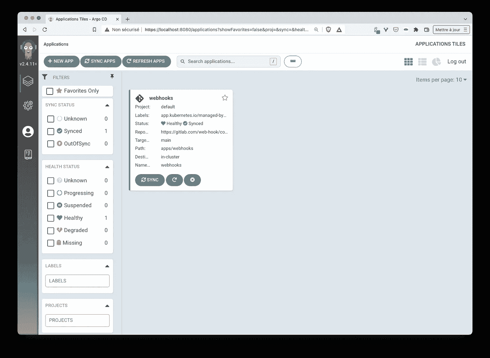

webhooks 应用程序是在我们安装 Argo CD 时创建的

Argo 认为该应用程序是同步的，因为在当前状态和期望状态之间没有差异。

注意:安装完成后，应用程序可能需要几十秒钟才能被认为是同步的。

单击应用程序，我们可以获得更多详细信息，如所有已创建资源的视图

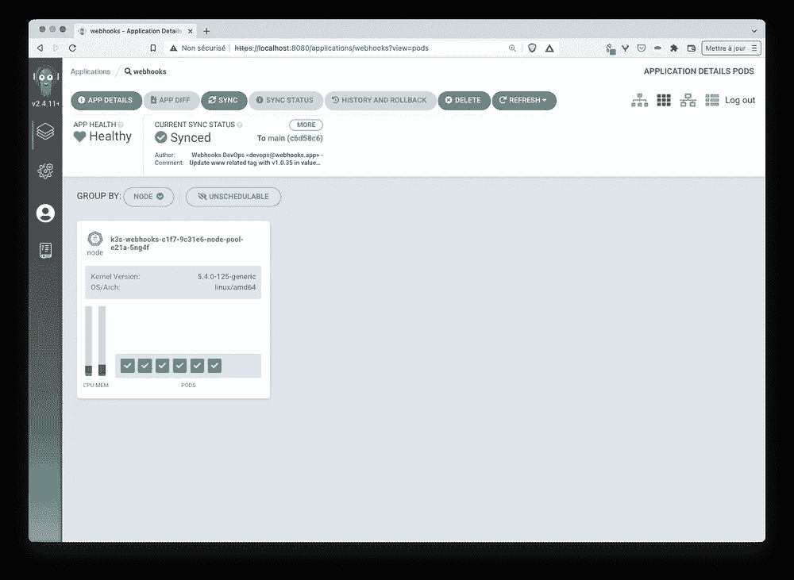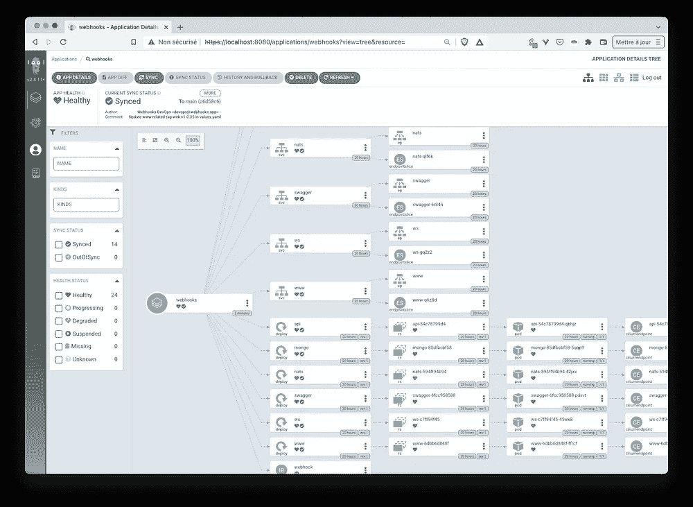

webhooks 应用程序当前正在同步

在下一部分中，我们将对应用程序做一个小小的改动。然后，我们将看到 Argo CD 检测到应用程序没有同步，并重新同步它。

正如我们在左下角看到的，目前 web 前端运行的版本是 1.0.35。

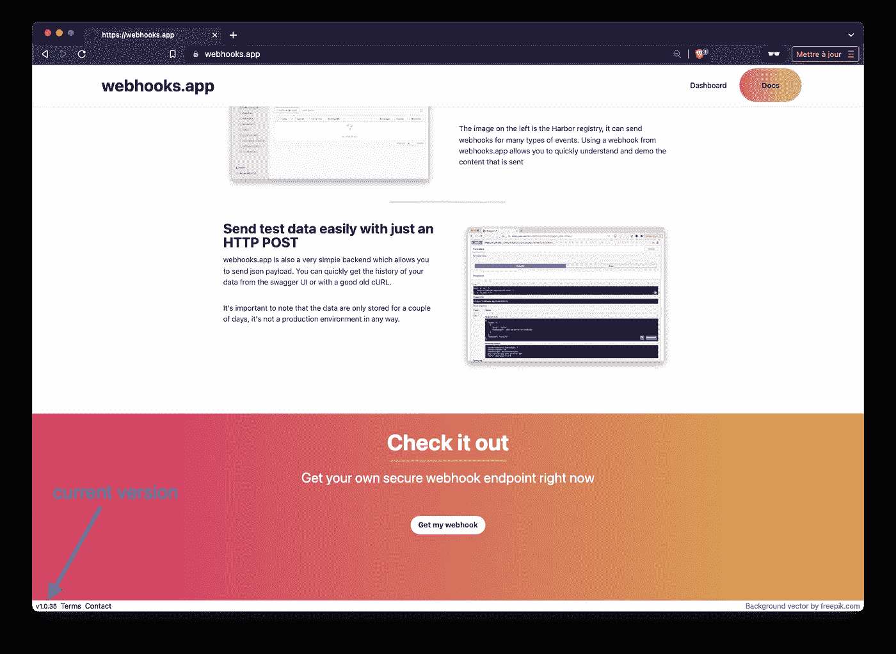

www 微服务的当前版本

为了简单起见，我们只需稍微修改一下 *www* 微服务的自述文件，然后提交并推送这一更改。

```
$ git add README.md $ git commit -m 'fix: dummy change to see pipeline in action'$ git push
```

当新代码被推送到 *www* 库的主分支时，会发生以下动作(这同样适用于应用的其他微服务，因为它们具有类似的 CI/CD 管道):

*   创建了一个新的 git 标记(遵循 SemVer 格式)。由于提交消息中的“fix”关键字，创建了补丁版本。

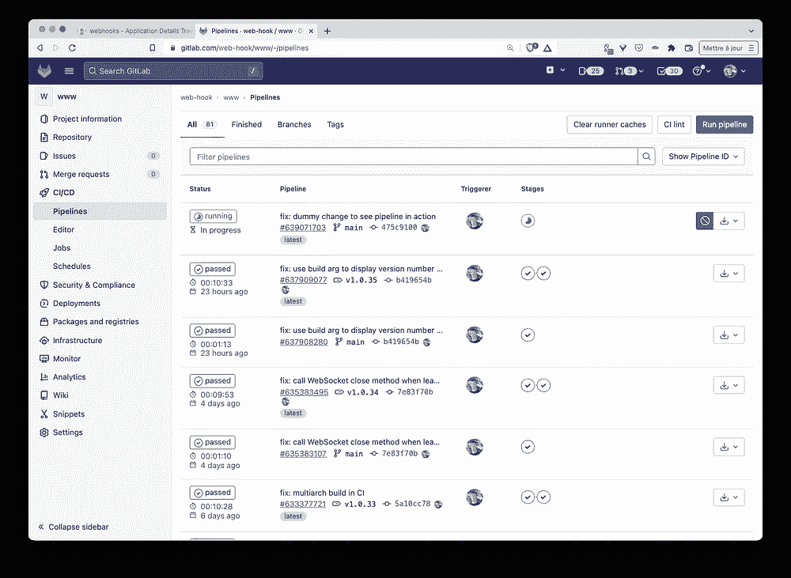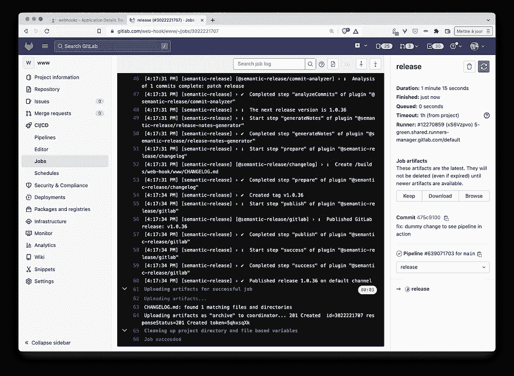

标签 v1.0.36 被创建并被推送到 www 储存库

*   使用这个标签构建并标记一个新的容器图像

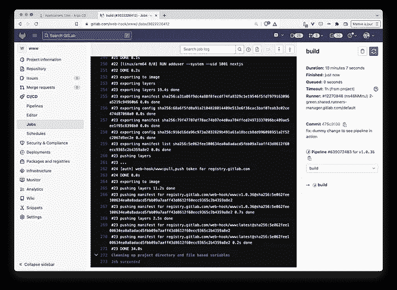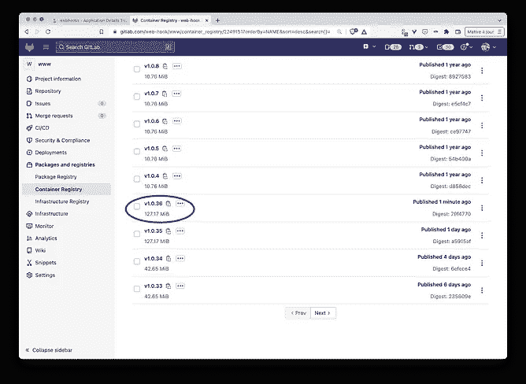

新标签触发了另一个构建容器映像的管道

*   *配置*库的 *values.yaml* 文件用这个新标签更新

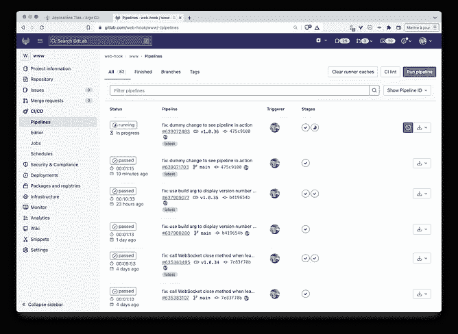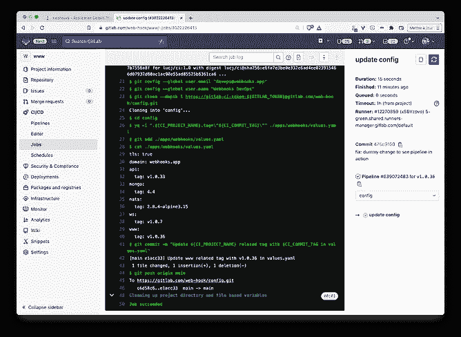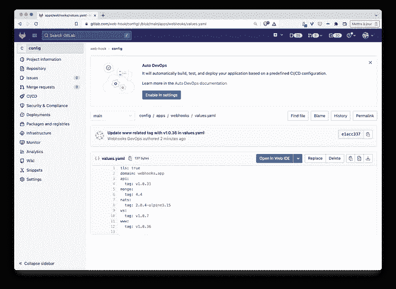

vww.tag 属性现在是 **v1.0.36**

Argo CD 很快注意到应用程序不同步，因为运行的 www 部署中使用的镜像版本与 git 存储库中的版本不同。然后，它会触发重新同步过程。

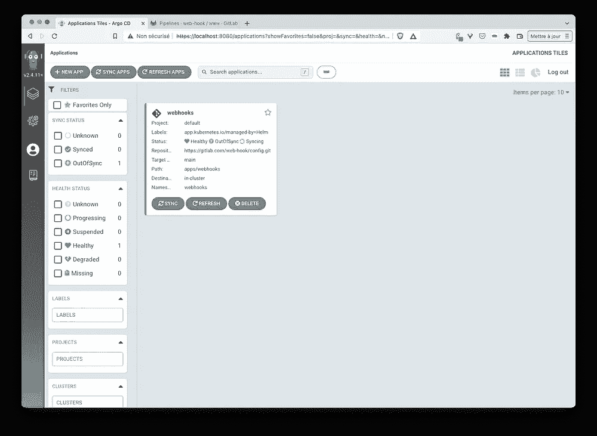

Argo CD 检测到应用程序不同步，并触发重新同步过程

用新的图像标签更新 www 部署只需要几十秒钟。原 *www* Pod 运行 *v1.0.35* 替换为 *v1.0.36\.*

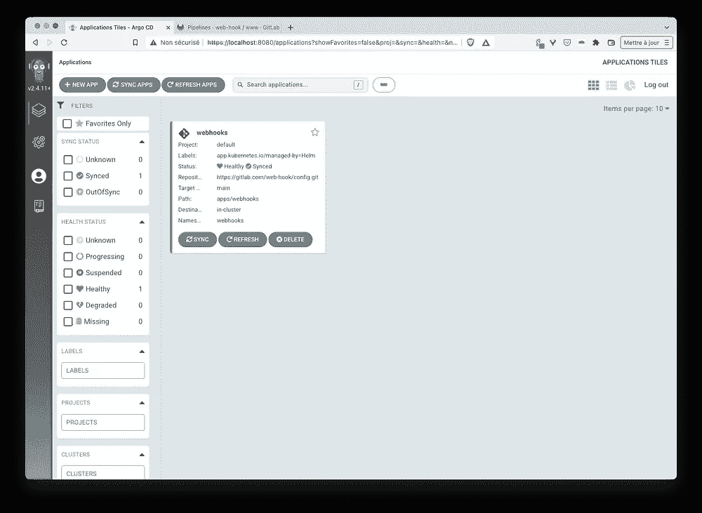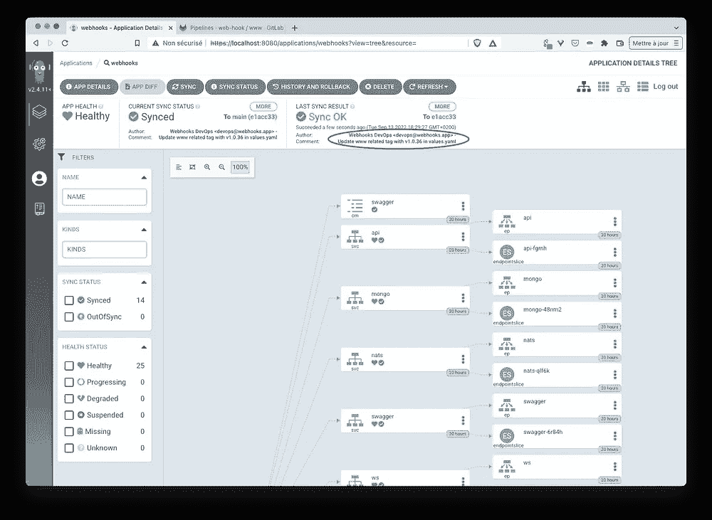

Argo CD 使用 Helm 更新集群中运行的应用程序

如果我们刷新 web 前端，我们会注意到以前的版本已经更新为新版本。

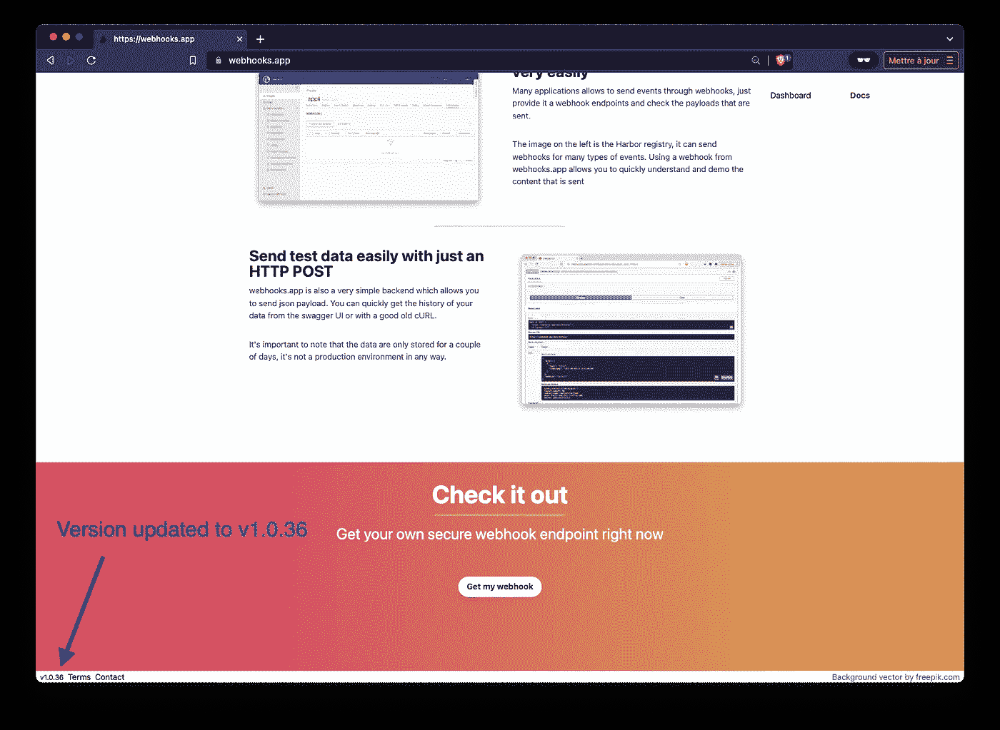

Web frontend 已更新到新版本

为 webhooks 应用程序设置 Argo CD 非常容易。现在，我们可以从 GitOps 方法中获益，确保应用程序代码中的每个更改都以一种干净、现代的方式触发应用程序的更新。

在本系列的下一篇文章中，我们将关注使用 Loki 堆栈的可观测性。