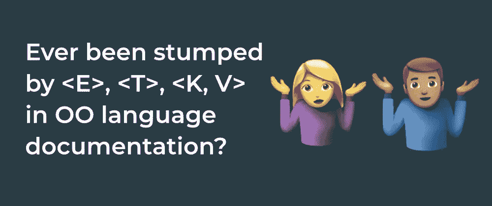

# 有没有被 OO 语言文档中的<e>、<t>、<k v="">难倒过？</k></t></e>

> 原文：<https://itnext.io/ever-been-stumped-by-e-t-k-v-in-oo-language-documentation-7add999fa9fd?source=collection_archive---------3----------------------->

## 我知道，我也是:)



在 Reddit[**/r/Dart lang**](https://reddit.com/r/dartlang)群中，一个名叫 **NFC_TagsForDroid** 的人就导航 Dart 文档时的困惑联系了我。特别是在理解演示代码示例时使用的一些“标记”背后的含义时。

以下是用户评论的摘录:

> 你能写一篇如何阅读 dartlang 文档的解释吗？对一个初学者来说，大部分是没有意义的。比如:[https://API . dartlang . org/stable/2 . 1 . 0/Dart-core/List/add . html](https://api.dartlang.org/stable/2.1.0/dart-core/List/add.html)(Dart Dart:core List<E>添加抽象方法)
> 标题列表< E >添加抽象方法**什么是< E >** ？作为一个抽象方法，它会对什么产生影响呢？

用户正在引用列表类型的`**add()**`方法的签名:

```
void add(
  **E** value
);
```

混乱的源头是`E`。其他在各种文档代码示例中使用的有`T`、`K`和`V`。

# 那么这些是什么意思呢？

这些看似神奇的“标记字母”是*占位符*，用于表示所谓的*类型参数*。这在*静态类型*面向对象语言中很常见，并且在谈到**泛型**时会很明显。

泛型提供了一种告诉编译器正在使用什么类型的方法，因此它知道要检查这一点。

换句话说如果你看到`<E>`把它读作*，那么`List<String>`就会读作【列表 ***字符串*** 。*

*现在，假设我们定义了一个`List<E>`:*

```
*List<**String**> fruits = ['apple', 'orange', 'pineapple'];*
```

*再次望着`add()`法:*

```
*void add(
  **E** value
);*
```

*解读的方式是,`E`代表集合中的一个**元素**，无论我们在创建列表时最初指定了什么类型**！在`fruits`的情况下其`String`。***

*这是我们如何使用它:*

```
*fruits.**add**('mango');fruits.add(1); // This will throw an error as its the wrong type*
```

# *那么为什么要使用特定的字母呢？*

*最简单的答案是*约定*。事实上，你可以使用任何你喜欢的字母。任何字母都会达到相同的效果，但常见的字母带有语义:*

*   *`T`意为一种类型*
*   *`E`是一个元素(`List<E>`:元素列表)*
*   *`K`是关键(在一个`Map<K, V>`*
*   *`V`是值(作为返回值或映射值)*

*即使我不使用上面的任何占位符字母，下面的代码也能工作。例如，请参见下面的片段:*

*→ [**在镖盘**](https://dartpad.dartlang.org/b2f2b4b80a52b3e83e074b10086e7a87) 中运行。*

*尽管使用的占位符是`A`，但这仍然有效。按照惯例，将使用`T`:*

```
*class CacheItem**<T>** {
  CacheItem(**T** this.itemToCache);

  final itemToCache;

  String get detail => '''
    Cached item: $itemToCache
    The item type is **$T**
  ''';
}*
```

*泛型功能强大，因为它允许我们使用不同的类型重用同一个类:*

```
***CacheItem<String>** **cachedString** = **CacheItem<String>**('Hello, World!');
print(cachedString.**detail**);
// Output:
// Cached item: Hello, World!
// The item's type is String

var **cachedInt** = **CacheItem<int>**(30);
print(cachedInt.**detail**);
// Output:
// Cached item: 30
// The item's type is int

var **cachedBool** = **CacheItem<bool>**(true);
print(cachedBool.**detail**);
// Output:
// Cached item: true
// The item's type is bool*
```

# *结论*

*我希望这很有见地，你今天学到了一些新东西。*

*我经营着一个 YouTube 频道，教用户用 Dart 开发全栈应用。我已经计划了一个名为“[**react . js-Dart**](https://youtu.be/DCgMfj-eFuE)入门”的网络系列，预计在元旦上传。*

*→ [**现在订阅**](http://bit.ly/fullstackdart) 发布时通知。*

***喜欢，分享一下** [**跟着我**](https://twitter.com/creativ_bracket) 😍有关 Dart 的更多内容。*

# *进一步阅读*

*   *[关于泛型的 StackOverflow 帖子](https://stackoverflow.com/questions/6008241/what-is-the-difference-between-e-and-t-for-java-generics)*
*   *[泛型语言指南](http://download.oracle.com/javase/1,5.0/docs/guide/language/generics.html)*
*   *[**免费飞镖截屏在 Egghead.io**](https://egghead.io/instructors/jermaine-oppong)*