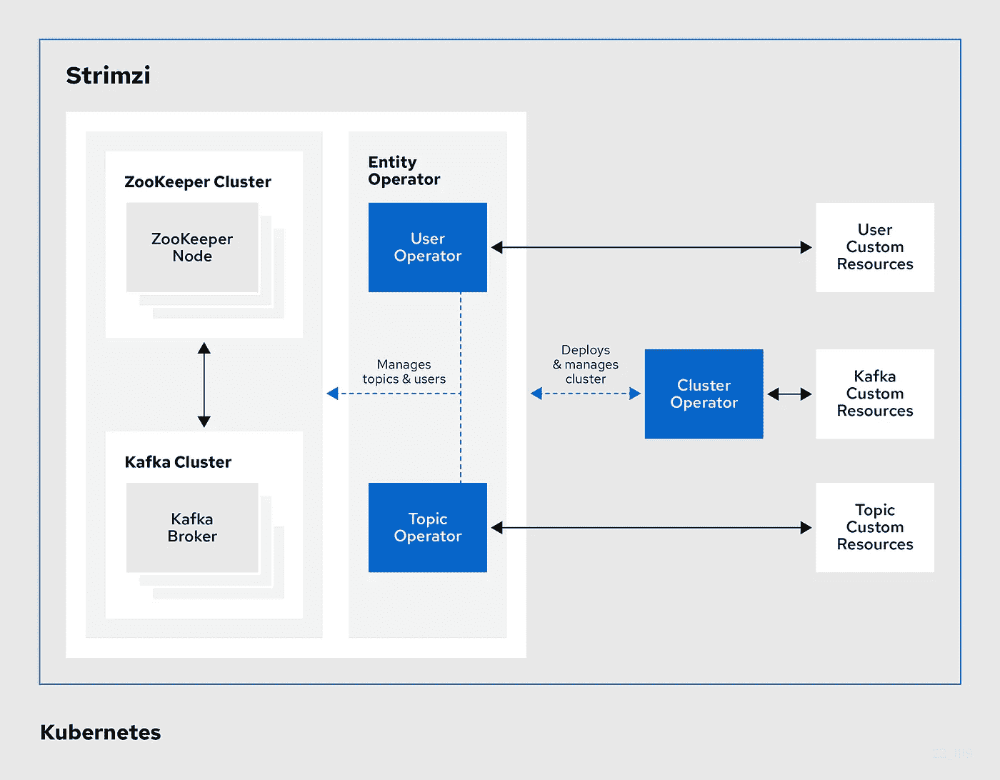

# 库伯内特斯上的卡夫卡，斯特里姆兹之路！(第一部分)

> 原文：<https://itnext.io/kafka-on-kubernetes-the-strimzi-way-part-1-bdff3e451788?source=collection_archive---------0----------------------->

欢迎来到这个关于在 Kubernetes 上运行卡夫卡的博客系列:

*   第 1 部分—本博客
*   [第二部分](/kafka-on-kubernetes-the-strimzi-way-part-2-43192f1dd831)
*   [第三部分](/kafka-on-kubernetes-the-strimzi-way-part-3-19cfdfe86660)
*   [第四部分](https://medium.com/@abhishek1987/kafka-on-kubernetes-the-strimzi-way-part-4-bf1e651e25b8)

我之前的一些博文(比如 [Kafka Connect on Kubernetes，the easy way！](/kafka-connect-on-kubernetes-the-easy-way-b5b617b7d5e9))，演示如何以 Kubernetes-native 方式使用 [Kafka Connect](https://kafka.apache.org/documentation/#connect) 。这是使用 [Strimzi 运算符](http://strimzi.io/)在 [Kubernetes](https://kubernetes.io/) 上发表的[阿帕奇卡夫卡](https://kafka.apache.org/)系列博文的第一篇。在本帖中，我们将从最简单的设置开始，即单节点 Kafka(和 Zookeeper)集群，并学习:

*   Strimzi 概述和设置
*   Kafka 集群安装
*   幕后使用/创建的 Kubernetes 资源
*   使用 Kubernetes 集群中的客户端测试 Kafka 设置

> *代码在 GitHub 上有—*【https://github.com/abhirockzz/kafka-kubernetes-strimzi】

# *我需要什么来尝试这个？*

*`kubectl`-[https://kubernetes.io/docs/tasks/tools/install-kubectl/](https://kubernetes.io/docs/tasks/tools/install-kubectl/)*

*我将使用[Azure Kubernetes Service(AKS)](https://docs.microsoft.com/azure/aks/intro-kubernetes?WT.mc_id=medium-blog-abhishgu)来演示这些概念，但总的来说，它是独立于 Kubernetes 提供者的(例如，可以随意使用像`minikube`这样的本地设置)。如果你想使用`AKS`，你只需要一个[微软 Azure 账户](https://docs.microsoft.com/azure/?WT.mc_id=medium-blog-abhishgu)，如果你还没有的话，你可以[免费获得](https://azure.microsoft.com/free/?WT.mc_id=medium-blog-abhishgu)。*

## *安装`Helm`*

*我将使用`Helm`安装`Strimzi`。这里是安装`Helm`本身的文档-[https://helm.sh/docs/intro/install/](https://helm.sh/docs/intro/install/)*

> **您也可以使用* `*YAML*` *文件直接安装* `*Strimzi*` *。点击此处查看快速入门指南-*[*https://strim zi . io/docs/quick start/latest/# proc-install-product-str*](https://strimzi.io/docs/quickstart/latest/#proc-install-product-str)*

## *(可选)设置 Azure Kubernetes 服务*

*Azure Kubernetes Service(AKS)使在 Azure 中部署托管的 Kubernetes 集群变得简单。它通过将大部分责任转移给 Azure，降低了管理 Kubernetes 的复杂性和运营开销。以下是如何使用设置 AKS 集群的示例*

*   *[Azure CLI](https://docs.microsoft.com/azure/aks/kubernetes-walkthrough?WT.mc_id=medium-blog-abhishgu) ，— [Azure portal](https://docs.microsoft.com/azure/aks/kubernetes-walkthrough-portal?WT.mc_id=medium-blog-abhishgu) 或*
*   *[手臂模板](https://docs.microsoft.com/azure/aks/kubernetes-walkthrough-rm-template?WT.mc_id=medium-blog-abhishgu)*

*一旦你设置了集群，你可以很容易地[配置](https://docs.microsoft.com/azure/aks/kubernetes-walkthrough?WT.mc_id=medium-blog-abhishgu#connect-to-the-cluster) `[kubectl](https://docs.microsoft.com/azure/aks/kubernetes-walkthrough?WT.mc_id=medium-blog-abhishgu#connect-to-the-cluster)` [来指向它](https://docs.microsoft.com/azure/aks/kubernetes-walkthrough?WT.mc_id=medium-blog-abhishgu#connect-to-the-cluster)*

```
*az aks get-credentials --resource-group <CLUSTER_RESOURCE_GROUP> --name <CLUSTER_NAME>*
```

# *等等，什么是`Strimzi`？*

**

**来自 Strimzi 文档**

*`Strimzi`简化在 Kubernetes 集群中运行 Apache Kafka 的过程。Strimzi 为在 Kubernetes 上运行 Kafka 提供了容器映像和操作符。它是作为`[Sandbox](https://www.cncf.io/sandbox-projects/)` [项目](https://www.cncf.io/sandbox-projects/)的 `[Cloud Native Computing Foundation](https://strimzi.io/blog/2019/09/06/cncf/)`的[部分(在撰写本文时)](https://strimzi.io/blog/2019/09/06/cncf/)*

*`Strimzi Operators`是项目的基础。这些操作人员具有专业的操作知识，能够有效地管理 Kafka。运营商简化了以下过程:部署和运行 Kafka 集群和组件，配置和保护对 Kafka 的访问，升级和管理 Kafka，甚至负责管理主题和用户。*

*下图展示了操作员角色的 10，000 英尺概况:*

**

*Strimzi 运算符—[https://strim zi . io/docs/Operators/master/images/Operators . png](https://strimzi.io/docs/operators/master/images/operators.png)*

# *安装 Strimzi*

*使用`Helm`安装`Strimzi`非常简单:*

```
*//add helm chart repo for Strimzi
helm repo add strimzi https://strimzi.io/charts///install it! (I have used strimzi-kafka as the release name)
helm install strimzi-kafka strimzi/strimzi-kafka-operator*
```

*这将安装`Strimzi`操作符(它只是一个`Deployment`)、定制资源定义和其他 Kubernetes 组件，如`Cluster Roles`、`Cluster Role Bindings`和`Service Accounts`*

> **更多详情，* [*查看此链接*](https://github.com/strimzi/strimzi-kafka-operator/tree/master/helm-charts/strimzi-kafka-operator)*
> 
> **删除，只需**

*为了确认 Strimzi 操作器已经被部署，检查它的`Pod`(它应该在一段时间后转换到`Running`状态)*

```
*kubectl get pods -l=name=strimzi-cluster-operatorNAME                                        READY   STATUS      
strimzi-cluster-operator-5c66f679d5-69rgk   1/1     Running* 
```

*还要检查自定义资源定义:*

```
*kubectl get crd | grep strimzikafkabridges.kafka.strimzi.io           2020-04-13T16:49:36Z
kafkaconnectors.kafka.strimzi.io        2020-04-13T16:49:33Z
kafkaconnects.kafka.strimzi.io          2020-04-13T16:49:36Z
kafkaconnects2is.kafka.strimzi.io       2020-04-13T16:49:38Z
kafkamirrormaker2s.kafka.strimzi.io     2020-04-13T16:49:37Z
kafkamirrormakers.kafka.strimzi.io      2020-04-13T16:49:39Z
kafkas.kafka.strimzi.io                 2020-04-13T16:49:40Z
kafkatopics.kafka.strimzi.io            2020-04-13T16:49:34Z
kafkausers.kafka.strimzi.io             2020-04-13T16:49:33Z*
```

> *`*kafkas.kafka.strimzi.io*` *CRD 在《库伯涅茨》中代表卡夫卡集群**

*现在我们有了“大脑”(Strimzi 操作符)，让我们使用它吧！*

# *是时候创建 Kafka 集群了！*

*如上所述，我们将保持简单，从以下设置开始(我们将在本系列的后续文章中逐步更新):*

*   *单节点 Kafka 集群(和 Zookeeper)*
*   *对同一 Kubernetes 集群中的客户端内部可用*
*   *没有加密、认证或授权*
*   *无持久性(使用`emptyDir`卷)*

*要部署 Kafka 集群，我们需要做的就是创建一个 Strimzi `Kafka`资源。看起来是这样的:*

```
*apiVersion: kafka.strimzi.io/v1beta1
kind: Kafka
metadata:
  name: my-kafka-cluster
spec:
  kafka:
    version: 2.4.0
    replicas: 1
    listeners:
      plain: {}
    config:
      offsets.topic.replication.factor: 1
      transaction.state.log.replication.factor: 1
      transaction.state.log.min.isr: 1
      log.message.format.version: "2.4"
    storage:
      type: ephemeral
  zookeeper:
    replicas: 1
    storage:
      type: ephemeral*
```

> **详细* `*Kafka*` *CRD 参考请查看文档-*[*https://strim zi . io/docs/operators/master/using . html # type-Kafka-reference*](https://strimzi.io/docs/operators/master/using.html#type-Kafka-reference)*

*我们在`metadata.name`中定义了星团的名字(`my-kafka-cluster`)。以下是`spec.kafka`中的属性汇总:*

*   *`version`——Kafka broker 版本(在撰写本文时默认为`2.5.0`，但我们使用的是`2.4.0`)*
*   *`replicas` - Kafka 集群大小，即 Kafka 节点的数量(集群中的`Pod`*
*   *`listeners` -配置 Kafka 代理的监听器。在本例中，我们使用的是`plain`监听器，这意味着集群可以被端口`9092`上的内部客户端(在同一个 Kubernetes 集群中)访问(不涉及加密、认证或授权)。支持的类型有`plain`、`tls`、`external`(参见[https://strim zi . io/docs/operators/master/using . html # type-KafkaListeners-reference](https://strimzi.io/docs/operators/master/using.html#type-KafkaListeners-reference))。配置多个侦听器是可能的(我们将在后续的博客文章中涉及这一点)*
*   *`config` -这些是用作 Kafka 代理配置属性的键值对*
*   *`storage`-Kafka 集群的存储。支持的类型有`ephemeral`、`persistent-claim`和`jbod`。我们在这个例子中使用了`ephemeral`,这意味着使用了`[emptyDir](https://kubernetes.io/docs/concepts/storage/volumes/#emptydir)` [卷](https://kubernetes.io/docs/concepts/storage/volumes/#emptydir),并且该数据只与 Kafka 代理`Pod`的生命周期相关联(未来的博客文章将涉及`persistent-claim`存储)*

*Zookeeper 集群细节(`spec.zookeeper`)类似卡夫卡。在这种情况下，我们只需配置`replicas`和`storage`类型的编号。详情请参考[https://strim zi . io/docs/operators/master/using . html # type-ZookeeperClusterSpec-reference](https://strimzi.io/docs/operators/master/using.html#type-ZookeeperClusterSpec-reference)*

*要创建 Kafka 集群，请执行以下操作:*

```
*kubectl apply -f [https://raw.githubusercontent.com/abhirockzz/kafka-kubernetes-strimzi/master/part-1/kafka.yaml](https://raw.githubusercontent.com/abhirockzz/kafka-kubernetes-strimzi/master/part-1/kafka.yaml)*
```

# *下一步是什么？*

**

*Strimzi 操作符开始行动，创建许多 Kubernetes 资源来响应我们刚刚创建的`Kafka` CRD 实例。*

*将创建以下资源:*

*   *`StatefulSet` - Kafka 和 Zookeeper 集群以`StatefulSet`的形式存在，用于管理 Kubernetes 中的有状态工作负载。详情请参考[https://kubernetes . io/docs/concepts/workloads/controllers/stateful set/](https://kubernetes.io/docs/concepts/workloads/controllers/statefulset/)及相关资料*
*   *`Service` - Kubernetes `ClusterIP`内部访问服务*
*   *`ConfigMap` -卡夫卡和动物园管理员配置存储在 Kubernetes `[ConfigMap](https://kubernetes.io/docs/concepts/configuration/configmap/)` s 中*
*   *Kubernetes 为 Kafka 集群组件和客户端存储私钥和证书。这些用于 TLS 加密和认证(将在后续的博客文章中介绍)*

## *Kafka 自定义资源*

```
*kubectl get kafkaNAME               DESIRED KAFKA REPLICAS   DESIRED ZK REPLICAS
my-kafka-cluster   1                        1*
```

## *`StatefulSet`和`Pod`*

*检查卡夫卡和动物园管理员`StatefulSet`的使用:*

```
*kubectl get statefulset/my-kafka-cluster-zookeeper
kubectl get statefulset/my-kafka-cluster-kafka*
```

*卡夫卡和动物园管理员*

```
*kubectl get pod/my-kafka-cluster-zookeeper-0
kubectl get pod/my-kafka-cluster-kafka-0*
```

## *`ConfigMap`*

*创建单独的`ConfigMap`来存储`Kafka`和`Zookeeper`配置*

```
*kubectl get configmapmy-kafka-cluster-kafka-config         4      19m
my-kafka-cluster-zookeeper-config     2      20m*
```

*让我们来看看卡夫卡式的结构*

```
*kubectl get configmap/my-kafka-cluster-kafka-config -o yaml*
```

*输出很长，但我会强调重要的部分。作为数据部分的一部分，Kafka 代理有两个配置属性— `log4j.properties`和`server.config`。*

*下面是`server.config`的一个片段。注意`advertised.listeners`(突出显示端口`9092`上的内部访问)和`User provided configuration`(我们在`yaml`清单中指定的那个)*

```
*##############################
    ##############################
    # This file is automatically generated by the Strimzi Cluster Operator
    # Any changes to this file will be ignored and overwritten!
    ##############################
    ############################## broker.id=${STRIMZI_BROKER_ID}
    log.dirs=/var/lib/kafka/data/kafka-log${STRIMZI_BROKER_ID} ##########
    # Plain listener
    ########## ##########
    # Common listener configuration
    ##########
    listeners=REPLICATION-9091://0.0.0.0:9091,PLAIN-9092://0.0.0.0:9092
    advertised.listeners=REPLICATION-9091://my-kafka-cluster-kafka-${STRIMZI_BROKER_ID}.my-kafka-cluster-kafka-brokers.default.svc:9091,PLAIN-9092://my-kafka-cluster-kafka-${STRIMZI_BROKER_ID}.my-kafka-cluster-kafka-brokers.default.svc:9092
    listener.security.protocol.map=REPLICATION-9091:SSL,PLAIN-9092:PLAINTEXT
    inter.broker.listener.name=REPLICATION-9091
    sasl.enabled.mechanisms=
    ssl.secure.random.implementation=SHA1PRNG
    ssl.endpoint.identification.algorithm=HTTPS ##########
    # User provided configuration
    ##########
    log.message.format.version=2.4
    offsets.topic.replication.factor=1
    transaction.state.log.min.isr=1
    transaction.state.log.replication.factor=1*
```

## *`Service`*

*如果您查询`Service` s，您应该会看到类似这样的内容:*

```
*kubectl get svcNAME                                TYPE        CLUSTER-IP     EXTERNAL-IP   PORT(S)
my-kafka-cluster-kafka-bootstrap    ClusterIP   10.0.240.137   <none>        9091/TCP,9092/TCP
my-kafka-cluster-kafka-brokers      ClusterIP   None           <none>        9091/TCP,9092/TCP
my-kafka-cluster-zookeeper-client   ClusterIP   10.0.143.149   <none>        2181/TCP
my-kafka-cluster-zookeeper-nodes    ClusterIP   None           <none>        2181/TCP,2888/TCP,3888/TCP*
```

*`my-kafka-cluster-kafka-bootstrap`使内部 Kubernetes 客户端可以访问 Kafka 集群，`my-kafka-cluster-kafka-brokers`是与`StatefulSet`相对应的`[Headless](https://kubernetes.io/docs/concepts/services-networking/service/#headless-services)` [服务](https://kubernetes.io/docs/concepts/services-networking/service/#headless-services)*

## *`Secret`*

*虽然我们没有使用它们，但是看看由`Strimzi`创造的`Secret`是有帮助的:*

```
*kubectl get secretmy-kafka-cluster-clients-ca               Opaque
my-kafka-cluster-clients-ca-cert          Opaque
my-kafka-cluster-cluster-ca               Opaque
my-kafka-cluster-cluster-ca-cert          Opaque
my-kafka-cluster-cluster-operator-certs   Opaque
my-kafka-cluster-kafka-brokers            Opaque
my-kafka-cluster-kafka-token-vb2qt        kubernetes.io/service-account-token
my-kafka-cluster-zookeeper-nodes          Opaque
my-kafka-cluster-zookeeper-token-xq8m2    kubernetes.io/service-account-token*
```

*   *`my-kafka-cluster-cluster-ca-cert` -集群 CA 证书，用于签署 Kafka 代理证书，并由连接客户端用于建立 TLS 加密连接*
*   *`my-kafka-cluster-clients-ca-cert` -客户端 CA 证书，供用户签署自己的客户端证书，以允许针对 Kafka 集群进行相互身份验证*

# *好吧，但是它有用吗？*

*让我们去兜一圈吧！*

*创建制作人`Pod`:*

```
*export KAFKA_CLUSTER_NAME=my-kafka-clusterkubectl run kafka-producer -ti --image=strimzi/kafka:latest-kafka-2.4.0 --rm=true --restart=Never -- bin/kafka-console-producer.sh --broker-list $KAFKA_CLUSTER_NAME-kafka-bootstrap:9092 --topic my-topic*
```

*在另一个终端中，创建一个消费者`Pod`:*

```
*export KAFKA_CLUSTER_NAME=my-kafka-clusterkubectl run kafka-consumer -ti --image=strimzi/kafka:latest-kafka-2.4.0 --rm=true --restart=Never -- bin/kafka-console-consumer.sh --bootstrap-server $KAFKA_CLUSTER_NAME-kafka-bootstrap:9092 --topic my-topic --from-beginning*
```

> **以上演示摘自 strim zi doc—*[*https://strim zi . io/docs/operators/master/deploying . html # deploying-example-clients-str*](https://strimzi.io/docs/operators/master/deploying.html#deploying-example-clients-str)*
> 
> **您也可以使用其他客户端**

# *我们才刚刚开始…*

*我们开始时规模很小，但是在 Kubernetes 上有一个 Kafka 集群，它很有效(希望对你也一样！).正如我之前提到的，这是一个多部分博客系列的开始。敬请关注即将发布的帖子，我们将探讨其他方面，如外部客户端访问、TLS 访问、身份验证、持久性等。*