# KEDA —基于 Kubernetes 的事件驱动自动缩放

> 原文：<https://itnext.io/keda-kubernetes-based-event-driven-autoscaling-48491c79ec74?source=collection_archive---------7----------------------->

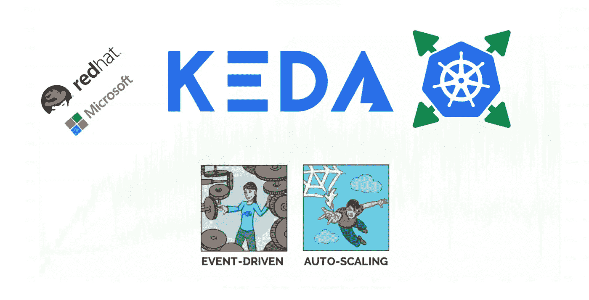

KEDA Kubernetes 上的事件驱动自动缩放

事件驱动的计算并不是一个新想法；数据库领域的人们已经使用数据库触发器很多年了。概念很简单:无论何时添加、更改或删除数据，都会触发一个事件来执行各种功能。新的特点是这些类型的事件和触发器在自动扩展、自动补救、容量规划等其他领域的应用程序中激增。事件驱动架构的核心是对系统上的各种事件做出反应，并相应地采取行动。

自动伸缩(在某种程度上是一种自动化)已经成为几乎所有云平台中不可或缺的组件，微服务*又名*容器也不例外。事实上，以灵活和解耦设计著称的容器最适合自动伸缩，因为它们比虚拟机更容易创建。

> *为什么要自动缩放？？？？*

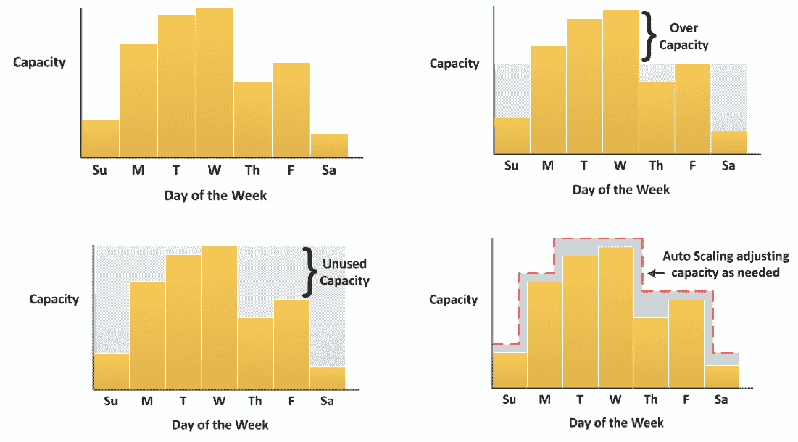

容量扩展—自动扩展

可伸缩性是现代基于容器的应用程序部署要考虑的最重要的方面之一。随着容器编排平台的进步，设计可伸缩性解决方案变得前所未有的简单。该工具被称为基于 Kubernetes 的事件驱动自动缩放，或 KEDA(用操作框架构建)，允许用户在 Kubernetes 上构建自己的事件驱动应用程序。KEDA 处理触发器以响应其他服务中发生的事件，并根据需要扩展工作负载。KEDA 使容器能够直接使用来自源的事件，而不是通过 HTTP 路由。

KEDA 可以在任何公共或私有云和本地环境中工作，包括 Azure Kubernetes 服务和 Red Hat 的 OpenShift。有了这个，开发者现在也可以使用微软的无服务器平台 Azure Functions，并将其作为一个容器部署在 Kubernetes 集群中，包括在 OpenShift 上。

这看起来很简单，但是假设每天都有大量事务处理，真的有可能像下面这样手动管理应用程序(Kubernetes 部署)的数量吗？？？

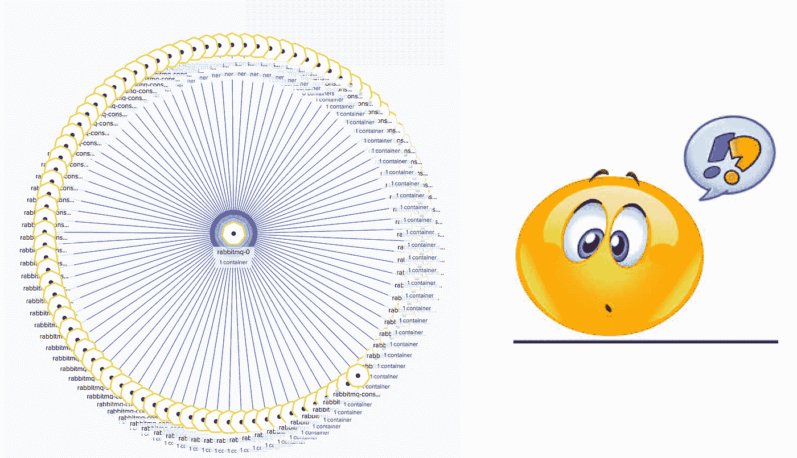

在生产中管理自动缩放

KEDA 将自动检测新部署并开始监控事件源，利用实时指标来推动扩展决策。

# KEDA

作为 Kubernetes 上的一个组件，KEDA 提供了两个关键角色:

1.  Scaling Agent:激活和停用部署的代理，用于扩展到已配置的副本，并在无事件时将副本缩减为零。
2.  Kubernetes Metrics Server:一个 Metrics Server，公开了大量与事件相关的数据，如队列长度或流延迟，允许基于事件的伸缩，使用特定类型的事件数据。

Kubernetes Metrics Server 与 Kubernetes HPA(水平 pod 自动缩放器)通信，以推动 Kubernetes 部署副本的横向扩展。然后由部署直接从源中消费事件。这保留了丰富的事件集成，并使完成或放弃队列消息等手势能够开箱即用。

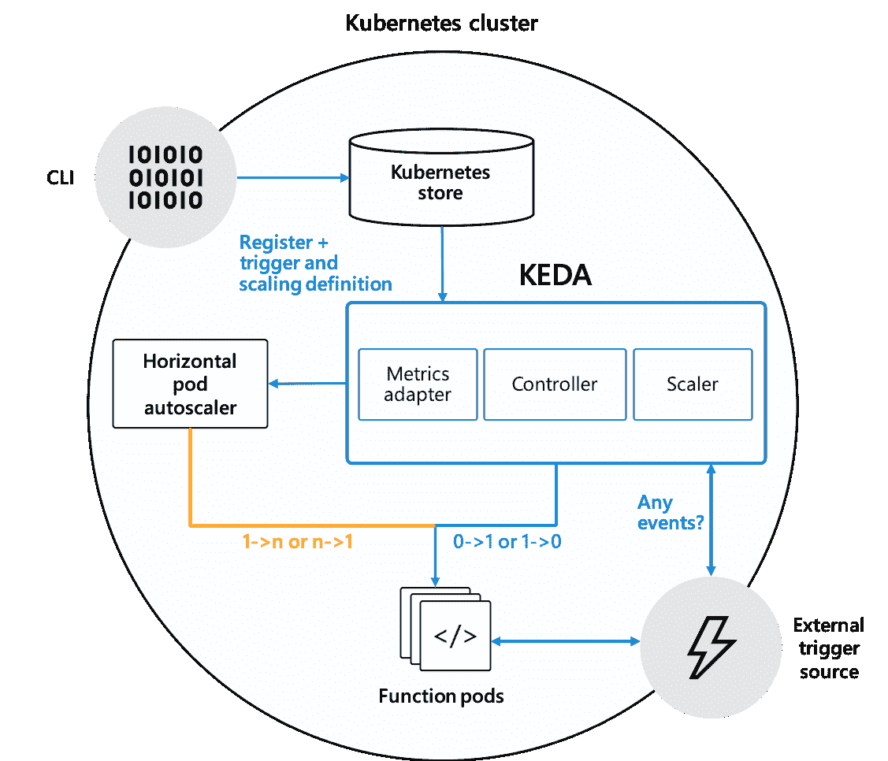

KEDA 建筑

# 攀登者

KEDA 使用“定标器”来检测是否应该激活或停用部署(定标),然后将其输入特定的事件源。今天支持多个带有特定支持触发器的“缩放器”，如 Kafka (trigger: Kafka Topics)、rabbit MQ(trigger:rabbit MQ Queues)以及更多。

除此之外，KEDA 与 Azure Functions 工具集成，本机扩展 Azure 特定的缩放器，如 Azure 存储队列、Azure 服务总线队列、Azure 服务总线主题。

# ScaledObject

ScaledObject 被部署为 Kubernetes CRD(自定义资源定义),它提供了将部署与事件源同步的功能。

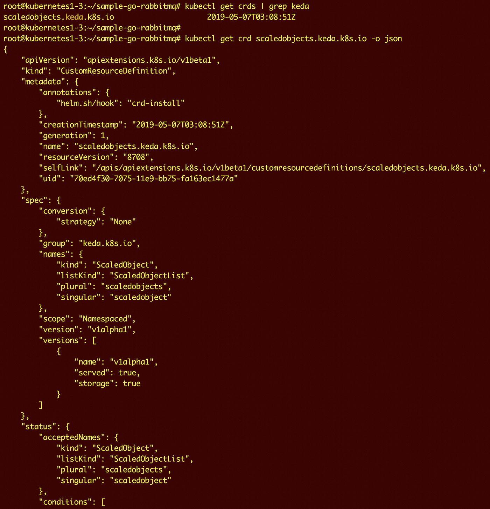

ScaledObject 自定义资源定义

部署为 CRD 后，ScaledObject 可以采用如下配置:

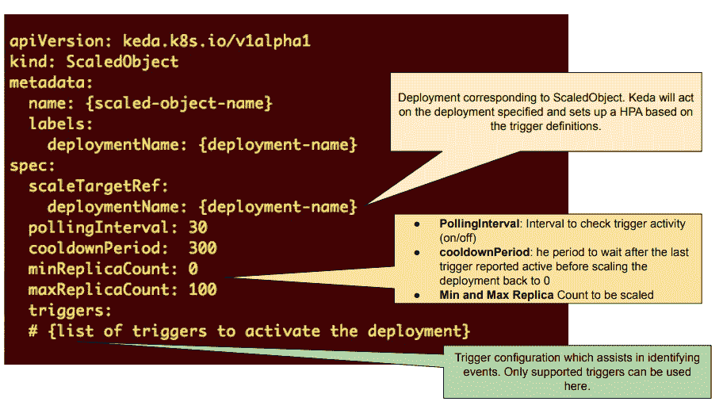

ScaledObject 规格

如上所述，支持不同的触发器，下面显示了一些示例:

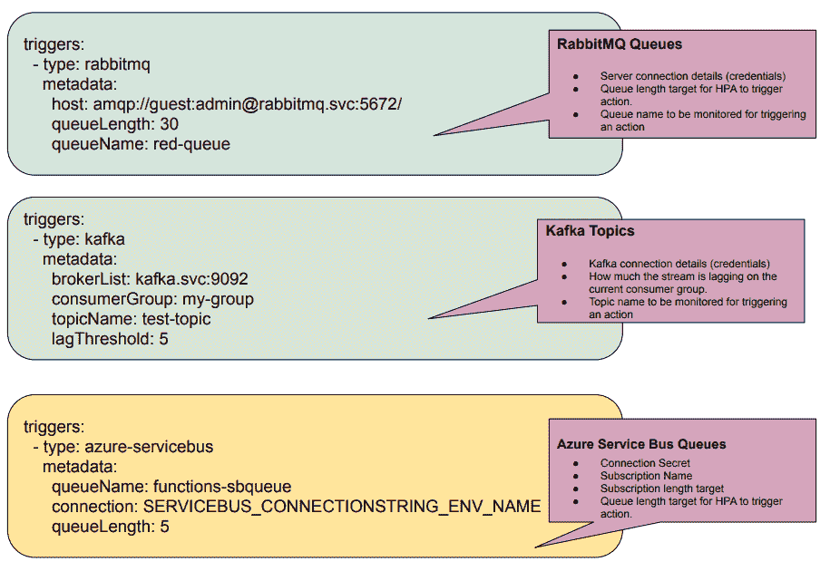

ScaledObject 的触发器配置

# 活动中的事件驱动自动扩展—内部 Kubernetes 集群

# KEDA 部署在库伯内特斯

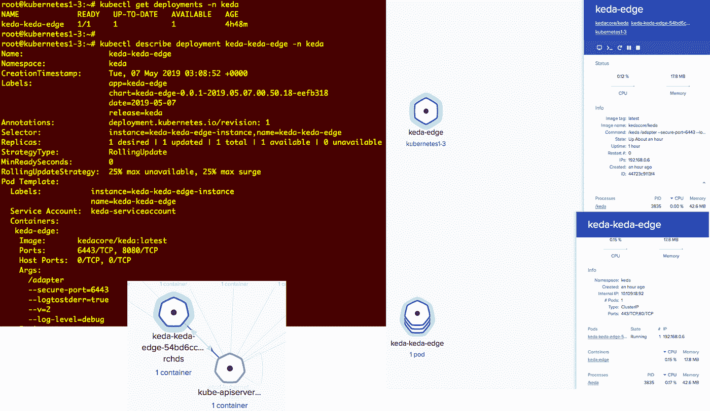

KEDA 控制器— Kubernetes 部署

# 带 KEDA 的 RabbitMQ 队列缩放器

RabbitMQ 是一个消息排队软件，称为消息代理或队列管理器。简单说；这是一个可以定义队列的软件，应用程序可以连接到队列，并在其上传输消息。

RabbitMQ 架构

在下面的例子中，RabbitMQ 服务器/发布者被部署为 Kubernetes 上的“statefulset ”:

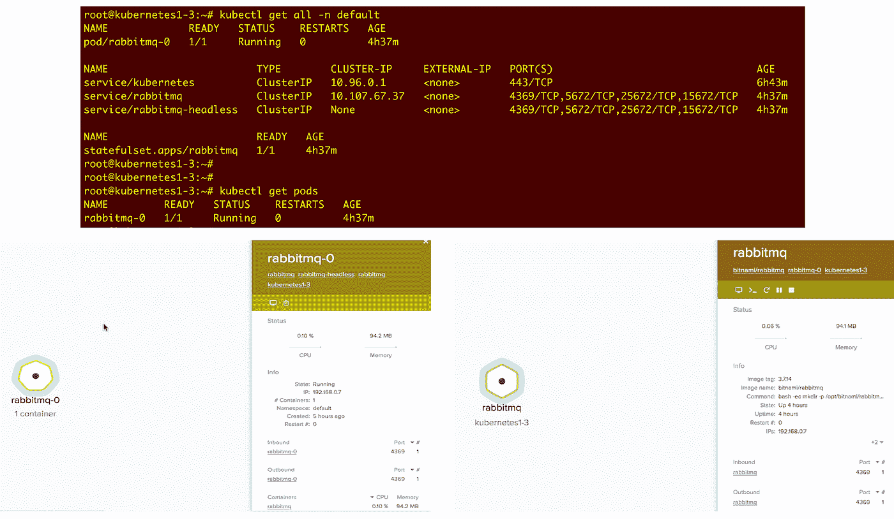

兔子 q

RabbitMQ 消费者被部署为接受由 RabbitMQ 服务器生成的队列并模拟执行的部署。

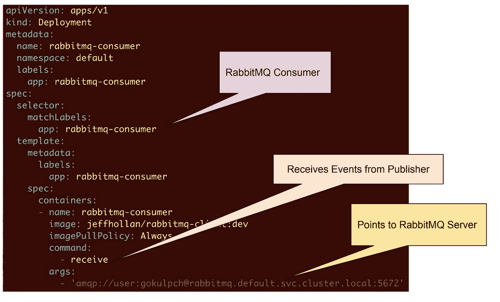

RabbitMQ 消费者部署

# 使用 RabbitMQ 触发器创建 ScaledObject

除了上面的部署，还提供了一个 ScaledObject 配置，该配置将由上面创建的 KEDA CRD 通过在 Kubernetes 上安装 KEDA 进行翻译。

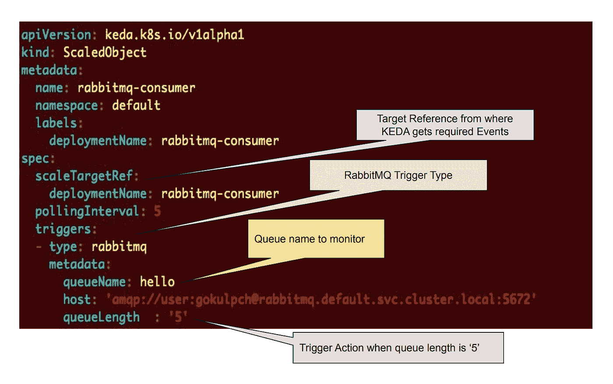

带有 RabbitMQ 触发器的 ScaledObject 配置

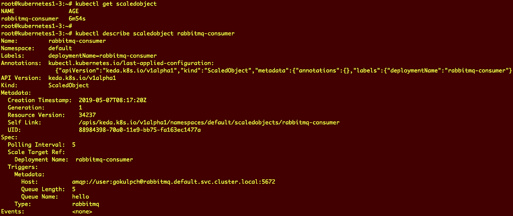

Kubernetes 上的 ScaledObject

一旦创建了 ScaledObject，KEDA 控制器就会自动同步配置，并开始监视上面创建的 rabbitmq-consumer。KEDA 无缝创建具有所需配置的 HPA(水平机架自动缩放器)对象，并根据 ScaledObject 提供的触发规则横向扩展副本(在本例中，队列长度为“5”)。因为还没有队列，所以 rabbitmq-consumer 部署副本被设置为零，如下所示。

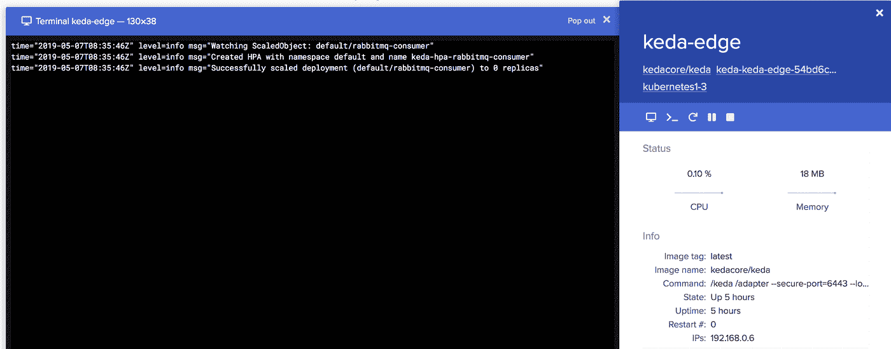

Kubernetes 上的 KEDA 控制器

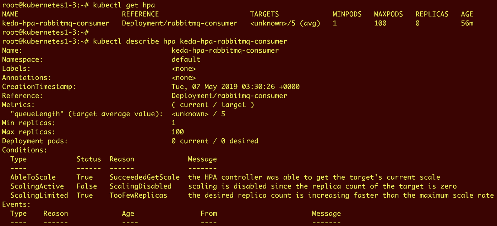

KEDA 发明的水平吊舱自动定标器

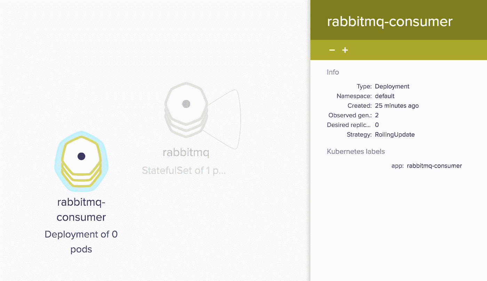

RabbitMQ 使用者-副本:0

使用上述 ScaledObject 和 HPA 配置，KEDA 将根据从事件源收到的信息驱动容器向外扩展。使用下面的“Kubernetes-Job”配置发布一些队列，这会产生 10 个队列:

kubernetes-发布队列的作业

KEDA 自动将当前设置为“零”个副本的“rabbitmq-consumer”扩展为“两个”副本，以满足队列需求。

## *发布 10 个队列— RabbitMQ 消费者扩展到两个副本*:

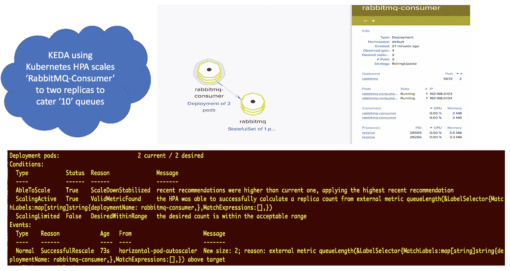

10 个队列— 2 个副本

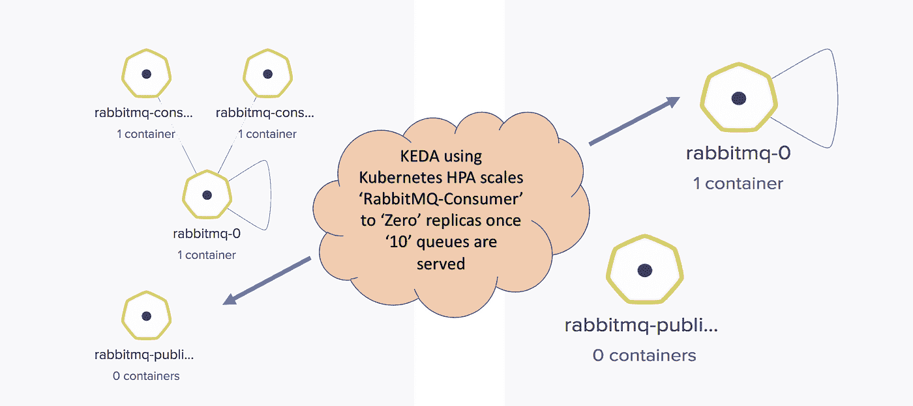

缩放至:2-向下缩放:0

## *发布 200 个队列— RabbitMQ 消费者扩展到四十(40)个副本:*

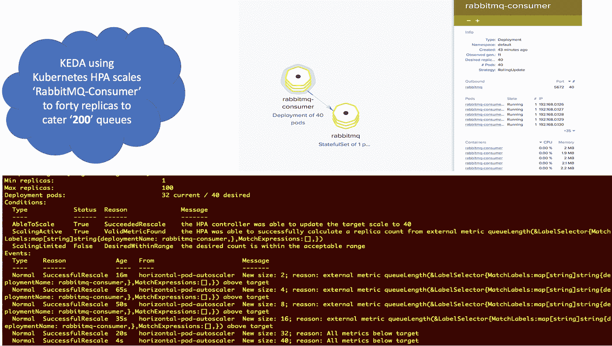

200 个队列— 40 个副本

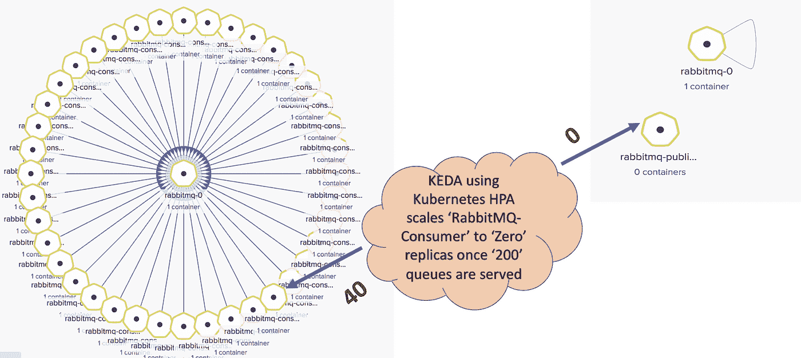

缩放至:40-向下缩放:0

## *发布 1000 个队列— RabbitMQ 消费者扩展到 100 个副本，最大副本数设置为 100 个*:

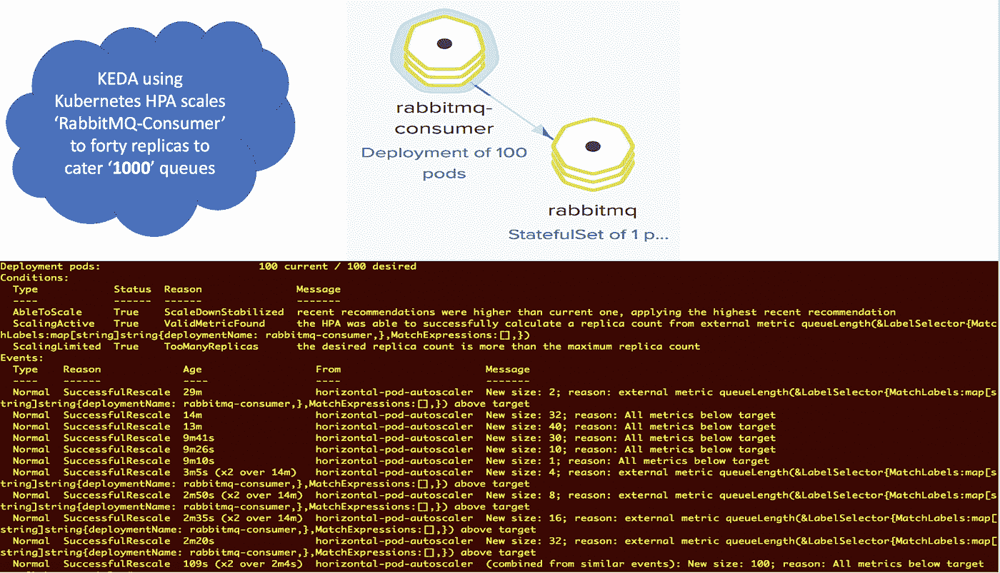

1000 个队列— 100 个副本

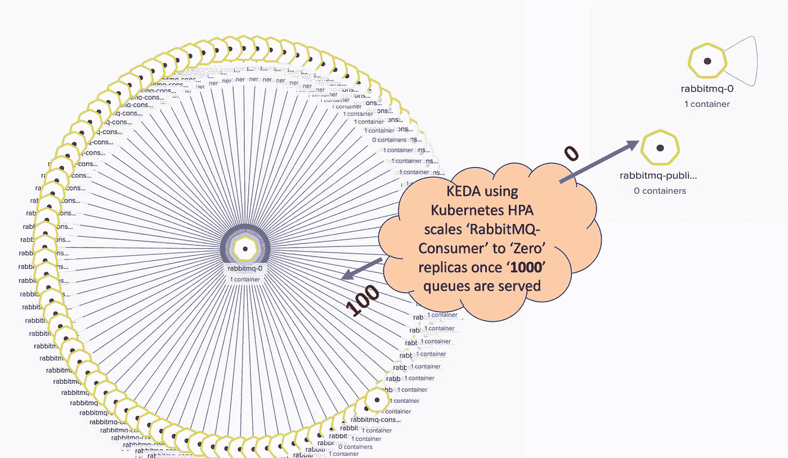

缩放至:100-向下缩放:0

KEDA 提供了一个类似 FaaS 的事件感知扩展模型，其中 Kubernetes 部署可以根据需求和智能动态扩展到零，而不会丢失数据和上下文。KEDA 还为 Azure Functions 提供了一个新的托管选项，可以作为一个容器部署在 Kubernetes 集群中，将 Azure Functions 编程模型和规模控制器带到任何 Kubernetes 实现中，无论是在云中还是在内部。

KEDA 也为 Kubernetes 带来了更多的活动来源。KEDA 有很大的潜力成为生产级 Kubernetes 部署中的必需品，因为未来会继续添加更多的触发器，或者为应用程序开发人员提供框架，以根据应用程序的性质设计触发器，从而使自动伸缩成为应用程序开发中的嵌入式组件。