# KeePass:一个 MFA TOTP 代码，一个浏览器的密码，SSH 密钥密码存储配置和秘密服务集成

> 原文：<https://itnext.io/keepass-an-mfa-totp-codes-a-browsers-passwords-ssh-keys-passwords-storage-configuration-and-a1b1efe50e13?source=collection_archive---------2----------------------->


所以，这似乎是关于 Linux 中密码和 SSH 管理的整个系列的最后一篇文章。

前面的部分是关于:

*   [Linux:next cloud 客户端，qtkeychain 和“org.freedesktop.secrets”这个名字没有被任何人提供。服务文件“错误](https://rtfm.co.ua/en/linux-the-nextcloud-client-qtkeychain-and-the-the-name-org-freedesktop-secrets-was-not-provided-by-any-service-files-error/)
    ——我发现一个密匙环服务能够存储 SSH 密钥密码
    ——并且知道 Chromium 以一种“不加密的方式”存储密码
*   [Linux: KeePass，SSHихраненеиепаиолейrsa-ключей](https://rtfm.co.ua/linux-keepass-ssh-i-xranenie-parolej-rsa-klyuchej/)(俄语*，即将翻译* )
    —如何使用`ssh-agent`，稍微介绍一下它与 KeePass 的集成，以存储 ssh 密钥密码
*   [什么是:Linux keyring、gnome-keyring、Secret Service 和 D-Bus](https://rtfm.co.ua/en/what-is-linux-keyring-gnome-keyring-secret-service-and-d-bus/)
    —什么是 keyring 以及如何使用它
    —回顾一下，如何使用 D-Bus
    —以及一些关于 KeePass 集成为 Secret Service 的内容
*   [Chromium: Linux，key rings&&Secret Service，密码加密和存储](https://rtfm.co.ua/en/chromium-linux-keyrings-secret-service-passwords-encryption-and-store/)
    ——最后整理出来——Chromium 以明文形式存储敏感数据是真的吗？

实际上，知道了所有这些，我们就可以把它们集合在一起，在一台装有 Arch Linux 和 Openbox DE 的工作笔记本电脑上配置普通的秘密管理。

在本帖中，我们将为以下各项配置 KeePassXC:

*   浏览器集成将密码存储在 KeePass 中，而不是 Chromium 自己的 SQLite 数据库中
*   MFA 的 TOTP 码生成
*   将集成`ssh-agent`和 KeePass 来存储 RSA 密钥密码
*   并将使特勤局集成使用 KeePass 作为 Linux 的密匙环存储

## **内容**

*   [KeePass vs KeePassXC](https://rtfm.co.ua/en/keepass-an-mfa-totp-codes-a-browsers-passwords-ssh-keys-passwords-storage-configuration-and-secret-service-integration/#KeePass_vs_KeePassXC)
*   [KeePass 和浏览器的密码— KeePassXC-Browser](https://rtfm.co.ua/en/keepass-an-mfa-totp-codes-a-browsers-passwords-ssh-keys-passwords-storage-configuration-and-secret-service-integration/#KeePass_and_a_browsers_passwords_KeePassXC-Browser)
*   [KeePassXC MFA TOTP 发电机](https://rtfm.co.ua/en/keepass-an-mfa-totp-codes-a-browsers-passwords-ssh-keys-passwords-storage-configuration-and-secret-service-integration/#KeePassXC_MFA_TOTP_generator)
*   [KeePass 和 ssh-agent 获取 ssh 密钥密码](https://rtfm.co.ua/en/keepass-an-mfa-totp-codes-a-browsers-passwords-ssh-keys-passwords-storage-configuration-and-secret-service-integration/#KeePass_and_ssh-agent_for_SSH_keys_passwords)
*   [sign_and_send_pubkey:签名失败:代理拒绝操作](https://rtfm.co.ua/en/keepass-an-mfa-totp-codes-a-browsers-passwords-ssh-keys-passwords-storage-configuration-and-secret-service-integration/#sign_and_send_pubkey_signing_failed_agent_refused_operation)
*   [KeePass 和特勤局整合](https://rtfm.co.ua/en/keepass-an-mfa-totp-codes-a-browsers-passwords-ssh-keys-passwords-storage-configuration-and-secret-service-integration/#KeePass_and_Secret_Service_integration)

# KeePass vs KeePassXC

我用 KeePassXC 代替 KeePass。

事实上，从一开始，我就改用 KeePassXC，只是因为默认情况下，它在装有 Openbox 的 Linux 中看起来要好得多。

KeePass:

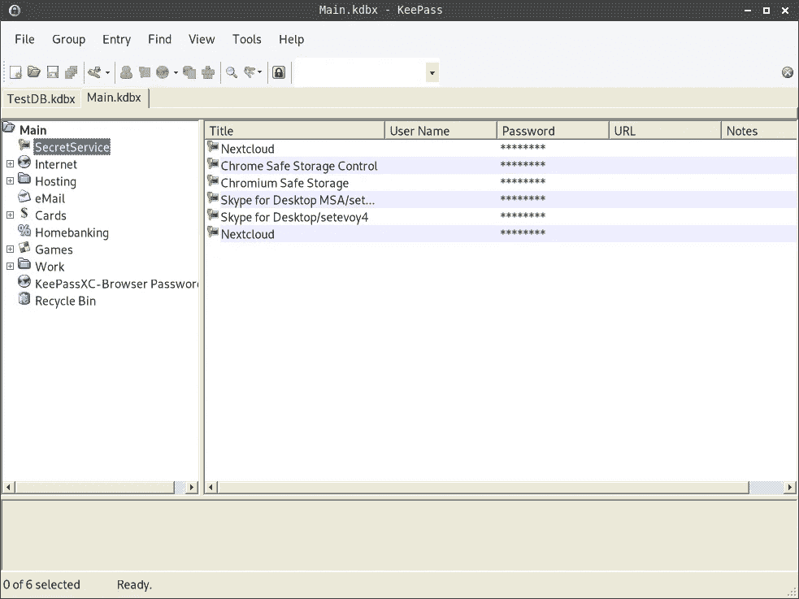

KeePassXC:

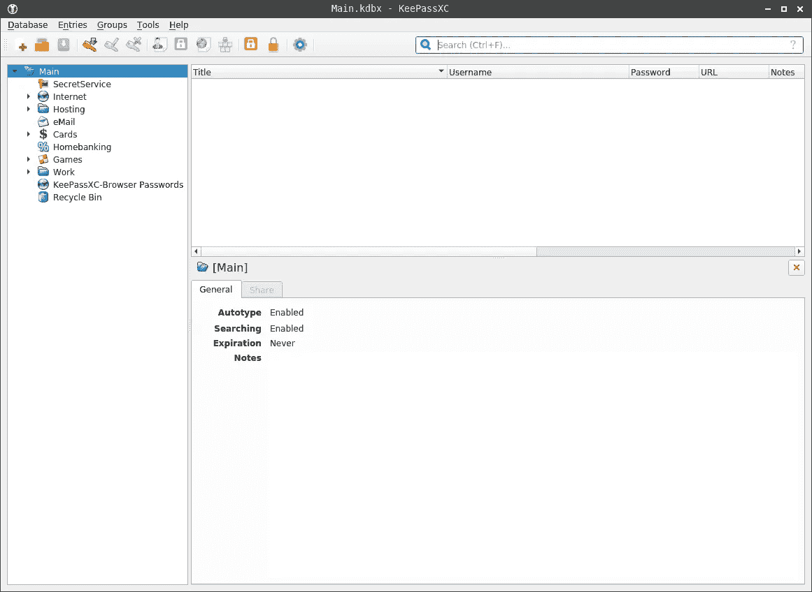

此外，KeePass 是用微软的 C#编写的，在 Linux 下需要`[mono](https://www.mono-project.com/docs/about-mono/supported-platforms/linux/)`才能工作，而 KeePassXC 是用 C++编写的(见其[库](https://github.com/keepassxreboot/keepassxc))，可以在任何平台上轻松工作——Linux/BSD/MAC OS/Windows。

查看 [Reddit](https://www.reddit.com/r/KeePass/comments/8wll8p/keepass_vs_keepassxc/) 上的帖子了解更多详情。

作为一个浏览器，我将使用基于 Chromium 的 Brave，这样在配置上就没有区别了。

## KeePass 和浏览器的密码— KeePassXC-Browser

首先，有一个很好的问题——你真的想改变你的浏览器的密码存储吗？

也就是说，你有 Chromium，它有自己的 SQLite 数据库，密码以加密的方式存储在那里。

此外，Chromium 在网页上创建凭证字段没有问题，但 KeePass 有时会出现这种情况。

另一方面，当使用 KeePass 时——你所有的密码(和 SSH 密钥等)总是在你身边，在同一个地方。易于备份/恢复、在计算机之间移动/共享、添加到另一个浏览器等等。

所以，每个人都会自己决定，但是让我们来写 KeePass 和 Chromium 的集成过程。

进入*工具>设置*，然后进入*浏览器集成*，启用:

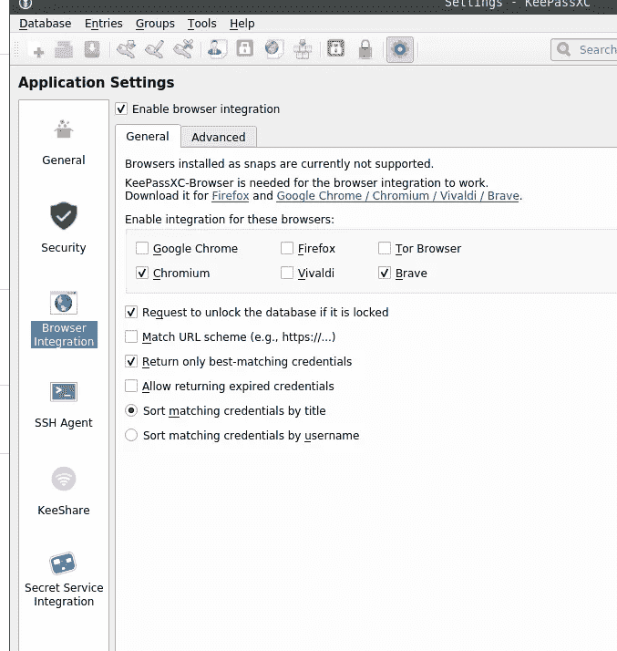

找到 **KeePassXC-Browser** 插件，安装:

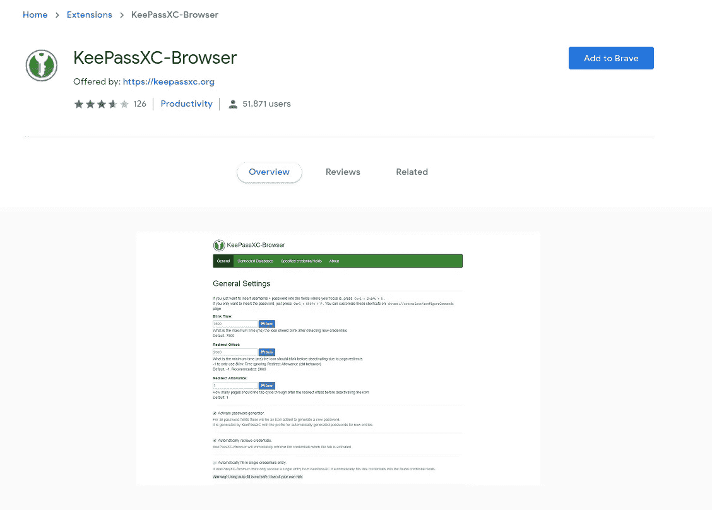

转到*设置*:

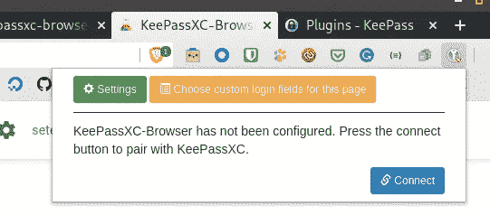

*   *保存新密码的默认组* —通常，我会禁用默认的 KeePassXC-Browser 密码，并启用该选项，以便总是询问我想在哪里保存新密码，因为在我的数据库中，所有内容都被分组
*   *激活 2FA/OTP 字段图标* —如果主动使用 MFA 可以启用，但是值得这么做吗？参见下面的 [*KeePass MFA TOTP 发生器*](https://rtfm.co.ua/?p=22933#KeePass_MFA_TOTP_generator)
*   **自动重新连接到 KeePassXC* —始终保持与数据库的连接很舒服，还没有发现任何滞后/错误*
*   *自动填写 HTTP 基本认证对话框并提交它们——看起来很有用，但是我不能让它工作——总是显示一个 HTTP 表单窗口*

*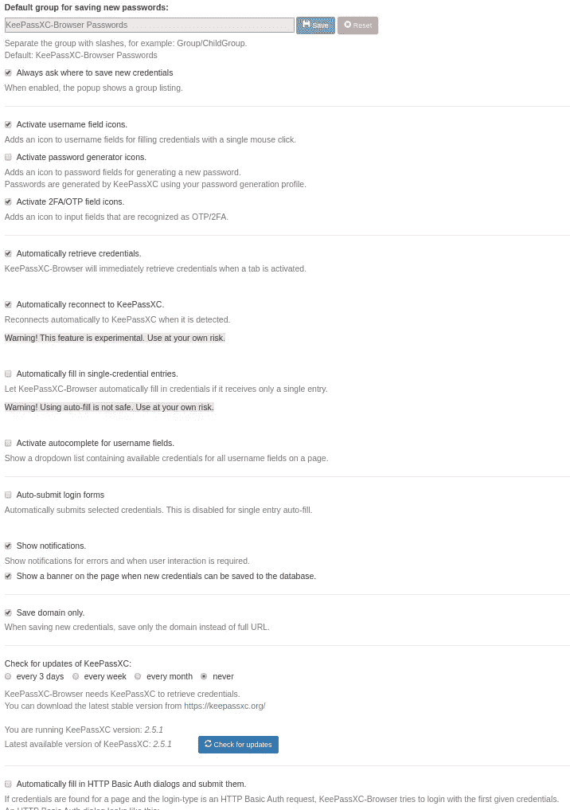*

*回到插件，点击*连接*:*

*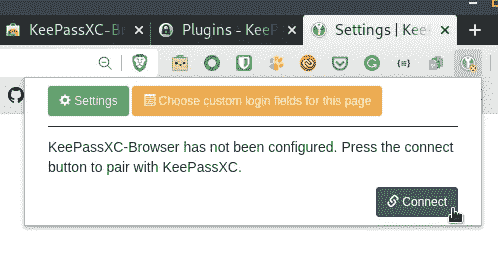*

*设置连接名称:*

*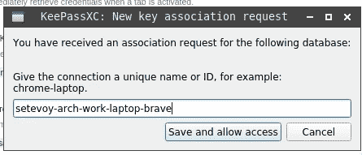*

*检查 KeePass 关于连接的浏览器:*

*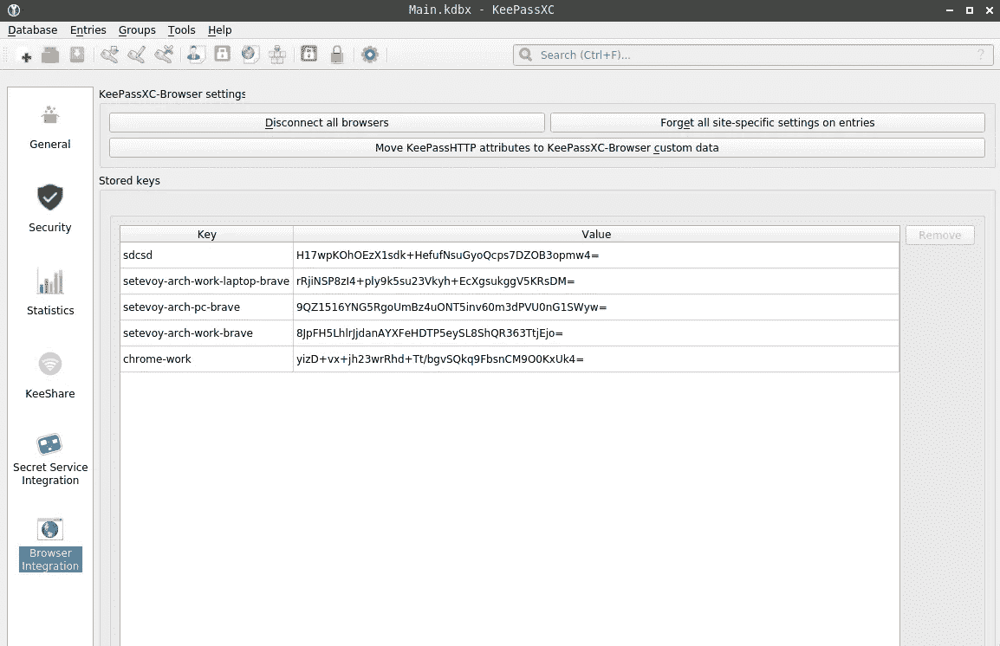*

*完成了——图标现在是绿色的:*

*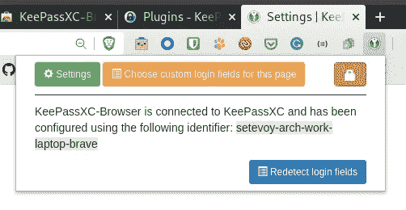*

*在某处登录，KeePass 会提示保存密码:*

*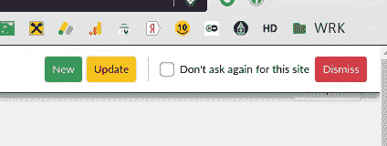*

*保存它( *New* )，再次登录——我们的凭证现在就在这里:*

*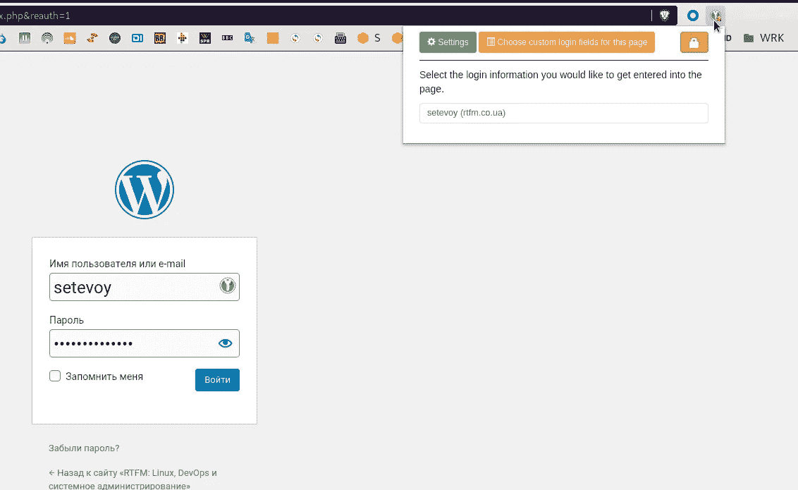*

## *KeePassXC MFA TOTP 发电机*

*还有一件有趣的事情 KeePassXC 中的 TOTP 码生成器。*

*然而，有一个严肃的问题:启用它是一个好的解决方案吗？*

*MFA 认证背后的主要思想正是使用两个独立的服务来认证你，即一方的*登录:密码*，另一方的**和**来自你的 MFA 的 TOTP 码。*

*是否值得将它们一起保存在同一个 KeePass 数据库中——绝对是关于你的，但请记住，如果有人将访问你的 KeePass——那么你将没有机会将 MFA 作为保护你数据安全的最后希望。*

*尽管如此，这样的选项是存在的，我使用的是 MFA，所以让我们看看如何配置它。*

*在 MFA 配置期间—根据服务选择类似“*显示密钥*或“*无法扫描 QR* ”的内容，以查看文本代码而非 QR 代码。*

*以下是 AWS 控制台的一个示例:*

*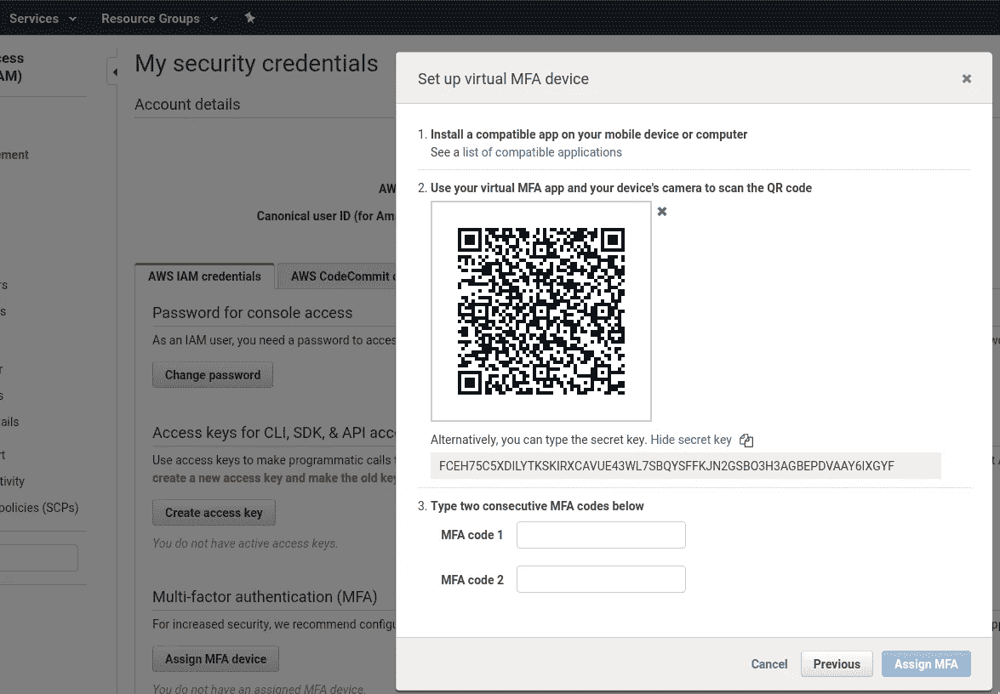*

*保存代码，然后在 KeePassXC 中找到或更新您想要配置 MFA 的条目，右键单击它— *TOTP >设置 TOTP* :*

*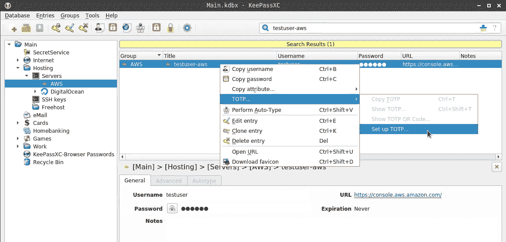*

*并从 AWS 设置*密钥*:*

*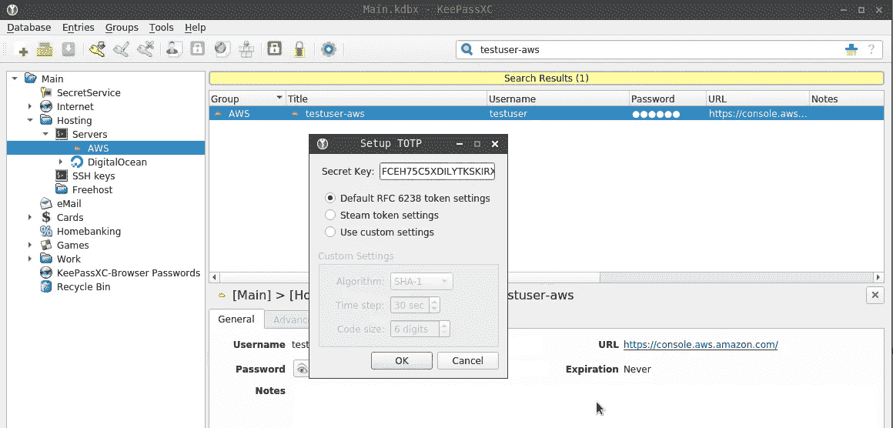*

*保存，再次点击右键— *显示 TOTP* :*

*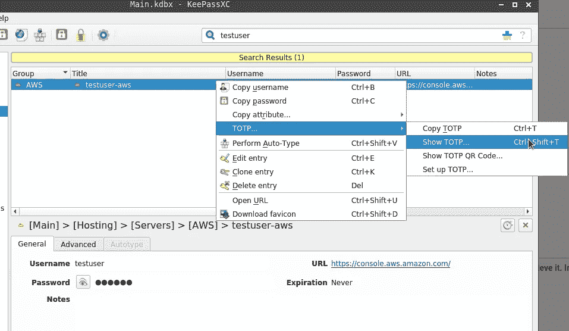*

*并在 AWS 中完成 MFA 配置:*

*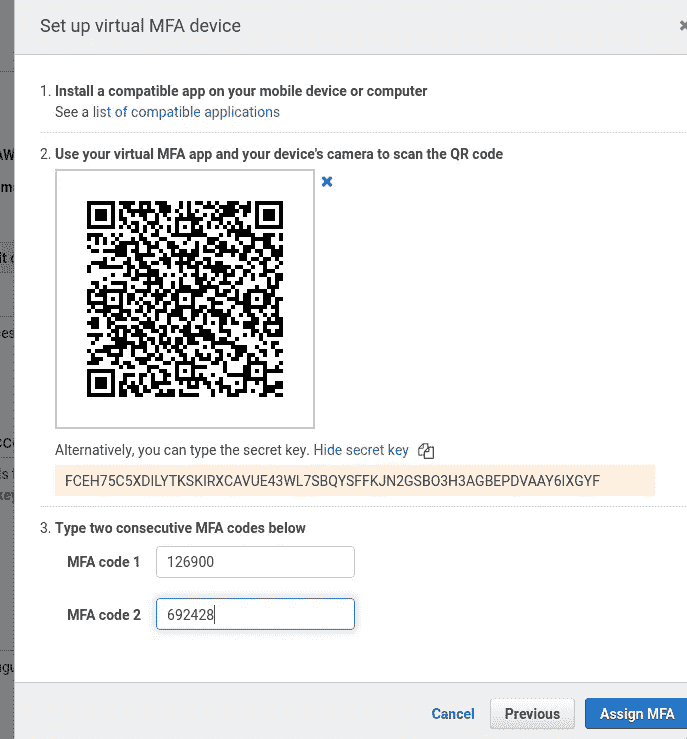*

*尝试登录，但是…填充 TOTP 字段的按钮不起作用:-(*

*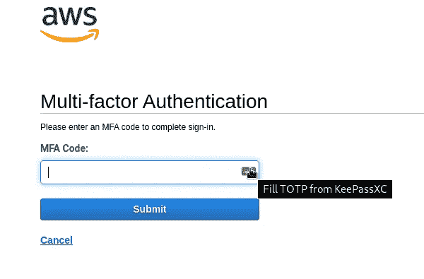*

*它在 Chromium 的 Gmail 上也不能用。*

*好了 KeePass 中的代码已经生成，所以只需通过右键单击或使用 *Ctrl+T* 手动复制它——我们就完成了。*

## *SSH 密钥密码的 KeePass 和`ssh-agent`*

*这里的想法是将 SSH 密钥密码存储在 KeePass 中，并通过`ssh-agent`访问它们，而不需要询问 SSH 密钥密码。*

*在 [Linux: KeePass，sshихранениепаиолеййrsa-ключей](https://rtfm.co.ua/linux-keepass-ssh-i-xranenie-parolej-rsa-klyuchej/)的帖子中已经有了更详细的描述，但是目前只有俄语版本(将在未来几天翻译)。*

*检查`ssh-agent`是否正在运行:*

```
*$ ps aux | grep ssh-agent
setevoy 1505 0.0 0.0 5796 456 ? Ss Dec10 0:00 ssh-agent*
```

*如果没有—启动它:*

```
*$ eval $(ssh-agent)
Agent pid 950428*
```

*检查`$SSH_AUTH_SOCK`变量是否可用，因为它将指向一个用于与代理通信的套接字:*

```
*$ env | grep SSH
SSH_AUTH_SOCK=SSH_AUTH_SOCK=/run/user/1000/ssh-agent.socket
SSH_AGENT_PID=950428*
```

*进入 KeePass *工具>设置*，启用 *SSH 代理*:*

*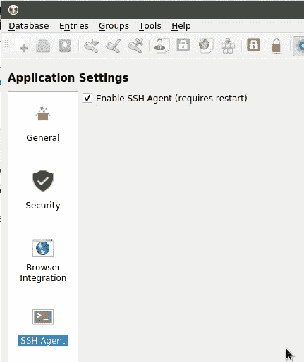*

*重新启动 KeePass 并添加新密钥。*

*生成它，设置密码:*

```
*$ ssh-keygen -f /home/setevoy/rtfm-do-prod-setevoy
Generating public/private rsa key pair.
Enter passphrase (empty for no passphrase):
Enter same passphrase again:
Your identification has been saved in /home/setevoy/rtfm-do-prod-setevoy.
Your public key has been saved in /home/setevoy/rtfm-do-prod-setevoy.pub.
…*
```

*注意这里是用于设置密钥文件的`-f`,它不在`.ssh`目录中，以便更简单地添加到 KeePass 中。*

*检查文件:*

```
*$ ll /home/setevoy/rtfm-do-prod-setevoy*
-rw — — — — 1 setevoy setevoy 2655 Dec 11 10:53 /home/setevoy/rtfm-do-prod-setevoy
-rw-r — r — 1 setevoy setevoy 579 Dec 11 10:53 /home/setevoy/rtfm-do-prod-setevoy.pub*
```

*返回 KeePass，创建一个新条目，设置任意名称，并在*密码*字段中设置您的密钥密码:*

*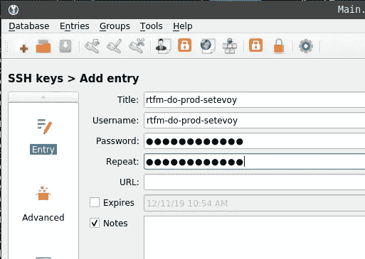*

*在 *SSH 代理中，*可以添加一个 key 作为*附件*，或者作为*外部文件*。*

*我建议使用*附件*，因为在这种情况下，密钥将直接存储在数据库中，您不需要将它复制到您的工作/家庭/etc 笔记本电脑上。*

*在同一个窗口中切换到*高级*，并附上关键文件标签:*

*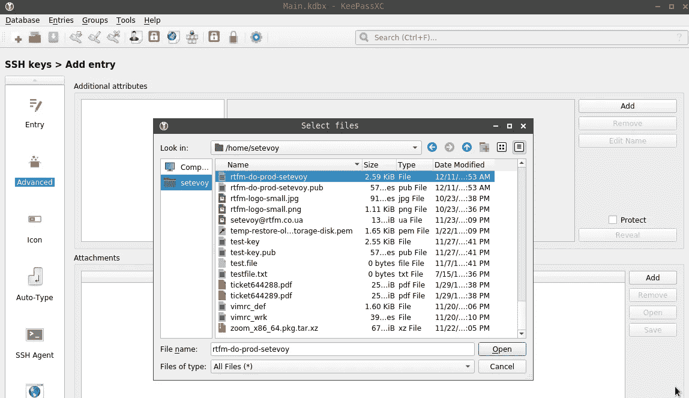*

*转到 *SSH 代理*，从*附件*添加密钥:*

*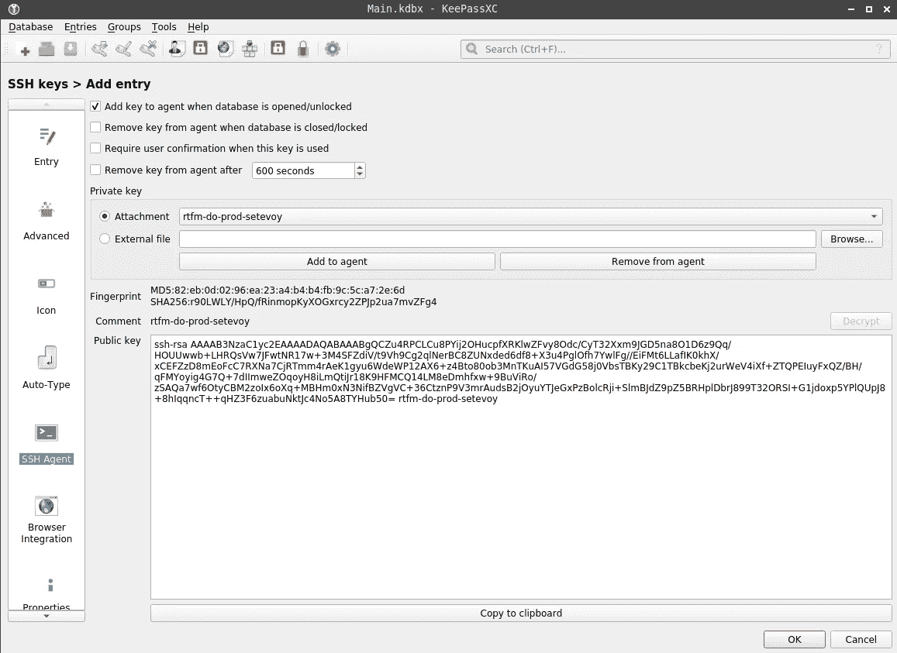*

*这里，请注意*数据库打开/解锁时将密钥添加到代理*选项——仅针对经常使用的密钥启用该选项，并且最好使它们少于 5 个，因为当 ssh-agent 尝试连接到主机时——它将尝试使用在`ssh-agent`中可访问的每个密钥，并且远程主机上的 ssh 服务器可以关闭连接以“防止暴力破解”。*

*好吧，试着连接到一个主机:*

```
*$ ssh setevoy@rtfm.co.ua
Linux rtfm-do-production 4.9.0–8-amd64 #1 SMP Debian 4.9.144–3.1 (2019–02–19) x86_64
…
setevoy@rtfm-do-production:~$*
```

*好的——它起作用了。*

*请记住，使用这种方法`ssh-agent`必须在 KeePass 之前启动，并且必须以这样的方式导出其`$SSH_AUTH_SOCK`变量，以便 KeePass 可以看到它。检查[中的选项，使用多种类型的终端运行 ssh-agent】。](https://rtfm.co.ua/en/ssh-rsa-keys-and-ssh-agent-for-ssh-keys-and-their-passwords-management/#Running_ssh-agent_with_multitype_terminals)*

*我使用带有`systemd`服务的变体，套接字路径将通过`~/.config/openbox/environment`文件导出(因为我使用的是 Openbox DE)。*

*我的单位-档案`/home/setevoy/.config/systemd/user/ssh-agent.service`:*

```
*[Unit]
Description=SSH key agent

[Service]
Type=simple
Environment=SSH_AUTH_SOCK=%t/ssh-agent.socket
ExecStart=/usr/bin/ssh-agent -D -a $SSH_AUTH_SOCK

[Install]
WantedBy=default.target*
```

*和环境文件— `~/.config/openbox/environment`:*

```
*export QT_QPA_PLATFORMTHEME="qt5ct"
export SSH_AUTH_SOCK="${XDG_RUNTIME_DIR}/ssh-agent.socket"*
```

*最后一步只是为了稍微舒服一点——为与`~/.ssh/config`的连接添加一个“短名称”:*

```
*Host rtfm
 Hostname rtfm.co.ua
 User setevoy*
```

*我们根本没有添加`IdentityFile`-`ssh-client`将询问`ssh-agent`可用的密钥来尝试登录，所以我们没有被绑定到磁盘上的密钥文件。*

*使用以下简称立即连接:*

```
*$ ssh rtfm
…
setevoy@rtfm-do-production:~$*
```

*既没有询问用户密码，也没有询问密钥密码——一切都如预期的那样正常工作。*

## *sign_and_send_pubkey:签名失败:代理拒绝操作*

*简短说明:如果您现在启用“*使用此键时需要用户确认*”选项:*

*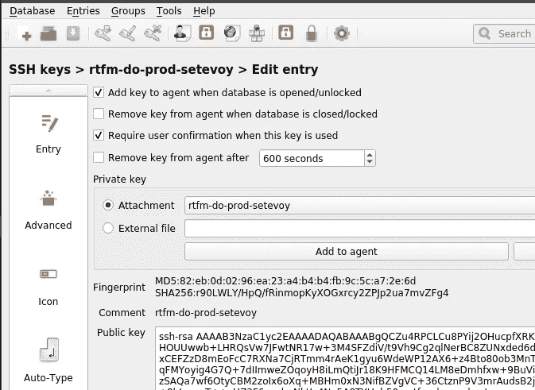*

*然后在 SSH 登录过程中，有时会看到“ *sign_and_send_pubkey:签名失败:代理拒绝操作*”错误:*

```
*$ ssh rtfm
sign_and_send_pubkey: signing failed: agent refused operation
Load key “/home/setevoy/.ssh/id_rsa”: Is a directory
setevoy@rtfm.co.ua’s password:*
```

*发生这种情况是因为`ssh-agent`试图要求用户确认，并使用了系统中无法安装的`ssh-askpass`实用程序:*

```
*$ file /usr/lib/ssh/ssh-askpass
/usr/lib/ssh/ssh-askpass: cannot open `/usr/lib/ssh/ssh-askpass’ (No such file or directory)*
```

*安装`x11-ssh-askpass`包:*

```
*$ sudo pacman -S x11-ssh-askpass*
```

*重新尝试登录—现在您必须看到这样一个带有确认请求的窗口:*

**

*点击*ок*——现在一切正常。*

## *KeePass 和特勤局整合*

*为了更好地理解一般情况下的密匙环和特殊情况下的特勤局——我强烈建议你首先阅读[什么是:Linux 密匙环、gnome-密匙环、特勤局和 D-Bus](https://rtfm.co.ua/en/what-is-linux-keyring-gnome-keyring-secret-service-and-d-bus/) 帖子。*

*首先，让我们确保我们的系统中没有可用的秘密服务——检查 D-Bus:*

```
*$ qdbus — session org.freedesktop.DBus / org.freedesktop.DBus.GetConnectionUnixProcessID org.freedesktop.secrets
Error: org.freedesktop.DBus.Error.NameHasNoOwner
Could not get PID of name ‘org.freedesktop.secrets’: no such name*
```

*好吧，是空的。*

*进入 KeePass，*工具>设置*，选择*特勤整合*，启用它:*

**

*现在，转到 KeePass 数据库的设置，并在它的*特勤局集成*设置中指定一个集合(团队，文件夹)，该集合将用于存储我们的秘密:*

**

*此外，现在最好在系统中的每个其他应用程序之前启动 KeePass。*

*在我的例子中，这可以通过`~/.config/openbox/autostart`文件来完成:*

```
*xrandr --output HDMI-1 --primary
xrandr --output eDP-1 --right-of DP-1

feh --bg-scale /home/setevoy/Pictures/Wallpaper/seryy-kapli-strela-ten-arch.jpg &

tint2 -c /home/setevoy/.config/tint2/setevoy-tint2-90-pecent-bottom-wrk.tint2rc &
polybar -c /home/setevoy/.config/polybar/setevoy-polybar-wrk-bars.conf bottom &
polybar -c /home/setevoy/.config/polybar/setevoy-polybar-wrk-bars.conf top &
sleep 5

keepassxc &
dropbox &
lxqt-notificationd &
xscreensaver &
qxkb &

skypeforlinux &
sleep 5
slack &
...*
```

*运行浏览器:*

```
*$ chromium — password-store=gnome*
```

*并在 KeePass' *工具>设置*中查看现在正在使用 Secret Service 的服务:*

**

*当 Chromium 试图访问其密码来解密其 SQLite 数据库中的一些密码时，KeePass 会发出通知:*

**

*但这里有另一个问题:当我通过`[gmrun](https://rtfm.co.ua/arch-posleustanovochnye-nastrojki/#Openbox_XOrg)`启动 Chromium 时——它是通过`--password-store=basic`而不是`--password-store=gnome`启动的，尽管它必须检查一个秘密服务是否可用，并运行“gnome”而不是“基本”存储。*

*要解决这个问题，请阅读 [Arch Wiki](https://wiki.archlinux.org/index.php/Chromium/Tips_and_tricks#Making_flags_persistent) 并创建一个`~/.config/chromium-flags.conf`文件:*

```
*--password-store=gnome*
```

*重启浏览器，进入 chrome://version/，勾选选项:*

**

*好吧，它对 Chromium 有效——但是 Brave 仍然使用“ *basic* ”选项。*

*对于 Arch Linux 中的 Brave 浏览器，你可以创建一个`~/.config/brave-flags.conf`文件，如[中提到的> > >](https://github.com/brave/brave-browser/issues/2300#issuecomment-504907440) 注释，所以我们可以只复制现有的一个:*

```
*$ cp .config/chromium-flags.conf .config/brave-flags.conf*
```

*重新启动 Brave，检查其选项:*

*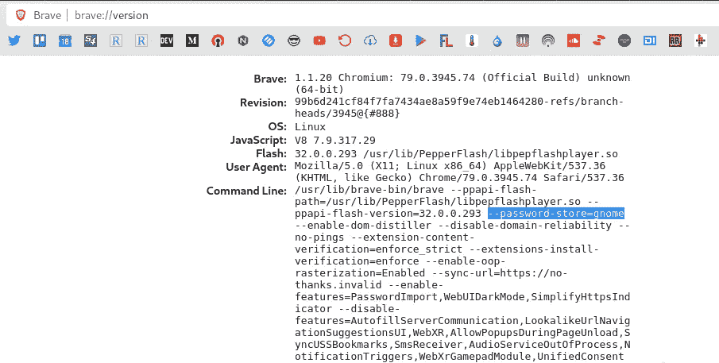*

*而且在 KeePass 的特勤里出现了*勇者*的记录，所以现在用的是特勤:*

*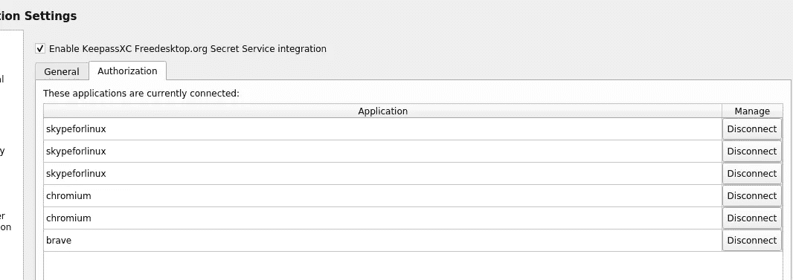*

*完成了。*

**最初发布于* [*RTFM: Linux、DevOps 和系统管理*](https://rtfm.co.ua/en/keepass-an-mfa-totp-codes-a-browsers-passwords-ssh-keys-passwords-storage-configuration-and-secret-service-integration/) *。**