# GPU 上的 Kubeflow 支持 AWS-EKS 集群

> 原文：<https://itnext.io/kubeflow-on-gpu-enabled-aws-eks-cluster-7c5d88c09d9b?source=collection_archive---------3----------------------->

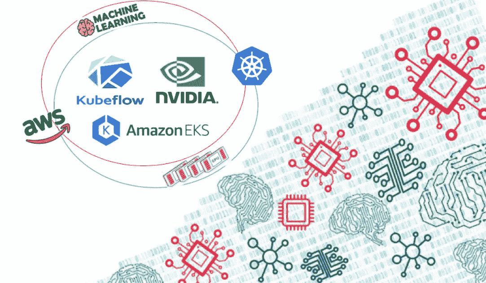

在 AWS-EKS 的强大 GPU 支持实例上运行 Kubeflow

自从 Google 将 Kubernetes 创建为一个开源容器编排工具以来，它已经以它可能从未想象过的方式蓬勃发展。随着这个项目越来越受欢迎，我们看到了许多辅助程序的发展。Kubeflow 旨在将机器学习引入 Kubernetes 容器。该项目的目标不是重新创建其他服务，而是提供一种简单的方法来为不同的基础设施部署 ML 的最佳开源系统。

GPU 已经从仅仅是一个图形芯片发展成为深度学习和机器学习的核心组件。CPU 是为更一般的计算工作负载而设计的。相比之下，GPU 的灵活性较差，但是 GPU 被设计为并行计算相同的指令，GPU 中的这种并行架构非常适合矢量和矩阵运算。机器学习是一个对计算要求很高的领域，GPU 的选择将从根本上决定用户的学习体验。在没有 GPU 的情况下，这可能看起来像是几个月的等待实验完成，或者运行一天或更长时间的实验，却看到所选的参数被关闭，模型出现偏差。

随着越来越多的 HPC 应用、AI 驱动的应用以及 GPU 在公共云中的广泛可用性，开源 Kubernetes 需要能够感知 GPU。借助 NVIDIA GPUs 上的 Kubernetes，软件开发人员和 DevOps 工程师可以大规模无缝地构建和部署 GPU 加速的深度学习训练或推理应用程序到异构 GPU 集群。Kubernetes 中的 GPU 支持由 NVIDIA 设备插件提供，该插件将主机上的 GPU 暴露给容器空间。

NVIDIA 和其他公司为 AWS 上基于 GPU 的加速计算实例提供了 ami。这使得开发人员能够在 AWS EC2 实例上线性扩展他们的模型训练性能，从而加速预处理和消除数据传输瓶颈，并快速提高他们的机器学习模型的质量。Nvidia 的 CUDA 是一个并行计算平台和编程模型，由 NVIDIA 开发，用于图形处理单元(GPU)上的通用计算。有了 CUDA，开发人员就可以利用 GPU 的强大功能，大幅提高计算应用的速度。

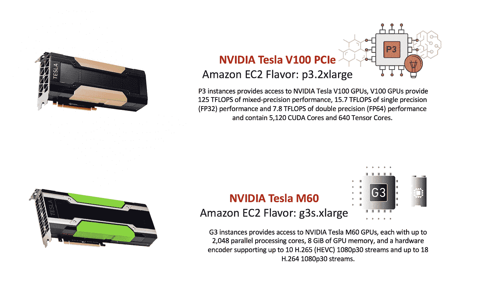

AWS 上可用的 GPU 实例

# EKS 上支持 GPU 的 Kubernetes 节点

AWS 提供 GPU 支持的 EC2 实例，可用于四个 AWS 地区的 EKS。P3 实例由多达八个[NVIDIA Tesla V100](https://www.nvidia.com/en-us/data-center/tesla-v100/)GPU 提供支持，旨在处理计算密集型机器学习、深度学习、计算流体动力学、计算金融、地震分析、分子建模和基因组工作负载。

用户可以在为工作节点创建 EKS 集群时选择特定的风格。

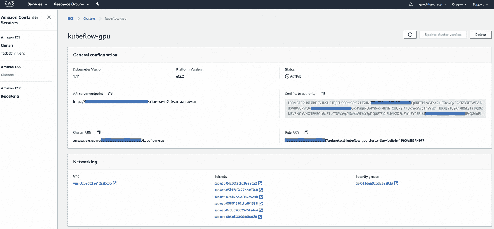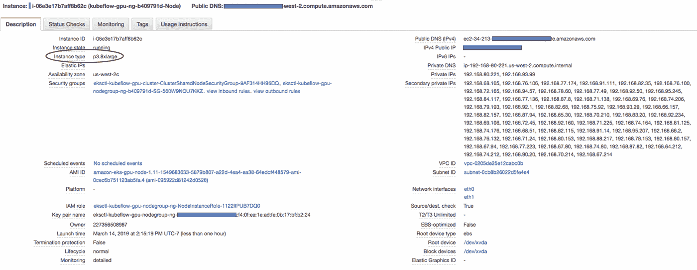

将 GPU 节点指定为 EKS 的 Kubernetes 节点

对于上述集群，Kubernetes 节点将配备 4 个特斯拉 V100-SXM2 GPU，如下所示:

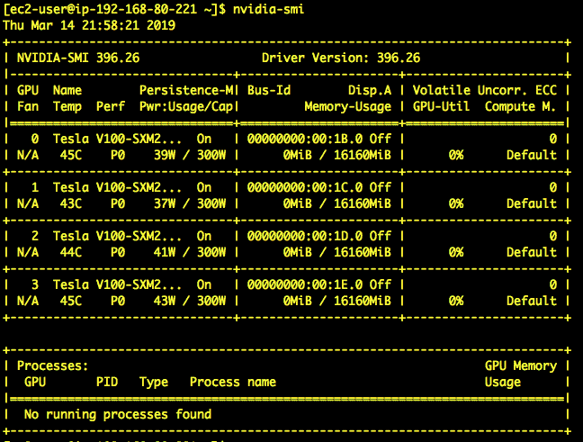

GPUS —英伟达

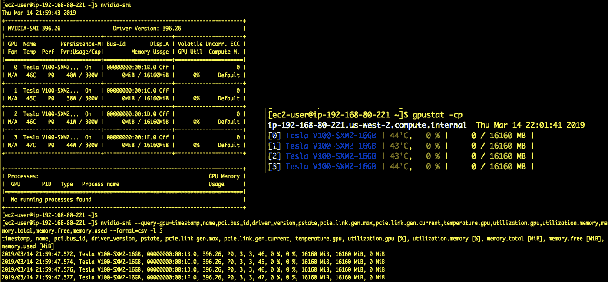

GPUS —英伟达

# 用于 Kubernetes 的 NVIDIA 设备插件

用于 Kubernetes 的 NVIDIA [设备插件](https://github.com/NVIDIA/k8s-device-plugin)是一款 Daemonset，允许您自动:

*   公开集群的每个节点上的 GPU 数量
*   跟踪 GPU 的运行状况
*   在 Kubernetes 集群中运行启用 GPU 的容器。

该插件将在以下节点上配置为默认运行时:

```
{
    "default-runtime": "nvidia",
    "runtimes": {
        "nvidia": {
            "path": "/usr/bin/nvidia-container-runtime",
            "runtimeArgs": []
        }
    }
}
```

NVIDIA GPUs 现在可以通过使用资源名称 nvidia.com/gpu:的容器级资源需求来使用

```
apiVersion: v1
kind: Pod
metadata:
  name: gpu-pod
spec:
  containers:
    - name: cuda-container
      image: nvidia/cuda:9.0-devel
      resources:
        limits:
          nvidia.com/gpu: 2 # requesting 2 GPUs
    - name: digits-container
      image: nvidia/digits:6.0
      resources:
        limits:
          nvidia.com/gpu: 2 # requesting 2 GPUs
```

该插件在 Kubernetes 集群上作为 daemonset 运行，如下所示:

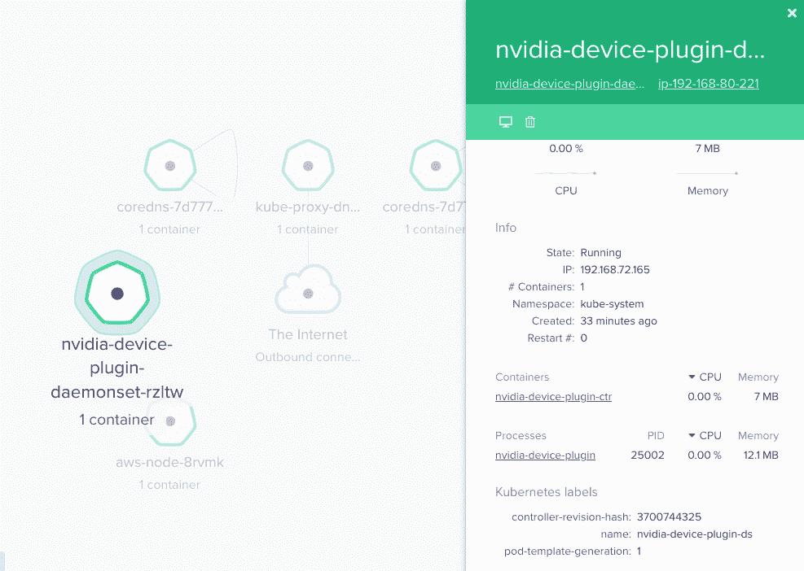

Kubernetes 上的英伟达设备插件

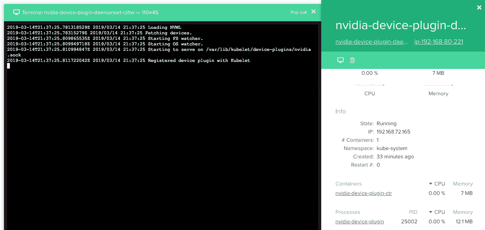

英伟达插件在 Kubelet 注册

安装设备插件后，Kubernetes 节点现在可以将 NVIDIA GPU 视为常规资源，如下所示:

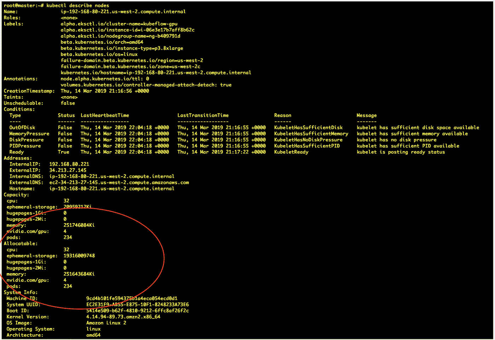

库柏内斯节点上的 GPU 可见性


库柏内斯节点上的 GPU 可见性

# 库贝弗洛谈 EKS

虽然可以使用 CPU 实例运行机器学习工作负载，但 GPU 实例具有数千个 CUDA 核心，这显著提高了深层神经网络的训练和处理大型数据集的性能。Kubeflow 可以部署在 EKS，消耗基于高性能 GPU 的 EC2 实例。

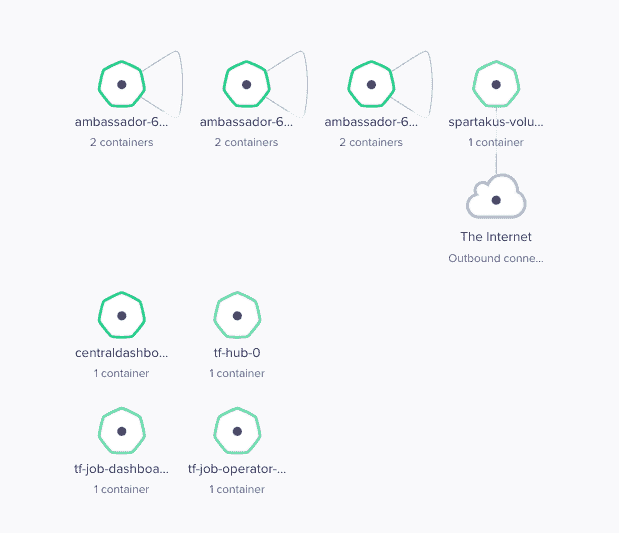

Kubernetes 上的 Kubeflow 堆栈

```
* tf-hub-0: JupyterHub web application that spawns and manages Jupyter notebooks.
* tf-job-operator, tf-job-dashboard: Runs and monitors TensorFlow jobs in Kubeflow.
* ambassador: Ambassador API Gateway that routes services for Kubeflow.
* centraldashboard: Kubeflow central dashboard UI.
centraldashboard: Kubeflow central dashboard UI.
```

# 消费 GPU 库贝弗洛

如上所述，作为 Kubeflow 的一部分的任何 pod 可以使用资源标志“nvidia.com/gpu”来消耗可用资源。库贝弗洛在集群中增加了一些资源来协助完成各种任务，包括培训和服务模特，以及运行 [Jupyter 笔记本](http://jupyter.org/)，用户可以创建和共享包含实时代码、公式、可视化效果和叙事文本的文档。

[JupyterHub](https://jupyterhub.readthedocs.io/en/latest/) 允许用户管理对多个单用户 Jupyter 笔记本电脑的身份验证访问。JupyterHub 将单用户笔记本的推出委托给了称为“spawners”的可插入组件。JupyterHub 有一个名为 kubespawner 的子项目，由该社区维护，该项目使用户能够调配由 Kubernetes pods 支持的单用户 Jupyter 笔记本，这些笔记本本身就是 Kubernetes pods。kubeform _ spawner 扩展了 kubespawner，使用户能够拥有指定 cpu、内存、gpu 和所需图像的表单。Spawners 配置允许用户选择 Jupyter Server 要使用的 GPU 数量。


设置资源限制 GPU 的数量

例如，上面的 Spawner 配置为使用 3 个 GPU 作为 resource_limit。这将在 Kubernetes 上创建一个 pod，其中指定的资源限制将该值替换为“nvidia.com/gpu:3”，并且特定的 JupyterHub pod 在创建后可以看到 3 个 gpu，如下所示:

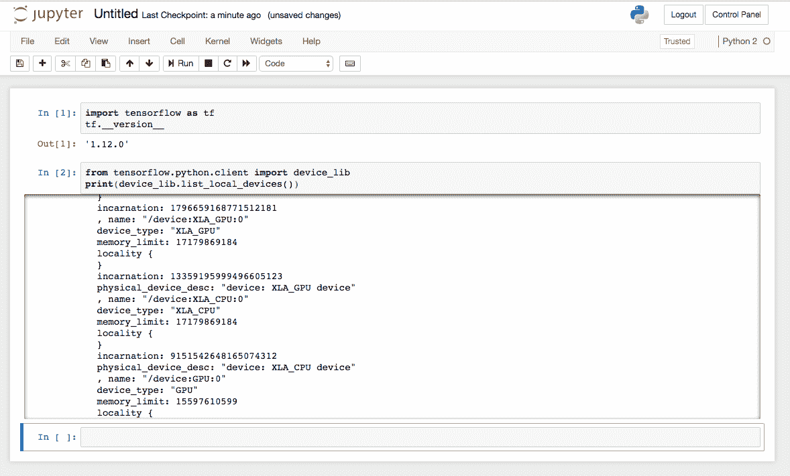

使用 GPU 的 Tensorflow 应用程序

如上所示，特定应用程序可以利用三个 GPU，如 spawner 选项中配置的那样。

以上游 Kubeflow — GitHub 问题摘要为例:使用 GitHub 问题公共数据集的自动摘要生成器。这个具体的例子包括多个步骤，如获取数据、预处理数据集、执行 TensorFlow NLP 模型的训练等。使用上面在 Kubernetes 上创建的 JupyterHub 应用程序可以加载和执行相同的内容。

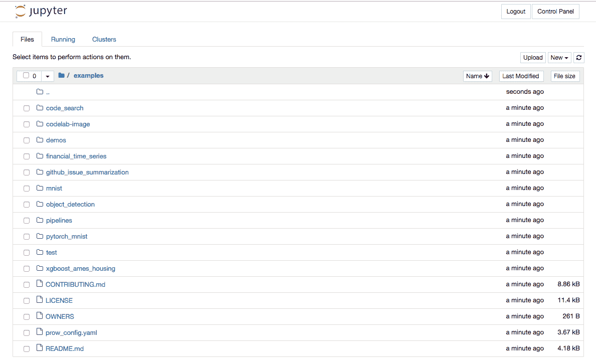

JupyterHub —应用程序目录

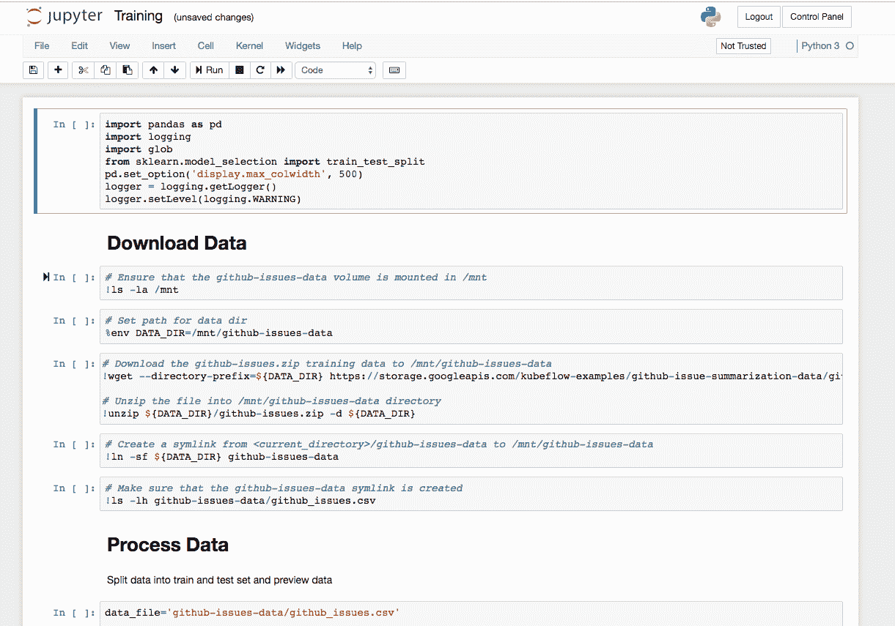

步骤—应用

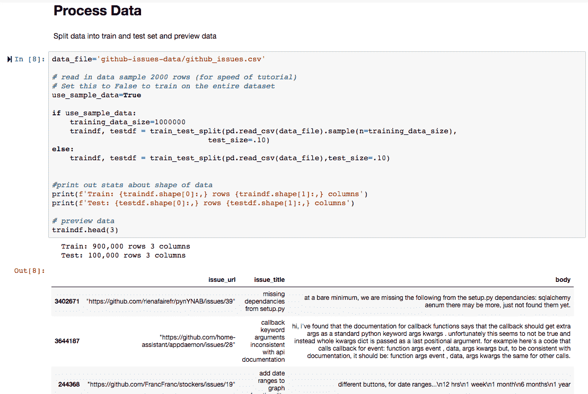

处理数据

# 使用 GPU 进行培训

在下面的示例中，用户在 Spawner 选项中将 1 个 GPU 配置为资源限制的 JupyterHub 应用程序。


配置资源限制


Kubernetes 上的笔记本应用程序

这使得应用程序只能从应用程序端看到节点上四个 GPU 中的一个。

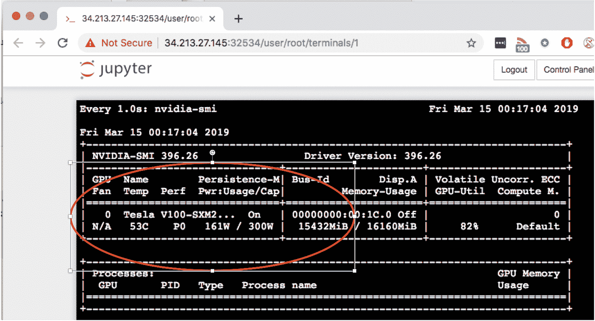

基于资源配置的应用 GPU 使用

使用上面的配置运行培训:

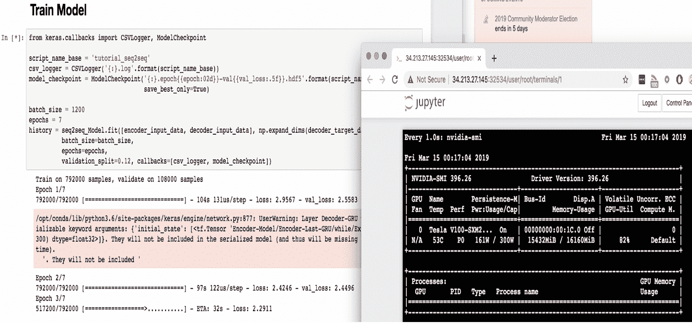

培养

如上所述，train_model 利用单个 GPU 进行训练，在 4 个可用 GPU 中的一个 GPU 上，利用率达到峰值，如下所示:

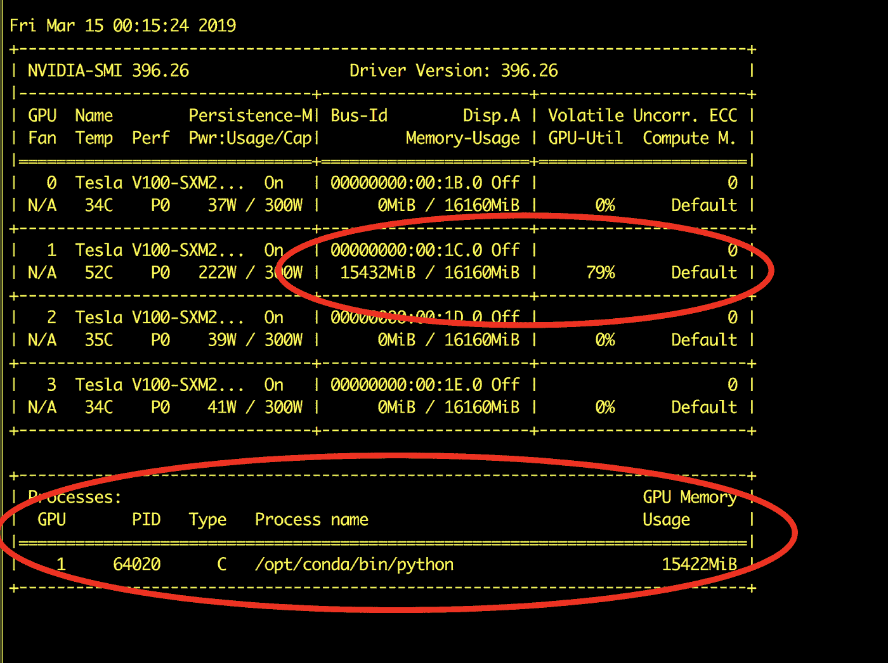

使用 GPU 的训练模型

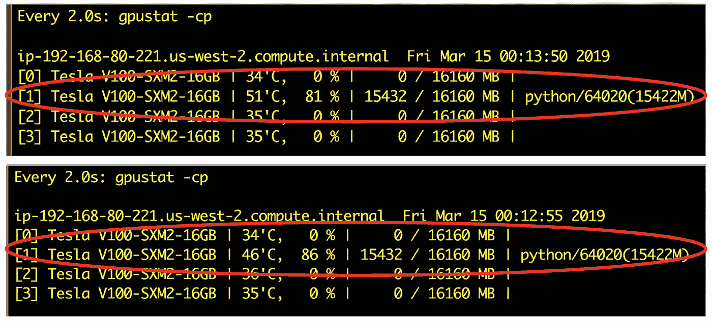

运行训练时的 GPU 统计

GPU 实例拥有数千个 CUDA 核心，在上述海量数据的训练中显著提升了性能。

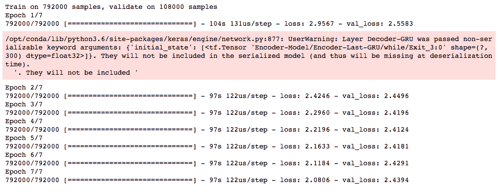

培训模式

同样，用户可以根据训练数据集的要求和大小来选择 GPU 的数量。下面显示了一个使用 3 个 GPU 的示例:


资源限制设置为 3 个 GPU

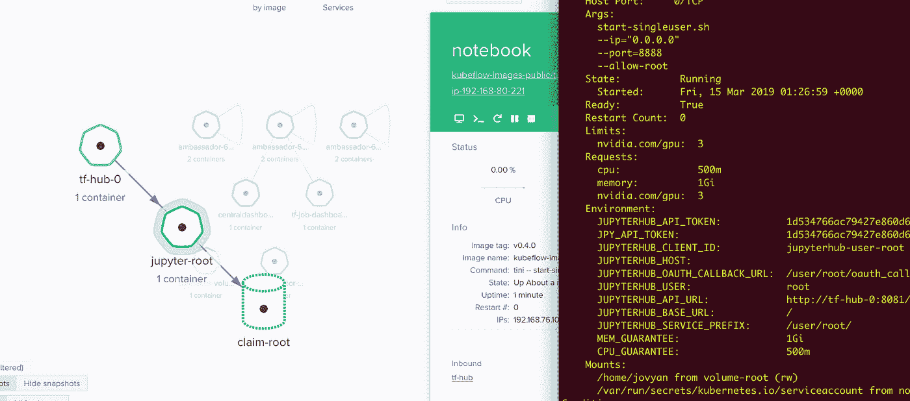

使用 3 个 GPU 的 Kubernetes 上的笔记本应用程序

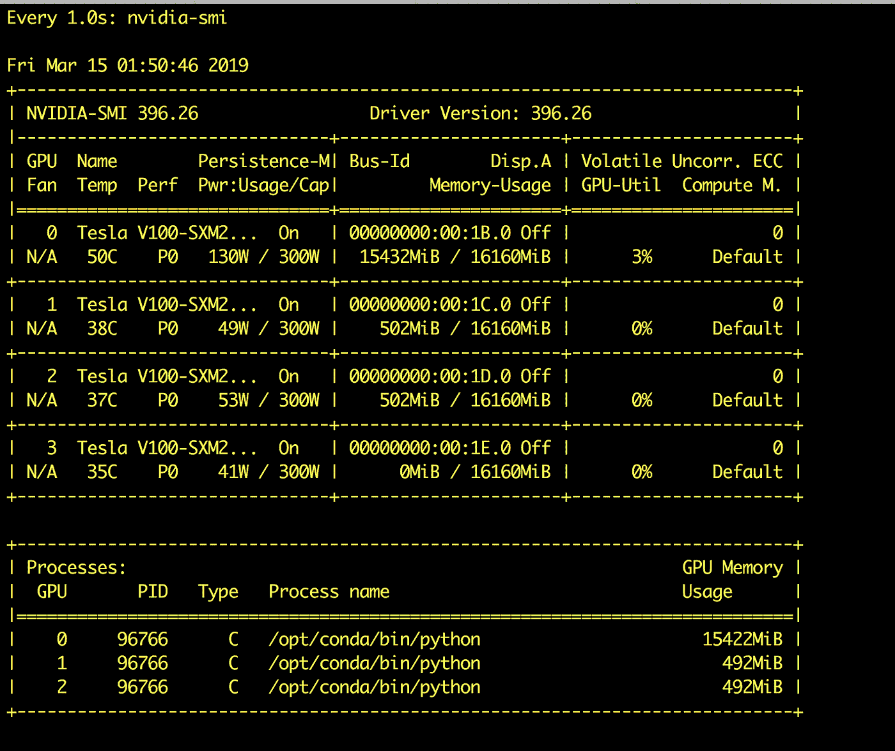

为应用程序配置了三个 GPU


GPU 统计

如上所述，该过程利用三个 GPU，但并不均匀地分布在 GPU 上，因为并行编程或多 GPU 构造必须通过代码库来启用，以便以并行方式正确利用所有 GPU。


使用 GPU 的训练模型

Nvidia 的 CUDA(由 NVIDIA 创建的并行计算平台和应用程序编程接口模型)构成了多个模型，使用户能够使用多个 GPU 来利用像上面的 AWS EC@ instance 这样的支持多 GPU 的系统的真正力量。比如说。cuda()接受一个设备 id，用户可以在同一个 training_model 中基于每个任务分配 GPU。

```
model1 = nn.DataParallel(model1).cuda(device=0)
model1_feat = model1(input_image)model2 = nn.DataParallel(model2).cuda(device=1)
model2_feat = model2(model1_feat, input_feat)
```

这样，用户可以充分利用系统中的 GPU，如下图所示，其中培训任务跨多个 GPU:

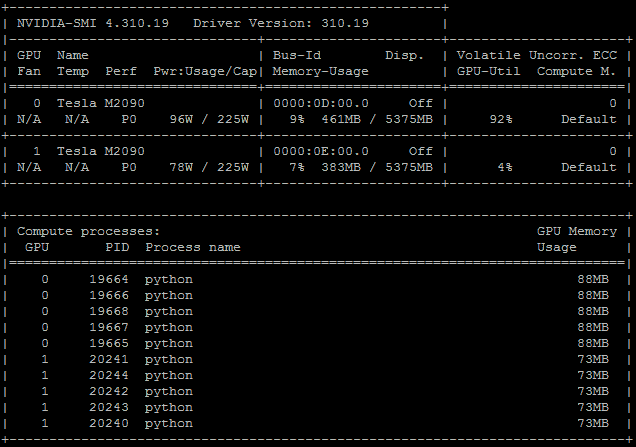

使用 CUDA 跨 GPU 进行培训

像 Kubeflow 这样的工具包确实加强了这样一个梦想，即运行人工智能任务并为其服务不仅仅局限于少数组织，而是每个人都可以轻松访问。目前，人工智能和深度学习在全球范围内创造了巨大的市场机会，旨在改善我们的生活和我们周围的世界。为深度学习任务选择正确类型的硬件是一个广泛讨论的话题。随着越来越多的公共云提供商，如 AWS、GCE 和 Azure，使用户能够轻松地采购这些基础设施，从财务和时间角度来看都有可观的收益。