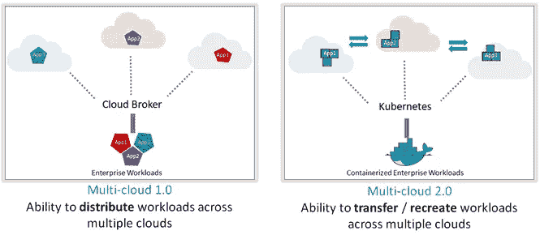

# Kubernetes 和多重云 2.0 的基础

> 原文：<https://itnext.io/kubernetes-and-the-underpinnings-of-multi-cloud-2-0-1c7aca50c46f?source=collection_archive---------5----------------------->

企业的云计算之旅可以大致分为两个阶段。Multi-cloud 1.0 —将**工作负载分布在不同云上的能力是重点，Multi-cloud 2.0 —跨云转移/重新创建**工作负载的能力很重要。

在多重云 1.0 阶段，云代理和多重云供应器，如 [Terraform](https://www.terraform.io/) 提供了在多重云中**分配**企业工作负载的能力。我们现在看到了多云 1.0 工具的进步，特别关注容器化的工作负载，正如在最近的一些公告中看到的那样——微软的[CNAB+Docker](https://open.microsoft.com/2018/12/04/announcing-cnab-cloud-agnostic-format-packaging-running-distributed-applications/)、[交叉平面](https://blog.upbound.io/introducing-crossplane-open-source-multicloud-control-plane/)、Kubernetes 的[可移植服务定义](https://github.com/kubernetes/enhancements/blob/master/keps/sig-apps/0032-portable-service-definitions.md)。

随着 Kubernetes 作为私有云和公共云中事实上的 CaaS 层被广泛采用，multi-cloud 2.0 阶段有望实现跨多个云无缝转移/重新创建工作负载的能力。为此，一个关键要求是工作负载和底层云之间不应有任何绑定。实现这一点的最简单方法是在您的应用中不使用云提供商的托管服务，例如 [AWS RDS](https://aws.amazon.com/rds/) 、 [Google CloudSQL](https://cloud.google.com/sql/) 。你最好坚持使用你需要的平台元素的容器化版本，比如你选择的数据库的容器化版本，负载平衡器的容器化版本，等等。本质上，通过为您的整个应用平台堆栈创建微服务架构。

**为多云 2.0 创建应用平台的挑战**

一旦我们出于可移植性的原因决定使用平台元素的容器化版本，我们就会面对这样一个事实:管理这种元素的复杂生命周期并不容易。Kubernetes 社区已经认识到了这个挑战，特别是对于有状态平台元素，引入了[操作符](https://coreos.com/operators/)的概念。如今，许多社区运营商正在为各种平台元素创建，如 MySQL、Kafka、Redis、Spark 等。(Kubernetes 运营商的 [350+ GitHub 库](https://github.com/search?q=Kubernetes+Operator))。

像 [OLM](https://github.com/operator-framework/operator-lifecycle-manager) 、[Helm with installation support](https://docs.helm.sh/developing_charts/#defining-a-crd-with-the-crd-install-hook)、 [Application CRD](https://github.com/kubernetes-sigs/application) 、 [helm-app-operator-kit](https://github.com/operator-framework/helm-app-operator-kit) 这样的工具解决了采用操作符的部分问题，例如——简化操作符安装和管理(OLM)的过程，使 CRD 成为 Helm release 的一部分(Helm with support)，使用 Kubernetes 本机对象定义应用元数据和创建应用程序(Application CRD)，为现有的 Helm 图表创建操作符(helm-app-operator-kit)。最终，我们相信这些方法将汇聚成通过 Helm 安装操作员的标准方式。

今天的用户正在寻找可用于容器化平台元素的社区运营商，并考虑使用它们来构建他们的应用平台栈。然而，这种自组装不同运营商的“定制平台即服务”的方法面临以下挑战:

1.  建造这种 DIY 包的过程既复杂又耗时。
2.  不同运营商的 DIY 平台缺乏一致性，因为它们是由不同的供应商开发的。
3.  应用程序开发人员在创建他们的应用程序平台 YAMLs 时也不容易使用运营商引入的定制资源，因为对于新添加的定制资源、其支持的可配置性、功能性等没有集中的文档。此外，没有简单的方法来调试定制资源实例中的问题。

在 CloudARK，我们正在开发 [KubePlus Platform Kit](https://github.com/cloud-ark/kubeplus) 来应对这些挑战，并使用所需的社区运营商简化创建定制平台的流程。

**KubePlus 平台套件**

KubePlus 的设计考虑了 3 个用户角色。

1.操作符开发人员—开发操作符并将其打包为舵图。为了在构建和包装运营商方面实现一致性，我们制定了[运营商发展指南](https://github.com/cloud-ark/kubeplus/blob/master/Guidelines.md)。

2.集群管理员/ DevOps 工程师—使用 kubectl 通过操作员导航图 URL 部署一个或多个操作员。

3.应用开发人员—通过部署的运营商发现可用的定制资源，并创建使用所需定制资源的应用平台。

**平台代码:**

KubePlus Platform Kit 是一个现代化的多云平台即服务层，无需引入任何新的 CLI 即可构建定制的平台即服务。它利用标准的 Kubernetes 接口— *kubectl* 和 Kubernetes YAMLs 来提供 PaaS 体验。受基础设施即代码的启发，即代码系统使用声明性定义来确保过程中的可共享性和可重复性。在基于 KubePlus 的定制 PaaS 的情况下，使用基于 Kubernetes YAML 的定义来实现平台化流程。因此得名[平台代码](https://cloudark.io/platform-as-code)。

**结论:**

我们相信，Kubernetes 的广泛采用将使多云 2.0 阶段成为可能，届时真正的跨云应用程序可移植性将成为可能。为了充分利用这一点，应用程序工作负载需要与底层云分离。在 Kubernetes 上为这种多云 2.0 愿景创建应用平台存在独特的挑战。我们讨论了 [KubePlus Platform Kit](https://github.com/cloud-ark/kubeplus) 如何通过一种独特的平台即代码方法来帮助解决这些挑战，这种方法提供了一种可组合、可重复和可共享的方式来创建应用平台。

[www.cloudark.io](https://cloudark.io/)