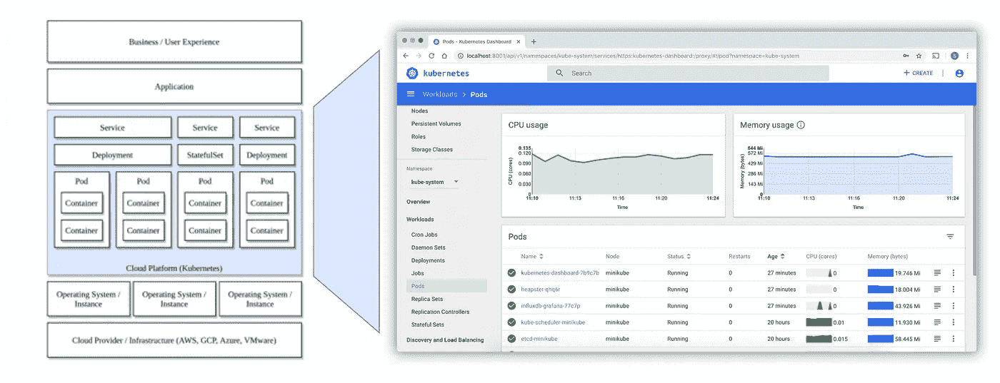
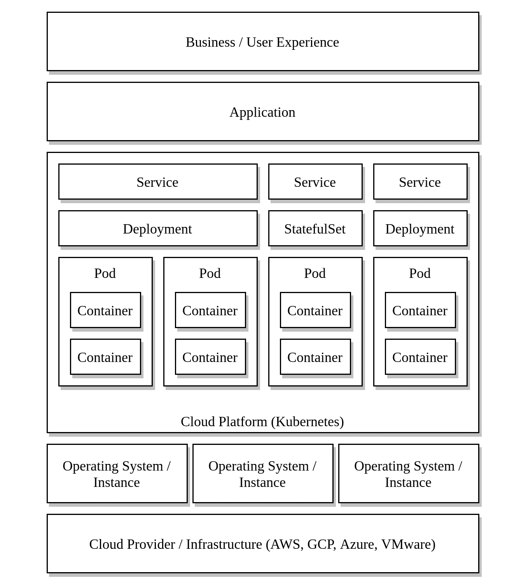

# Kubernetes:可观测性平台的挑战

> 原文：<https://itnext.io/kubernetes-challenges-for-observability-platforms-21af913a9135?source=collection_archive---------2----------------------->

*“思想实验，薛定谔的猫，介绍了一只既活着又死了的猫，同时。没有更好的类比来描述监控 Kubernetes 这样的平台的复杂性，在这里，事情每分钟都会发生几十次，每时每刻都在发生变化。”— Matt Reider、Dynatracer 和 Kubernetes 向导*

[Kubernetes](https://kubernetes.io/) 是容器编排事实上的标准，因为它解决了许多问题，比如在机器之间分配工作负载，实现容错，以及在出现问题时重新调度工作负载。虽然加速开发过程和降低复杂性确实使 Kubernetes 操作员的生活变得更加轻松，但固有的抽象和自动化可能会导致新类型的错误，这些错误很难发现、排除和防止。

通常情况下，Kubernetes 监控是使用一个单独的仪表板(如 [Kubernetes 仪表板](https://kubernetes.io/docs/tasks/access-application-cluster/web-ui-dashboard/)或用于 Kubernetes 的 [Grafana 应用程序)来管理的，该仪表板显示集群的状态并在出现异常时发出警报。安装在 Kubernetes 节点上的监控代理监控 Kubernetes 环境，并提供关于节点状态的有价值的信息。然而，有一些相关的组件和流程，例如虚拟化基础设施和存储系统(见下图)，可能会导致您的 Kubernetes 基础设施出现问题。](https://grafana.com/grafana/plugins/grafana-kubernetes-app)

Kubernetes 仪表板是全面监控解决方案的一部分

本文介绍了在设计 Kubernetes 监控解决方案时要考虑的关键构建块。

作为一名平台运营商，您希望快速发现问题并从中吸取教训，以防止未来的停机。作为一名应用程序开发人员，您希望对您的代码进行检测，以了解您的服务如何相互通信，以及哪里的瓶颈会导致性能下降。幸运的是，监控解决方案可用于分析和显示此类数据，提供深刻的见解，并基于这些见解采取自动操作(例如，警报或补救)。

# 库伯内特人的经历

当使用像[谷歌 Kubernetes 引擎(GKE)](https://cloud.google.com/kubernetes-engine) 、[亚马逊弹性 Kubernetes (EKS)](https://aws.amazon.com/eks/) 或 [Azure Kubernetes 服务](https://azure.microsoft.com/en-us/services/kubernetes-service/)这样的托管环境时，很容易启动新的集群。在应用了第一批清单(很可能是从[操作指南](https://kubernetes.io/docs/tasks/run-application/run-stateless-application-deployment/)中复制和粘贴的)之后，一个 web 服务器在几分钟内就启动并运行了。

但是，当扩展生产配置时，随着您专业知识的增长，您可能会发现:

*   您的应用程序并不像您想象的那样是无状态的
*   在 Kubernetes 中配置存储比在您的主机上使用文件系统更复杂
*   在容器映像中存储配置或秘密可能不是最好的主意。

您克服了所有这些障碍，过了一段时间，您的应用程序就可以顺利运行了。在采用阶段，对操作条件做了一些假设，应用程序部署与这些假设相一致。尽管 Kubernetes 具有内置的错误/故障检测和恢复机制，但意外的异常仍然会悄悄出现，导致数据丢失、不稳定以及对用户体验的负面影响。此外，如果您的资源限制设置得很高(或者根本没有设置)，Kubernetes 中嵌入的自动伸缩机制会对成本产生负面影响。

为了避免这种情况，您需要对应用程序进行检测，以提供深入的监控见解。这使您能够在发生影响最终用户体验的异常和性能问题时采取措施(自动或手动)。

# 可观测性对 Kubernetes 意味着什么？

当设计和运行现代的、可伸缩的和分布式的应用程序时，Kubernetes 似乎是满足您所有需求的解决方案。然而，作为一个容器编排平台，Kubernetes 对应用程序的内部状态一无所知。这就是为什么开发人员和 SRE 依赖遥测数据(即指标、跟踪和日志)来更好地了解他们的代码在运行时的行为。

*   指标是时间间隔的数字表示。它们可以帮助您发现系统的行为是如何随时间变化的(例如，与上一个版本相比，新版本中的请求需要多长时间？).
*   跟踪表示分布式系统上因果相关的分布式事件，例如，显示请求如何从用户流向数据库。
*   日志很容易生成并以纯文本、结构化(JSON、XML)或二进制格式提供数据。日志也可以用来表示事件数据。
*   除了可观察性的三个支柱(即日志、指标和跟踪)，更复杂的方法可以添加拓扑信息、真实用户体验数据和其他元信息。

# 从可观察性数据中进行监控是有意义的

为了理解由可观测性提供的遥测数据，需要一个存储、基线和分析的解决方案。此类分析必须基于收集的数据，通过异常根本原因检测和自动补救措施提供可操作的答案。有各种各样的监控产品，它们具有不同的功能、警报方法和集成。这些监控产品中的一些遵循声明性方法，其中必须准确指定要监控的主机和服务。其他的几乎是自我配置的——它们自动检测要监控的实体，或者当监控代理推出时，被监控的实体自己注册。

# 监控 Kubernetes 的分层方法

" *Kubernetes 的性能取决于它所运行的 IaaS 层。和 Linux 一样，Kubernetes 也进入了发行版时代。”——(凯尔西·海托华通过推特，2020 年)*

尽管 Kubernetes 系统本身可能运行良好，您的监控工具不会报告任何问题，但您可能会在 Kubernetes 之外遇到错误，这会带来风险。

*举例:*

*您的 Kubernetes 部署使用在动态配置的虚拟机映像文件中运行的虚拟机(无论是否是最佳实践)。您还没有发现虚拟化主机(或其共享存储)上缺少磁盘空间。现在，当机器映像试图纵向扩展时，您的虚拟机管理程序会停止虚拟机，从而使您的一个节点不可用。*

在这个例子中，Kubernetes 监控本身和安装在 Kubernetes 节点上的操作系统代理都没有发现问题。由于有许多这种交叉异常的例子，应考虑采用更全面的方法来监测 Kubernetes。这样的解决方案可以分解成更小、更集中的领域，如下图所示。

Kubernetes 监控解决方案的层次

让我们一次看一层。

# 云提供商/基础设施层

根据您使用的部署模型，问题可能发生在您的云提供商的基础架构中，也可能发生在您的内部环境中。当在公共云环境中运行时，您希望确保不会耗尽资源，同时确保不会使用超过 Kubernetes 集群开始扩展时所需的资源。因此，跟踪云提供商上配置的配额，同时监控您消耗的资源的使用情况和成本，将有助于您降低成本，同时不会耗尽资源。此外，云基础架构的变化也可能导致问题。因此，审计日志可以导出或直接导入到监控系统中。

在内部运行 Kubernetes 环境时，有必要监控所有可能影响它的基础设施组件。例如网络(交换机、路由器)、存储系统(尤其是在使用[精简配置](https://en.wikipedia.org/wiki/Thin_provisioning)时)和虚拟化基础架构。网络的一些典型指标是吞吐量、网络接口的错误率，甚至是安全设备上丢弃/阻塞的数据包。日志文件分析有助于您在问题发生之前主动检测问题(例如，过度配置)。

# 操作系统/实例层

如果您没有在托管服务上运行 Kubernetes 集群，您有责任保持您的操作系统最新并得到维护。这样做的时候，检查 Kubernetes 服务的状态(比如 kubelet、api-server、scheduler、controller-manager)和容器运行时(比如， [containerd](https://containerd.io/) 或 [Docker](https://www.docker.com) )是有意义的。此外，检查安全更新/补丁是否可用，并在下一个更新周期自动安装它们应该在您的列表中。即使在这一层，日志条目也将帮助您发现系统中是否有问题，并且是审计系统的有用来源。

# 云平台层

通过设计监控解决方案的底层，您确保了 Kubernetes 环境的基础设施是稳定且可观察的。Kubernetes 中出现的许多问题都是由于清单中的错误配置，或者是由于集群中的应用程序数量在增长，而基础设施却没有扩展。

正如许多指南中所述，您可以检查集群中的所有节点是否都是可调度的(例如，`kubectl get nodes`)。对于 pod、部署和任何其他 Kubernetes 对象类型也可以这样做。特别是，当您在集群上不断加入新服务时，您可能会发现一些 pod 处于“挂起”状态。这表明调度程序无法正常工作。使用`kubectl describe <kind> <object>`会给你更多的洞察力，并且会打印出与这个对象相关的事件。通常，这些信息是有用的，它会让您知道缺少什么(或配置错误)。

*提示:对于所有其他集群系统，请记住一个节点可能会故意(例如，在更新之后)或意外地发生故障。在这种情况下，您希望能够在剩余的节点上调度您的工作负载，因此，如果您在监视基础结构上配置阈值，您应该为这样的预留做好计划。*

在某些情况下，您可能会配置一个部署，并发现不会创建任何 pod(例如，通过使用不存在的服务帐户)。有问题的一个迹象是部署的期望吊舱和可用吊舱的值有偏差(`kubectl get deployment`)。

最后，当配置低内存请求时，可能会出现这样的情况，您的 pod 会因为内存不足而重启多次。这可以简单地通过修改容器请求和限制来解决。

# 应用层

即使您的基础设施运行良好，Kubernetes 没有显示任何错误，您仍然可能在应用层遇到问题。

*举例:*

*您正在运行一个多层应用程序(web 服务器、数据库),您配置了一个 HTTP 健康检查，它在应用程序服务器上简单地输出“OK ”,还有一个在数据库上运行简单的数据库查询。两项健康检查都运行良好，似乎没有任何问题。当客户试图在 web 界面上运行特定操作时，会显示一个白色页面，并且该页面会无限加载。*

上述示例中的应用程序问题不会导致系统崩溃，并且无法使用简单的检查机制检测到。然而，正如第一部分中所描述的，您可以检测您的应用程序来检测这种异常。例如，跟踪可以显示请求被传递到应用服务器，数据库被查询，但是不产生响应。一段时间后，可能会有额外的请求在应用程序上排队(或者其他一些客户试图做同样的事情)，连接池被填满(可能是一个指标)。过一会儿，可能会出现 HTTP 服务器本身不再能够获得请求的情况，之后健康检查将会失败。

使用综合监控技术，模拟客户行为，从而从客户的角度验证可用性。在前面描述的例子中，可以设置一个模拟这种行为的检查，它将报告一个错误，因为请求没有(及时)完成。

真实用户监控(RUM)让您深入了解用户对应用程序的行为和体验。RUM 帮助您识别错误，但也发现可用性问题，比如许多客户在订购过程的特定点离开您的站点。

# 业务层

如果客户无法使用或不喜欢，最好的新功能可能会失败。因此，将应用程序中的变化或新特性映射到与业务相关的指标，如收入或转换率，可以帮助量化软件开发工作的结果。例如，应用程序的更新版本可以使用标记和指标(例如，每小时的订单数)与以前的版本进行比较。如果您看到对这些指标的负面影响，回滚到上一个成功的版本是一个很好的补救选择。

# 可能的解决方案

许多产品都支持您的 Kubernetes 监控之旅。如果你更喜欢使用开源产品，有很多 [CNCF(云原生计算基金会)](https://www.cncf.io/)项目，像[普罗米修斯](https://prometheus.io/)用于存储和抓取监控数据。此外， [OpenTelemetry](https://opentelemetry.io/) 帮助安装软件， [Jaeger](https://www.jaegertracing.io/) 用于表示跟踪数据。其他项目，如 [Zabbix](https://www.zabbix.com/) 和 [Icinga](https://icinga.com/) 可以帮助您监控您的服务和基础设施。 [Grafana](https://grafana.com/) 是一个工具，用于表示几乎所有监控工具收集的数据。

虽然许多开源工具专门用于很好地实现它们的用例，但商业解决方案通常涵盖更广泛的基础设施、应用程序和真实用户监控用例。例如， [Dynatrace](https://www.dynatrace.com?utm_medium=blog&utm_source=medium.com&utm_campaign=kubernetes&utm_content=guide&utm_term=none) 以最小的设置工作量涵盖了本文中描述的所有功能。如果您想了解更多关于 Kubernetes 监控的 Dynatrace 特性，请看以下四篇博文:

*   [借助对 Kubernetes pods 的运营洞察，扩展应用和基础设施的可观察性](https://www.dynatrace.com/news/blog/expand-application-and-infrastructure-observability-with-operational-insights-into-kubernetes-pods?utm_medium=blog&utm_source=medium.com&utm_campaign=kubernetes&utm_content=guide&utm_term=none)
*   [监控第 2 天运营的 Kubernetes 基础设施](https://www.dynatrace.com/news/blog/monitoring-of-kubernetes-infrastructure-for-day-2-operations?utm_medium=blog&utm_source=medium.com&utm_campaign=kubernetes&utm_content=guide&utm_term=none)
*   [60 秒在谷歌 Kubernetes 引擎上自我升级可观测性](https://www.dynatrace.com/news/blog/60-seconds-to-self-upgrading-observability-on-google-kubernetes-engine?utm_medium=blog&utm_source=medium.com&utm_campaign=kubernetes&utm_content=guide&utm_term=none)
*   [通过 Dynatrace 将自动气象站 EKS 监控作为自助服务](https://www.dynatrace.com/news/blog/aws-eks-monitoring-as-a-self-service-with-dynatrace?utm_medium=blog&utm_source=medium.com&utm_campaign=kubernetes&utm_content=guide&utm_term=none)

# 结论

在为 Kubernetes 设计监控解决方案时，除了 Kubernetes 本身之外，还有许多事情需要考虑。通过将您的监控分解成更小的块，团队能够专注于并维护他们的职责范围。例如，应用部署可以从内部部署切换到公共云基础架构部署，而不会影响对应用本身的监控。

由于 Kubernetes 是一个高度动态的编排平台，应用程序实例可以在短时间内来来去去，因此可以处理这种行为的监控解决方案可以确保更流畅的监控体验。

有许多方法和工具可以在您的监控之旅中为您提供支持。商业可观察性平台，如 Dynatrace，使您能够轻松地监控您的 Kubernetes 基础设施。

在构建 Kubernetes 监控解决方案时考虑到这些因素将有助于您保持客户满意度和系统稳定性。使用 Dynatrace，您将获得现成的解决方案。要熟悉并开始使用 Dynatrace，您可以查看免费试用版。