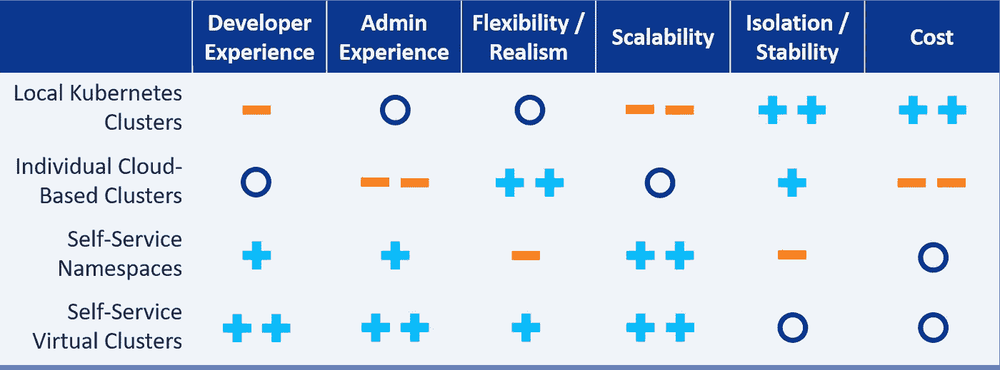

# Kubernetes 开发环境—比较

> 原文：<https://itnext.io/kubernetes-development-environments-a-comparison-4a2276254c98?source=collection_archive---------3----------------------->

有几种方法可以为开发人员提供 Kubernetes 工作环境，它们各有优缺点。

Kubernetes 已经脱离了主要作为 ops 技术落后于 T1 的状态，现在对许多开发者来说也非常重要。正如我在博客中写的关于 Kubernetes 工作流[的文章](https://loft.sh/blog/kubernetes-development-workflow-3-critical-steps/)，每个开始直接使用 Kubernetes 的开发人员的第一步是建立/访问 Kubernetes 开发环境。

Kubernetes 的工作环境不仅是第一步，也是能够与 Kubernetes 一起工作的基本要求。然而，访问这样的环境通常是一个问题:一项 [VMware 研究](https://tanzu.s3.us-east-2.amazonaws.com/campaigns/pdfs/VMware_State_Of_Kubernetes_2020_eBook.pdf)甚至发现“访问基础设施是开发人员生产力的最大障碍”。为此，Kubernetes 开发环境应该是每个计划使用该技术的团队的重中之重。

在本文中，我将描述和比较四种不同的 Kubernetes 开发环境，并解释何时使用哪种开发环境。

1.  局部 Kubernetes 集群
2.  单个基于云的集群
3.  自助命名空间
4.  自助式虚拟集群

# 6 开发环境的评估标准

为了使不同的 Kubernetes 开发环境具有可比性，首先定义所使用的评估标准是有意义的。我将使用以下标准对每个环境进行评级:

**开发人员体验:**开发人员开始使用该环境的难易程度如何？这包括诸如安装速度、易用性和开发人员所需的知识等因素。

**管理员体验:**管理员管理环境和管理系统有多容易？在这里，我将考虑系统的复杂性、管理它的工作量以及添加额外的用户。

**灵活性/真实性:**与生产环境相比，开发环境的真实性如何？对于不同的用例，灵活性如何？一个好的开发环境应该与生产环境非常相似，以避免“它在我的机器上工作”的问题，并且它还应该可以自由配置，可以用于许多不同的用例(例如，编码、测试等等)。

**可伸缩性:**环境本身的可伸缩性如何，如果有许多用户使用该系统，该方法的可伸缩性如何？尤其是复杂的应用，需要大量的计算资源，所以 dev 环境应该能够提供。此外，为开发人员提供这种环境的一般方法对于大型团队也应该是可行的。

**隔离/稳定性:**用户之间如何隔离，系统有多脆弱？开发人员应该能够并行工作而不互相干扰，他们使用的系统应该稳定和安全，以减少无效的停机。

**成本:**这种方法有多贵？这个类别应该是不言自明的，但是在为您的团队选择合适的开发环境时，它仍然是一个重要的因素。

既然评估标准已经明确，我们可以开始比较 Kubernetes 开发环境了:

# 1.局部 Kubernetes 集群

本地 Kubernetes 集群是在开发人员的个人计算机上运行的集群。有很多工具可以提供这样的环境，比如 [Minikube](https://github.com/kubernetes/minikube) 、 [microk8s](https://github.com/ubuntu/microk8s) 、 [k3s](https://github.com/rancher/k3s) ，或者 [kind](https://github.com/kubernetes-sigs/kind) 。虽然它们不完全相同，但是它们作为开发环境的用途是相当相似的。

## 开发者体验:-

本地开发环境需要由开发人员自己建立，因为他们在自己的计算机上运行。这可能相当具有挑战性，尤其是因为本地设置总是略有不同(不同的硬件、不同的操作系统、不同的配置等。)这使得提供非常简单的安装指南变得更加困难。设置完成后，开发人员还负责自己维护和管理他们的环境，如果他们没有以前的 Kubernetes 经验，他们通常不习惯这样做。

所以一般的开发者体验对开发者来说是比较不好的(至少在没有 Kubernetes 知识的情况下)。

## 管理经验:o

管理员不参与本地 Kubernetes 集群的设置和管理。这意味着他们在这里没有努力。然而，他们也不知道开发人员是否能够使用他们的集群，并且通常被排除在集群的设置和管理之外。尽管如此，在出现问题和疑问的情况下，管理员可能必须支持开发人员。

总的来说，管理员的体验是平庸的，因为管理员没有面对他们典型的挑战，而是必须单独教育和支持开发人员。

## 灵活性/现实性:o

一方面，本地集群与云环境中的“真实”集群总是有些不同。它们通常是经过删减的 Kubernetes 版本，缺少一些不能在本地复制的特性(而且本地通常也不需要)。示例性地，这可以从“k3s”的名称中看出，这是对原始 Kubernetes“k8s”的典故。另一方面，工程师可以对他们的本地集群做任何他们想做的事情，因此他们也可以灵活地配置它。

总之，本地集群在灵活配置方面得分较高，但在真实性方面得分较低，因为它们不具备 Kubernetes 的所有功能，因此不能用于任何用例。

## 可扩展性:-

由于本地集群只能访问工程师计算机上可用的计算资源，因此它们相对较快地达到了复杂应用程序的极限。此外，让工程师自己创建本地集群的方法没有真正的可扩展性，因为每个工程师都必须重复相同的过程，几乎没有自动化选项。

因此，可伸缩性是本地 Kubernetes 集群的一个明显弱点。

## 隔离/稳定性:++

每个开发人员都有一个独立的环境，与任何其他环境完全分离。理论上，它们甚至可以在没有互联网连接的情况下使用。对于这一点，本地集群的隔离是完美的。这种分离还确保了只有单个环境会出现故障，而不是所有环境同时出现故障，从而最大限度地减少了这种为开发人员提供 Kubernetes 环境的方法的漏洞。

孤立和安全绝对是本地集群的优势。

## 成本:++

本地 Kubernetes 集群有时不需要昂贵的云计算资源，而是只使用本地可用的计算资源。不同的本地 Kubernetes 解决方案都是开源的，可以免费使用。

使用本地 Kubernetes 集群进行开发没有任何直接成本，因此这是可能的最便宜的解决方案。

# 2.单个基于云的集群

运行在云中的单个集群是 Kubernetes 开发环境的第二种类型。它们既可以由管理员创建，然后授予开发人员个人访问权限，也可以由开发人员自己创建，如果他们有自己的云提供商帐户的话。

## 开发者体验:o

开发人员的体验可能会非常不同，这取决于创建各个集群的方式:如果开发人员可以直接访问云，例如，通过精心设计的身份和访问管理(IAM)，他们可以按需创建他们的工作环境，并且设置非常容易(特别是在公共云中)，因为它总是一样的。但是，他们必须自己完成这项工作，并且可能需要一些帮助来管理集群。

如果管理员创建集群并将访问权分配给开发人员，开发体验会变得非常糟糕。虽然现在已经注意到了集群的管理，但是管理员却成了瓶颈。在这里，您将面临前面提到的等待中央 IT 提供开发环境的问题。

总的来说，在最好的情况下，如果开发人员可以直接访问云，开发体验就足够了。

## 管理经验:-

无论开发人员以何种方式获得集群，管理体验总是很糟糕。如果每个开发人员都有自己的云帐户，管理员将很难了解整个系统的概况(还在使用什么？谁在使用什么？).在这种情况下，他们还必须支持开发人员管理集群。因为集群的数量随着工程师的数量成比例地增长，所以工作也随着团队规模的增长而增长。

在由管理员集中创建和分发集群的情况下，管理员也需要付出很多努力。他们必须回答开发人员对集群和配置更改的所有请求，并且必须始终可用，因为这对开发人员的绩效至关重要。一般来说，许多集群会给管理员带来更多的管理工作。

从管理员的角度来看，单个基于云的集群方法是一个糟糕的解决方案，必然会给他们带来大量工作，甚至让他们无法处理。

## 灵活性/现实性:++

由于生产系统通常也在云中的 Kubernetes 上运行，拥有这样的开发环境是完全现实的。单个环境也可以自由配置，因此它们完全符合开发人员的需求，或者与生产系统的设置完全相同。

单个基于云的集群是获得高度真实的开发环境的最佳解决方案。

## 可伸缩性:o

就可伸缩性而言，集群运行在云环境中很重要，这允许您几乎无限地扩展它们。尽管如此，可伸缩性标准还包括大型团队的一般方法的可伸缩性，在这里，随着团队规模的扩大，管理工作的增加，单个集群可能会达到极限。

计算资源方面的可伸缩性对于云中的单个集群来说不是问题，但是在大型组织中推广这样的系统通常是不可行的。

## 隔离/稳定性:+

在集群级别隔离开发人员是非常安全的。如果您正在使用公共云，开发人员的隔离几乎与不同公司的隔离相同，这当然是云提供商的首要任务。

在云中可能永远达不到 100%的稳定性和隔离性，但对于单个集群来说，它们已经尽可能好了。

## 成本:-

运行许多集群是非常昂贵的。这是由于几个因素:首先，您将有很多冗余，因为每个集群都有自己的控制平面。其次，使用这种方法几乎不可避免地会出现过大或未使用的集群，因为要么是开发人员负责调整规模和关闭集群，要么是管理员必须集中完成，但他们没有监督和了解仍在使用什么。

此外，开发环境也只在开发人员工作时使用，因此许多集群可能会在晚上、假期和周末空闲运行。最后，公共云提供商收取集群管理费，这需要为每个集群支付，在这种情况下是为每个开发人员支付。

为云中的每个工程师提供单独的集群是提供 Kubernetes 开发环境的一种非常昂贵的方法。

# 3.自助命名空间

除了给每个开发人员一个完整的集群，也可以只给他们 Kubernetes 名称空间。同样，这些名称空间可以由管理员集中创建，也可以为开发人员提供一个按需创建[自助式名称空间](https://loft.sh/blog/self-service-kubernetes-namespaces-are-a-game-changer/)的工具。集中提供它们会带来很多缺点，我已经针对单个集群解决了这些缺点，所以这里我将重点介绍自助式名称空间方法。

## 开发者体验:+

由于工程师可以自己创建名称空间，所以他们独立于管理员，永远不必等待获得 Kubernetes 开发环境。同时，名称空间运行在由管理员管理的集群上，因此开发人员不必关心环境的管理。作为集群中的构造，名称空间通常足以完成更简单的开发工作，因此开发人员将能够完成大多数标准任务，并且只在某些情况下受到限制，例如，当他们需要 CRD 或者想要安装使用 RBAC 的舵图时。

因此，对于“标准”开发任务和没有特殊 Kubernetes 配置需求的开发人员来说，自助式名称空间的开发人员体验非常好。

## 管理经验:+

管理员需要[建立一个内部的自助式 Kubernetes 平台](https://loft.sh/blog/building-an-internal-kubernetes-platform/)，如果他们想从头开始构建，这可能需要一些时间，就像 [Spotify](https://www.youtube.com/watch?v=vLrxOhZ6Wrg) 这样的公司所做的那样。或者，也可以购买将这种自助式命名空间功能添加到任何集群的解决方案，例如 [Loft](https://loft.sh/features/self-service-kubernetes-namespaces) 。在任何情况下，一旦系统设置正确，管理员就可以专注于其他任务，如底层集群的安全性和稳定性。此外，获得整个系统的概况也相对容易，因为所有东西都在一个集群中运行。

自助式名称空间是一种管理友好的解决方案，需要一些初始设置工作。

## 灵活性/现实性:-

由于名称空间运行在一个共享的 Kubernetes 集群上，所以不可能由开发人员单独配置所有的东西。例如，所有工程师都必须使用相同的 Kubernetes 版本，并且不能修改集群范围的资源。尽管如此，名称空间运行在类似于生产环境的云环境中，这至少使名称空间成为一个相对真实的工作环境。

总的来说，名称空间在某些情况下可能会限制开发人员的灵活性，但通常不是不切实际的开发环境。

## 可扩展性:++

自助式名称空间系统的可伸缩性在两个方面都非常好:有可能扩大名称空间的资源，因为它们运行在云中(当然也有可能限制开发人员以防止过度使用)。同时，向系统添加额外的用户也没有问题，特别是如果它提供了[单点登录选项](https://loft.sh/features/kubernetes-auth-sso)。

名称空间是为许多开发人员提供 Kubernetes 环境的一种有效方式，这种环境可以灵活地伸缩。

## 隔离/稳定性:-

名称空间是 Kubernetes 多租户的原生解决方案，但是隔离并不完美，而是一种软多租户形式。然而，由于租户(开发人员)是可信的，这对于开发环境来说不一定是个问题。此外，名称空间共享相同的底层集群，这意味着如果集群关闭，所有名称空间都会失败，因此集群的稳定性至关重要。

名称空间是一种 Kubernetes-native 隔离解决方案，但它肯定不是完美的。但是，如果底层集群运行稳定，名称空间对于组织中受信任的工程师来说仍然是一个很好的解决方案。

## 成本:o

要获得自助服务体验，您可能需要购买自助服务命名空间软件。此外，在云环境中运行的名称空间不是免费的，因为它们也需要云计算资源。然而，底层集群及其资源可以由许多开发人员共享，这提高了利用率并防止了不必要的冗余。还可以更容易地获得空闲运行的内容的集中概述，因此可以关闭这些名称空间。这一过程甚至可以通过[睡眠模式](https://loft.sh/docs/self-service/sleep-mode)自动完成。

总的来说，名称空间是为开发人员提供 Kubernetes 访问的一种非常划算的方法。

# 4.自助式虚拟集群

[虚拟集群(vClusters)](https://loft.sh/blog/introduction-into-virtual-clusters-in-kubernetes/) 是一个让您在 Kubernetes 集群中创建 Kubernetes 集群的解决方案。与名称空间一样，虚拟集群运行在单个物理集群上，如果开发人员能够访问 [vCluster 平台](https://loft.sh/features/virtual-kubernetes-clusters)，他们可以按需创建虚拟集群。

## 开发者体验:++

开发人员对虚拟集群的体验类似于名称空间。开发人员可以轻松地按需创建它们，并且独立于中央 IT，但仍然不必自己管理底层集群。同时，vClusters 对开发者来说感觉像是“真正的”集群，所以通常根本不会受到它们的限制。

因此，使用 vClusters 的开发体验与使用名称空间的体验类似，但甚至给了开发人员更多的自由去做和配置他们想要的东西。

## 管理经验:++

考虑到管理体验，自助命名空间和 vClusters 也非常相似。初始设置完成后，管理员的管理工作量非常有限，因此他们可以再次专注于其他任务。然而，与名称空间相比，vClusters 更好地隔离了用户，因此开发人员不太可能让底层集群崩溃。此外，大多数 Kubernetes 配置和安装都可以在 vCluster 中进行，因此底层集群可以非常简单，只需提供基本功能，这使得管理员的工作更加轻松。

因此，在正确设置后，自助式 vCluster 平台还可以提供非常流畅的管理体验。

## 灵活性/现实性:+

虚拟集群运行在云中，这使得它们成为非常真实的开发环境，特别是因为开发人员可以单独配置它们以满足他们的需求。但是，vClusters 与真实的集群并不完全相同，因此真实感不如单个集群那样完美。

总体而言，vClusters 可以灵活配置，以满足不同用例的要求。由于它们是虚拟结构，所以与物理集群还是有一些细微的区别。

## 可扩展性:++

vClusters 的可伸缩性与命名空间一样好。vClusters 在云中可以拥有不同的、基本上无穷无尽的计算资源。在单个集群上运行的平台上的自助式资源调配也使得许多工程师可以使用 v cluster。

自助式 vCluster 解决方案将满足开发环境在可扩展性方面的所有需求。

## 隔离/稳定性:o

虚拟集群的隔离优于命名空间级别的隔离，但 v cluster 仍然是 Kubernetes 多租户的一种形式，因此，v cluster 共享一个公共物理集群。虚拟集群的一个好处是底层集群可以非常简单，这使得它更容易稳定。

总的来说，vClusters 的隔离相当不错，整个系统的稳定性也相当不错。但是，很多稳定性是由底层群集的稳定性决定的。

## 成本:o

虚拟集群平台不是免费的，因为它需要云计算资源和平台软件。在这一类别中，vClusters 再次与命名空间非常相似:集群共享提高了利用率，并使了解概况和关闭未使用的虚拟集群变得更加容易，这些虚拟集群甚至可以通过睡眠模式实现自动化。

虚拟集群平台与命名空间平台一样经济高效，但所有基于云的解决方案不一定完全免费。

# 何时使用哪个开发环境

在描述了四种不同类型的 Kubernetes 开发环境之后，问题是哪种环境适合您的情况。

根据我的经验，许多公司和工程师从本地开发环境开始。事实上，它们是免费的，并且在本地计算机上运行，减少了最初的障碍，因为不需要复杂的预算审批。本地环境对于爱好开发人员和小型应用程序来说也是一个很好的解决方案，但对于知道如何处理和设置这些环境的 Kubernetes 专家来说也是如此。

随着组织在云原生之旅中的进展，他们希望向更多没有任何 Kubernetes 经验的开发人员推广 Kubernetes。这些组织通常从“显而易见”的解决方案开始:给每个开发人员一个自己的集群。一段时间后，他们通常会意识到这种方法非常昂贵，而且随着越来越多的开发人员使用这种方法，这种方法会变得更加复杂。对于这一点，单个基于云的集群解决方案通常只是一个临时的解决方案，除非开发人员的数量相对较少，并且成本不是太重要。

为了避免较大团队的高成本和管理工作，许多组织希望为开发人员提供名称空间或虚拟集群(虚拟集群相对较新，因此名称空间仍然更常见)。然而，由于这些公司已经意识到这种方法的可扩展性非常重要，他们希望以自动化的方式实现这一点，因此要么开始开发自己的内部 Kubernetes 平台[，就像 Spotify 所做的那样](https://www.youtube.com/watch?v=vLrxOhZ6Wrg)，要么只是购买现有的解决方案，如 [Loft](https://loft.sh/) 。因此，命名空间是否足够或者虚拟集群是否是更好的解决方案，取决于应用程序的复杂性以及开发人员的专业知识和需求。

# 结论

随着越来越多的公司希望他们的开发人员使用 Kubernetes，也有越来越多的开发人员需要访问 Kubernetes 的工作环境。对于这一点，有几种选择，都有它们的优点和缺点。

虽然本地开发集群是一个好的、廉价的起点，但是对于没有经验的开发人员或大型组织来说，它们通常不是正确的解决方案。

然后，这些组织转向基于云的单个集群的“显而易见”解决方案，这种解决方案在灵活性和真实性方面无与伦比，但对于管理员来说也很难管理，并且可能会变得非常昂贵。

最后，共享集群是自助式命名空间或虚拟集群的基础，是一种将成本效益与良好的开发人员和管理体验相结合的解决方案。尽管这些解决方案不是免费的，并且需要一些初始设置工作，但它们是一个长期的解决方案，即使对于较大的公司来说也是如此。

照片由 [Unsplash](https://unsplash.com/?utm_source=unsplash&utm_medium=referral&utm_content=creditCopyText) 上 [RawFilm](https://unsplash.com/@rawfilm?utm_source=unsplash&utm_medium=referral&utm_content=creditCopyText) 拍摄

*最初发布于*[*https://loft . sh*](https://loft.sh/blog/kubernetes-development-environments-comparison/)*。*