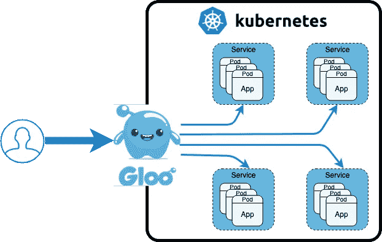

# 使用 Gloo 的 Kubernetes 入口控制

> 原文：<https://itnext.io/kubernetes-ingress-control-using-gloo-3dca70924ed3?source=collection_archive---------0----------------------->

Kubernetes 非常棒，它使得创建和管理高度分布式的应用程序变得更加容易。一个挑战是，你如何与世界其他地方分享你的伟大的 Kubernetes 托管的应用程序。许多人倾向于使用 [Kubernetes Ingress](https://kubernetes.io/docs/concepts/services-networking/ingress/) 对象，本文将向您展示如何使用开源的[solo . io](https://solo.io)Gloo 来满足这一需求。

Solo.io Gloo 作为 Kubernetes 入口

[Gloo 是一个函数网关](https://medium.com/solo-io/announcing-gloo-the-function-gateway-3f0860ef6600)，它为用户提供了许多好处，包括复杂的函数级路由、深度服务发现以及 OpenAPI (Swagger)定义的内省、gRPC 反射、Lambda 发现等等。Gloo 可以充当入口控制器，即根据入口对象中定义的路径路由规则，将 Kubernetes 外部流量路由到 Kubernetes 集群托管的服务。我非常相信通过例子展示技术，所以让我们快速浏览一个例子，向您展示什么是可能的。

# 先决条件

这个例子假设您正在一个本地 [minikube](https://kubernetes.io/docs/setup/minikube/) 实例上运行，并且您也有 [kubectl](https://kubernetes.io/docs/tasks/tools/install-kubectl/) 在运行。你可以在你最喜欢的云提供商管理的 Kubernetes 集群上运行这个例子，你只需要做一些调整。你还需要安装 Gloo。让我们用[自制软件](https://brew.sh/)来为我们设置这一切。

将所有内容下载并安装到您的本地计算机上，并开始所有工作需要几分钟时间。假设一切顺利，命令(`kubectl`)应该已经返回了`minikube`，这意味着您的本地 minikube 集群正在运行，并且您的 Kubernetes 集群配置已经为 minikube 正确设置。

在我们深入研究入口对象之前，还有一件事，让我们设置一个部署在 Kubernetes 上的示例服务，我们可以参考它。

# 设置示例 Petstore 的入口

让我们设置一个基本的 Ingress 对象，将所有 HTTP 流量路由到我们的 petstore 服务。为了让这变得更有趣和更有挑战性，谁不喜欢好的技术挑战呢，让我们也配置一个主机域，这将需要一点额外的`curl`魔法来正确调用我们本地的 Kubernetes 集群。下面的入口定义将把对`http://gloo.example.com`的所有请求路由到我们集群中监听端口 8080 的 petstore 服务。petstore 服务提供了一些监听查询路径`/api/pets`的 REST 函数，这些函数将返回我们(小)商店中宠物库存的 JSON。

如果您在公共云 Kubernetes 实例中尝试这个例子，您很可能需要配置一个云负载平衡器。确保您为在`gloo-system`名称空间中运行的`service/ingress-proxy`配置了负载平衡器。

重要的细节是:

*   注释`kubernetes.io/ingress.class: gloo`，这是将入口标记为由特定入口控制器(即 Gloo)处理的标准方式。当我们增加 Gloo 作为集群默认入口控制器的能力时，这个需求将很快消失
*   路径通配符`/.*`表示将所有流量路由到我们的 petstore 服务

我们可以通过以下命令验证 Kubernetes 是否正确创建了入口。

为了测试，我们将使用`curl`来调用我们的本地集群。就像我前面说过的，通过在我们的入口中定义一个`host: gloo.example.com`，我们需要做更多的事情来调用它，而不需要对 DNS 或我们的本地/etc/hosts 文件做任何事情。我将使用最近的`curl --connect-to`选项，您可以在 [curl 手册页](https://curl.haxx.se/docs/manpage.html#--connect-to)中了解更多相关信息。

glooctl 命令行工具帮助我们使用`glooctl proxy url --name <ingress name>`命令获取代理的本地主机 IP 和端口。它返回一个带有协议前缀的完整 URL，我们需要去掉这个前缀才能和 curl 一起使用。下面的两个命令将使用一点点命令行魔法来使这个例子在您的本地机器上工作。

它应该返回下面的 JSON

## TLS 配置

如今，大多数人都希望使用 TLS 来保护您的通信。Gloo Ingress 可以充当 TLS 终结器，我们将快速浏览一下它的设置。

任何执行 TLS 的 Kubernetes Ingress 都需要创建一个 Kubernetes TLS secret，所以让我们创建一个自签名证书，用于我们的示例`gloo.example.com`域。以下两个命令将创建一个证书，并在 minikube 中创建一个名为`my-tls-secret`的 TLS 秘密。

现在让我们用所需的 TLS 配置来更新我们的入口对象。重要的是 TLS 主机和规则主机匹配，并且`secretName`匹配先前部署的 Kubernetes secret 的名称。

如果一切顺利，我们应该将我们的宠物商店改为现在收听`https://gloo.example.com`。让我们尝试一下，再次使用我们的 curl magic，我们需要它来解析主机和端口以及验证我们的证书。注意，这次我们向 glooctl 请求`--port https`，我们在端口 443 上卷曲`https://gloo.example.com`。

# 后续步骤

这是 Gloo 如何作为 Kubernetes 入口控制器的快速浏览，只需对现有的 Kubernetes 清单做很小的更改。请尝试一下，并通过我们的[社区 Slack 频道](https://slack.solo.io/)告诉我们您的想法。

如果你对启动 Gloo 超能力感兴趣，请尝试网关模式下的 Gloo`glooctl install gateway`，它会解锁一组 Kubernetes CRDs(自定义资源),为你提供一种更标准、更强大的方式来进行更高级的流量转移、速率限制等，而不会在你的 Kubernetes 集群中产生注释气味。查看这些其他文章，了解 Gloo 额外能力的更多细节。

*   [带 Gloo 功能网关的路由](https://medium.com/solo-io/routing-with-gloo-function-gateway-301765bb103e)
*   [带 Gloo 功能网关的 Canary 部署](https://medium.com/solo-io/canary-deployments-with-solo-io-gloo-function-gateway-using-request-headers-b78fc15c806b)
*   [使用加权目的地的 Gloo 功能网关的 Canary 部署](https://medium.com/solo-io/canary-deployments-with-gloo-function-gateway-using-weighted-destinations-b3365ea7af7d)

*原载于*[*scott.cranton.com*](https://scott.cranton.com/kubernetes-ingress-controlling-with-gloo.html)*。*