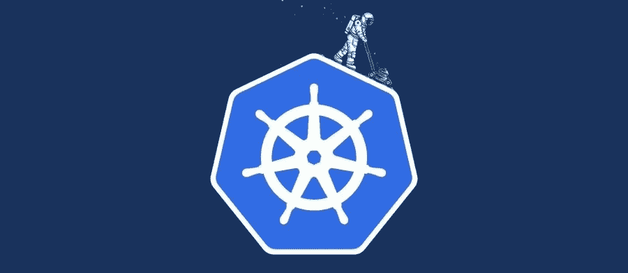

# Kubernetes 安装方法完全指南

> 原文：<https://itnext.io/kubernetes-installation-methods-the-complete-guide-1036c860a2b3?source=collection_archive---------0----------------------->

如果你熟悉 Kubernetes，你一定知道 Kubernetes 安装是 Kubernetes 的一个具有挑战性的主题。出现这种挑战是因为存在多种安装方法。在本文中，我将讨论 Kubernetes 的安装方法、可用的选择和最佳实践。让我们开始吧。

# Kubernetes 安装方法:

由于存在大量的安装方法，我将这些方法分为五大类。这种划分是根据用途、安装的容易程度和安装位置来进行的。

# 1-单节点安装:

这种类型的安装适合于那些想要预览 Kubernetes 的人，或者适合于实践、测试和开发目的。市场上有许多单节点 Kubernetes 发行版，但我介绍的是最流行的。

minikube 是由 Kubernetes 社区正式发布的单节点 Kubernetes 发行版。Kubernetes 的最新版本可以与 minikube 一起运行。除了安装 Kubernetes，一些 Kubernetes 插件可以很容易地运行。使用 minikube，Kubernetes 可以部署在 VM、容器或裸机系统上。也支持多个容器运行时(Docker、Containerd、CRI-O)。

更多关于[的信息 https://minikube . sigs . k8s . io](https://minikube.sigs.k8s.io)

**kind** 是用于在本地系统上运行 Docker 容器中的 Kubernetes 集群的发行版。kind 代表“Docker 中的 Kubernetes”。这个发行版适用于测试、本地开发和 CI 系统。kind 由 Kubernetes 社区正式发布。

更多关于[的信息 https://kind.sigs.k8s.io](https://kind.sigs.k8s.io/)

k3s 是 Rancher 发布的另一个有用的发行版。它最初是为物联网和边缘计算而构建的，但也可以用于任何其他目的。您可以使用几个命令运行单节点 Kubernetes 或集群。

关于 [https://k3s.io](https://k3s.io/) 的更多信息

**k3d** 是 Docker 上运行 k3s 的助手。它在本地机器上启动一个 Kubernetes 集群，就像“kind”一样。k3d 是牧场主放出的。

关于[https://github.com/rancher/k3d](https://github.com/rancher/k3d)的更多信息

**microk8s** 是另一个安装选项。使用 microk8s 不仅可以部署单节点 Kubernetes，还可以部署集群。这个 Kubernetes 发行版是由 Canonical——发布 Ubuntu 的公司——发布的，可以在 snappy package manager 上获得。Kubernetes 可以用几个命令部署。除了 Kubernetes，还有一个各种插件的列表，它们可以很容易地部署。

更多关于[的信息 https://microk8s.io](https://microk8s.io/)

# 2-手动集群安装:

这种类型的安装用于部署最小可行集群。安装的某些部分应该手动完成。这是首次部署 Kubernetes 集群的首选方式。

**kubeadm** 是一款用于人手部署集群的工具。它用于引导 Kubernetes 组件，而不是供应机器。在引导集群之前，应该手动完成一些操作。

更多关于 https://kubernetes.io/docs/reference/setup-tools/kubeadm 的信息

# 3-自动集群安装:

这种类型的安装是通过使用自动化工具、脚本或提供商分发的安装程序来完成的。对于那些希望在本地环境中部署生产级 Kubernetes 集群或者希望手动管理集群生命周期的人来说，这是一种首选方式。

kubespray 是一组可翻译的行动手册，用于在裸机和云上部署生产级集群。在安装的同时，第二天的操作可以通过 kubespray 进行。这个安装程序由 Kubernetes 社区官方维护。kubespray 中有十几个插件，可以很容易地与 Kubernetes 一起部署。kubespray 是最合适的安装选择之一。

更多关于 https://github.com/kubernetes-sigs/kubespray 的信息

**kops** 不仅会管理集群生命周期，还会提供必要的云基础设施。官方支持在 AWS 上部署，在其他云提供商上部署也是可用的，但仍处于测试阶段。

关于[https://kops . sigs . k8s . io](https://kops.sigs.k8s.io/)的更多信息

**RKE** 是一家牧场主分布式 Kubernetes，它可以在 Docker 容器上部署生产级 Kubernetes 集群。使用 RKE 可以轻松管理 Kubernetes 集群。如果您想使用 Rancher 平台，您应该选择这个发行版。

关于 https://github.com/rancher/rke 的更多信息

**Charmed Kubernetes** 是使用 Juju 部署 Kubernetes 集群的标准方式。它适合在多云环境和裸机上运行 Kubernetes。如果您正在寻找一个可以部署在 OpenStack 上的合格的 Kubernetes 发行版，这个安装程序就是为您准备的。

更多关于 https://ubuntu.com/kubernetes[的信息](https://ubuntu.com/kubernetes)

KubeSphere 不仅是一个 Kubernetes 发行版，它还是一个基于 Kubernetes 创建云解决方案的平台。使用 KubeSphere 和 Kubernetes 可以部署大量的工具、插件等。这个平台也可以部署在现有的 Kubernetes 集群上。

关于 [https://kubesphere.io](https://kubesphere.io/) 的更多信息

Kubermatic 是一个 Kubernetes 平台，就像牧场主一样。您可以在云和内部部署和管理 Kubernetes 集群。主/种子集群和下游集群之间的连接由 OpenVPN 处理。

关于[https://github.com/kubermatic/kubermatic](https://github.com/kubermatic/kubermatic)的更多信息

KubeOne 是一个工具，用于提供必要的基础设施，并在几个提供商上部署 Kubernetes。它可以很容易地与 Terraform 和 Kubermatic 集成。

关于[https://github.com/kubermatic/kubeone](https://github.com/kubermatic/kubeone)的更多信息

# 4-受管集群:

集群的生命周期由提供者管理。在这种类型的安装中，可以通过最少的用户操作来部署生产级集群。提供商负责管理整个集群以及底层基础设施。由于易于安装和管理，建议任何人都使用这种方法。使用托管 Kubernetes 的另一个好处是可以访问云特性。一些托管的 Kubernetes 提供商提供了一组有用的功能，这些功能在本地或裸机解决方案中可能不可用。

**Magnum** 是一款 OpenStack 解决方案，用于在 OpenStack 生态系统上安装托管 Kubernetes 和其他编排工具。借助 Magnum，云客户可以轻松运行 Kubernetes 集群。这种方法也可以归类为自动化集群安装方法。我决定在这里介绍它，因为它也支持令人惊叹的云特性。此外，基于 OpenStack 的云提供商可以向他们的客户提供这种方法来安装托管 Kubernetes 集群。

关于 https://docs.openstack.org/magnum/latest 的更多信息

**EKS** 代表弹性 Kubernetes 服务是亚马逊提供托管 Kubernetes 集群的解决方案。EKS 可以很容易地与亚马逊的其他服务整合。一个命令行工具 eksctl 用于在几分钟内运行一个生产 Kubernetes 集群。

更多关于 https://aws.amazon.com/eks[的信息](https://aws.amazon.com/eks)

GKE 是谷歌云版本的 Kubernetes，就像 AWS EKS 一样。GKE 提供了一种称为自动驾驶的特殊操作模式，可以降低管理成本，优化集群生产。

关于 https://cloud.google.com/kubernetes-engine 的更多信息

**AKS** 由微软 Azure 管理，可以轻松部署。这个托管的 Kubernetes 解决方案对 Azure 用户来说很好，因为它可以与 Azure 生态系统上可用的其他 Azure 工具集成。

关于[https://azure . Microsoft . com/en-us/services/kubernetes-service 的更多信息](https://azure.microsoft.com/en-us/services/kubernetes-service/)

# 5- Kubernetes 来硬的:

艰难的方法是用来安装 Kubernetes 从零开始。我向所有想学习 Kubernetes 所有组件的人推荐这种类型的安装，以深入了解 Kubernetes。如果您想知道部署集群的过程以及集群组件之间发生了什么，那么至少要用这种方法安装一次 Kubernetes。

据我所知，Kelsey Hightower 是第一次发布 hard way 方法的人。他解释了如何在 Google 云平台上从头开始部署 Kubernetes。

关于[https://github.com/kelseyhightower/kubernetes-the-hard-way](https://github.com/kelseyhightower/kubernetes-the-hard-way)的更多信息

**Mumshad mannan Beth**派生出之前解释过的方法，并对其进行了更改，以使用 vagger 部署到本地机器。这个版本的 hard way 没有更新到最新的 Kubernetes。

更多关于 https://github.com/mmumshad/kubernetes-the-hard-way 的信息

# 结论:

市场上有许多其他安装 Kubernetes 的工具和解决方案，但是我描述的是更流行的一些。你应该使用哪种方法由你决定。没有绝对正确的解决方案，但是如果你想要我的意见作为最佳实践，这里有你在不同情况下的一些选择。你最后穿裤子。

用于测试和开发的绝对单节点: **minikube**

在单节点机器上运行多节点 Kubernetes:**种类**或 **k3d**

基于 Ubuntu 生态系统的最小生产集群: **microk8s**

预装插件的单节点: **k3s**

物联网友好，支持集群: **k3s** 或 **microk8s**

用于 CI/CD 系统上的执行器: **k3s** 或 **microk8s**

手动最小可行簇: **kubeadm**

基于 Ansible 的自动化集群安装: **kubespray**

AWS 上的自管理集群: **kops**

各种基础设施的自我管理: **KubeOne**

码头工人顶部的牧场主友好集群: **RKE**

对于 Ubuntu 爱好者来说，使用 Juju: **迷倒 Kubernetes**

管理多集群环境: **Rancher** 或 **Kubermatic**

云原生应用管理: **KubeSphere**

基于 OpenStack 的云: **Magnum**

为所有人管理集群: **GKE** ， **EKS** 或**阿克什**

具有自动驾驶仪支持的托管集群: **GKE**

对于那些需要深入了解 Kubernetes 的人:**艰难地**

日常练习(多合一): **minikube** 或 **k3s**

如果你有一些经验或者知道其他好的方法，请在下面评论。如果市场上发生任何变化，我会更新这个帖子。

关注我的 LinkedIn[https://www.linkedin.com/in/ssbostan](https://www.linkedin.com/in/ssbostan)

祝你好运。