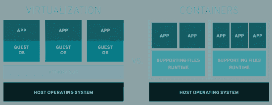
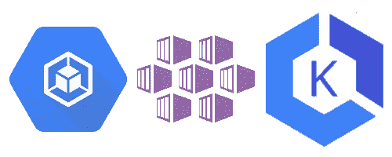

# Kubernetes 之旅—启动并运行云计算—简介

> 原文：<https://itnext.io/kubernetes-journey-up-and-running-out-of-the-cloud-introduction-f04a811c92a5?source=collection_archive---------4----------------------->

照片由来自 [Pexels](https://www.pexels.com/photo/woman-and-man-riding-on-motorcycle-2174656/?utm_content=attributionCopyText&utm_medium=referral&utm_source=pexels) 的 Ajay Donga 拍摄

你好。

我们一直在关注行业转型，尤其是在 IT 基础设施方面。

我们见证了第一波应用基础设施现代化浪潮，通过这一浪潮，企业能够利用虚拟化技术实现巨大的规模经济。有了它，就没有必要再等待购买物理硬件来增加 CPU、内存或磁盘。这只是一个改变配置的问题，一切又变好了。

图片作者:【https://www.redhat.com】T4

后来，在应用程序开发现代化运动之后，应用程序变得越来越复杂，通过服务接口相互交流，我们看到了容器化运动的兴起。起初，仅限于开发人员本地环境，使得在本地开发和测试应用程序以及运行产品演示变得容易。

接着，一场全新的现代化运动出现了。许多公司一直在将工作负载转移到云，利用规模经济的优势，使自己能够实施当前场景所需的业务变化，在这种情况下，响应变化的速度成为企业生存能力的关键因素。

正是在这种情况下，我们的应用程序变成了复杂的系统，由多个集成的和不断发展的小部分组成，Kubernetes 诞生了。主要的云提供商各自提供自己的 Kubernetes(如 GKE、EKS、AKS 等。)

云中的 Kubernetes 风味(GKE、阿拉斯加、EKS)

通过大型云提供商提供 Kubernetes 给软件开发商和公司带来了很多好处。然而，仍有相当多的公司由于各种原因(例如，法规)无法利用云，而是希望利用 Kubernetes 的功能。正是在这种背景下，公共云不是一个选项，该公司希望在其数据中心安装 Kubernetes，我们将在这一系列文章中探索和揭开谜底。

我们将深入探讨基础设施的概念(网络、安全性、高可用性、灾难恢复等)，开发团队通常不熟悉这些概念，但要从头开始成功安装 Kubernetes，这些概念是必不可少的。

如果您对这个主题感兴趣，并且想详细了解如何设置 Kubernetes 集群，那么您不能错过这个旅程！

如果你不想等到所有的文章都发表了，又想马上动手，可以随意克隆项目的 Github repo。它完全实用，文档也在不断改进:

 [## 罩下的姆瓦利姆/库伯内特斯

### 本教程是有人计划安装一个 Kubernetes 集群，并希望了解一切如何配合在一起…

github.com](https://github.com/mvallim/kubernetes-under-the-hood) 

**索引**

这一部分将随着本系列中其他文章的发布而更新链接。因此，我强烈建议您将它保存在书签中，这样您就可以快速查阅本系列的所有文章。

我还建议您在 Medium 上关注我，这样当本系列中有新文章发布时，您就会得到通知。

1.  **规划**‣[架构概述](/kubernetes-journey-up-and-running-out-of-the-cloud-architecture-overview-e75763b54922)‣[技术堆栈](/kubernetes-journey-up-and-running-out-of-the-cloud-technology-stack-9c472aafac4e)‣[联网](/kubernetes-journey-up-and-running-out-of-the-cloud-network-5341831ed712)
2.  **kubernetes**t15】‣[概述](/kubernetes-journey-up-and-running-out-of-the-cloud-kubernetes-overview-5012994b8955)t18】‣[师傅和工人](/kubernetes-journey-up-and-running-out-of-the-cloud-master-and-worker-6328775b347f)t21】‣[etcd](/kubernetes-journey-up-and-running-out-of-the-cloud-etcd-b332d1be474c)t24】‣[法兰绒](/kubernetes-journey-up-and-running-out-of-the-cloud-flannel-c01283308f0e#b134-accd60b5efdd)t27】‣[Linux 镜像](/kubernetes-journey-up-and-running-out-of-the-cloud-linux-image-c51953e50d0e)
3.  **将所有东西放在一起** ‣ [如何设置网关和 Busybox 组件](/kubernetes-journey-up-and-running-out-of-the-cloud-starting-the-actual-setup-737c0f3e0fb1)
    ‣ [如何设置高可用性的 HAProxy 集群](/kubernetes-journey-up-and-running-out-of-the-cloud-how-to-setup-the-haproxy-cluster-with-high-ee5eb9a7f2e1)
    ‣ [如何使用](/kubernetes-journey-up-and-running-out-of-the-cloud-how-to-setup-the-masters-using-kubeadm-9a496a14fbc1)`[kubeadm](/kubernetes-journey-up-and-running-out-of-the-cloud-how-to-setup-the-masters-using-kubeadm-9a496a14fbc1)`[bootstrap](/kubernetes-journey-up-and-running-out-of-the-cloud-how-to-setup-the-masters-using-kubeadm-9a496a14fbc1)
    ‣如何使用`kubeadm` bootstrap
    ‣如何设置仪表板

回头见！！

再见