# 在装有 k3d 和 k3s 的 Windows 10 笔记本电脑上安装 Rancher 2.5，并在 k8s 上部署 nginx

> 原文：<https://itnext.io/kubernetes-rancher-2-5-on-your-windows-10-laptop-with-k3d-and-k3s-7404f288342f?source=collection_archive---------1----------------------->


本文展示了如何在您的 Windows 10 笔记本电脑上使用 Rancher Cluster Manager 设置一个最小的 Kubernetes dev env，并使用 k3d 来设置 k3s 集群。

***TL；博士安装 Docker 桌面& Chocolatey 并运行最后的要点***

> 这是对[https://jyeee.medium.com/rancher-2-4-14c31af12b7a](https://jyeee.medium.com/rancher-2-4-14c31af12b7a)的更新，但是使用了 Docker 和 k3d 而不是 multipass

# 先决条件

*   带 Hyper-V 的 Windows 10 **Pro**
*   Docker 桌面(2.5.x)

说真的，就是这样！我们将使用巧克力来帮助，但除此之外不需要任何其他东西。

# 概观

1.  启用 Hyper-V 并检查您的 Docker 安装
2.  安装 Chocolatey 来安装 kubectl 和 helm
3.  安装 k3d 并启动单节点 k3s Kubernetes 集群
4.  使用 helm 将证书管理器部署到集群中
5.  通过 Rancher 部署应用

# 1/5 启用 Hyper-V 并检查 Docker 安装

Hyper-V 允许您快速运行运行单节点 kubernetes 集群的虚拟机。它是 Windows 10 Pro 的标配。

如果你以前没有使用过 Hyper-V，你可能需要使用这个命令来启用它(在[https://github.com/kubernetes/minikube/issues/2954](https://github.com/kubernetes/minikube/issues/2954)了解更多信息)

```
**Enable-WindowsOptionalFeature -Online -FeatureName Microsoft-Hyper-V -All**
```

这也是检查 docker 安装是否良好的好时机

```
**docker run hello-world**
```

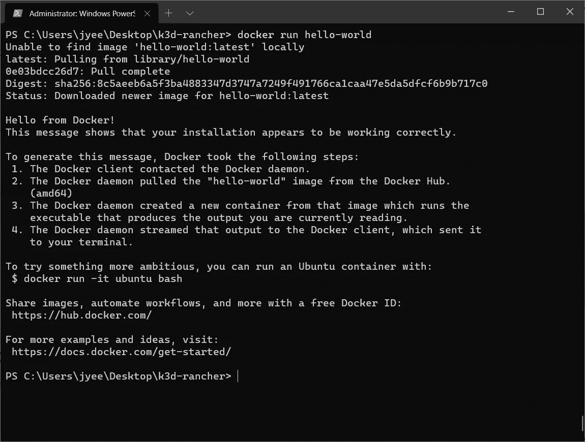

你好世界！

> 有用提示:将 Windows 终端锁定为任务栏上的第 n 个项目。然后按 Win+Ctrl+Shift+n 以管理员身份打开。所以如果你把它作为第一个，它将是 Win+Ctrl+Shift+1
> 
> [https://stack overflow . com/questions/62496779/opening-up-windows-terminal-with-elevated-privileges-from-in-windows-termin](https://stackoverflow.com/questions/62496779/opening-up-windows-terminal-with-elevated-privileges-from-within-windows-termin)

# 2/5 安装巧克力来安装头盔和 kubectl

Chocolatey 是 Windows 的命令行包管理器，感觉就像 macOS 中的自制工具。我们在这里安装它是因为 Chocolatey 提供了 Helm & kubectl (Kubernetes CLI)实用程序的简单安装。

> *注意:我在桌面上创建了一个工作文件夹* `*k3s-rancher*` *来存放未来的 kubeconfig 文件。*

我按照这里的说明[https://chocolatey.org/install#individual](https://chocolatey.org/install#individual)，并使用这个命令来确认它的安装。

```
PS C:\Users\jyee\Desktop\k3s-rancher> **choco list --local-only**
Chocolatey v0.10.15
chocolatey 0.10.15
1 packages installed.
```

然后用命令安装 helm 和 kubectl

```
**choco install kubernetes-cli -y
choco install kubernetes-helm -y**
```

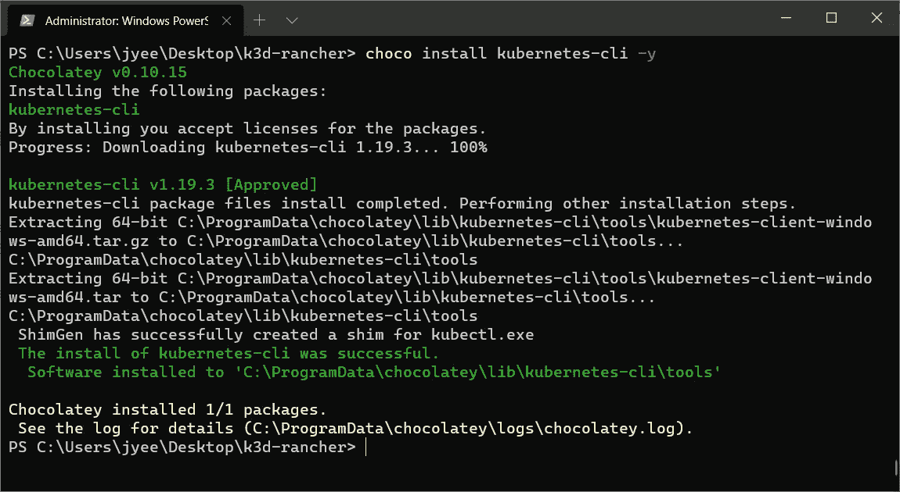

下面显示了我们应该安装的所有 Chocolatey 软件包。

```
PS C:\Users\jyee\Desktop\k3d-rancher> **choco list --local-only**
Chocolatey v0.10.15
chocolatey 0.10.15
kubernetes-cli 1.19.3
kubernetes-helm 3.4.0
3 packages installed.
```

# 3/5 安装 k3d 并启动单节点 k3s Kubernetes 集群

[k3d](https://k3d.io/) 是一种运行 [k3s](https://k3s.io/) 集群的方式，只需要 Docker Desktop 作为依赖。k3s 是 k8s 的一个小发行版，可以在 Raspberry Pi 上运行——但是它和任何 k8s 发行版一样得到了认证，你可以在生产中运行它。通过从 GitHub 下载它来获得它，并且为了使指令适用于多个平台(hello macOS ),为了方便起见，我设置了一个别名为`k3d`。

```
PS C:\Users\jyee\Desktop\k3d-rancher> **wget** [**https://github.com/rancher/k3d/releases/download/v3.2.0/k3d-windows-amd64.exe**](https://github.com/rancher/k3d/releases/download/v3.2.0/k3d-windows-amd64.exe) **-o k3d-windows-amd64-3.2.0.exe** PS C:\Users\jyee\Desktop\k3d-rancher> lsDirectory: C:\Users\jyee\Desktop\k3d-rancherMode                 LastWriteTime         Length Name
----                 -------------         ------ ----
-a----        11/11/2020   9:34 PM       22679552 k3d-windows-amd64-3.2.0.exePS C:\Users\jyee\Desktop\k3d-rancher> **Set-Alias -Name k3d -Value ~\Desktop\k3d-rancher\k3d-windows-amd64-3.2.0.exe**
```

现在在[https://rancher . localhost](https://rancher.localhost.)上构建集群，在这里我们将使用`.localhost` [DNS 魔术](https://en.wikipedia.org/wiki/.localhost)来知道将任何请求路由到 k3s 节点。

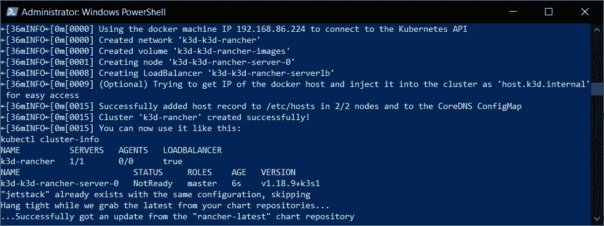

```
PS C:\Users\jyee\Desktop\k3d-rancher> **$env:CLUSTER_NAME="k3d-rancher"**PS C:\Users\jyee\Desktop\k3d-rancher> **$env:RANCHER_SERVER_HOSTNAME="rancher.localhost"**PS C:\Users\jyee\Desktop\k3d-rancher> **$env:KUBECONFIG_FILE="${env:CLUSTER_NAME}.yaml"**PS C:\Users\jyee\Desktop\k3d-rancher> **k3d cluster create $env:CLUSTER_NAME --api-port 6550 --servers 1 --port 443:443@loadbalancer --wait**
```

一旦你有了一个集群，设置一些 env 变量、别名和你的 kubectl，这样你就可以确认你的集群已经启动并运行，并开始在上面运行应用程序。

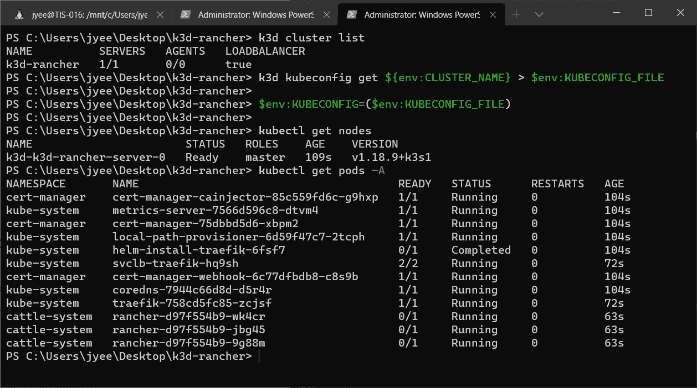

```
PS C:\Users\jyee\Desktop\k3d-rancher> **k3d cluster list**
NAME          SERVERS   AGENTS   LOADBALANCER
k3d-rancher   1/1       0/0      truePS C:\Users\jyee\Desktop\k3d-rancher> **k3d kubeconfig get ${env:CLUSTER_NAME} > $env:KUBECONFIG_FILE**PS C:\Users\jyee\Desktop\k3d-rancher> **$env:KUBECONFIG=($env:KUBECONFIG_FILE)**PS C:\Users\jyee\Desktop\k3d-rancher> **kubectl get nodes**
NAME                       STATUS   ROLES    AGE    VERSION
k3d-k3d-rancher-server-0   Ready    master   109s   v1.18.9+k3s1PS C:\Users\jyee\Desktop\k3d-rancher> **kubectl get pods -A**
NAMESPACE       NAME                                       READY   STATUS      RESTARTS   AGE
cert-manager    cert-manager-cainjector-85c559fd6c-g9hxp   1/1     Running     0          104s
...
cattle-system   rancher-d97f554b9-9g88m                    0/1     Running     0          63s
```

# 4/5 使用 helm 将证书管理器部署到集群中

这些命令安装 Rancher，一般遵循这些指令[https://Rancher . com/docs/Rancher/v2 . x/en/installation/k8s-install/helm-Rancher/](https://rancher.com/docs/rancher/v2.x/en/installation/k8s-install/helm-rancher/)

```
# Install cert-manager with helm
**helm repo add jetstack** [**https://charts.jetstack.io**](https://charts.jetstack.io) **helm repo update
kubectl create namespace cert-manager
helm install cert-manager jetstack/cert-manager --namespace cert-manager --version v1.0.4 --set installCRDs=true --wait
kubectl -n cert-manager rollout status deploy/cert-manager
date**# Install Rancher
**helm repo add rancher-latest** [**https://releases.rancher.com/server-charts/latest**](https://releases.rancher.com/server-charts/latest) **helm repo update
kubectl create namespace cattle-system
helm install rancher rancher-latest/rancher --namespace cattle-system --set hostname=${env:RANCHER_SERVER_HOSTNAME} --wait
kubectl -n cattle-system rollout status deploy/rancher
date**
```

成功安装后，您会看到这些日志

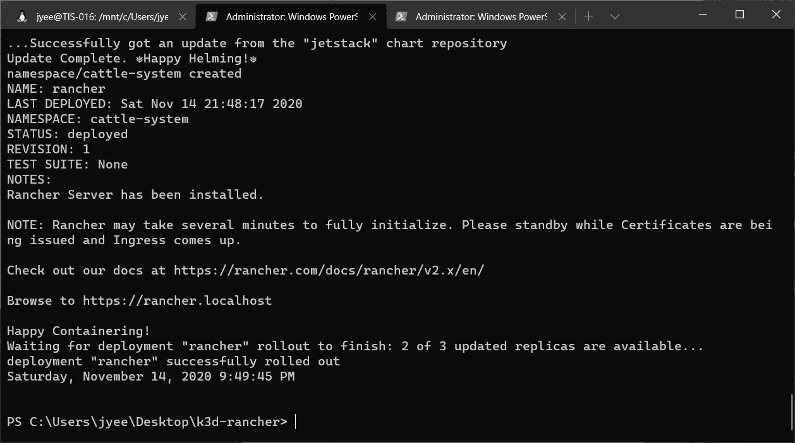

在您看到行`deployment "rancher" successfully rolled out`之后，浏览到[https://rancher . localhost](https://rancher.localhost.)，在这里我们将使用`.localhost` [DNS 魔术](https://en.wikipedia.org/wiki/.localhost)来知道路由任何请求到 k3s 节点。如果你看不到这个屏幕，你可能不得不使用[*this is unsafe*](https://dev.to/brettimus/this-is-unsafe-and-a-bad-idea-5ej4)chrome 技巧

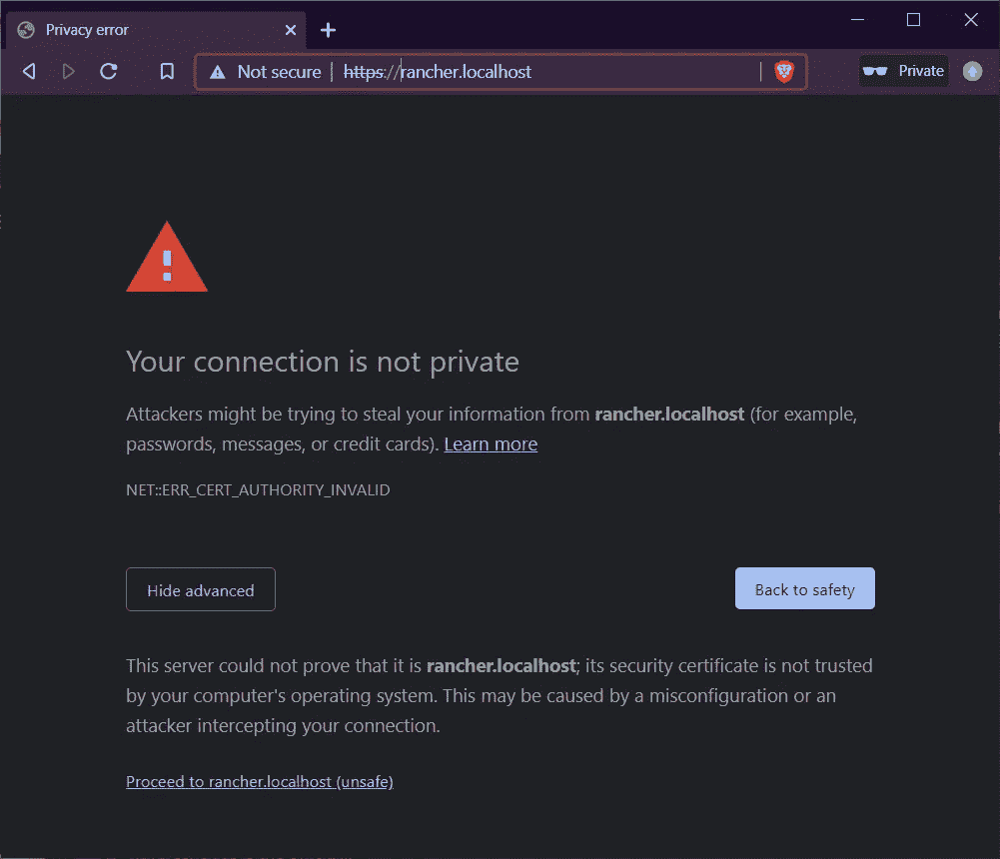

我保留了默认设置，为`admin`用户创建了一个新密码。如果我必须再次登录，我可以使用`admin`和这个密码

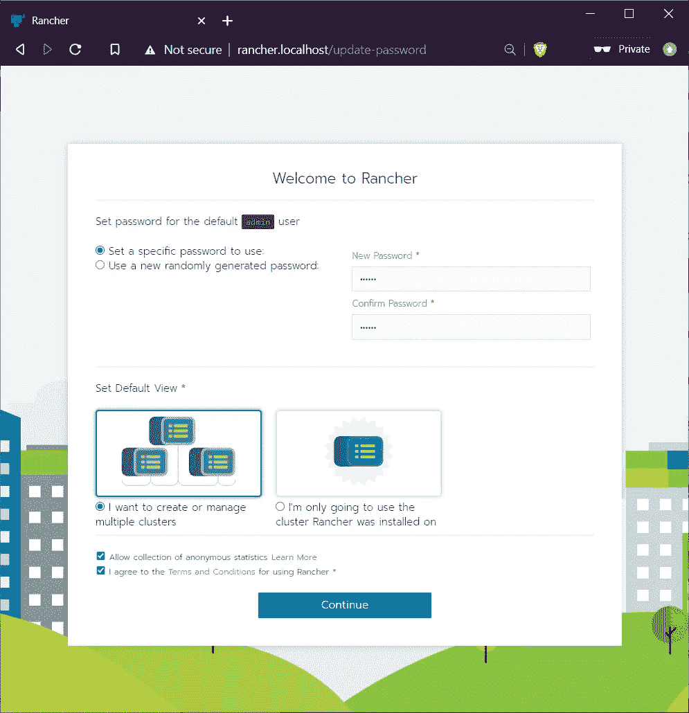

使用`rancher.localhost`作为你的牧场主安装，以利用。本地主机魔法。在生产中，这个魔术将是一个负载平衡器和通配符证书。

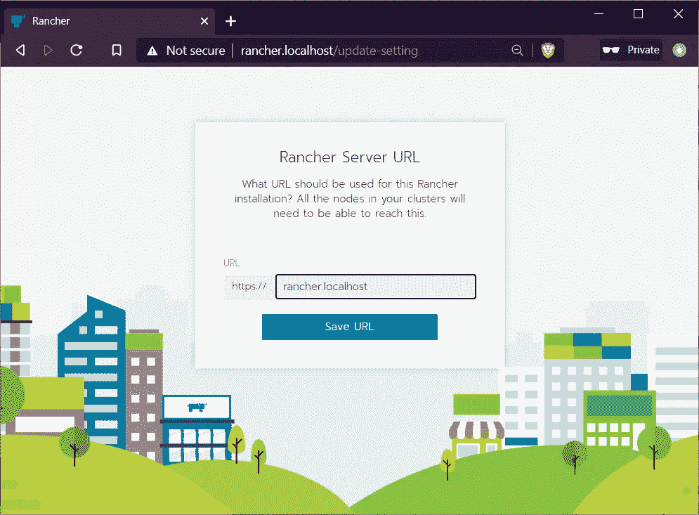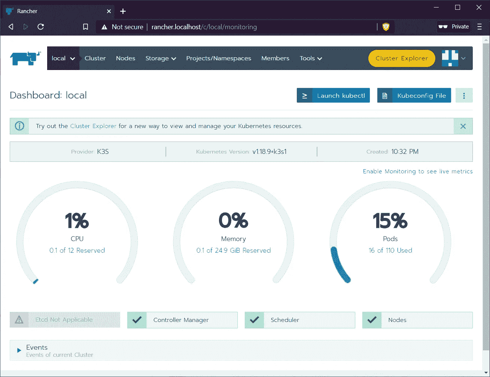

关于 Rancher 最好的事情之一是你可以通过点击 **Launch kubectl** 按钮在你的浏览器中启动并运行 kubectl！

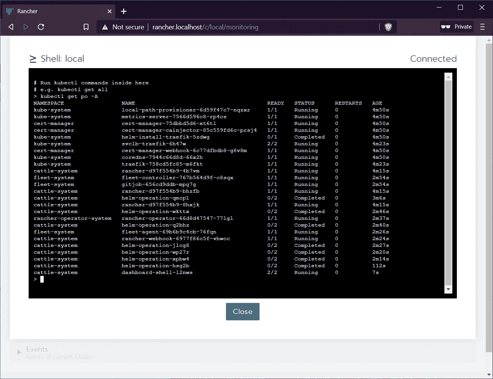

# 5/5 通过 Rancher 部署应用

我们将使用这里显示的[相同的过程](https://jyeee.medium.com/rancher-2-4-14c31af12b7a)来部署 nginx 容器，并通过使用 Rancher Cluster Manager UI 来公开它。

将鼠标悬停在左上角的本地集群上，并转到**默认** Rancher 项目。Rancher 项目提供了一个名称空间管理层，允许集群管理员轻松实现 RBAC 和资源限制。

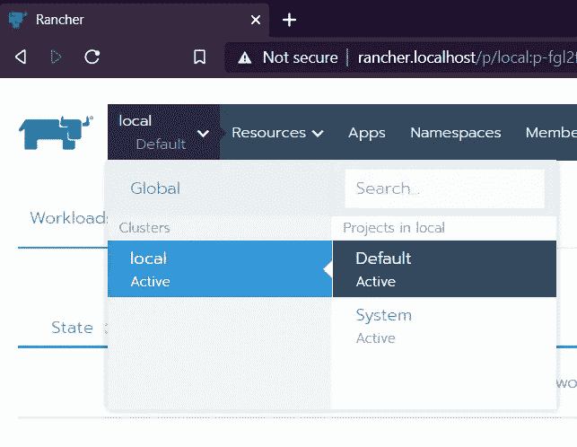

在**默认**项目页面中，您可以看到没有部署任何工作负载。让我们通过单击右上角的蓝色 **Deploy** 按钮来部署一个工作负载


使用`nginx:alpine`图像，按照此截图显示端口 80，点击**启动**

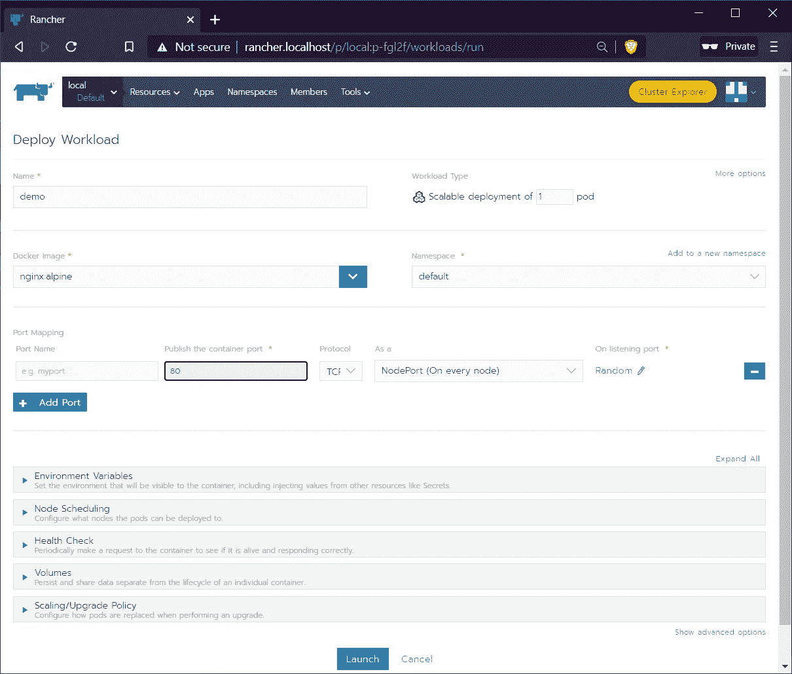

您应该看到创建了一个“pod ”,它有一个“nodeport ”,在端口 31896 上公开了集群中节点上的工作负载(在我看来，k8s 有很多术语/复杂性，Rancher 可以帮助您直观地理解其中的很多内容)。

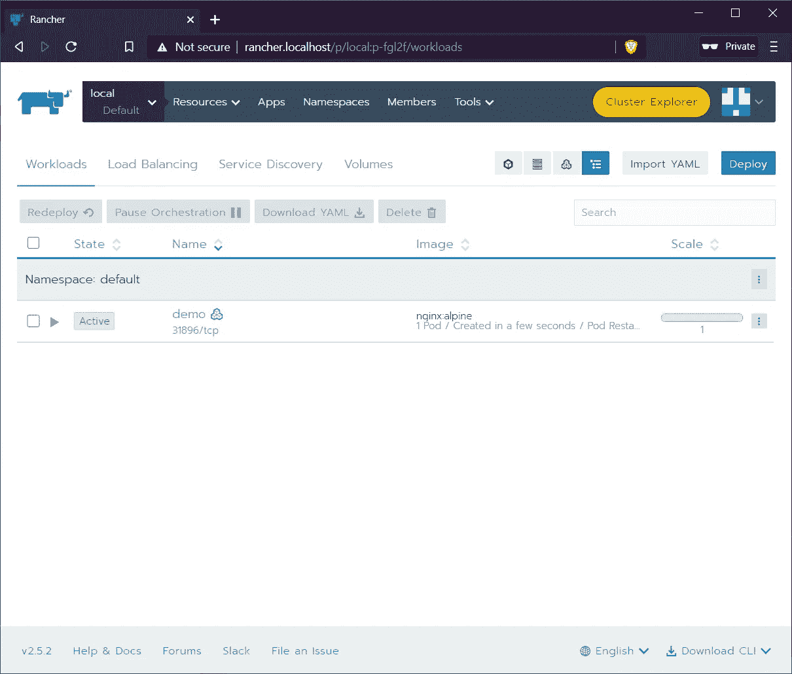

换句话说，如果您通过 ssh 进入其中一个节点，您可以通过端口 31896 访问它，如下图所示，使用`docker exec`

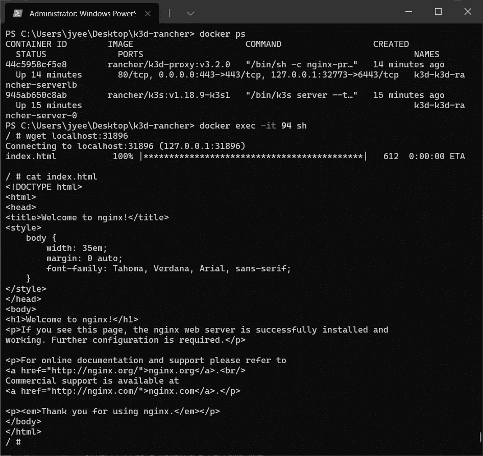

要在集群之外共享这个服务而不暴露任何节点，可以再次使用非常方便的 Rancher GUI 来设置入口。点击工作负载右侧的**负载平衡**选项卡，然后点击**添加入口**

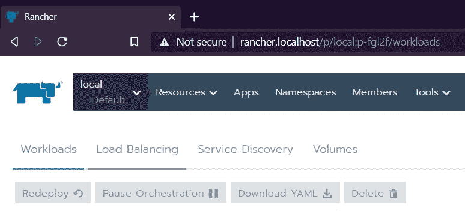

我用(注意两张截图)配置了入口

*   名称: **demo.rancher.localhost**
*   指定要使用的主机名(设置请求主机): **demo.rancher.localhost**
*   单击减号删除默认工作负载，单击+号添加一个**服务**作为目标后端
*   将目标字段更改为**演示节点端口**，它将自动选择相应的端口

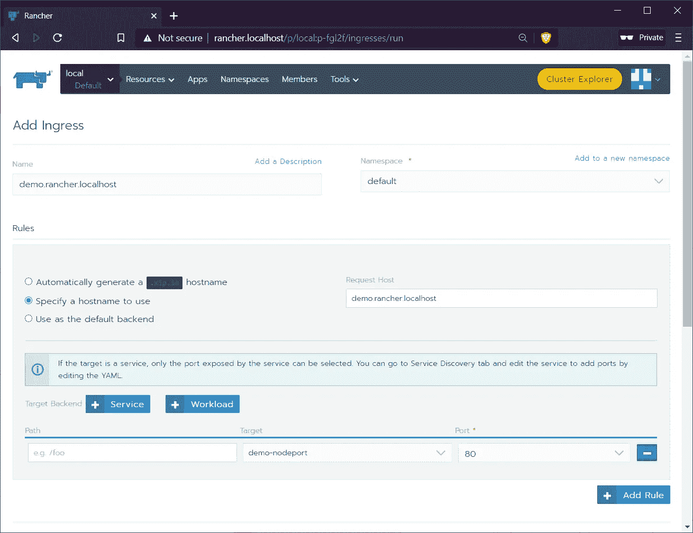

*   将证书添加到同一个主机 **demo.rancher.localhost**

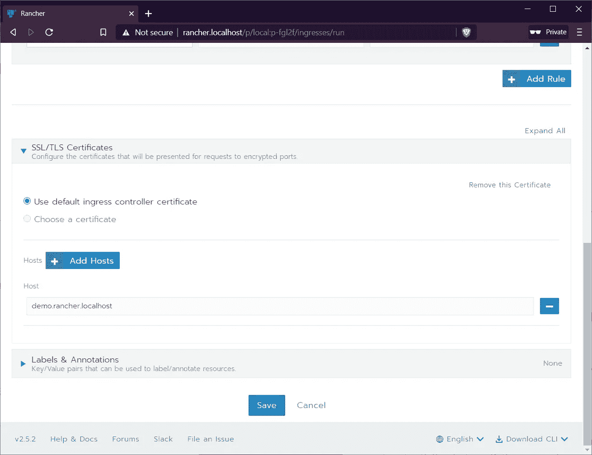

点击保存后，你会看到有一个新的入口，带你去你想去的地方，感谢一些牧场主和 DNS 魔术！

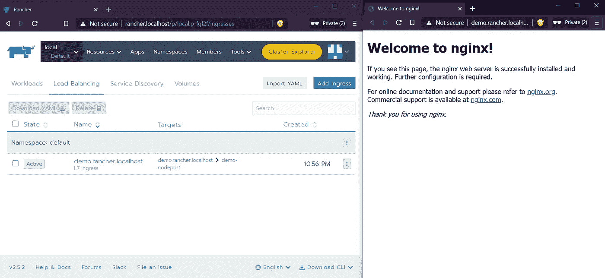

在生产中，您将希望编写一些部署 yamls，并通过 CI/CD 管道部署它们。但是现在，享受在你的笔记本电脑上有一个开发实验室来探索 k8 和牧场主来管理它！

感谢 [Brandon Gulla](https://medium.com/u/ce902113ac3a?source=post_page-----7404f288342f--------------------------------) 向我介绍 k3d 和 [Thorsten K](https://medium.com/u/f4cb33e4a07f?source=post_page-----7404f288342f--------------------------------) 的 k3d 演示，它继续激励着我，希望也激励着许多其他开发者！！

下面是我用来启动集群和安装 Rancher 的统一 PS1 脚本的要点。先决条件是安装 Docker 和 Chocolatey。