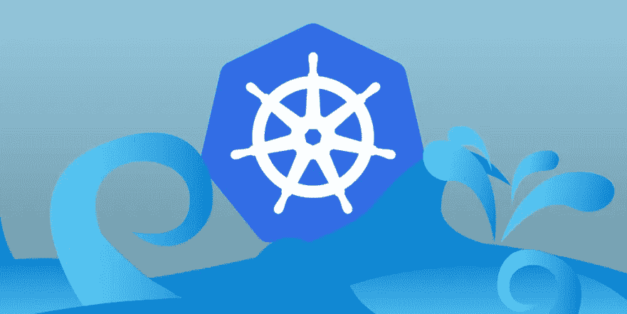

# Kubernetes 故障排除系列第 2 部分:网络和 DNS 连接

> 原文：<https://itnext.io/kubernetes-troubleshooting-saga-part-2-networking-and-dns-connectivity-7f11013f6148?source=collection_archive---------3----------------------->



# 简介:

这是排除 Kubernetes 传奇故障的第二部分。这篇文章将涵盖臭名昭著的 DNS 间歇性延迟 5 秒的问题，以及如何处理 Kubernetes 网络。对于传奇的第一部分，请点击以下链接:

Kubernetes 故障排除系列第 1 部分:pod、部署和集群。

# DNS 间歇延迟:

Kubernetes 在其核心服务中使用 iptables，Kubernetes 依靠 Netfilter 内核模块来建立低级集群 IP 负载平衡。这需要两个关键模块，IP 转发和桥接。由于 netfilter 的一个内核错误，在重负载下，DNS 会出现问题。这个话题有多个 Github 问题开放，比如 [#Kube56903](https://github.com/kubernetes/kubernetes/issues/56903) 。要详细了解这个问题，我推荐阅读昆汀·马楚的[这篇](https://blog.quentin-machu.fr/2018/06/24/5-15s-dns-lookups-on-kubernetes/)文章。

我第一次面对这个问题是在和 KOPS 一起为 CNI 编织的时候。我在与 EKS 的 CoreDNS 合作时也看到了这个问题。因为这是一个内核错误，如果你不想给内核打补丁，只能采用变通方法。内核补丁在这里[可用](https://github.com/torvalds/linux/commit/ed07d9a021df6da53456663a76999189badc432a)在这里[可用](https://github.com/torvalds/linux/commit/4e35c1cb9460240e983a01745b5f29fe3a4d8e39)。补丁可以应用于内核版本 5 或更高版本。

## DNS 延迟的解决方法:

**变通方法 1** :我分享的昆汀·马楚的帖子附带了一个简单的解决方案。它将在 weave 的 Daemonset 中运行额外的容器，这将在 DNS 调用之间带来延迟。对于使用 Weave 并且有合理流量的集群，我会推荐这个解决方案，因为它很容易实现。将以下配置添加到 Weave 的 Daemonset 中:

```
spec:
      containers:
      - name: weave-tc
        image: 'qmachu/weave-tc:0.0.1'
        securityContext:
          privileged: true
        volumeMounts:
          - name: xtables-lock
            mountPath: /run/xtables.lock
          - name: usr-lib-tc
            mountPath: /lib/tcvolumes:
      - hostPath:
          path: /usr/lib/tc
          type: ""
        name: usr-lib-tc
```

**解决方法 2:** 对于具有高负载和大量 pods 的集群，DNS 缓存是一种可行的方法。[这里的](https://github.com/kubernetes/kubernetes/tree/master/cluster/addons/dns/nodelocaldns)是指向 Kubernetes Nodelocal DNS 缓存文档的链接。为此我找了一个 Kubekon 2019 的视频:

> **注意:**对于这两种变通办法，请确保您有足够数量的 kube-dns 或 core-DNS pod 可用。在压力测试期间，由于 kube-dns pods 耗尽了资源，我的网络出现了中断。

# 网络故障排除:

我通常使用 busybox 部署来测试我的网络。您可以使用您喜欢的所有工具创建自己的定制映像，然后使用该映像运行部署。下面是一个使用 busybox 的示例部署:

```
apiVersion: apps/v1beta1
kind: Deployment
metadata:
  labels:
    run: busybox
  name: busybox
  namespace: default
spec:
  replicas: 2
  selector:
    matchLabels:
      run: busybox
    type: RollingUpdate
  template:
    metadata:
      labels:
        run: busybox
    spec:
      nodeSelector:
        type: other      
      containers:
      - image: busybox:latest
        imagePullPolicy: Always
        name: busybox
```

## 一般故障排除步骤:

网络是一个广泛的话题，因此我将记录排除潜在网络问题时应该采取的一般步骤:

*   良好的起点是调试服务，请查看 Kubernetes 的本指南:[https://Kubernetes . io/docs/tasks/debug-application-cluster/debug-service/](https://kubernetes.io/docs/tasks/debug-application-cluster/debug-service/)
*   检查入口控制器的日志，例如:
    `stern nginx-ingress`
*   确保正确创建或重新创建入口，例如:
    `kubectl get ingress <ingress name>
    kubectl describe ingress <ingress name>`
*   如果您已经更改了 nginx 入口的配置，或者您想要检查配置，那么您可以使用:
    `kubectl exec -it <nginx ingress pod name> cat /etc/nginx/nginx.conf`
*   您可以从 nginx 或 busybox pods 测试端点:
    `kubectl exec -it <pod name> curl [http://test-app/v1/health](http://test-app:8080/v1/health)`
*   为了确保您的负载平衡器不是问题的根本原因，您可以使用 curl 点击 LB。`kubectl describe ingress`将为您提供与您的服务入口相关的 LB。下面是命令:
    `curl -H “HOST: www.test-app.com" <elb-ed>.us-west-1.elb.amazonaws.com`
*   拥有像 Istio 这样的服务网格工具和像 jaeger 这样的跟踪工具有助于了解您的 kube 网络发生了什么以及瓶颈在哪里。
*   如果您的集群没有任何跟踪或服务网格，那么像 tcpdump 这样的工具会非常有用，让我们假设我们的部署没有工作，pod 的 ip 是 172.28.93.3。我们可以通过在节点运行 pod 上运行 tcpdump 来捕获相关流量:
    `tcpdump -i any host 172.28.93.3`
*   nslookup 也是测试 dns 的便捷工具，例如:
    `nslookup [www.test-app.com](http://www.test-app.com)`

除了上述步骤之外，以下是对诊断网络问题有用的资源:

*   [https://www . praqma . com/stories/debugging-kubernetes-networking/](https://www.praqma.com/stories/debugging-kubernetes-networking/)
*   [https://www . Alibaba cloud . com/blog/how-to-inspect-kubernetes-networking _ 594236](https://www.alibabacloud.com/blog/how-to-inspect-kubernetes-networking_594236)