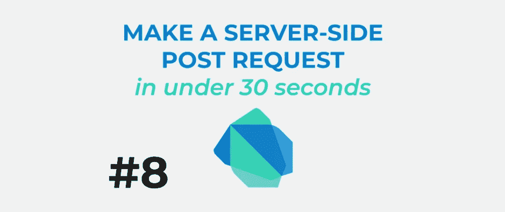

# 学习 Dart #8:在 30 秒内执行服务器端 POST 请求

> 原文：<https://itnext.io/learn-dart-perform-a-serverside-post-request-in-under-30-seconds-894fc889c551?source=collection_archive---------6----------------------->

## 我们将使用内置的 HttpClient 类来实现这一点



朋友们好。在今天的快速技巧中，我们将使用内置的`HttpClient`类来执行服务器端 POST 请求。

下面的视频演示了这一点:

→ [**在 YouTube 上观看**](http://bit.ly/serverside-post-request)

以下是完整的解决方案:

我承认有点啰嗦*。*然而，Dart 团队创建了一个名为 **http** 的库来简化这个逻辑**。**

要安装，请更新您的`pubspec.yaml`文件:

```
name: dart_project
dependencies:
  **http: ^0.12.0**
```

并运行`pub get`来更新您的依赖项。

现在的解决方案是这样的:

```
import '**package:http/http.dart**' **as** **http**;void main() async {
  var **response** = await **http.post**('[https://jsonplaceholder.typicode.com/posts'](https://jsonplaceholder.typicode.com/posts'),
    **body**: {
      'title': 'Post 1',
      'content': 'Lorem ipsum dolor sit amet',
    }); print(response**.body**);
}
```

并运行:

```
$ **dart bin/main.dart**# Result:
# {
#   "title": "Post 1",
#   "content": "Lorem ipsum dolor sit amet",
#   "id": 101
# }
```

**订阅** [**我的 YouTube 频道**](http://bit.ly/fullstackdart) 获取更多涵盖全栈 web 开发各个方面的视频。

**喜欢，分享** [**跟我来**](https://twitter.com/creativ_bracket) 😍有关 Dart 的更多内容。

# 进一步阅读

1.  [**HttpClient** 类](https://api.dartlang.org/stable/2.1.0/dart-io/HttpClient-class.html)
2.  [**发布上的 http** 包](https://pub.dartlang.org/packages/http)
3.  [**免费飞镖截屏在 Egghead.io**](https://egghead.io/instructors/jermaine-oppong)