# 使用 KumuluzEE 学习 JWT 安全——环境联盟的财务

> 原文：<https://itnext.io/learning-jwt-security-using-kumuluzee-the-finances-of-a-league-of-the-environment-2f541e99cc90?source=collection_archive---------1----------------------->


如今，我们越来越关注性能，同时，我们想知道系统如何快速可靠地通信。很多时候我们想发送信息，尽可能的保密和安全。敏感数据有时也必须通过网络公开传输，并在网络的另一端触发操作。大多数情况下，我们希望生成会导致数据突变的操作。在这些情况下，我们不仅要保护我们的数据。我们希望确保发送我们的数据所触发的操作是可信的。我们可以通过多种方式保护我们的数据。最常见的是，我们通过[](https://www.cloudflare.com/learning/ssl/transport-layer-security-tls/)****(传输层安全)安全连接发送数据。这将确保我们的数据通过网络得到加密。我们使用**证书**在双方之间创建信任关系并实现这一点。****

****在这篇文章中，我想讨论一下 [**JWT**](https://jwt.io/) 标准，并进一步看看我们如何将 [**JWT**](https://jwt.io/) 整合成一个通用的**企业**应用。既然这样，我们就来看看 [**KumuluzEE**](https://ee.kumuluz.com/) 。****

****让我们来看看一些基本概念。 **JWT** 或 **JSON Web Token** ，或者更好的说法是 **JavaScript** **对象表示法 Web Token** ，是在 [**RFC7519**](https://tools.ietf.org/html/rfc7519) 中定义的一个标准。像所有的 [**RFC**](https://en.wikipedia.org/wiki/Request_for_Comments) (征求意见)标准一样，该标准已经由 [**IETF**](https://www.ietf.org/) (互联网工程任务组)定义、编写并发布。它可以有多种定义。一般来说，我们可以说 **JWT** 是一种在双方之间传递**债权**的简洁、安全的形式。简化声明的一种方法是将其描述为包含信息的名称/值对。我们需要这些信息来保证我们互联网通信的几个重要方面。我们需要确保我们收到的信息在第一时间得到验证和信任。然后我们需要验证它。基本上就是这样。****

****为了实现这个标准，我们可以使用几个框架来帮助我们实现一个 Java 企业应用。[](https://spring.io/projects/spring-boot)****被广泛使用。很多时候，它也以另一个名称包装在来自某些组织(如银行和其他金融组织)的专有软件中。对于我们的例子，我决定做一些不同的事情。代替 [**Spring Boot**](https://spring.io/projects/spring-boot) ，我们来看一个 [**KumuluzEE**](https://ee.kumuluz.com/) 的例子。关键是要确定 JWT 到底是什么以及它看起来像什么。Java 企业应用程序基本上是可以部署在应用程序服务器中的应用程序，或者只是通过使用嵌入式服务器独立运行。例如，[**【Spring Boot】**](https://spring.io/projects/spring-boot)**应用程序运行在嵌入式[**Tomcat**](http://tomcat.apache.org/)**服务器上。在本文中，我们的重点将放在 [**KumuluzEE**](https://ee.kumuluz.com/) 上。就像[**Spring Boot**](https://spring.io/projects/spring-boot)**它也包含一个嵌入式服务器。只不过在这种情况下它被称为 [**突堤**](https://www.eclipse.org/jetty/) 。这与 [**焊缝**](https://www.eclipse.org/jetty/documentation/current/framework-weld.html) 结合使用，以提供 [**CDI**](https://weld.cdi-spec.org/) (上下文依赖注入)。所有的 [**Java EE**](https://www.oracle.com/java/technologies/java-ee-glance.html) 和 [**Jakarta EE**](https://jakarta.ee/) 技术标准都兼容这个框架。**************

# ****1.例子****

****为了举例说明《T2》《JWT》《T3》的基本形式是如何运作的，我必须想出一种方法来展示它。关注安全性的典型例子是银行。然而，制作一个完整的银行应用程序来展示 **JWT** 是如何工作的将是浪费时间，并且可能会涉及太多的概念。相反，我做的是一个非常简单的银行系统。我们主要关心的是显示数据如何通过网络流动，以及用户如何访问我们应用程序的某些区域。我也不打算讨论 TLS 或者我们如何通过网络发送加密信息。我们将继续关注最纯粹的 JWT。****

****你的案例是一个捍卫自然和环境的团体所使用的银行系统。这只是展示 JWT 如何工作的一种有趣的方式。这个自然联盟的主角是露西，她正在成为我所有文章中的常见角色。****

# ****2.体系结构****

****在我们开始之前，让我们先描绘一下我们正在运行的应用程序。这是一个非常简单的应用程序，但绘制它仍然是一件好事:****

****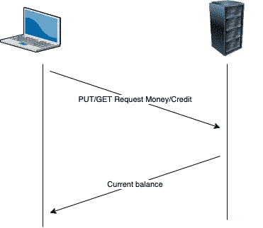****

****基本请求和响应****

****这如此简单的原因是因为 JWT 在每个请求上都得到了检查，并且每个请求都根据公钥得到了验证，所以我们知道只要我们在每个请求上都发送了正确的令牌，我们就能够通过。**可以与 [**OAuth2**](https://oauth.net/2/) **，**[**Okta SSO**](https://www.okta.com/products/single-sign-on/)**，**或任何其他**授权**机制集成。在这种情况下，我们所做的是建立**认证和授权。**在我们的应用程序中，我们将使用 **JWT** ，并通过它使用签名来认证我们的消息。不过，我们不会登录到应用程序。相反，我们将在**认证**成功后**授权**用户使用我们的应用。在这一点上，很容易看出 **JWT** 的核心实际上是整个应用程序的很小一部分。尽管如此，还是需要添加一些功能。这些就是我们需要的 ***资源*** :******

*   ****平衡系统****
*   ****信用制度****

****这么说吧，我们的基本系统只登记货币和信用请求。本质上它只会累加值。我们还假设一些人能够获得信贷，而另一些人则不能。一些人将能够储存金钱，其他人将能够获得信贷。****

# ****3.选择技术****

****正如简介中提到的，我们将使用 [**KumuluzEE**](https://ee.kumuluz.com/) 作为我们的企业应用程序框架，我们将实现一个超基础的应用程序，就像我们可以看到基础的 [**JWT**](https://jwt.io/) 术语和概念一样。****

****确保拥有正确的 Java 版本。在这个阶段，我们需要安装最少的 Java 17 SDK。我们将需要 [maven](https://maven.apache.org/) 、 [git](https://git-scm.com/) 、一个类似 [Intellij](https://www.jetbrains.com/idea/) 的 Java 兼容 IDE，以及某种外壳。****

# ****4.设置****

****按照的顺序开始我们的应用程序，我们有几个 [**KumuluzEE**](https://ee.kumuluz.com/) 的依赖项。这主要是因为 [**KumuluzEE**](https://ee.kumuluz.com/) ，就像[**Spring Boot**](https://spring.io/projects/spring-boot)**需要几个依赖关系。让我们简单地看一下 pom 文件:******

******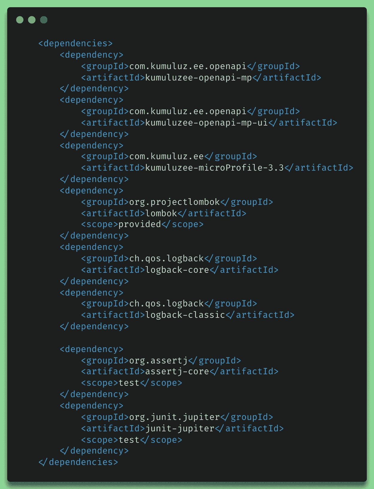******

******pom 依赖性******

******让我们简单讨论几个依赖项。当你阅读这篇文章时，请从头到尾阅读我们的 **pom.xml** 文件。这对于理解下面的解释很重要。******

****我们需要一个依赖包来使我们的应用程序工作。幸运的是，KumuluzEE 为我们提供了 **Microprofile** 库，其中包含启动这个应用程序的基本标准包。这些都包含在 KumuluzEE-Microprofile 库中。为了能够用我们需要的所有 **JWT** 参数配置我们的应用程序，我们必须向它添加一个 [**微配置文件**](https://projects.eclipse.org/projects/technology.microprofile) 库。同时，我们需要一个 **JSON 处理库**。这将是 [**约翰逊核心**](https://johnzon.apache.org/) 所做的事情。我们当然需要 KumuluzEE 的核心来工作。[**Jetty**](https://www.eclipse.org/jetty/)**是运行 **KumuluzEE** 框架的底层服务器。这就是为什么我们在依赖关系中需要它。考虑到我们需要 [**CDI**](https://weld.cdi-spec.org/) ，我们还需要一个支持它的库。为了启用我们的 **REST** 端点，我们需要 **KumuluzEE** 的 REST 库。为了获得我们的 API，我们需要一个 **Geronimo** 库。这将确保我们有一个[**JSR-374**](https://www.jcp.org/en/jsr/detail?id=374)**的实现可用。我们还需要解释我们的 **JWT** 和它的 **JSON** 格式的内容。********

****[**龙目**](https://projectlombok.org/) 本身并不真的需要。它让一切都变得美丽而闪亮！ [**日志回溯**](http://logback.qos.ch/setup.html) 也很重要，这样我们可以更好地解释日志并理解我们的结果。****

****现在让我们看看我们的 ***资源*** 文件夹。****

****首先，让我们先了解我们期望在这个文件夹中找到什么。我们需要用与 JWT、Logback 相关的东西来配置我们的应用程序，最后，我们需要说一些关于我们将要创建的 beans 的事情。****

****让我们看看最简单的文件。beans.xml 可以在 **META-INF** 中找到:****

****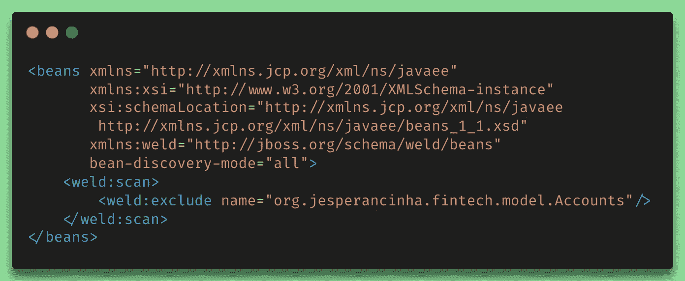****

****beans.xml****

****这只是一个典型的，你现在可能会想，有点旧的文件。此时，我们的想法只是让 KumuluzEE 运行起来。我们确实有一个 ***排除*** 动作。这告诉 **Weld** 在扫描**bean**动作时不要考虑类**账户**。这一点很重要，因为对于我们正在使用的实现， **Weld** 基本上会将每个具有空构造函数的类视为一个 bean。稍后我们将会看到为什么我们不希望**帐户**被认为是一个 bean。现在让我们记住，我们是在**请求**范围下发出请求的。这是合乎逻辑的，因为每个请求可以有不同的用户。****

****现在我们来看看“`**logback**`**”**是如何实现的。也可以在 **META-INF** 中找到:****

****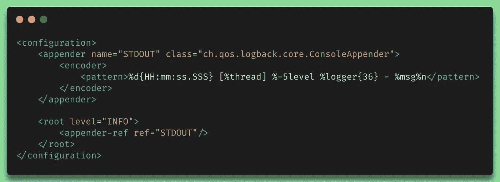****

******`**logback.xml**`******

********这只是我们日志的一个非常简单的配置。********

********最后，也许是我们应用程序中最重要的文件。这就是`**config-template**`。此时，需要注意的是，我在这个项目中创建的一些文件是模板结构的一部分。稍后我会对此进行更多的解释。这个模板文件应该被转换成一个 config.yml 文件，该文件将被 [**微文件**](https://projects.eclipse.org/projects/technology.microprofile) 读取。该文件位于资源的根目录下:********

******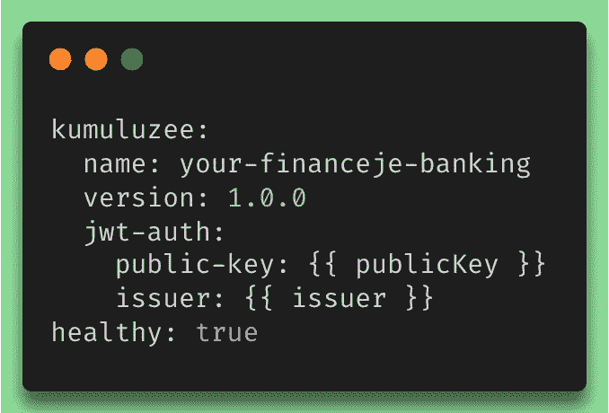******

********`**config-template**`********

********我们将在后面看到所有这些属性的确切含义。所有这些都是不言自明的。`**publicKey**` 和`**issuer**` 都是将被替换的参数。我们稍后将对此进行探讨。我们的 **bash** 脚本将确保它们被替换。********

********我们几乎准备好开始编码了，但是首先，让我们看看我们的 JWT 令牌结构。********

# ********5.实践代码********

********让我们做一个非常小的应用程序。这一部分将解释如何让我们的应用程序与 JWT 一起工作。我们想知道的是，我们是否可以指定用户访问我们的一些 **REST** 方法，而不是其他方法。********

********开始研究这段代码的方法之一是先看看我们的普通 JWT 令牌。以下是我们的管理示例:********

********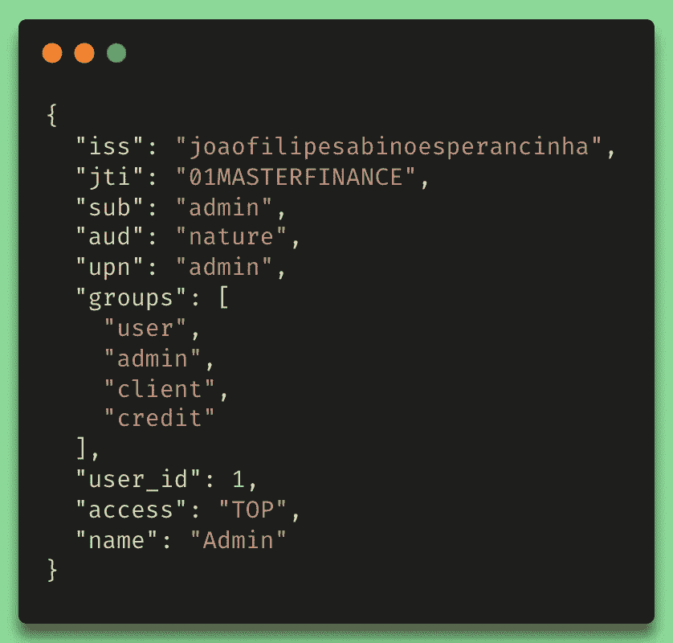********

**********`**jwt-token-admin.json**`**********

********我们的 **JSON** 中的每一个名字都被称为声明。在我们的示例中，我们看到一些**保留的**声明:********

*   **********`**iss**`**—这是令牌的发行者。我们可以为此任意选择一个值。该参数的值必须与我们之前看到的 **config.yml** 中要替换的**发行者**变量相匹配。************
*   ********`**jti**`**—这是令牌的唯一标识符。例如，我们可以使用这种声明来防止令牌被使用两次或更多次。**********
*   **********`**sub**`**—这是令牌的主题。可以是用户，也可以是我们喜欢的任何东西。重要的是要记住，这也可以用作标识符、键、命名或我们想要的任何东西。************
*   **********`**upn**`**—用户主体名称。这用于标识用户正在使用的主体。************
*   **********`**groups**`**—这是当前用户所属的组的数组。本质上，这将决定带有这个令牌的请求能做什么。************

********在我们的令牌中，我们接着看到一些**自定义**声明。我们可以像使用**保留的**声明一样使用它********

*   ********`**user_id**`**—我们将用它来设置用户 id。**********
*   **********`**access**`**—我们将确定用户的访问级别。************
*   **********`**name**`**—用户的名字。************

# ********6.实践代码********

********让我们回顾一下到目前为止我们所知道的。我们知道我们将与具有我们已经确定的结构的令牌进行通信。此外，我们已经设置了应用程序的配置，即`**logback**`配置，最后，我们为企业 bean 查找设置了一个定制配置。********

******再来看套餐**型号**。在这里，我们将找到 3 个类。这些类基本上只是表示帐户的集合以及客户和帐户之间的表示。这样我们可以从看类***Client.java***开始:******

******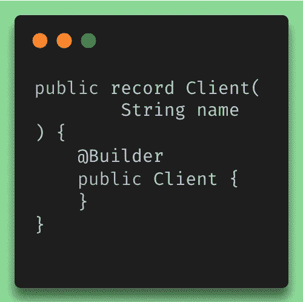******

********Client.java********

******第一个模型类是我们客户的代表。我们的委托人只有一个名字。这是由`**jwt**`**属性**名称表示的用户名。**********

******再进一步，我们有***Account.java***:******

******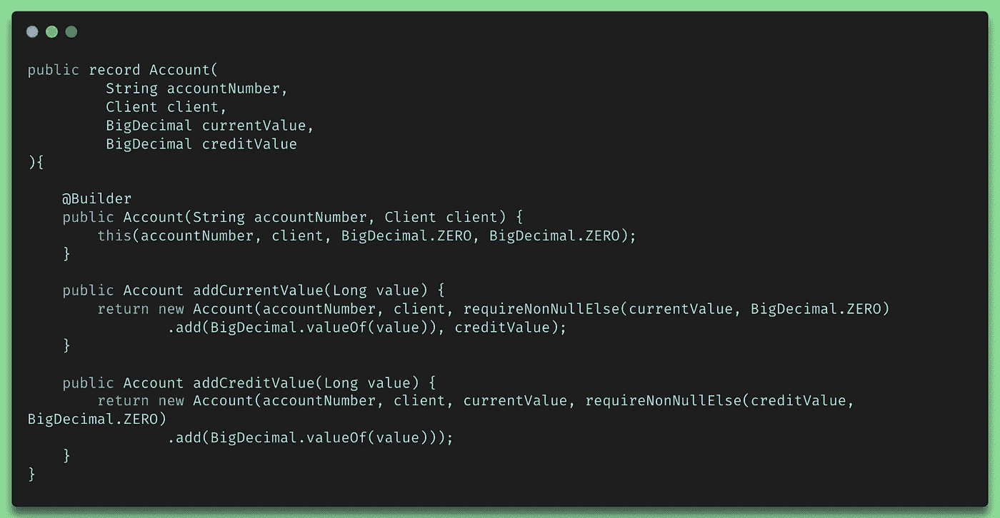******

********Account.java********

******在这个班里，我们基本上设置了一个`***accountNumber***`，一个`***client***`，一个`***currentValue***` ，最后一个`***creditValue***`。请注意，我们将所有值默认为 0。我们也在用 ***BigDecimal*** ，纯粹是因为我们在和钱打交道。钱必须准确，不能遭受系统四舍五入或四舍五入。换句话说，举例来说，这意味着像**0.000000000000000000000000000000000000001**这样的数字必须始终保持该数字。此外，我们希望为我们的客户增值。这就是方法`***addCurrentValue***`存在的地方。出于同样的原因，我们也会用`***addCreditValue***` *来充值。*******

******最后，在我们的数据设置的最后一部分，我们遇到了类*:*******

*******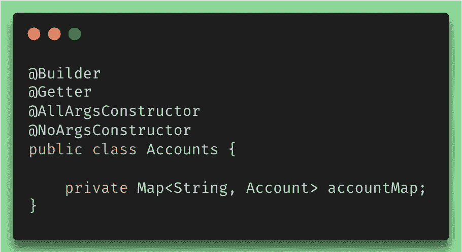*******

*********Accounts.java*********

*******这实际上只是我们所有账户的集合。我们将使用它的 **map** 内容来模拟数据库的行为。*******

*******现在我们来看看 ***控制器*** 包。这是我们创建运行数据模型的应用程序的地方。首先，我们来看看类 ***BankApplication*** :*******

*******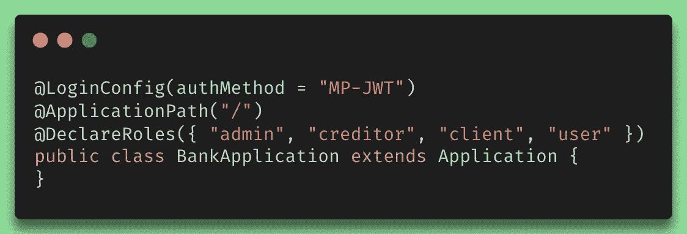*******

*********BankApplication.java*********

*******就此，我们要说三件重要的事情。使用 ***LoginConfig*** 注释，我们根据**微文件**定义它来使用和理解 **JWT** 令牌。**T22【应用路径】T23**定义了应用的根。这是应用程序 URL 的起点。在我们的例子中，它将是[**HTTP://localhost:8080**](http://HTTP://localhost:8080)**。**最后， ***声明角色*** 定义了我们的应用程序将要使用和接受的角色。在这种情况下，角色和组是可以互换的术语。*******

*******为了使注入有效地工作，我们创建了一个特定的注释来标识帐户映射:*******

*******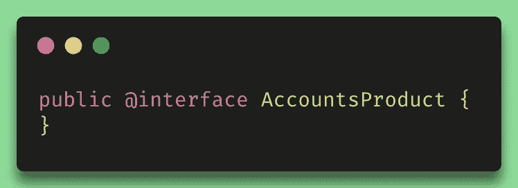*******

*********AccountsProduct.java*********

*******接下来，我们创建一个缓存对象工厂:*******

*******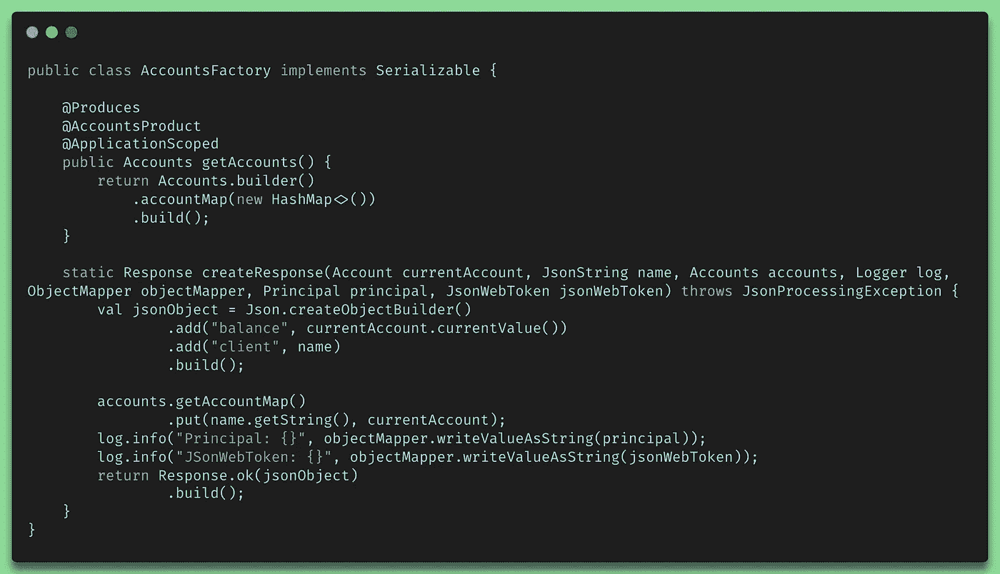*******

*********AccountsFactory.java*********

*******这个工厂是我们禁用查找的原因，专门针对***【Accounts.java】***。我们自己创建聚合器实例，而不是让查找过程创建 bean。使用 ***产生*** 注释，允许我们创建 bean。使用我们的自定义注释，***accounts product***，我们使这个 bean 的使用更加具体。最后，通过使用 ***应用范围*** ，我们将其范围定义为**应用范围**。换句话说，帐户聚合 bean 将在整个应用程序中表现为一个[单例](https://www.tutorialspoint.com/design_pattern/singleton_pattern.htm)对象。*******

*******“`***createResponse***`***”****只是一个创建 JSON 响应的通用方法。********

********我们现在需要的是两个`***Resources***`*。这与春季的`***Controllers***`*基本相同。这是一个不同的名字，但它有完全相同的用法。**********

*********让我们来看看 AccountsResource.java 的*班:**********

*********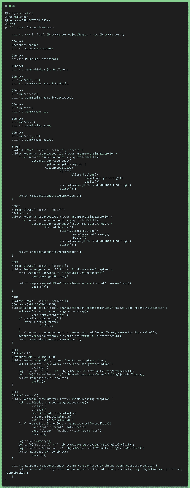*********

***********AccountsResource.java***********

*********花点时间更详细地看看这个类。 ***Path*** 注释定义了如何从根节点到达这个资源。记住我们使用的是“**/**作为词根。在这种情况下，“**accounts”***是我们对该资源的根访问点。我们所有的资源，在我们的例子中只有两个在运行，作用域为***request resource***。带注释**的*产生*的**确定对所有请求的所有响应，无论其类型如何，都将采用 **JSON** 格式化消息的形式。**********

********要注入我们的聚合器，我们只需使用 ***注入*** 注释和 ***帐户产品*** 注释的组合:********

********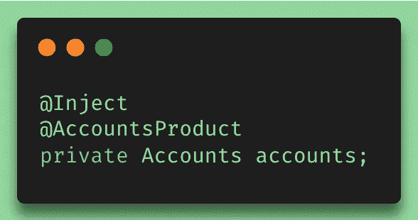********

**********账目注入**********

********这符合我们在工厂中定义的内容。********

********此外，我们还注入了两个重要的安全元素。一个`***principal***`和一个`***jsonWebToken***`:********

********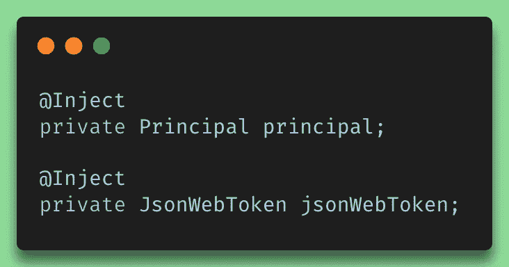********

**********委托人和 JsonWebToken**********

***********JsonWebToken*** 和 ***Principal*** 将是相同的，我们将在我们的日志中看到这一点。********

********在我们的资源中，我们总是可以从带有特定令牌的请求中注入声明:********

********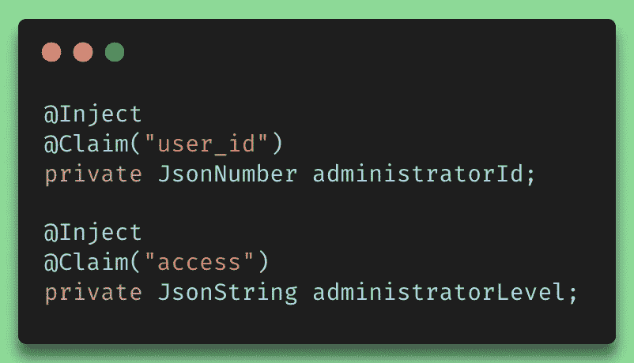********

********索赔注入********

********这是用 ***注入*** 和 ***声明*** 注释的组合来完成的。放置在 ***声明*** 注释下的名称定义了我们想要注入哪个声明。我们必须小心定义参数的类型。在我们的例子中，r 我们只需要 ***JsonString*** 和 ***JsonNumber*** 类型。********

********首先，让我们看看如何创建**帐户**和**用户**:********

********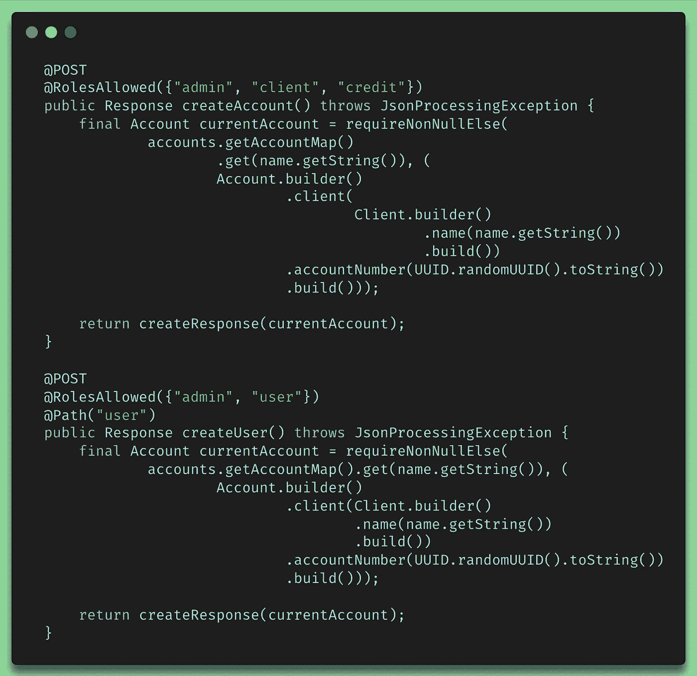********

**********创建账户和用户**********

********这里的目的是能够分离方法并给它们不同的权限。在我们的例子中，他们都只是创建一个帐户，但是需要注意的是，只有角色为`***user***`的用户才能使用`***createUser***`方法。同样，只有角色为`***client***` 和`***credit***`的用户才能访问方法`***createAccount***`。********

********现在让我们详细看看这个资源的 ***PUT*** request 方法:********

********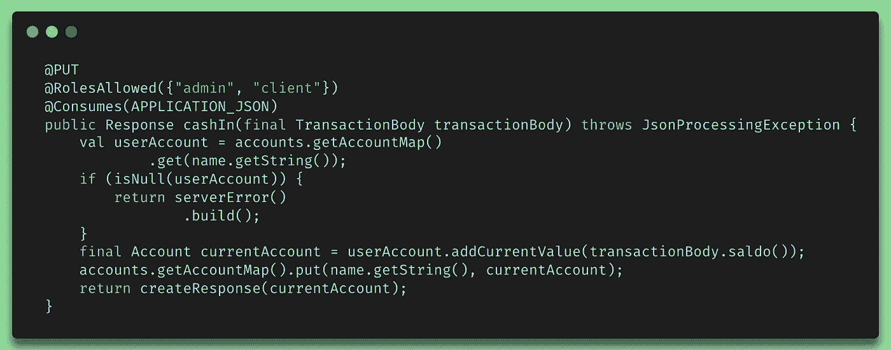********

**********兑现**********

********我们知道注释 ***PUT*** 表明这个方法只能被类型 **PUT** 的请求访问。注解 ***路径*** 然后告诉 **Jetty** 这个方法的路径是一个值。这也被称为**路径参数**。最后，我们可以定义这个方法只允许角色为`***admin***`或`***client***`的用户使用。然后通过使用 ***PathParam*** 将输入值传递给我们的 ***长值*** 变量。********

********如果我们不定义任何角色，那么任何拥有正确令牌的用户都可以访问这些方法。********

*********也是以同样的方式实现的:*********

*********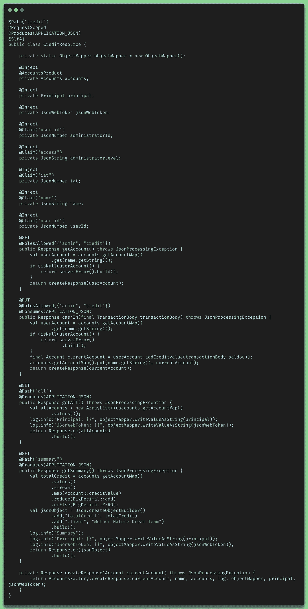*********

***********CreditResource.java***********

*********唯一不同的是，我们现在使用的是 ***admin*** 和**角色和 ***client*** 角色，而不是使用角色 ***admin*** 和 ***角色。另外，请注意，永远不会在此资源中创建用户帐户。这只能通过账户的`**resource**`来实现。**************

******现在我们知道了代码是如何实现的，让我们首先回顾一下我们在 **REST** 服务中提供了哪些方法。******

# ******7.应用程序使用******

******让我们检查正在使用的服务列表:******

********所有端点********

# ******8.生成测试环境******

******我在根文件夹中创建了一个 bash 文件。这个文件叫做`***setupCertificates.sh”***`。让我们深入了解一下它的功能:******

******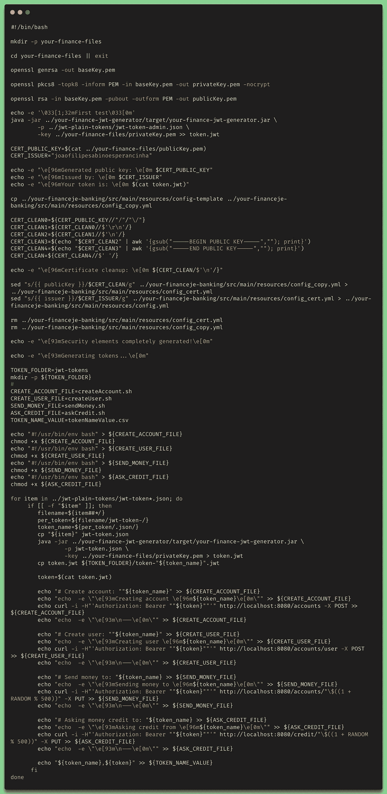******

********环境生成********

******请按照我解释的文件做。这一点很重要，这样我们才能确切地了解它在做什么。我们首先以 PEM 格式创建私钥和公钥。然后，我们将私钥用于我们的 runnable " `**your-finance-jwt-generator.jar**` **"。**这是我们的 runnable jar，允许快速创建令牌。发行人以后不能更改。最后，它创建一个令牌。稍后我们将看到如何读取这个令牌。该令牌包含 3 个额外的**标头**声明。这些是“`***kid***`*`***typ***`***”***`***alg***`*。它遵循以下格式:********

*******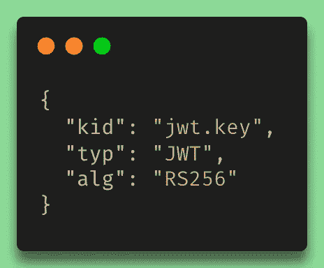*******

*********JWT 的页眉*********

*******让我们更仔细地看看这些说法*******

*   ********`***kid***`***——****W*works 作为提示认领。它表明我们正在使用哪种算法。********
*   *******`***typ***`***——***用于声明 [IANA 媒体类型](https://tools.ietf.org/html/rfc7519#ref-IANA.MediaTypes)。有三个选项**JWT**(JSON Web token)**JWE**(JSON Web 加密) **JWA** (JSON Web 算法)。这些类型与我们的实验无关。我们只会看到我们的令牌没有被很好地加密，并且很容易被解密。我们还将看到，虽然我们可以解密令牌，但我们不能轻易篡改来执行其他操作。*******
*   *********"***`***alg***`***"***—这就是我们如何定义我们想要使用的签名类型。签名可以被认为是一种加密操作，它将确保原始令牌没有被更改并且是可信的。在我们的例子中，我们使用 **RS256** 或者称为 **RSA 签名和 SHA-256。********

******有了我们的**公共**密钥，我们终于可以用它来改变我们的模板了。新的 **config.yml** 文件应该如下所示:******

************

********config.yml********

******第二步是创建四个文件。对于目录“`***jwt-plain-tokens***`***”***中的每个普通令牌，我们将创建四个命令。第一个命令是创建可以有效地使用其帐户进行操作的用户。这些用户具有配置文件“`***admin”***`”、“`***client”***`”和“`***credit”***`”、“T34”。让我们运行文件`***createAccount.sh***`*，以便创建它们。第二个命令将创建尚未拥有任何权限的其余用户。这是文件`***createUser.sh***`*。让我们运行它。现在我们将看到所有用户最终都被创建了。现在让我们来看看关于事务的细节，并看看剩下的两个命令。一个给“`**cashin**`”**”**，另一个要更多积分。第一个生成的文件是“`***sendMoney.sh***`***”***bash 脚本。在这里我们可以找到所有对`**cashin**` **的请求。**在这个文件中，您会发现一个 curl 请求，向每个用户发送随机的货币数量。让我们看看**管理**案例:********

************

********sendMoney.sh 摘录********

******同样的用户也有分配给他们的信用请求:******

************

********askCredit.sh 摘录********

******所有我们的角色都是自然联盟的一部分。本质上只是一些人成为这个银行系统的一部分。在这种情况下，他们是在保护环境。这群人做了什么或者他们在故事中的位置与文章并不相关，但就上下文而言，他们参与了保护环境和减缓气候变化影响的行动。我们的一些角色可以做任何事情，一些不能做任何事情，还有一些只能做“T0”或者只是“T1”。还要注意，我正在用 ***混淆*** 敏感信息。这些令牌通常不应被共享或在特定的 **URL** 中可见。是的，它们总是可以通过浏览器开发者控制台获得，但无论如何是为了保护一些正在进行的请求。这是一个被称为“`**security-per-obscurity**`**”**的概念，虽然它在技术上不能阻止用户意识到令牌正在被使用，但它确实起到了**威慑**的作用。******

******在这两种方法中，当我们存款或申请信贷时，请注意，对于每个请求，我们发送的是 1 到 500 之间的随机数。******

******我们现在差不多准备好开始我们的应用程序了，但是首先，让我们深入一点理论。******

# ******9.JWT 代币是如何制作的******

******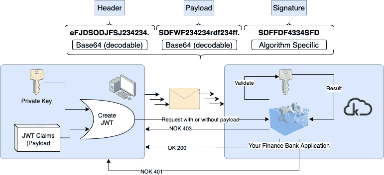******

******JWT 令牌生成概述******

******现在我们已经生成了令牌，让我们来看看其中的一个。我将向你们展示一个模糊的令牌，我们将用它来理解这个。******

******这是我们的信物:******

```
******FAKETOKENFAKETOKENFAKETOKENFAKETOKENFAKETOKENFAKETOKENFAKE**.FAKETOKENFAKETOKENFAKETOKENFAKETOKENFAKETOKENFAKETOKENFAKETOKENFAKETOKENFAKETOKENFAKETOKENFAKETOKENFAKETOKENFAKETOKENFAKETOKENFAKETOKENFAKETOKENFAKETOKENFAKETOKENFAKETOKENFAKETOKENFAKETOKENFAKETOKENFAKETOKENFAKETOKENFAKETOKENFAKETOKENFAKETOKENFAKETOKENFAKETOKENFAKETOKENFAKETOKENFAKETOKENFAKETOKENFAKETOKENFAKETOKENFAKETOKENFAKETOKENFAKETO.**FAKETOKENFAKETOKENFAKETOKENFAKETOKENFAKETOKENFAKETOKENFAKETOKENFAKETOKENFAKETOKENFAKETOKENFAKETOKENFAKETOKENFAKETOKENFAKETOKENFAKETOKENFAKETOKENFAKETOKENFAKETOKENFAKETOKENFAKETOKENFAKETOKENFAKETOKENFAKETOKENFAKETOKENFAKETOKENFAKETOKENFAKETOKENFAKETOKENFAKETOKENFAKETOKENFAKETOKENFAKETOKENFAKETOKENFAKETOKENFAKETOKENFAKETOKENFAKETOKENFAKETOKEN******
```

******这里需要注意的是，我们的令牌分为三个部分。******

*   ********头** —这是一个 Base64 编码的 **JSON** 配置头，就像我们上面讨论的一样。******
*   ********有效载荷** —这是一个 Base64 编码的 **JSON** 有效载荷。这是我们定义**保留**和**自定义**声明的地方。我们还可以在这里定义**私有**和**公共**声明。它们都属于海关索赔。简单地说，我们可以对这两个声明做我们想做的事情。然而，公共声明是指在 [IANA JSON Web 令牌注册中心](https://www.iana.org/assignments/jwt/jwt.xhtml)中定义的声明。为了避免与注册中心冲突，我们以某种方式命名我们的令牌是很重要的。**公开的**权利要求也可以被定义为标准可选的。私人声明没有标准，由我们来定义。******
*   ******签名——这是我们可以有点创意的地方。签名是**报头**和**有效载荷**的加密组合。我们决定我们想要使用的算法，令牌的这一位将基本上决定我们发送的消息是否可信。该组合是唯一的，我们的服务器将使用我们创建的“`**public-key”**`”来确定我们是否匹配。如果你还记得上面的话，我们在例子中使用的是 **RS256** 。******

******在我们继续之前，请注意，在我们的示例中，**报头**和**有效载荷**都可以解耦。我们只是“`**can’t**`”篡改有效载荷或报头，并仍然使其可信。针对恶意令牌的潜在影响的保护只能由我们选择的算法来保护。所以要明智选择。******

******如果你在一个关注绝密信息的组织工作，比如银行，请**不要**做我们将要做的事情。这只是我们在线检查本地生成的令牌内容的一种方式。******

******首先，让我们去[https://jwt.io/](https://jwt.io/)并填写我们的 **JWT 令牌**。使用您刚刚生成的令牌。******

******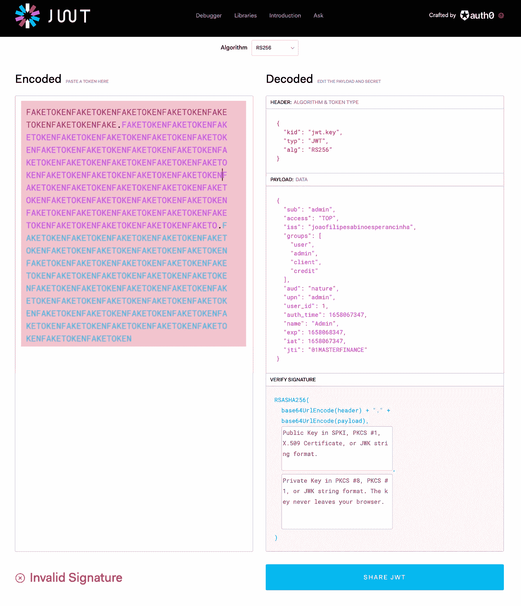******

********使用**【https://jwt.io/】****来检查我们令牌的内容**********

********让我们检查一下这里有什么。这是我们的管理员令牌。在我们的例子中，那个人是“`**Admin”**`”。我们可以看到我们的参数都是可用的。在我们的列表中我们看到“`***sub***`*`***aud***`*`***upn***`*`***access***`***`***user_id***`****`***iss***`*`***name***`****”我们也有一些额外的索赔。让我们来看看它们:*****************

*********`**auth_time**`**—这是认证已经发生的时间。我们的令牌已于 2022 年 7 月 17 日星期日 16:15:47 [GMT+02:00](https://www.epochconverter.com/timezones?q=1658067347) DST 通过认证***********

*************`**iat**`**—这是创建令牌的时间。在我们的例子中，这与 **auth_time** 同时发生。***************

*********"**`**exp**`**"**-这是令牌的到期日期。它将于 2022 年 7 月 17 日星期日 16:32:27 [GMT+02:00](https://www.epochconverter.com/timezones?q=1658068347) DST 到期。我们没有在令牌中指定任何到期日期。这意味着 JWT 使用默认值约 15 分钟。*******

*******现在让我们进行一些测试。*******

# *********10。运行应用程序*********

*******T he 代码准备好在 [GitHub](https://github.com/jesperancinha/your-finance-je) 上使用。如果我们签出代码并用 Intellij 打开它，我们需要意识到我们不能像运行[**Spring Boot**](https://spring.io/projects/spring-boot)**应用程序一样运行这个应用程序。没有`**psvm”**` 让它运行。相反，我们可以直接运行生成的 jar，并确保在之前生成一个"`**mvn build”**`。以下是我目前使用它的方式:*********

*******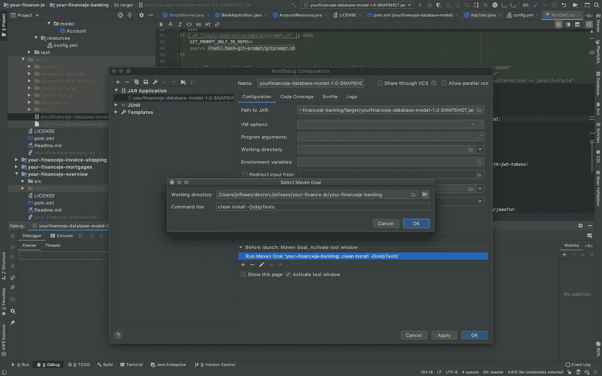*******

*********运行应用程序的环境设置*********

*******现在让我们再次运行“`***setupCertificates.sh”***`脚本。我不知道你花了多少时间来到这里，但很可能 15 分钟已经过去了。以防万一，再运行一次。*******

*******开始我们的 app 吧！*******

*******我们可以这样开始:*******

```
*****$ mvn clean install
$ java -jar your-financeje-banking/target/your-financeje-banking.jar*****
```

*******或者，我们可以通过现成的运行配置来运行它。如果你想了解它所做的一切，事先检查一下 [repo](https://github.com/jesperancinha/your-finance-je) 和 **Makefile** :*******

```
*****$ make dcup-full-action*****
```

*******这个脚本将运行两个服务。一个在端口 **8080** 上，另一个在端口 **8081** 上。在端口 **8080** 上，我们将运行该软件的一个版本**，运行我们自己的代码来生成 JWT 令牌**。在端口 8081 上，我们将使用由 [**Adam Bien**](https://github.com/AdamBien) 创建的 [**jwtknizr**](https://github.com/AdamBien/jwtenizr) 生成器运行一个版本。然而，我们将把本文的重点放在运行在端口 8080 上的服务上。如果您愿意，也可以使用以下工具运行 cypress:*******

```
*****$ make cypress-open*****
```

*******这将打开 cypress 控制台，您将能够使用您选择的浏览器运行测试。然而，现阶段浏览器选项仍然有限。大多数请求实际上是 cypress 提供的命令行请求。*******

*******就目前而言，我们先不要进入`**cypress**`**。请转到您的浏览器，前往以下位置:*********

```
*******[http://localhost:8080/accounts/all](http://localhost:8080/accounts/all)*******
```

*********我们应该会得到这样的结果:*********

******************

***********运行一次** `**askCredit.sh”**` **和** `**sendMoney.sh”**` **脚本**后，完成 JSON 结果*********

*********正如我们所见，`**Malory**`**`**Jack Fallout**`**`**Jitska**`**没有任何信用或金钱。这是因为他们只被赋予了 ***用户*** 组。还要注意的是，Shikka 没有得到积分。“`**Shikka**` **”，**是我们唯一没有集团 ***信用*** 的客户。***************

*******如果我们查看日志，我们可以看到成功的操作采用以下格式:*******

```
*****Sending money to admin
HTTP/1.1 200 OK
Date: Sun, 17 Jul 2022 15:01:13 GMT
X-Powered-By: KumuluzEE/4.1.0
Content-Type: application/json
Content-Length: 32
Server: Jetty(10.0.9){"balance":212,"client":"Admin"}*****
```

*******一个 **200** 让我们知道手术成功了。*******

*******在“`**Malory**`**”**“`**Jack Fallout**`**”**”和“`**Jitska**`**”**的情况下，两个操作都失败，然后我们会得到这样的消息:*******

```
*****Sending money to jitska
HTTP/1.1 403 Forbidden
X-Powered-By: KumuluzEE/4.1.0
Content-Length: 0
Server: Jetty(10.0.9)*****
```

*******一个 **403** 让我们知道我们的 **JWT 令牌已经被验证**并且是可信的。然而，用户**被禁止执行该操作。**换句话说，他们无权访问指定的方法。*******

*******让我们稍微改变一下我们的代币。如果我们改变 ***sendMoney.sh*** 文件的一些令牌。我们应该得到这个:*******

```
*****Sending money to admin
HTTP/1.1 401 Unauthorized
X-Powered-By: KumuluzEE/4.1.0
WWW-Authenticate: Bearer realm="MP-JWT"
Content-Length: 0
Server: Jetty(10.0.9)*****
```

*******这个 **401** 意味着我们的令牌没有被验证。这意味着服务器用来检查我们的令牌是否可信的公钥没有找到匹配。如果公钥不能评估和验证 **JWT** 令牌的签名，那么它将拒绝它。*******

*******概括地说，报头和“`**Payload**`”**”**没有加密。他们只是基数 64 "`**encoded**`**。这意味着“`**Decoding**`**”**可以让我们一直窥视里面的有效载荷到底是什么。如果我们希望保护我们的有效负载不被窃听，我们就不应该使用令牌的“`**Payload**`**”**来做其他事情，而应该选择标识参数。当有人得到了 **JWT** 令牌时，问题就来了，例如，当 **TLS** 隧道已经被攻破，有人能够读取交换消息的内容。当这种情况发生时，还有另一种保护措施。这是签名。唯一能够验证消息进入的是包含**公共**密钥的服务器。这个**公共**密钥，虽然**公共**，但是只允许通过运行**签名**和`**Header + Payload**`来验证传入的消息。*********

# *******11。结论*******

*******我们已经到了会议的尾声。感谢您的关注。*******

*******我们可以看到 **JWT** 标记是如何紧凑的，并且比它们的 XML 对应物 **SAML** 标记要少得多。我们已经看到创建和使用令牌来获得某些方法所需的某些**授权**是多么容易，以及我们如何通过一个**签名的**令牌来获得授权。*******

*******然而，我发现了解一下 JWT 是如何运作的非常重要。希望我已经很好地向你介绍了 JWT 令牌是如何工作的。*******

*******为了更好地理解所有这些是如何工作的，我建议您尝试一下已经实现的 cypress 测试。这是一个很好的方式，可以看到请求是如何发出的，我们正在测试什么，以及我们期望什么。然后，您还会更好地理解为什么有些用户可以执行某些操作，而有些用户不能。*******

*******我已经把这个应用程序的所有源代码放到了 [**GitHub**](https://github.com/jesperancinha/your-finance-je) 上*******

*******我希望你能像我喜欢写这篇文章一样喜欢它。*******

*******我很想听听你的想法，所以请在下面留下你的评论。*******

*******感谢您的阅读！*******

# *******12.参考*******

*******[](https://auth0.com/docs/tokens/concepts/jwt-claims) [## JSON Web 令牌声明

### JSON Web Token (JWT)声明是关于主题的信息片段。例如，一个 ID 令牌(它是…

auth0.com](https://auth0.com/docs/tokens/concepts/jwt-claims) [](https://blog.kumuluz.com/product/developers/2017/05/03/microservices-with-java-ee-and-kumuluzee-updated.html) [## 使用 Java EE 和 KumuluzEE 开发微服务—更新

### 本文通过 KumuluzEE 探索了微服务与 Java EE 一起使用的方式。它扩展了…

blog.kumuluz.com](https://blog.kumuluz.com/product/developers/2017/05/03/microservices-with-java-ee-and-kumuluzee-updated.html) [](https://ee.kumuluz.com/) [## 库穆卢泽

### 什么是 KumuluzEE KumuluzEE 是一个使用标准 Java 开发微服务的轻量级框架，Java EE /…

ee.kumuluz.com](https://ee.kumuluz.com/) [](https://dzone.com/refcardz/rest-api-security-1?chapter=1) [## REST API 安全性— DZone — Refcardz

### 应用程序编程接口(API)是一组明确定义的不同应用程序之间的通信方法

dzone.com](https://dzone.com/refcardz/rest-api-security-1?chapter=1) [](https://dzone.com/articles/restful-api-security?fromrel=true) [## RESTful API 安全性— DZone 集成

### 这篇文章是新的 DZone 集成指南:API 设计和管理中的特色。获取更多免费副本…

dzone.com](https://dzone.com/articles/restful-api-security?fromrel=true) [](https://developer.okta.com/blog/2018/10/31/jwts-with-java) [## 教程:用 Java 创建和验证 jwt

### 本文探讨了 Java 应用程序使用 jwt 进行令牌认证的好处。

developer.okta.com](https://developer.okta.com/blog/2018/10/31/jwts-with-java) [](https://github.com/oktadeveloper/okta-java-jwt-example) [## okta developer/okta-Java-jwt-example

### 带有 Java 的 JSON Web 令牌。通过在…上创建帐户，为 oktadeveloper/okta-Java-jwt-example 开发做出贡献

github.com](https://github.com/oktadeveloper/okta-java-jwt-example)  [## Spring Boot CLI

### 一旦安装了 CLI，就可以通过在命令行键入 spring 并按 Enter 来运行它。如果你跑…

docs.spring.io](https://docs.spring.io/spring-boot/docs/current/reference/html/spring-boot-cli.html) [](https://blog.payara.fish/java-ee-security-api-jsr-375/soteria-with-jwt-tokens) [## 带有 JWT 令牌的 Java EE 安全 API(JSR 375/索特里亚)

### Java EE 安全 API 1.0 是 Java EE 8 的一个新规范，旨在弥补传统上……

博客. payara.fish](https://blog.payara.fish/java-ee-security-api-jsr-375/soteria-with-jwt-tokens) [](https://github.com/payara/Payara-Examples/tree/master/javaee/security-jwt-example) [## Payara/Payara-示例

### 展示 JWT 与 Java EE Security 1.0 (Soteria RI)集成的示例代码库…

github.com](https://github.com/payara/Payara-Examples/tree/master/javaee/security-jwt-example) [](https://antoniogoncalves.org/2016/10/03/securing-jax-rs-endpoints-with-jwt/) [## 保护 JAX-RS 与 JWT 的端点

### 在这篇博文中，我将向您展示如何使用 JJWT 库发布和验证带有 JAX-RS 端点的 JSon Web 令牌…

antoniogoncalves.org](https://antoniogoncalves.org/2016/10/03/securing-jax-rs-endpoints-with-jwt/) [](https://gchq.github.io/CyberChef/) [## 网络咖啡馆

### 网络瑞士军刀——一个用于加密、编码、压缩和数据分析的网络应用

gchq.github.io](https://gchq.github.io/CyberChef/) [](https://projects.eclipse.org/projects/technology.microprofile) [## Eclipse 微文件

### 许多创新的“微服务”企业 Java 环境和框架已经存在于 Java 生态系统中。这些…

projects.eclipse.org](https://projects.eclipse.org/projects/technology.microprofile)*******