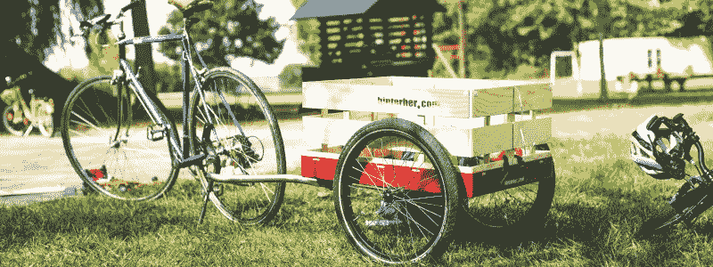

# 从 Heroku 迁移到 kubernetes 集群后的经验教训

> 原文：<https://itnext.io/lessons-learned-after-migrating-from-heroku-to-a-kubernetes-cluster-463f3a0d1274?source=collection_archive---------1----------------------->

马库斯·斯皮斯克在 Unsplash 上拍摄的照片

当我到达我的新工作场所时，我被赋予的部分任务是将我们的 rails 主机从 Heroku 服务完全迁移到 kubernetes 解决方案。这是我第一次迁移生产栈，也是我第一次使用 kubernetes。以防你认为这个任务还不够艰巨，在我到达几个星期后，前唯一的开发者决定离开去寻找另一个机会。这一离开很快被遗忘，因为该公司雇佣了另一名已经将应用程序转移到 kubernetes 的开发人员。所以我上了一堂 udemy 的课，通读了 kubernetes 文档，做了笔记，还摆弄了一个玩具集群。然后我开始了转型之旅。

六个月后，Heroku-Kubernetes 的转变已经结束。我获得了很多经验。我觉得是时候分享了。

# 堆栈

我们公司的旗舰产品是一种智能灯，它可以检测老年人的运动和活动，并在他们摔倒时发出警报。它主要用于法国的养老院，但我们在白银经济领域获得了相当多的关注，我们即将在全球范围内推广，并向特许经销商销售我们的产品及其网络基础设施。这就是 Kubernetes 作为一个方便的解决方案的地方，因为它允许快速复制和扩展单个堆栈。

因此堆栈包含在 MQTT 代理中(由 CloudMQTT 托管),它接收由智能灯及其附件发送的消息。然后，sidekiq 工作器不断轮询代理，以获取消息并根据内容采取行动:发送警报、监控活动或只是记录温度等等。rails web 应用程序负责管理界面和一些移动应用程序使用的 API 端点。其他连接的服务包括用于数据的 Heroku Postgres，作为 Sidekiq 后端的 Redis，用于索引和搜索记录的 MQTT 有效负载的 Elasticsearch，用于跟踪 rails 日志的 logentries，用于警报的 Sendgrid 和用于电子邮件的 send grid。

所有这些服务都是从 Heroku 应用程序控制台以 Saas 的形式订阅的。

# 我做对了什么

## 我要求时间

在这种背景下，这是我做的第一件事。该公司希望快速迁移，但我说我必须了解堆栈，熟悉代码库并解决一些问题，然后才能很好地理解这种迁移意味着什么。他们同意了，给了我几个月的过渡期。

我只能想象在对应用程序了解有限的情况下承担这样的任务会有多痛苦。

## 我请求帮助

我以前的 devops-ish 经验仅限于编辑我的 Capistrano 配置和维护一些 VP。在我的新工作场所发布一个新的更新，仅仅是输入“git push heroku master ”,然后可能在服务器上运行一个迁移。调整堆栈包括添加或删除 dyno，以及更改 Saas 计费计划以获得更多资源。

当我开始观察 Kubernetes 的架构方式时，我很快意识到我需要一个顾问的帮助来指导我，并建议我如何构建新的堆栈，并在无数可用的配置选项上做出明智的决策。我非常感谢那个家伙，他碰巧非常友好和耐心。值得称赞。

## 我四处玩耍并做笔记

这很重要。我从零开始破坏和重建集群至少三次。每次，我都在维基上写下一些东西作为参考。而且每一次都改进了工作流程，收获了很多经验。

我删除了吊舱，服务，重新创建了它们，摆弄了 PVC，尝试了许多舵图…这给了我实践经验，让我在知道如何让事情工作之前崩溃几次。

## 我改进了生产流程

也许我应该说“他”，因为那是库本内特公司顾问的工作。

我们现在有了一个很好的、完全集成的 CI 流程，为生产、测试和试运行创建了 kubernetes 环境。它仍然需要改进，但我们现在几乎与' git push heroku master '持平。

# 我做错了什么

很多事情。以下是细节。

## 我浪费了时间来适应堆栈

当我将 Elasticsearch 引入堆栈时，我们的内存消耗急剧增加。所以我们决定寻找一个替代方案。Elasticsearch 不作为面向最终用户的功能使用。它由我们的售后服务部门和开发人员使用。所以我们决定搜索日志只需要 3 秒钟，而不是 300 毫秒，并且完全放弃了 elasticsearch。

我们错了。我不仅花了大量时间研究解决方案、调优索引、分区表、重构代码，而且最终也没有找到一个可行的替代方案，可供我的同事们日常使用。所以我决定暂时回到弹性研究来过渡，以后再做研究。这应该是我们从一开始就做的决定，因为为了每年节省几百美元，我们损失了大量的工时。

## 我增加了功能

当你得到一个新玩具时，你很想在任何情况下都尝试一下。

不要。

几个星期后，k8s 分支在很大程度上偏离了师父。同样，它可能会出现可怕的错误，而且在某种程度上确实如此，因为在一些客户解释说服务的某些部分没有按预期运行之后，我不得不在第二天做了一些实时补丁。

## 我修改了版本

嘿。Postgres 12 可用。让我们使用它。

也许升级你的数据库是个好主意。但是把这个留到以后，一旦尘埃落定。我确实遇到了一些与升级相关的问题。它们不是巨大的虫子。但它们本可以避免或推迟。

## 我一口气把所有东西都搬走了

我们决定让我们的集群完全独立，不再依赖 Saas，除了 Sentry 和 Sendgrid。所以我们选择了 Stolon 作为高可用性 Postgresql 数据库，VerneMQ 作为 MQTT 代理，bitnami helm charts 作为 Elasticsearch 和 Redis。

这很好。但这太难一蹴而就了。我有很多处理 Postgres 数据库的经验，Redis 还可以，但我对 elasticsearch 管理完全是个新手。在迁移当天，这是导致最多问题的服务器，我不得不重新索引 8000 万个日志数据库两次，以便在不使服务器崩溃的情况下得到正确的结果。

回过头来看，事情可能会变得非常糟糕。

我应该循序渐进:

*   首先是 rails 的 app，Redis 和 Postgres。这是我们堆栈的核心。对于第一遍来说，这已经足够了。修复错误，调整应用程序，让它在一两周内稳定下来。
*   第二，设置 Grafana。我对日志使用 Loki，所以它是日志条目的很好的替代品。
*   然后，引入 MQTT 代理。这很简单，因为你可以把信息从一个连接到另一个。那么这只是一个将设备指向新 URL 的例子。那是物联网开发团队的问题，不是我的。
*   最后，尝试使用日志子集进行 Elasticsearch。看它表现如何。然后逐步将其余部分迁移到新的基础设施中。

# TL；DR；你应该怎么做

不要太贪心，要谦虚一点，一点一点去尝试搬东西。试着让这个栈与 Heroku 栈开始时尽可能相似:相同的软件版本，相同的环境。只有这样，你才能升级软件，如果你想这样做。让连接的 Saas 保持运行，如果你想这样做的话，逐步将它们添加到你的堆栈中。但是要确保事先有一个合适的测试和试运行环境。