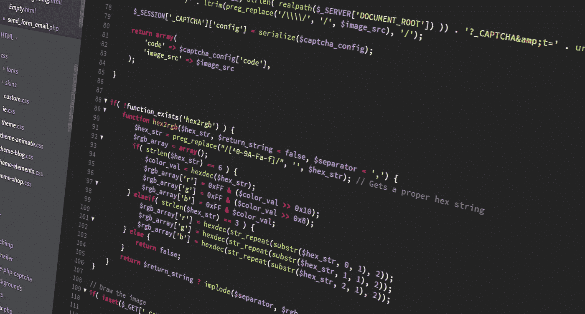

# 从大型软件迁移中吸取的教训&减少技术债务

> 原文：<https://itnext.io/lessons-learned-from-a-big-software-migration-reducing-technical-debt-220ab4bc1be6?source=collection_archive---------8----------------------->

## 我们如何在不破坏任何东西的情况下成功迁移我们的应用程序

软件工程中的重大迁移可能具有挑战性。我参与了将许多大公司日常使用的两年多的 Angular 4 应用程序迁移到最新的 Angular 7 的工作。首先，我将讨论您应该采取的相当一般的步骤，这些步骤不仅仅适用于角度迁移项目。然后，我将更详细地介绍我们是如何遵循这些步骤的。

但是进行这些迁移的原因是什么呢？那么“*永远不要改变正在运行的系统*”呢？虽然这不是不真实的，但我认为一个运行的系统可能是不够的。一个应用程序可能仍然工作，现有用户继续为它付费。另一方面，有几个理由反对停滞不前:

*   **你的竞争对手不会睡觉**:他们会改进，潜在客户可能会更喜欢仍在发展的产品。
*   **雇佣新人才对于任何雄心勃勃的公司来说都是必不可少的。过时的技术可能会让候选人失去兴趣。**
*   IT 安全是一个流行的话题。许多安全事故的发生是由于第三方库中的已知漏洞。多亏了开源社区，已知的安全漏洞通常在几天内就能得到修补。
*   快速移动和打破东西会变得更加困难。虽然你不应该打破东西，但是如果你的技术停滞不前，这可能会拖慢你的工作。例如，过时的技术可能会阻止你像竞争对手一样快速前进。
*   **过时的技术让开发者日子更难过**。流行的第三方库或重要的 bug 修复可能需要最新的框架。此外，如果你的框架版本严重过时，开发人员将会变得更懒去尝试新事物:“*嘿，Angular Universal 可以大幅度提高我们的性能！嗯，太糟糕了，我们还在 AngularJS 上，不能使用它*

你可能会问自己:“*那么，升级能有多难呢？只要运行 npm 更新什么的就好了，对吧？*”。现实情况是，许多技术迁移(不仅限于技术)失败了，或者花费的时间比预期的要长。迁移难以进行的一些可能原因:

*   **技术发生了巨大的变化**要求你改变很多东西，比如测试、依赖等等。
*   **缺少迁移指南或变更日志不足**会使您更难理解发生了什么变化以及需要采取什么措施来升级。
*   **目标不明确**。如果在迁移的同时创建新的建筑工地，迁移过程将会花费更长的时间，管理起来也会变得更加复杂。
*   **缺少关于所用技术堆栈的知识**使得更新变得更加复杂。

## 迁移的一般步骤是什么？

*   对于框架来说，当一个版本包含重大变更时，通常会有**更新指南**。
*   像用于 Java 项目的 Gradle 这样的构建工具，或者像用于 JavaScript 项目的 NPM 这样的包管理器，让开发人员更容易管理依赖关系。运行 [**npm 过时**](https://docs.npmjs.com/cli/outdated.html) 来查看哪些依赖项可以更新。尤其是第三方库可能已经被更新以支持最新版本的框架。在更新之前，我建议检查您的第三方库，看看它们是否真正支持您想要更新到的版本。
*   **检查变更日志中的重大变更**。为了让库的用户更容易发现，库作者通常会突出显示重大更改。
*   **自动化测试&持续集成**可以帮助你在发布之前发现问题。这包括做一个完整的生产就绪的 AOT 构建，以及运行单元测试和端到端测试。这减少了手动测试的需要，并允许您更加自信地发布代码。
*   **手动测试**仍然是应该发生的事情，即使自动化测试应该减少对它的需求。一些变化，如未测试的功能或风格差异，可能不会被构建或自动化测试所捕获。人工测试不仅应该由开发人员来完成，还应该由外部人员(例如 QA 人员)来完成，因为他们可以发现开发人员可能会忽略的问题。只有在自动化测试通过后，才应该进行手动测试。
*   **更新前的应用程序与更新后的应用程序的比较**允许您识别更新过程中发生变化的行为。
*   **改进的工具和更成熟的生态系统使得更新更容易**。强大的 CLI、官方文档、培训材料和活跃的用户群改善了开发人员的入职流程和体验。
*   **大爆炸式更新可能会有问题**。相反，你可以做一个尖峰:花一两天的时间来估计需要多少努力。
*   **不要让迁徙的树枝搁置太久**。因为其他人也可能会更改代码，所以迁移时间越长，解决合并冲突就越困难。
*   **不要将其他任务与您的迁移任务**混在一起。在做其他不相关的任务之前，专注于完成迁移。
*   **功能概述您的应用程序实际能做什么使测试更容易**。您不需要创建一个大文档:良好的测试覆盖率有助于识别您的应用程序的特性。

在下一部分，我想更多地关注我们是如何做这些事情的。

## 为了迁移，我们如何遵循这些步骤？

*   [**棱角分明更新指南**](https://update.angular.io/) 真是帮了大忙。它显示了更新 Angular 需要遵循的一般步骤。我们遵循了角度更新指南中的说明，其中包括基本步骤，也提到了突破性的变化。
*   **我们创建了一个图表**，更详细地展示了更新路径。我们尝试增量更新，而不是大规模更新。
*   **通过扫描我们第三方库的变更日志，我们** **提前发现了一些需要我们调整代码的重大变更**。一个例子是[Rx*JS*](https://rxjs-dev.firebaseapp.com/)*在版本 6 中引入了突破性的 API 变化。*
*   *看到哪些依赖关系已经过时或者根本不再需要，让我们看到没有依赖关系在 Angular 7 中不工作。尤其是第三方 Angular 库(例如 *ngx-bootstrap* )可能已经更新，以支持更高的 Angular 版本。幸运的是，在未来的 Angular 版本中没有不可用的依赖项。一些第三方库需要更新。这也是删除根本不用的第三方库或用更新的库替换它们的机会。*
*   *我们有一个**良好的单元测试和端到端测试覆盖**，这对确保我们不破坏功能有很大帮助。。*
*   *对于手工测试，我们**邀请其他开发人员以及客户支持人员参加我们的“QA 日”**。在几个小时的时间里，我们要求参与者浏览我们拥有的功能并寻找问题。通过这种方式，我们发现了一些可以快速修复的小错误。*
*   *在一些主要的改变之后，我们**比较了我们的当前版本和旧版本**以确保我们没有改变行为。此外，新旧版本的比较发现了一些容易解决的较小的风格问题。*
*   *在最新的 Angular CLI 中，通过使用 ng update ，更新过程变得更加简单。从 Angular CLI v6 开始，有一个相当好用的 CLI 命令叫做 [**ng update**](https://angular.io/cli/update) 可以用来更新你的应用及其依赖关系。与从角度 5 到角度 6 的跳跃相比，从角度 6 到角度 7 的跳跃在几分钟内完成。此外，Angular 现在支持定制 [webpack](https://webpack.js.org/) 配置，因此我们可以摆脱工作区。*
*   ***在 Angular 更新期间，我们注意到一些很好但不是强制性的改进**。我们没有创建更多的构建站点，而是将它们收集起来，集中精力首先以一种整洁的方式完成迁移。更新后，我们可以无忧无虑地处理这些改进，因为主要任务已经被处理了，这些改进更像是蛋糕上的冰。*
*   ***如果你确切知道要测试什么，测试起来会更容易**。多亏了一些良好的测试覆盖率、产品特性矩阵以及测试过程中每个人深厚的产品知识，我们确信不会遗漏应用程序的任何特性。*

## *结论*

*感谢阅读这篇文章。软件工程中的主要迁移可能具有挑战性，尤其是在成熟的软件项目中。然而，你不应该害怕做这样的改变。在开始迁移之前做一些研究和规划有助于降低失败的风险。请在评论中告诉我你的经历。*