# 让我们利用 Oracle 云基础架构加密无服务器自动化

> 原文：<https://itnext.io/lets-encrypt-automation-with-oracle-cloud-infrastructure-1ea5840a5be6?source=collection_archive---------2----------------------->

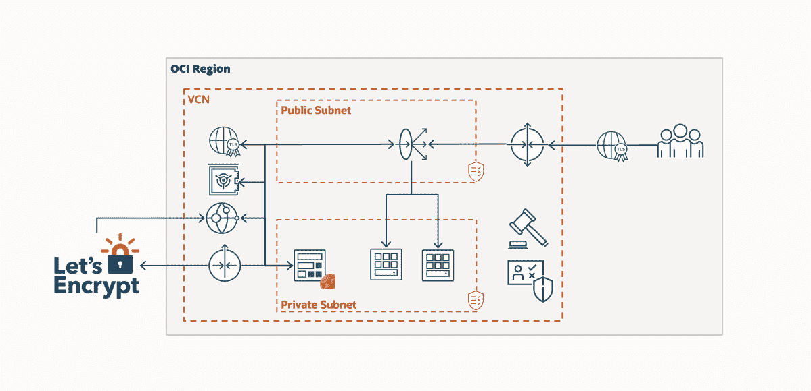

[让我们加密](https://letsencrypt.org/)在 2015 年末首次亮相。它是由[互联网安全研究小组提供的免费认证机构。](https://www.abetterinternet.org/)目标是支持采用 SSL / TLS 来确保通过公共互联网发送的信息的隐私性。Let's Encrypt 现在每天提供超过 250 万份证书。

如果你正在阅读这篇文章，很可能你以前已经处理过 SSL 证书。也有可能你们中的一些人已经调查了一次中断，却发现一个 SSL 证书在没有人知道的地方过期了。证书的发现、管理和续订可能会非常耗时，而且也没什么意思。

云提供商通过引入能够发布公共域验证(DV)证书的证书服务，使这项工作变得更加容易。Oracle 云基础设施(OCI)目前允许您创建私有证书颁发机构(CA)、私有证书和私有证书颁发机构包。专用证书资源用于保护专用网络上的通信，在专用网络上可以安装和信任证书以实现安全通信。

但是对于通过互联网连接的用户来说，公开签署的证书又如何呢？使用私有 OCI 证书将导致您的 web 浏览器出现“证书不可信”错误；这就是让我们加密的用武之地。我将向您展示如何在您的 OCI 租赁中运行完全自动化的无服务器 Let's Encrypt 解决方案，以安装并自动续订在您的 web 浏览器中显示为可信的证书。

# 它是如何工作的？

正确处理证书与在终端上启用 TLS 一样重要。证书和私钥应始终安全存储，只有授权用户和服务才能访问。我的解决方案使用 OCI 本地服务、[功能](https://www.oracle.com/au/cloud/cloud-native/functions/)、 [DNS](https://www.oracle.com/au/cloud/networking/dns/) 、[证书服务](https://www.oracle.com/au/security/cloud-security/ssl-tls-certificates/)和[保险库](https://docs.oracle.com/en-us/iaas/Content/KeyManagement/Concepts/keyoverview.htm)来执行与 Let's 加密和安全存储证书工件的交互。所有操作都在内存中执行，确保没有证书或密钥保存到磁盘存储中。

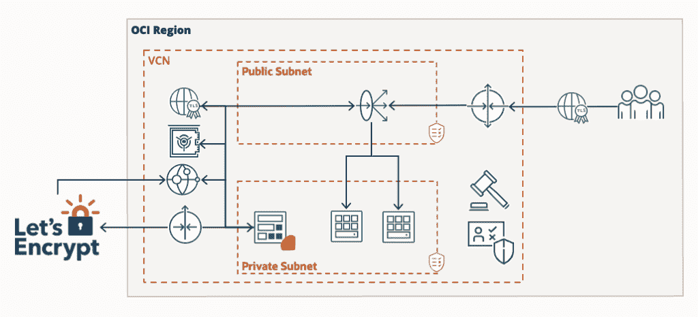

上图展示了我提出的解决方案的架构。它包括:

*   虚拟云网络、公共和私有子网、互联网和 NAT 网关
*   一个应用程序负载平衡器，带有一个或多个后端 web 服务器。
*   我创建了一个名为 let-encrypt 的自定义 Ruby 函数。
*   DNS 区域
*   虚拟仓库
*   证书服务

# 项目先决条件

在我们开始之前，您需要:

*   OCI 的租赁
*   具有公共/私有子网的虚拟云网络、互联网网关、NAT 网关
*   OCI DNS 上托管的 DNS 域。对于我的例子，我使用 dflect.me
*   具有一个或多个 web 服务器后端的应用程序负载平衡器。
*   足够的 IAM 权限，以便在您的租用中或在资源将要驻留的隔离专区中创建资源

如果你没有在 OCI 运行的现有 web 服务器，你可以按照这些说明安装 NGINX:[https://docs . Oracle . com/en/learn/Oracle-Linux-NGINX/index . html](https://docs.oracle.com/en/learn/oracle-linux-nginx/index.html)。您还需要配置一个负载平衡器来支持 NGINX 服务。

# 设置和配置

***注意:*** 下面的说明有一个更新，允许您提供多个证书。更新的说明可以在这里找到:[https://medium . com/@ scotti . Fletcher . 1/managing-multiple-lets-encrypt-certificates-with-Oracle-cloud-infra structure-470 eef 51630](https://medium.com/@scotti.fletcher.1/managing-multiple-lets-encrypt-certificates-with-oracle-cloud-infrastructure-470eef51630)

你还需要安装 [Docker](https://www.docker.com/) ，以及 [Fn 项目](https://fnproject.io/)。在 OSX，安装 Fn 项目很容易，因为有自制软件:

```
$ brew install fn
```

要将该功能推送到 OCI 容器库，您还需要一个 Auth Token，它可以通过选择您的用户并单击“Auth Tokens”在 OCI 身份中生成。

从 Github[https://github.com/scotti-fletcher/oci-letsencrypt](https://github.com/scotti-fletcher/oci-letsencrypt)下载函数源代码。一如既往，我建议在使用之前检查你从网上下载的任何源代码的安全问题。

现在我们将创建一个函数应用程序。应用程序只是函数的逻辑分组，在这个解决方案中，我只有一个名为“acme-certbot”的应用程序和一个名为“lets-encrypt”的函数。

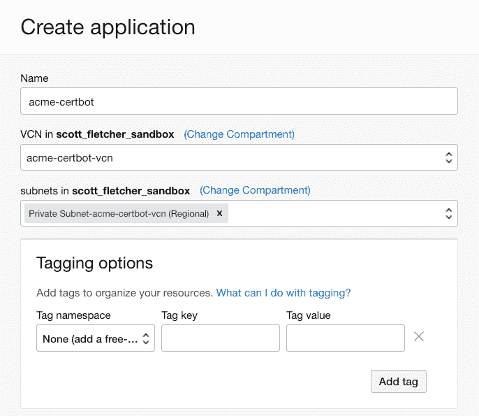

创建应用程序后，按照“本地设置”的“入门”说明进行操作。显示的说明将因您的 OCI 环境而异，但是我将解释这些步骤，因为本示例并不需要所有步骤。

在终端中，cd 进入包含函数文件的 let-encrypt 目录:

```
scott@scott-mac lets-encrypt % cd ~/Projects/oci-certbot/lets-encrypt
scott@scott-mac lets-encrypt % ls
Gemfile func.rb func.yaml models.rb
```

为此隔离专区创建一个上下文，并选择使用它。我的函数位于我的沙箱隔离舱中，名称如下所示:

```
$ fn create context scott_fletcher_sandbox --provider oracle 
$ fn use context scott_fletcher_sandbox
```

使用创建应用产品的隔离专区 OCID 和 Oracle Functions API URL 更新上下文。

```
$ fn update context oracle.compartment-id [your compartment ocid] 
$ fn update context api-url [https://functions.ap-sydney-1.oraclecloud.com](https://functions.ap-sydney-1.oraclecloud.com)
```

创建一个存储库，用于存储您的函数容器映像。

```
$ fn update context registry syd.ocir.io/[your namespace]/acme-certbot
```

登录 OCI 集装箱登记处。

```
$ docker login -u '[your namespace]/oracleidentitycloudservice/scott.fletcher@oracle.com' syd.ocir.io
```

您应该会看到“登录成功”的消息。现在，您可以构建和部署您的应用程序了。首次执行此操作可能需要几分钟时间:

```
scott@scott-mac lets-encrypt % fn deploy --app acme-certbot                                                                                                    
Deploying lets-encrypt to app: acme-certbot
Bumped to version 0.0.19
Using Container engine docker
Building image syd.ocir.io/abcd/acme-certbot/lets-encrypt:0.0.19 ......
Parts:  [syd.ocir.io abcd acme-certbot lets-encrypt:0.0.19]
Using Container engine docker to push
Pushing syd.ocir.io/abcd/acme-certbot/lets-encrypt:0.0.19 to docker registry...The push refers to repository [syd.ocir.io/abcd/acme-certbot/lets-encrypt]
d15aa7ac2cf0: Pushed 
f9a15c3fd1e8: Pushed 
111ae97432f0: Layer already exists 
fb57e582ca84: Layer already exists 
d55982f12cfa: Layer already exists 
04aab8128d11: Layer already exists 
05dc728e5e49: Layer already exists 
0.0.19: digest: sha256:d86dcf6889fa8fe3a036da8e17fbb7733c50369a158c1daf2649eaaf7d232c40 size: 1783
Updating function lets-encrypt using image syd.ocir.io/abcd/acme-certbot/lets-encrypt:0.0.19...
```

创建之后，您应该能够在 OCI 控制台的应用程序下以及容器注册表中看到该函数。

现在我们需要创建一个日志组来保存我们的函数特定的日志。创建一个日志组，我将我的命名为“cert-bot-logs”:

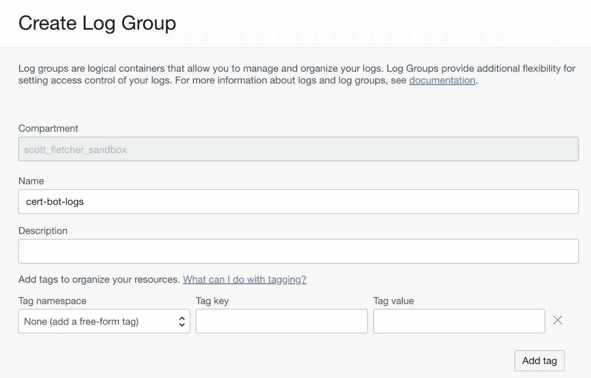

在日志中，点击“创建自定义日志”并将其命名为“cert-bot-activity”。

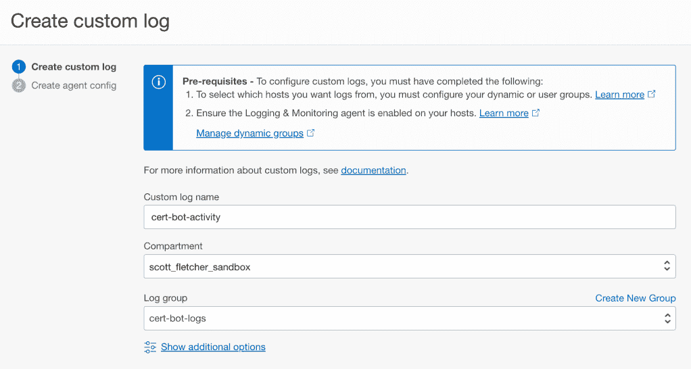

出现提示时，选择“稍后添加配置”，然后单击创建。您应该在“cert-bot-logs”中看到日志“cert-bot-activity”。记下 cert-bot 活动日志的 OCID，因为您稍后会需要它。

如果您在 OCI 保管库中还没有主加密密钥，则需要创建一个:

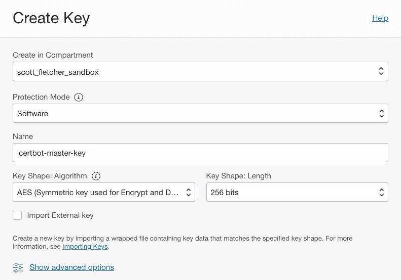

记下主加密密钥的 OCID，因为您稍后会需要它。

现在，我们将返回到我们的函数，并更新所需的配置项。配置项只是函数可以访问的环境变量:

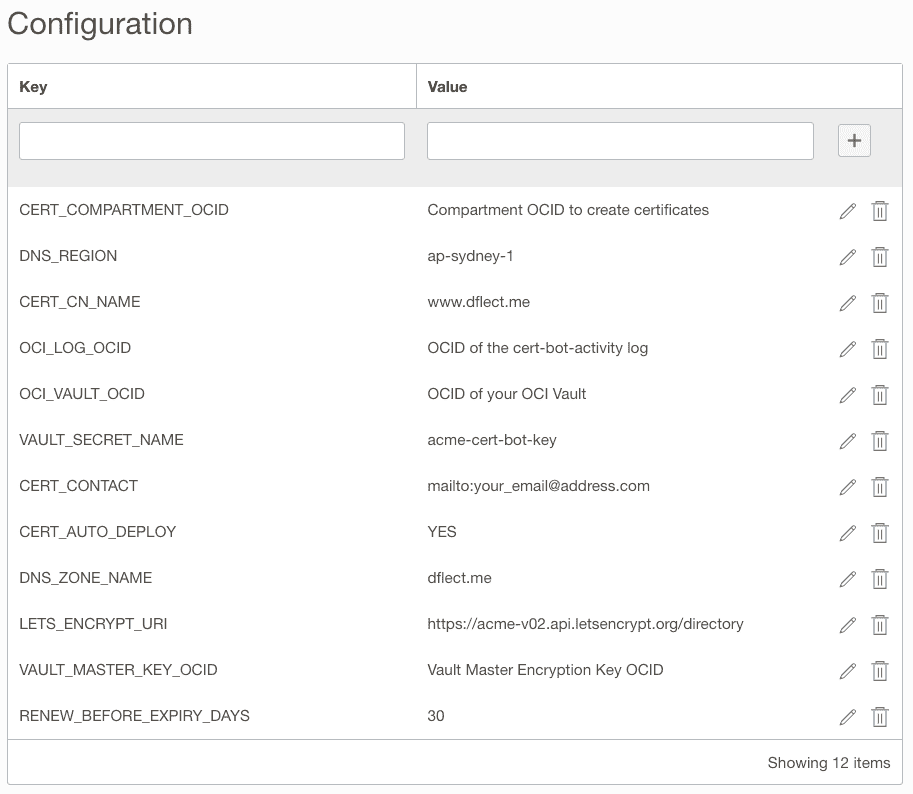

您需要配置以下项目:

*   CERT_COMPARTMENT_OCID:这是将创建证书的隔离舱。
*   DNS_REGION:这是配置 DNS 区域的区域。
*   CN_CERT_NAME:这是您希望由 Let's Encrypt 颁发的证书的通用名称。如上，我要颁发的证书是给 [www.dflect.me](https://www.dflect.me)
*   OCI 日志 OCID:这是你之前创建的证书机器人活动日志的 OCID。
*   OCI _ 保险库 _OCID:这是您的主加密密钥所在的保险库的 OCID。这也是我们将存储您的 Let's Encrypt 帐户私钥作为一个秘密。
*   VAULT_SECRET_NAME:这是保存您的 Let's Encrypt 帐户私钥的秘密名称。您可以使用“acme-cert-bot-key ”,或者根据需要更改它。
*   CERT_CONTACT:这是与将要颁发的证书相关联的电子邮件地址
*   CERT_AUTO_DEPLOY:在此输入“是”将使将来续订的证书成为证书服务中的“当前”版本，从而触发任何相关负载平衡器上的证书更新。
*   DNS 区域名称:这是您的 DNS 区域的名称。如上，我的名字叫做 dflect.me
*   让我们加密 URI:这是让我们加密 API 端点。
*   VAULT_MASTER_KEY_OCID:这是您要使用的或之前创建的主加密密钥的 OCID。
*   RENEW_BEFORE_EXPIRY_DAYS:这定义了在证书到期前多少天，您希望续订证书。我已选择在到期前 30 天更新我的证书。

您还需要为该功能配置超时和内存。内存应为 1024mb，超时时间应设置为 300 秒:


函数也会发出日志，为了调试的目的，查看它们是很有用的。要启用这些日志，请单击“启用日志”:

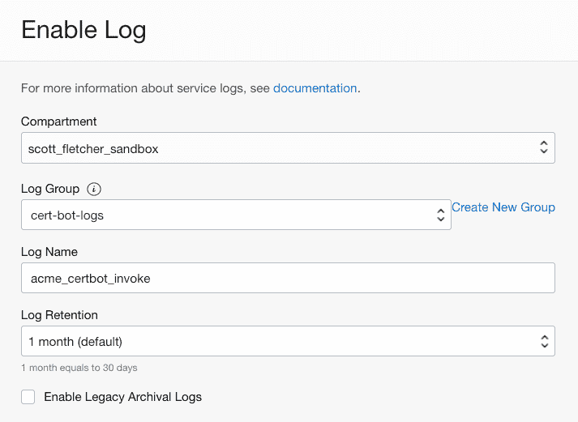

在测试我们的功能之前，我们需要创建一个动态组，以及允许我们的功能在我们的环境中运行的策略。根据您的使用情形以及您的保管库和 DNS 区域的位置，您可能需要调整策略。我下面的例子仅限于我的沙盒区间。

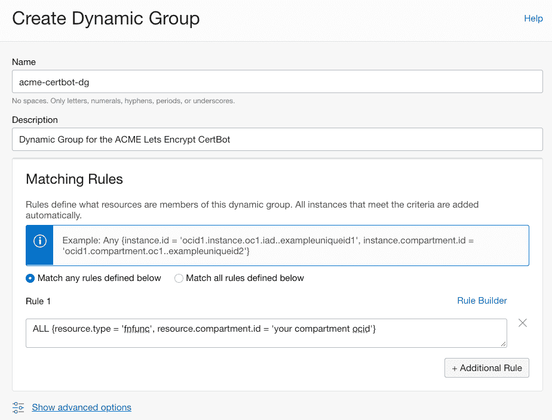

使用以下策略语句创建一个新策略。如果您选择了不同的动态组和隔离专区名称，则需要相应地更新策略声明:

```
Allow dynamic-group acme-certbot-dg to use log-content in compartment scott_fletcher_sandbox
Allow dynamic-group acme-certbot-dg to use dns in compartment scott_fletcher_sandbox
Allow dynamic-group acme-certbot-dg to manage leaf-certificate-family in compartment scott_fletcher_sandbox
Allow dynamic-group acme-certbot-dg to manage secrets in compartment scott_fletcher_sandbox
Allow dynamic-group acme-certbot-dg to manage key-family in compartment scott_fletcher_sandbox
```

这些语句允许我的函数:

*   将日志推送到 cert-bot 活动日志
*   更新 DNS 区域以响应 TXT 记录“让我们加密挑战”。
*   将证书导入证书服务
*   创建并读取您的 Let's Encrypt 帐户私钥，该私钥作为秘密存储在保管库中
*   加密“让我们加密”帐户私钥时，请使用您的主加密密钥

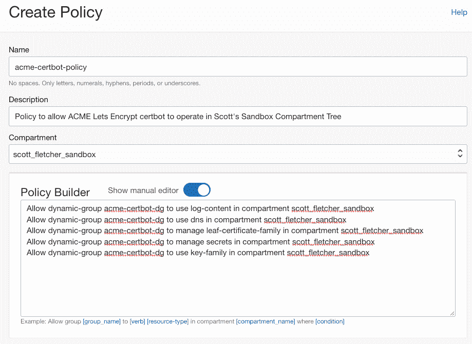

现在一切都配置好了，我们可以调用函数来创建证书。这可能需要 1-2 分钟。您应该会看到返回一条“成功完成”的消息:

```
scott@scott-mac lets-encrypt % fn invoke acme-certbot lets-encrypt "Completed Successfully"
```

如果我们看一下我们的 cert-bot 活动日志，我们可以看到证书是这样创建的:

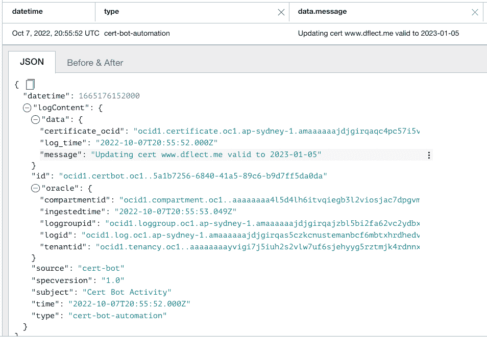

查看我们的 DNS 区域记录，我们可以看到为 _acme-challenge.www.dflect.me 添加了一条 TXT 记录:

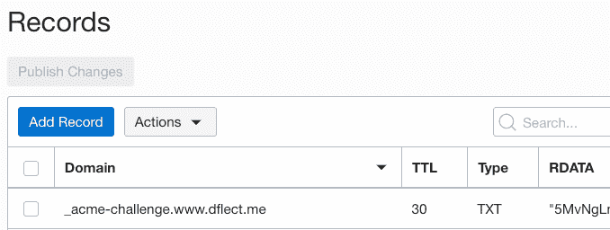

查看我们的存储库，我们可以看到还添加了 acme-cert-bot-key 秘密:


最后，我们可以看到证书已导入证书服务:


如果我们再次调用该函数，我们将看到未来的证书被添加到现有证书中，最新的证书被提升到当前版本:

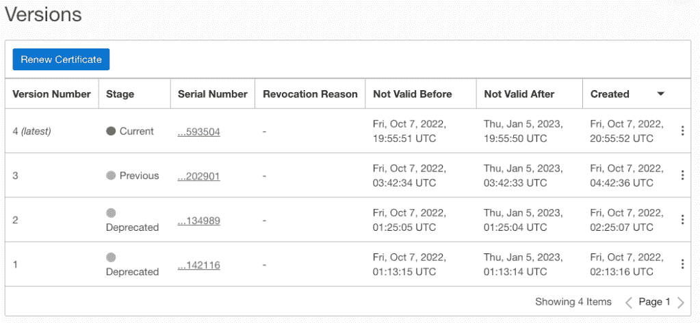

现在，我们需要将证书与负载平衡器侦听器相关联。您可以创建 HTTPS 监听程序，或编辑现有监听程序。选择已创建的证书:

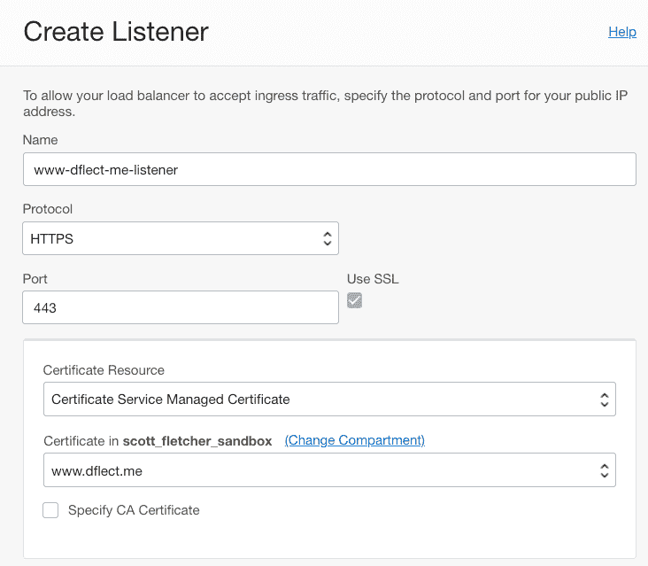

一旦负载平衡器工作请求完成，您现在就可以浏览您的网站。对我来说，是 https://www.dflect.me/:

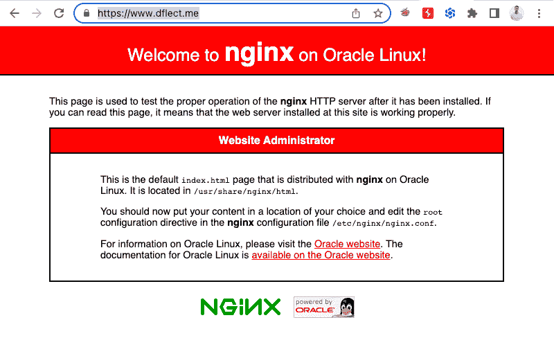

我还可以查看由“让我们加密”颁发的证书:

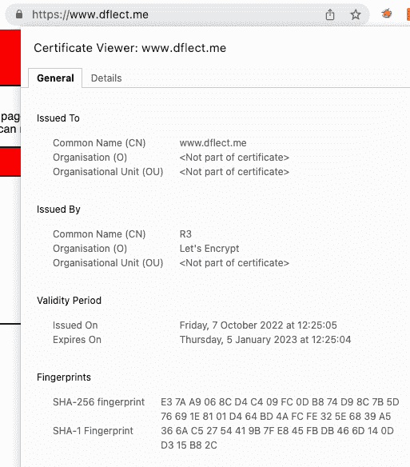

现在最棒的事情是，每当调用该函数时，如果需要新证书(在本例中是在到期前 30 天),就会生成一个新证书，将其升级为当前证书，并自动推送到任何关联的资源。这意味着我的负载平衡器将永远拥有一个有效的 SSL 证书。

最后要做的事情是配置一个机制，通过它来调用 OCI 中的函数。有几种方法可以实现这一点:

*   根据需要通过命令行手动运行它(如前面所示)
*   通过计算实例中的 cron 作业或您使用的其他调度程序来运行它
*   使用从 OCI 内部触发该函数的方法自动运行它。

因为我不想手动运行它，而且我也没有调度程序，所以我打算每天使用一次 OCI 警报来触发我的功能。我的同事有一篇关于如何做到这一点的好文章[https://red thunder . blog/2022/05/03/a-better-mechanism-for-periodic-functions-invocation/](https://redthunder.blog/2022/05/03/a-better-mechanism-for-periodic-functions-invocation/)。这是一本很好的读物，它深入探讨了这种方法如何工作的细节。

首先，我们需要创建一个主题:

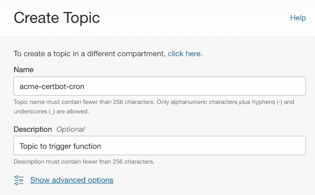

创建主题后，创建一个将调用 let-encrypt 函数的订阅:

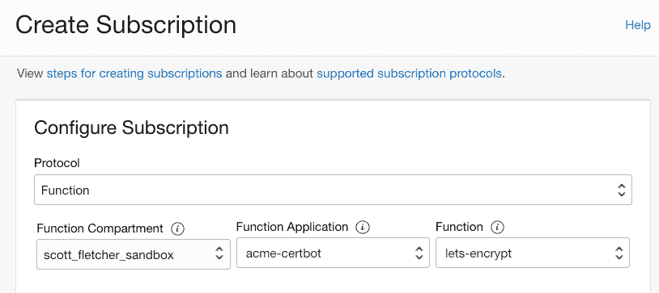

现在我们需要创建一个警报:


因为我正在运行多个计算实例，所以我选择了一个将始终触发的指标。

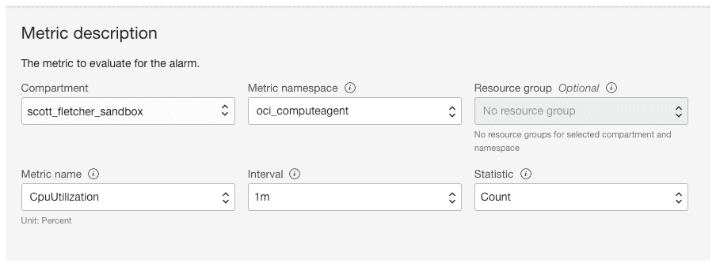

当值大于-1 时触发规则，这意味着警报将总是触发。您可能需要输入 1，然后按下向下箭头键获得值-1。您可以通过查看图表来验证指标是否有效。蓝线表示该指标将触发警报:

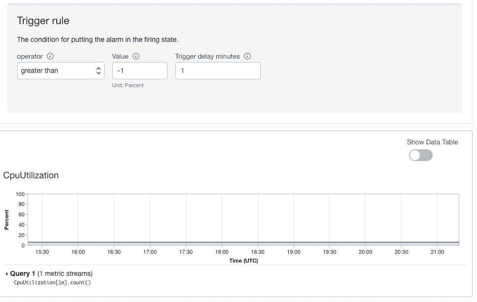

现在我们需要做的就是配置警报，向我们的通知主题发送消息。注意:我已将闹钟配置为每 24 小时重复通知一次。这将确保我们的 let-encrypt 函数每天运行一次:

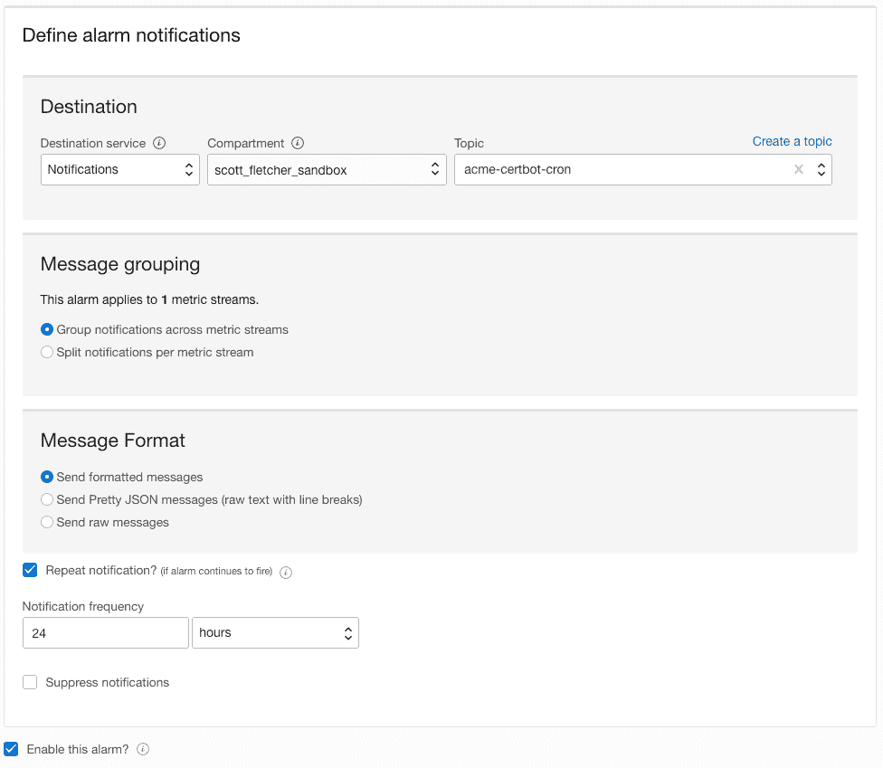

要确认 let-encrypt 函数每天都在运行，请查看函数指标:

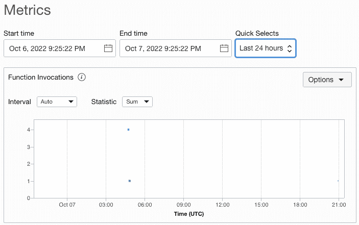

太棒了，现在我们有了一个完全自动化的解决方案，允许我们颁发和续订加密证书，并自动更新负载平衡器。

# 其他考虑/想法

*   当请求 Let's Encrypt 证书时，提供的证书链不包括信任根的所有证书。如果您试图手动将“让我们加密”证书导入 OCI 的证书服务，您可能会收到“信任链错误”。我在函数中通过遍历 CA Issuer 树并构建导入的正确证书链来处理这个问题。如果你查看源代码，你会看到它是如何完成的。
*   我建议在您的 OCI 租赁中启用[云卫士](https://www.oracle.com/au/security/cloud-security/cloud-guard/)。它是免费的，在一系列令人敬畏的云安全状态管理功能中，它有检测器来识别负载平衡器上的证书何时到期。如果您在证书到期前 30 天续订证书，那么将您的 Cloud Guard 检测器设置为识别将在 20 天后到期的证书将确保您在该功能未能成功运行或执行时收到警报。
*   如果你想做端到端的 SSL 加密，那么你可以在后台使用 OCI 的私有证书。在调配计算实例时，您也可以使用 init 脚本来检索、安装和信任这些证书。
*   我的 IAM 策略的范围是我的沙盒隔离专区中的所有内容。如果您想要进一步控制该函数可以访问的内容，您可以将这些内容限定到特定的资源 OCID。
*   我选择将 CERT_AUTO_DEPLOY 配置变量设置为“YES ”,这意味着更新的证书将自动成为当前版本，从而触发相关负载平衡器上的自动更新。如果您只想检索证书，而不想将它自动推送到负载平衡器，请将此项设置为“否”。如果您将其设置为“否”,则您需要监视证书何时更新，并手动将其标记为“当前”。
*   我把账户私钥作为秘密储存在金库里。这是因为如果您需要撤销证书，您将需要帐户私钥和证书。
*   此解决方案演示了如何更新单个证书。如果您需要多个加密证书，那么您可以根据需要部署多个功能。在不久的将来，我将更新解决方案，以处理多个证书配置。

如果你觉得这有用，请分享！如果你有任何问题，你可以在 LinkedIn 上联系我[https://www.linkedin.com/in/scotti-fletcher/](https://www.linkedin.com/in/scotti-fletcher/)


*原载于 2022 年 10 月 7 日*[*http://red thunder . blog*](https://redthunder.blog/2022/10/08/lets-encrypt-automation-with-oracle-cloud-infrastructure/)*。*