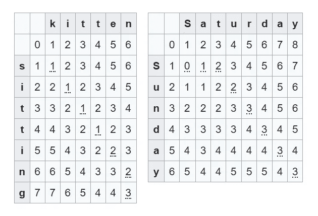

# 打字稿中的 Levenshtein 距离

> 原文：<https://itnext.io/levenshtein-distance-in-typescript-6de81ea2fb63?source=collection_archive---------3----------------------->

## 模糊字符串比较去神秘化

杰森·登特在 [Unsplash](https://unsplash.com/?utm_source=unsplash&utm_medium=referral&utm_content=creditCopyText) 上拍摄的照片

模糊字符串匹配在编程中有很多应用，但实现起来并不容易。有许多不同的方式可以使两根弦不同，但仍然看起来与人眼相似。确定两个字符串“相同”的一种(可编程的)方法是计算需要对一个字符串进行的单个字符修改的数量，以便将转换为另一个字符串。这叫做两根弦之间的 Levenshtein 距离。

为了计算 Levenshtein 距离，我们确定了从一个字符串到另一个字符串所需的最小编辑量。允许的修改是替换、添加或删除字符串中的单个字符。有了这个数字，如果我们记住字符串的长度，我们可以说两个字符串有多相似。对长度为三的字符串进行三次编辑操作当然与对长度为三十个字符的字符串进行三次操作不同。

# 基本实现

实现 Levenshtein 最简单的方法是使用递归函数的强力方法。在计算编辑距离时，我们从字符串的前两个字符开始，将它们之间的距离加上其余两个字符串之间的距离。在查看两个字符串时，我们需要考虑四种不同的情况:

*   第一个字符串为空。在这种情况下，距离是第二个字符串的长度，因为我们需要对该字符串中的每个字符进行插入操作。
*   第二个字符串为空。这里我们返回第一个字符串的长度，原因同上。
*   第一个字符串的第一个字符等于第二个字符串的第一个字符。我们不需要对第一个字符进行编辑，所以距离就是其余两个字符串的距离。
*   第一个字符不相等。在这种情况下，编辑距离是 1 加上其余两个字符串的编辑距离。这里我们有一个难题:我们对当前第一个字符使用的操作将影响其余字符串的编辑距离。这就是强力部分发挥作用的地方。我们计算所有可能操作的编辑距离，然后使用距离最小的一个。

在 TypeScript 中，这可以如下所示实现:

虽然这是一个相对容易编写和推理的函数，但它的效率也非常低。`levenshtein(‘barbaz’, ‘bazbar’)`将调用`levenshtein`函数 141 次，输入`(‘z’, ‘’)`和`(‘’, ‘r’)`将分别被处理 22 次。而且这个数字会在弦变长的时候快速增长。

# 动态编程实现

在动态编程中找到了一种更有效、更好的计算两个字符串之间的 Levenshtein 距离的方法。这里我们使用一个矩阵，其中两个字符串组成了`x`和`y`轴，值是从它们的索引开始的字符串之间的距离。这可以用一些例子来说明:

图片取自[维基百科](https://en.wikipedia.org/wiki/Levenshtein_distance)

这种矩阵中的最小距离是右下角的值。我们可以计算矩阵中的所有值，而不必重新计算两个字符串之间的距离两次。用子串之间的距离填充矩阵分几个步骤完成:

*   创建一个长度为`a`乘以`b`的矩阵。所有值都应该用`0`初始化。
*   用它们各自的索引填充左侧垂直轴和顶部水平轴。这些值是正确的，因为我们可以通过使用`n`插入从空字符串创建一个字符串。
*   之后我们遍历矩阵中的每个单元。为了确定一个槽的值，我们不需要像以前的实现那样对每条路径进行强力运算。我们可以通过回顾矩阵并将成本加到该单元的当前成本来计算每个操作的成本。对于删除，我们将`i`降低 1，对于插入，我们将`j`降低 1，以获得正确的单元格。对于这两个操作，我们总是增加一个成本。为了替换，我们将`i`和`j`降低一个，只有当我们实际上必须替换字符时才增加成本。我们再次将可能的最短距离作为该单元的成本。

在实际实施中，我们还需要在回顾矩阵时考虑零参考误差。完整的实现如下所示:

虽然这种实现已经比强制距离有效得多，但是仍然有更有效的算法来计算 Levenshtein 距离。可以只使用两行矩阵，并减少需要存储和计算的单元数量。还有一个版本使用了分而治之的方法 *(* [*【赫希伯格】*](https://en.wikipedia.org/wiki/Hirschberg%27s_algorithm) *)* ，性能甚至更好。但是这些都只是标准动态编程实现的改进版本，所以如果您感兴趣的话，我会让您自己去查找。

# 结论

在本文中，我们研究了多种比较模糊字符串的方法。这在搜索、拼写检查和其他处理文本的软件中有应用，这些文本需要以人类逻辑的方式进行比较。我希望你喜欢阅读这篇文章。