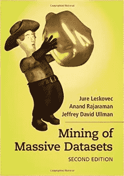
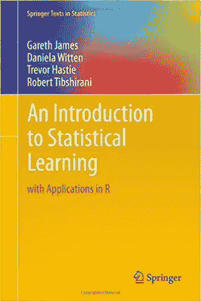
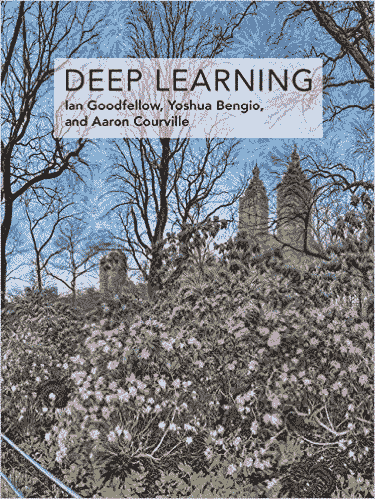
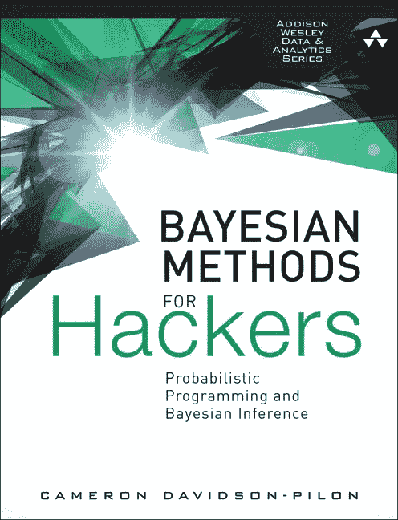
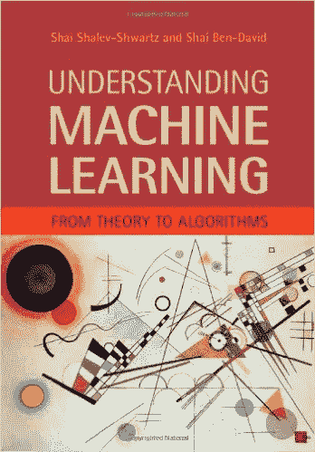
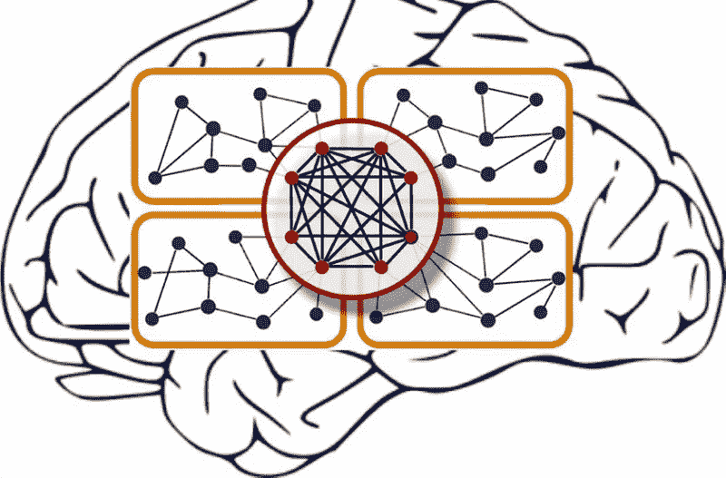
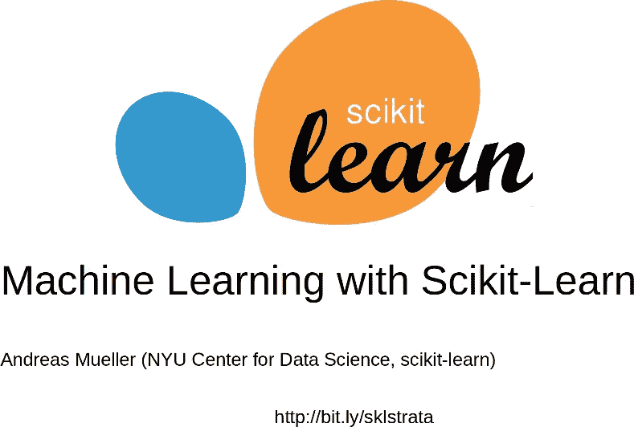
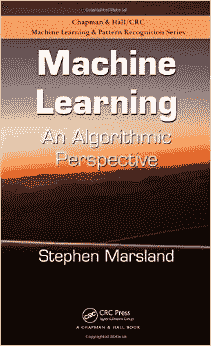
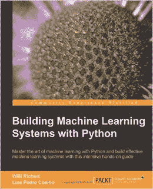

# 免费必读机器学习书籍列表

> 原文：<https://itnext.io/list-of-free-must-read-machine-learning-books-45288ab52919?source=collection_archive---------4----------------------->

机器学习是人工智能的一种应用，它使系统能够自动学习并根据经验进行改进，而无需显式编程。在这篇文章中，我们列出了一些你应该考虑浏览的最好的免费机器学习书籍(没有特别的顺序)。

[*点击这里在 LinkedIn* 上分享这篇文章](https://www.linkedin.com/cws/share?url=https%3A%2F%2Fitnext.io%2Flist-of-free-must-read-machine-learning-books-45288ab52919)

# [挖掘海量数据集](http://mmds.org/#ver21)

作者: Jure Leskovec，Anand Rajaraman，Jeff Ullman

基于斯坦福计算机科学课程 CS246 和 CS35A，本书面向计算机科学本科生，不要求任何先决条件。这本书已经由剑桥大学出版社出版。

# [统计学习导论(附 R 中的应用)](http://www-bcf.usc.edu/~gareth/ISL/)

作者:加雷斯·詹姆斯，丹妮拉·威滕，特雷弗·哈斯蒂和罗伯特·蒂布拉尼

这本书包含了统计学习方法的序言以及一些 R 实验室。

# [深度学习](http://www.iro.umontreal.ca/~bengioy/talks/lisbon-mlss-19juillet2015.pdf)

**作者:**伊恩·古德菲勒、约舒阿·本吉奥和亚伦·库维尔

这本深度学习教材是为那些处于机器学习特别是深度学习初级阶段的人设计的。这本书的网络版现在可以免费获得。

# 黑客的贝叶斯方法

**作者:**卡姆·戴维森-皮隆

这本书从计算的角度向你介绍了贝叶斯方法和概率编程。这本书基本上是那些对数学不甚了解的人的天赐之物。

# [理解机器学习:从理论到算法](http://www.cs.huji.ac.il/~shais/UnderstandingMachineLearning/understanding-machine-learning-theory-algorithms.pdf)

[**作者:**](https://www.paralleldots.com/) 沙莱夫-施瓦茨和沙伊本-大卫

对于精通数学的人来说，这是理解机器学习背后的魔力的最值得推荐的书籍之一。

# [深度学习教程](http://deeplearning.net/tutorial/deeplearning.pdf)

作者:蒙特利尔大学丽莎实验室

使用 Theano 的深度学习教程，如果你愿意进入这个领域，是必读书，而且绝对免费。

# [Scikit-Learn 教程:科学数据处理的统计学习](http://gael-varoquaux.info/scikit-learn-tutorial/)

**作者:**安德里亚斯·穆勒

探索统计学习，本教程解释了使用机器学习技术的目的是统计推断。该教程可以免费在线获得。

# [机器学习(算法视角)](https://seat.massey.ac.nz/personal/s.r.marsland/MLBook.html)

**作者:**斯蒂芬·马斯兰德

这本书为学习机器学习和人工智能的工程和计算机科学学生提供了很多东西。不幸的是，这本书由 CRC 出版社出版，由 Stephen Marsland 撰写，并不是免费的。然而，我们强烈建议你投资这个。此外，所有的 python 代码都可以在线获得。这些代码是学习 python 的很好的参考资料。

# [用 Python 构建机器学习系统](http://totoharyanto.staff.ipb.ac.id/files/2012/10/Building-Machine-Learning-Systems-with-Python-Richert-Coelho.pdf)

**作者:**威利·里歇特和路易斯·佩德罗·科埃略

这本书也不是免费的，但包括它服务于我们的列表正义。这是一个最终的实践指南，以获得最大的机器学习与 python。

这些是我们推荐的一些最好的机器学习书籍。有别的想法吗？请在下面评论你的一些令人敬畏的机器学习书籍。

对使用人工智能感兴趣？你可以[注册](https://user.apis.paralleldots.com/signing-up?utm_source=blog&utm_medium=banner&utm_campaign=paralleldots_blog)免费 [ParallelDots](https://www.paralleldots.com/) 账号，使用触手可及的人工智能。