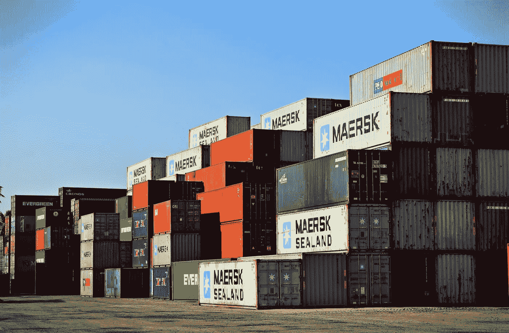

# 内部循环容器本地开发工具

> 原文：<https://itnext.io/local-container-native-development-tools-ef4b1beb472c?source=collection_archive---------3----------------------->

## 用于简化内循环容器本机应用程序开发的构建、推送和部署过程的工具

## 介绍

传统的开发工作流程相对简单:

第一步:写代码。

第二步:构建代码。

步骤 3:部署代码。

步骤 4:识别问题并迭代。

除了上述步骤之外，容器本机应用程序还带来了新的考虑因素。编译你的代码后，它将被构建成一个图像。您必须连接到分布式容器编排平台，如 Kubernetes，而不是部署到单个虚拟机。为了安排在该平台上的部署，您还需要一个映像注册表。

这意味着您的开发流程现在需要考虑构建应用程序的容器映像，将映像推送到注册中心服务，并将映像从注册中心部署到 Kubernetes 集群。如果手动完成，每一步都由多个命令组成，这会开始消耗您的时间并扰乱您的开发流程。协调部署大量分解和互连的微服务(而不是单一的传统整体服务)的复杂性增加了，这可能会进一步复杂化。此外，请记住，您的每个微服务都必须遵循这一流程。

在容器化的开发过程和传统的开发过程中，识别问题可能看起来非常不同。您将不得不单独提取每个容器的日志，而不是集中查看 monolith 生成的所有日志。处理大量的容器很容易遗漏一两个日志，或者没有注意到容器一开始就没有启动。

您还可以选择在开发过程中不部署到 Kubernetes 来开发您的微服务。您可以将您的容器直接部署到 Docker，并单独测试它。但是，需要部署到 Kubernetes 来测试多个服务之间的依赖性。运行工具来测试您正在开发的微服务也是有帮助的，例如应用程序跟踪。当然，如果您需要您的开发环境来镜像您的部署环境，这也很方便。

# 我为什么在乎？

在发现自己浪费了大量时间在一个小型 Java 微服务应用程序中添加跟踪工具之后，我开始研究这些工具。每次更新应用程序时，我都必须重新打包，创建一个新的 Docker 映像，将映像推送到注册表，部署应用程序，并验证更改是否真正完成了我想要完成的任务。仅仅是对应用程序进行微小的修改，就需要进行大量的按键操作——尤其是在第一次、第二次、第三次等修改都不起作用的时候。试试看。我需要一个工具，通过编译、构建和启动我的应用程序，并在我做出更改时重新部署它，来帮助我查明并解决我的问题。幸运的是，我发现我不是唯一有这些需求的人。

您可能会想，可以通过持续集成和持续交付(CI/CD)管道来处理部分或全部工作。你这样想不会错。这些管道是为使现代应用程序开发过程简单和可重复而专门构建的。但是假设您正在尝试一些新的东西，例如将跟踪数据推送到部署在 Kubernetes 集群上的 Zipkin 服务的端点。您不能确切地确定使用什么字符串作为您的端点，并且堆栈溢出不是特别有用，所以您决定尝试一堆不同的字符串来找出哪一个有效。在传统的 CI/CD 系统中，当您测试各种问题的解决方案时，这会导致大量不必要的变更被跟踪。或者，如果您可以访问本地开发工具，您可以选择只提交最终版本——具有正确端点的版本——并忽略所有不成功的迭代。

# 你为什么在乎？

在开发容器化应用程序的过程中，您可能会发现自己面临着比确定跟踪服务的适当端点更困难的问题。在一天结束时，您希望能够启动您的应用程序，对应用程序进行更改，并识别应用程序的问题。您不希望被容器化开发的复杂性所困扰，并发现自己重复输入`docker push`和`kubectl blah blah`。

我正在探索一系列开源工具来简化容器原生开发工作流的内部循环。这描述了您正在编写代码，但是还没有将它推送到版本控制系统的一段时间。这些工具，**[**ska ffold**](https://medium.com/@m.r.boxell/inner-loop-container-native-development-with-skaffold-d954c8dfcda5)和 [**Tilt**](https://medium.com/@m.r.boxell/inner-loop-container-native-development-with-tilt-47c97fc31918) 各自采取不同的方法来完成手头的任务。每个工具都可以用于构建代码变更、构建项目的映像、将映像推送到您选择的注册服务，以及将映像部署到 Kubernetes 集群上。采用这些工具将释放你的时间，让你专注于编写代码。**

**在[http://cloudnative.oracle.com](http://cloudnative.oracle.com)查看更多云原生和容器原生项目。**