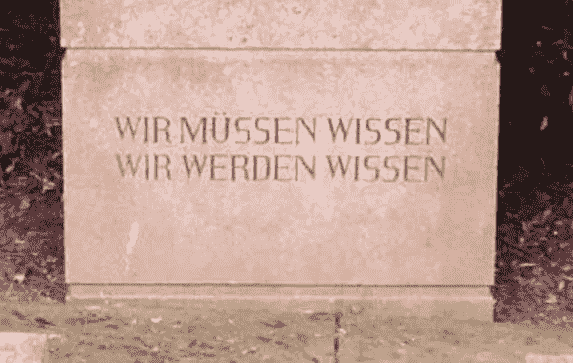

# 逻辑、验证和“上帝”埃尔

> 原文：<https://itnext.io/logic-verification-and-god-el-3849d1724275?source=collection_archive---------3----------------------->



# 发现与发明

虽然电话是一项随着科学进步而不断变化的发明，但重力是一项非常重要的发现。关于宇宙中为什么存在引力的解释，随着时间的推移而改变。从牛顿到爱因斯坦的解释，引力的存在是使我们回到地球的根本原因。同样，人们争论数学是发明还是发现。探索一方说，不管宇宙是否存在，2 + 3 总是 5，宇宙在一套规则下运行。在数学的发明方面，有人认为，数学是由人脑发明的，因为它的复杂性和数学只是碰巧完美地工作。

# 无知与无知

欧几里得用一套行之有效的特定规则将几何公理化。因此人们想在相似的基础上正式化所有的数学。戴维·希尔伯特做了一次这样的尝试。曾经有一句拉丁语引用来表示科学知识的局限性

*意思是“我们不知道，也不会知道”。希尔伯特直接用另一句史诗般的德语引用来反对它，*

> ***T5。***
> 
> *我们会赢的。*

*意为，“**我们必须知道，我们会知道**”。事实上，希尔伯特把这些台词带进了坟墓。因此，形式化数学的努力为元数学的兴起铺平了道路。*

# *希尔伯特-恩特施伊登斯问题*

*希尔伯特提出了 **Entscheidungsproblem** (也称决策问题)，即给定一个陈述，是否可以用一个算法在所有上下文中普遍有效的“是”/“否”来回答。*

# *阿隆佐·邱奇和艾伦·图灵解决方案公司*

*对数学本质的探索给了我们黄金的 1936 年，在那里决策问题得到了否定的答案，即不存在这样的算法。阿隆佐·邱奇提出了λ演算，并证明了其中的 2 个表达式可以被证明是等价的。同年艾伦·图灵提出了图灵机并证明了停机问题的存在。所以决策问题独立得到了 2 个答案。*

# *库尔特·哥德尔的不完全性定理*

*由于计算机科学和现代函数式语言的相关性，几乎每个人都知道图灵和丘奇的工作。但是没有多少人知道他们的工作受到了库尔特·哥德尔的不完全性定理的影响。*

*不完全性定理的关键是，任何能够执行算术运算的系统都是不完全的，即*

> ****系统中可能存在成立的语句，但无法用建立它的基本规则来证明****

*这在集合论及其悖论中可以很好地看到。虽然库尔特·哥德尔确实证明了一些对数学本质如此重要的东西，但他在那个时代证明的过程确实令人惊叹。他把每一个逻辑陈述都转换成数字，这样逻辑本身就可以简化为算术(这个过程称为哥德尔计数)。虽然这在他那个时代似乎已经过时了，但在我们现在生活的世界里，我们写的每一行代码都被编译成字节，而这些字节实际上就是数字。甚至在艾伦·图灵在二战后的研究中“发现”编程语言的“想法”之前，库尔特·哥德尔就曾试图证明数学本身的本质。*

# *库尔特·哥德尔的遗产*

*第二次世界大战后，哥德尔移居美国。他也是阿尔伯特·爱因斯坦非常亲密的朋友。1947 年，当哥德尔为美国申请公民身份时，他告诉爱因斯坦，美国宪法中有一个可能允许独裁的矛盾。哥德尔实际上继续正式验证美国宪法的法律，并向检查他的公民身份表格的法官解释。*

# *向遗产致敬*

*我们正处于编程语言和静态类型系统的时代。正如哥德尔所指出的，有算术能力的系统本身是不完整的。所以让我们对我们最喜欢的语言进行逻辑测试吧！*

***使用λ表达式的矛盾不动点算子***

```
*const Y = f => (x => x(x))(x => f(y => x(x)(y)))*
```

*同样，如果你使用的是强类型语言，你可以在你的类型系统中表示说谎者悖论，并证明它的不一致性，即在类型系统中表示下面的句子*

> ****答:答为假*** *上述说法既不能被证明为真/假。但是一些强类型语言仍然允许它们给出不一致的结果。就像下面这个骗子悖论的打字版本**

```
**// credit to Haskell implementation:* [*https://www.cs.unm.edu/~stelleg/liar.html*](https://www.cs.unm.edu/~stelleg/liar.html)type Not<X> = (x: X) => falsetype Liar = {
    val: Not<Liar>
}let liarIsFalse: Not<Liar> = (x: Liar) => x.val(x);const absurd: false = liarIsFalse({
    val: liarIsFalse
});*
```

*生日快乐库尔特·哥德尔！*