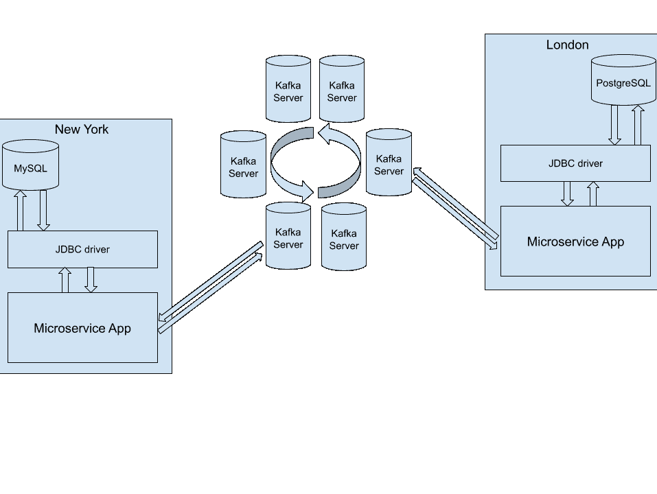
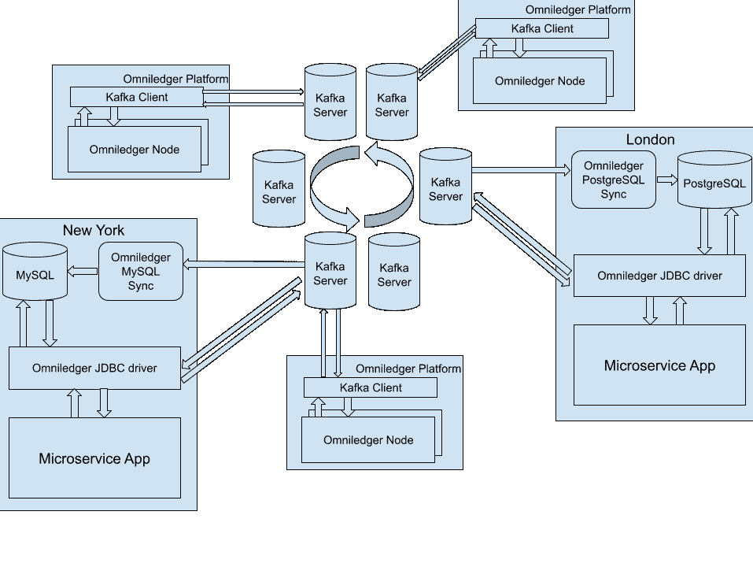

# 松散耦合的巨石柱以及在哪里可以找到它们

> 原文：<https://itnext.io/loosely-coupled-monoliths-and-where-to-find-them-4004fac8ecc1?source=collection_archive---------0----------------------->

在过去的十年中，技术部门一直致力于减少对中央 SQL 块的依赖。这些工作的主体集中在微服务及其作为指导原则的"[松散耦合](https://en.wikipedia.org/wiki/Loose_coupling)和"[关注点分离](https://en.wikipedia.org/wiki/Separation_of_concerns)"上。

[在之前的系列文章](https://andrasgerlits.medium.com/why-does-developing-microservices-look-so-easy-if-its-so-hard-d72a28ce7be1)中，我讨论了设计这种系统的固有问题；在这个例子中，我们将看到理想的结果。

*   设计这样一个系统需要什么？
*   它对运行和开发它的人有什么影响？
*   我们持续关注的问题是什么？
*   有什么改进的方法吗？

在集中式设置中，模式和数据的变化会影响到世界另一端的团队(和他们的操作)。在分散的环境中，爆炸半径减小了:我们用弹性换取了软件开发和维护的复杂性。

整体 SQL 实例为不同进程之间的数据交换提供了健壮的解决方案，但是它们不仅引入了数据流瓶颈，而且还是整个系统的单点故障。由于这些实例绝大多数是单数据中心解决方案，这些瓶颈往往最终决定了此类系统的稳定性和可用性。

另一方面，分散的设置更难开发。分布式系统是根据其服务于共享客户端 API 请求的能力来定义的。这意味着它的组成节点必须在彼此之间共享信息。因为它们中的每一个都必须能够“自己拿主意”，所以服务通常要么完全无状态，要么在多个独立的数据存储上维护它们的状态。围绕数据的两个特别困难的问题是节点同意:

*   我们如何描述像“银行账户”这样的记录？
*   这些记录的历史是什么？

第一个问题叫做“数据语义”，第二个问题叫做“一致性”。这两个问题已经开始困扰微服务和基于云的项目，尤其是在混合配置中，或者如果它们包含现有的遗留子系统。

# 松耦合及其"[活性性质](https://en.wikipedia.org/wiki/Safety_and_liveness_properties)

分散式系统通常被称为“松散耦合”。这意味着子系统之间的相互假设很少。让我们做一些天马行空的思考，并说这种自由放任的方法非常适合我们。该系统的所有功能都可以完美地划分到不同的服务中，我们已经解决了所有可能出现的数据排序问题。

这种情况下还有哪些遗留问题？它需要不同的节点通过某种消息传递基础设施相互通信，并且发送方和接收方必须能够相互交谈。换句话说:**消息结构必须得到双方的同意，消息平台需要为系统运行**而工作。任何分布式系统都必须处理的另一个问题是“交付语义”，它代表了发送消息的原子事件不同于其传输和接受的问题。每个参与者都有一段不确定的时期，他们无法确切知道“另一方”认为交换的状态是什么，并且(如果不小心管理)会导致各种各样的误解，最终表现为错误。让我们也把这个问题掩盖起来，说我们已经设计并开发出了解决这个问题的方法。我们还剩下什么？

# 完美的系统

我们的地毯现在越来越不平整，但我们终于有了完美的系统。我们可以满足客户的要求，我们可以从失败中恢复过来，我们可以比以前更好地扩展我们的服务。我们还可以让服务在地理上更接近它们的使用地，如果我们幸运的话，我们仅仅通过设计和实现更好的软件就实现了这一点。

为了实现这一点，我们必须在我们的服务之间设计一个原子的、一致的和隔离的数据交换机制，这(因为这是一个所谓的[以客户端为中心的解决方案](https://en.wikipedia.org/wiki/Consistency_model#Client-centric_consistency_models))需要仔细考虑每一次代码更改。我从来没有见过一个分布式系统接近这种理想状态，但是即使我们降低标准到“每个人都能接受”，成功也是非常罕见的，并且伴随着许多额外的复杂性和维护问题。

换句话说，以此为目标的项目总是需要了解分布式系统细微差别的专家，即使他们设法雇用了这样的团队，这种灵活性的费用也将永不停止。我们必须付出代价是额外的开发时间、更慢和更不确定的发布周期以及更大的系统不稳定风险。

# 彩虹尽头的麻烦

我们的新系统显然比以前的好得多，但它也带来了一系列不同的问题，这些问题更难理解。我们现在有一个服务网格，通过冗余的容错消息总线(如卡夫卡或[小熊猫](http://redpanda.com))相互通信，每个服务的职责严格限制在公司内部的一小部分问题上。

换句话说:我们将处理服务相互依赖的复杂性转移给了网络和我们的(昂贵的)专家团队。为了真正消除这些担忧，我们需要某种“分布式权威”来告诉我们数据语义和记录一致性，就像集中式解决方案那样。在 monoliths 中，我们使用数据库模式来执行第一个，使用 [ACID 属性](https://en.wikipedia.org/wiki/ACID)来执行第二个。我们不想重新引入我们刚刚通过放回巨石而解决的问题，所以我们需要寻找一个替代方案。

# 嘿，角落里的是什么？

我们系统可靠性的核心是我们的消息总线保持弹性的承诺，即使面对不同类型的故障。卡夫卡(例如)依靠一个名为“”的“[共识——协议](https://en.wikipedia.org/wiki/Consensus_%28computer_science%29)”来实现这一属性。由于我们的系统的弹性取决于其内部通信的能力，我们的“分布式授权”也应该依赖于同样的保证。这正是我们系统的工作方式。

我们建立了一种全新的服务来解决这些问题。它使用已建立的消息总线，并通过允许在不同的 SQL 服务器之间通过消息总线共享 SQL 表来解决“共享语义”和“一致性”问题。由于每个微服务已经依赖于自己的数据存储，并且它们通过消息总线相互通信，所以所有的基本元素都已经存在于项目中。

原始解决方案

在上图中，有两个微服务:一个在伦敦，一个在纽约。他们通过 Kafka 互相交流，并依靠他们内部的 SQL 数据库(LDN 的 Postgres，纽约的 MySQL)。因为它们是完全独立的，所以它们同时受到一致性和数据语义问题的困扰。

Omniledger 模块解决方案

我们在架构中引入了许多新元素，这些元素保持了我们对 Kafka 总线的“分布式权威”。微服务写入自己的 SQL 服务器。位于应用程序和数据库之间的 JDBC 驱动程序会自动获取这些更改。然后，这些信息通过 Kafka 传送到 Omniledger 平台节点，在那里它们被同步，潜在的冲突被解决。其他微服务创建的新信息通过“Omniledger sync”模块引入到应用程序中，这些模块位于应用程序实例附近。

简而言之:如果纽约的微服务决定更新伦敦和纽约都使用的记录，它只需要在本地提交该信息，以便在两个服务之间协调更改。如果伦敦微服务在纽约处理同一记录时成功更新了该记录，那么纽约受影响的事务将不得不回滚，就像现在遇到乐观锁时一样。换句话说:开发人员不需要考虑任何数据冲突，因为 Omniledger 平台节点会处理它们。他们不需要在系统中引入新的组件，因为该解决方案可以在现有的基础设施上运行。他们不需要了解分布式系统的细节，因为这些问题都归结为基本的 SQL 操作。

由于平台仅依赖于 Kafka 建立的信息，每个节点(平台模块和同步模块)都可以停止和重启，而不会影响系统的可用性。只要卡夫卡在工作，我们的平台也是可以的。

整体结构的简单性与同类最佳微服务解决方案的优势。一只神秘的野兽。

在我们的下一篇文章中，我们将看看这些概念在实践中是如何工作的，例如:微服务开发者的工作流程是怎样的。 *与此同时，* [*查看项目背后的研究*](http://researchgate.net/publication/359578461_Continuous_Integration_of_Data_Histories_into_Consistent_Namespaces) *，给我们发邮件到*[*info @ omniledger . io*](mailto:info@omniledger.io)*，在媒体和 Twitter 上关注我:*[*@ AndrasGerlits*](https://twitter.com/AndrasGerlits)*了解进展更新。*