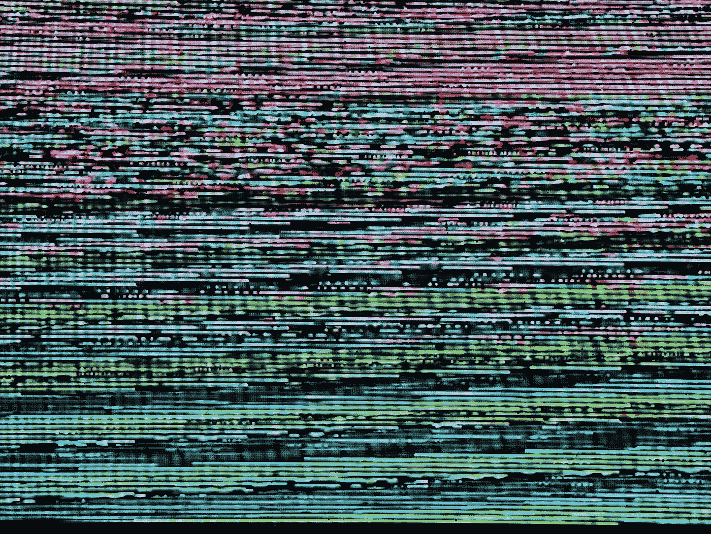

# 像爱你自己一样爱你的错误信息

> 原文：<https://itnext.io/love-your-error-messages-as-thyself-dd038dfd3c85?source=collection_archive---------4----------------------->

迈克尔·泽兹奇在 [Unsplash](https://unsplash.com/s/photos/error?utm_source=unsplash&utm_medium=referral&utm_content=creditCopyText) 上的照片

学会恨，然后爱错误信息。

# 堆栈溢出溢出

我已经在堆栈溢出上浪费了太多时间。

我的意思是栈溢出是伟大的，没有它的巨大影响，软件开发知识不会如此先进，如此广泛。我的意思是，我经常发现自己重复着*的无休止的模式，‘嘿，我有一个错误...哇，这么多单词…让我们谷歌一下这个。栈溢出有！让我们看看他们怎么说'*

我不是在谈论臭名昭著的堆栈溢出复制粘贴综合症，也不是在否定伟大的开发人员给出的伟大答案，而是在上面的例子中遗漏的一步:在实际寻找现成的答案之前，自己理解错误消息。

我们的大脑走捷径的速度如此之快，以至于它经常让我们变得懒惰，跳过那些看似不必要的步骤，而这些步骤是我们的思维得以充分发展所必需的。以走路为例。虽然我不太记得我在这个世界上迈出的第一步，但我可以想象这是一个需要如此专注——更不用说勇气——和协调的运动，开始时肯定感觉很尴尬。今天，我想都不敢想。我的大脑只是协调一切，允许我出去散步，实际上思考其他事情。

想想你第一次输入电脑程序的第一天。想想你当时的思维方式。也许你目前正在学习计算机科学，许多有经验的开发人员甚至没有想到的机制是你有意识地一步一步采取的步骤，以便达到代码质量——或者甚至写出实际工作的代码。

而且在学习的时候，我们都遇到了 bug。我们编写代码的语言用复杂的词语和概念与我们交流，有时我们甚至不知道这些概念。我们都在谷歌上搜索解决方案。堆栈溢出被很好地构思和维护，我们肯定在那里找到了答案。它又发生了。有时，错误信息是如此难以理解，如此晦涩难懂。所以我们只是不停地复制粘贴错误信息，它就不停地向你抛出正确的答案，只要稍加修改，就可以了。

然后，你的大脑跳过了阅读错误信息的步骤。

但是我们不想只是成为非常非常非常有才华的谷歌员工，不是吗？

## RTFEM！

阅读该死的错误信息！

所以我鼓励你们所有的学习者仔细看看就在你期待成功编译时出现的错误信息。花时间去阅读它们。花点时间看看那些到处出现的奇怪符号。你知道吗？一开始你可能不会更快地抓住要点，但是你会对你的语言实际上是如何构建的，它内部是如何工作的有更深的了解。表面上，你可能看着你的程序员同事们更快地提高他们的技能，但是你对错误消息的理解将最终把你变成一名代码绝地大师。

让我真正停止忽略错误信息的是读帕特·沙乌格内西的《显微镜下的 Ruby》，这是一本非常好的书，讲述了 Ruby 实际上是如何用 C 语言编写的，语言解析器是如何工作的，以及它如何将你写的文字转化成机器可以理解的概念。

在本书介绍解析器如何工作的第一部分，作者谈到了语言标记化，这是——非常基本的——解析器如何获取单词并理解如何将它们与特征匹配。在这里，在一个代码示例中，它们是我长期以来一直看到但鲜为人知的错误消息朋友，即 *tSTRING* 、 *tCONSTANT* 和 *tINTEGER* 。

如果我以前知道这些对应的是什么，像这些的错误信息就不会让我去谷歌搜索答案了。

但是我怎么会知道呢？当你在谷歌上搜索 ruby tString 时，你会得到各种各样的结果，大多数会跳过前面的 *t* 。为了得到真正的东西，我应该花时间真正阅读错误消息，并想知道:

语言想告诉我什么？

如果这听起来很尴尬，请记住你的编程语言实际上是由其他人编写的计算机程序，并问问你自己:

语言的作者告诉我看什么？

他很有可能试图让你看到这种语言的一些特征，这些特征可能不是显而易见的，而是隐藏在视线之外的。如果他想让你看这些，你还是照做为好。并且学习。

## 学会喜欢你的错误信息

你不仅应该仔细阅读错误信息，还应该花时间用爱和关心来精心制作你的错误信息。就像我在之前的一篇文章中所说的，[你应该总是试着用你未来的想法来写代码](/writing-code-for-your-future-self-65e66e098303)。我想这同样适用于错误消息。

不要只是在你的 lib 中提出*错误*，或者*标准错误*。实际上写自己的 *OddError* 类。给它一个信息。说清楚。让你的用户——这可能是未来的你——渴望看到你写的代码并理解它是如何构建的。

错误信息必须清晰，所以它要求你的代码清晰，因此它要求你的编程头脑清楚代码实际上在做什么。错误信息告诉你一些关于你自己的事情。

错误信息是程序作者和他的用户之间的对话。作为一名程序员，你会依次成为其中之一，并且经常同时成为两者。

错误信息会让你在*学习*软件的同时成长。当*使用*软件时，他们会让你成长。他们会让你在*写*软件的时候成长。不要只是忽略它们并跳到堆栈溢出步骤。