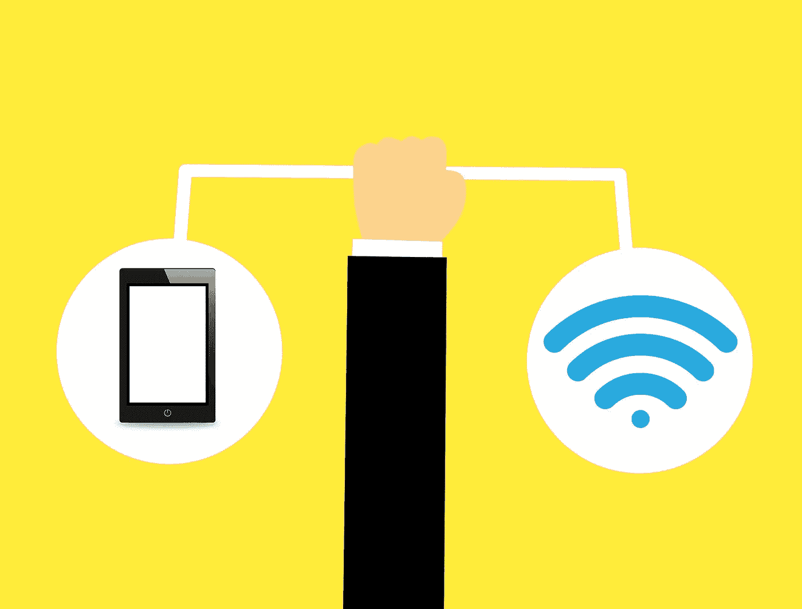

# 使用缓存的可观察数据制作离线离子应用

> 原文：<https://itnext.io/make-offline-capable-ionic-apps-with-cached-observables-12d79a3a1e75?source=collection_archive---------0----------------------->



应用应该是在线的，但不应该让用户在离线时束手无策。

因此，你正在开发下一个大型应用，一切都很好，除了当你的用户离线时，在一个接收信号不稳定的地区，或者一般来说连接很慢。突然，他们的个人资料、消息或任何从你的服务器 API 加载的应用内内容都非常慢，超时或无法加载。这是一个可怕的用户体验，让你的应用在离线时完全无用。

在这篇文章中，我们将研究如何缓存 Ionic 应用程序的可观测数据，以减少延迟，改善用户体验，并使您的应用程序在离线时仍能工作。

> 如果你只是想尝试一下，你可以在这里克隆示例源代码，然后用`ionic serve`:[https://github.com/westphalen/ionic-offline-example](https://github.com/westphalen/ionic-offline-example)立即尝试一下

## 装置

从启动一个新的离子项目开始。如果你以前没有这样做过，请务必前往 IonicFramework.com[阅读如何开始。](https://ionicframework.com/)

```
ionic start myOfflineApp
```

你将需要两个包来实现这个奇迹，第一个是`@ionic/storage`，它需要在应用程序会话之间存储数据，第二个是`ionic-cache-observable`，它完成所有的魔法:

```
npm install --save @ionic/storage ionic-cache-observable
```

现在我们需要在我们的`AppModule`中注册模块，例如`src/app/app.module.ts`:

```
//.........
@NgModule({
  declarations: [
    ...
  ],
  imports: [
    ...
    // Add the cache module
    CacheModule, 
    // We will use the HttpClient for our API provider          
    HttpClientModule, 
    // Add the storage module
    IonicStorageModule.*forRoot*(),
    IonicModule.*forRoot*(MyApp),
    ...
  ],
//.........
```

## 从 API 加载数据

现在，如果您已经有了 API 数据的提供者，请跳过这一节。否则，让我们用来自 [JSONPlaceholder](https://jsonplaceholder.typicode.com/) 的数据创建一个。

```
ionic g provider Placeholder
```

这将在`src/providers/placeholder/placeholder.ts`创建您的新提供商。打开它，让我们添加一些 API 数据:

```
import { Injectable } from '@angular/common';
import { HttpClient } from '@angular/common/http';// Remember to import RxJs dependencies.
import { Observable } from 'rxjs/Observable';
import 'rxjs/add/observable/defer';
import 'rxjs/add/operator/delay';// Interface for the data returned by the JSONPlaceholder API
export interface Placeholder {
  userId: number;
  id: number;
  title: string;
  body: string;
}@Injectable()
export class PlaceholderProvider { constructor(private http: HttpClient) {} public random(): Observable<Placeholder> {
    // Observable.defer makes sure we generate a 
    // random number each time the Observable is triggered.
    return Observable.defer(() => {
      const randIndex = Math.ceil(Math.rand() * 10); // 0-10 const url = 'https://jsonplaceholder.typicode.com/posts/' 
        + randIndex; return this.http.get<Placeholder>(url).delay(1000);
    });
  }}
```

好了，我们已经定义了一个接口，它描述了我们期望从 API 中得到的占位符数据。接下来是我们的随机函数，它从 API 请求随机数据，模拟我们的应用程序中不断变化的数据。此外，我们实施了一个`1000 ms`延迟来模拟慢速连接——这样我们可以更好地看到发生了什么。

## 在视图中缓存数据

到我们想要显示数据的页面上，例如`src/pages/home/home.ts`:

```
//....................
export class HomePage { public data$: Observable<Placeholder>; constructor(placeholderProvider: PlaceholderProvider,
              cacheService: CacheService) {
    // The data we want to display on the page. 
    // This could be a user's profile or his list of todo items.
    const dataObservable = placeholderProvider.random(); // We register a cache instance, using a unique name 
    // so the CacheService will know what data to display next time.
    cacheService.register('home', dataObservable)
      .subscribe((cache) => {
        this.data = cache.get$;
      });
  }
// ......................
```

在我们的页面组件中，我们为 API 数据注入了`PlaceholderProvider`,为之前安装的包注入了`CacheService`。然后*使用标识符`'home'`向`CacheService`注册*可观察到的 API 数据，以便能够识别会话之间的数据。寄存器 observable 为我们提供了`cache`对象，从现在开始代表我们的`Placeholder`数据。在这个简单的场景中，我们将把缓存的`get$`赋给页面的`data$`变量。缓存将自动从我们提供的`dataObservable`中提取数据，我们可以在`home.html`中显示这些数据:

```
<ion-content>
  <div *ngIf="data$ | async as data">
    <h1>{{ data.title }}</h1>
    <p>{{ data.body }}</p>
  </div>
</ion-content>
```

当`data$`更新时,`async`管道将自动更新视图。

现在，使用`ionic serve`启动应用程序，或者在您的设备上运行它。当你第一次打开页面的时候，你应该注意到在一个随机的标题和正文从我们的 API 中出现之前有一秒钟的延迟。现在弹出页面，刷新或重新打开应用程序，看看奇迹发生。当您第二次导航到该页面时，数据或多或少会立即出现，尽管数据应该是随机的，但我们显示的内容与之前完全相同。API 从不被调用，所以这些数据甚至可以在离线时显示出来！但是当然，我们不希望一直显示过时的数据。让我们看看如何刷新缓存。

## 刷新缓存数据

让我们使用凉爽的**离子清新器**组件制作一个简单的清新功能。返回到您的页面组件，例如`home.ts`:

```
//....................
export class HomePage { public data$: Observable<Placeholder>; private cache: Cache<Placeholder>; constructor(placeholderProvider: PlaceholderProvider,
              cacheService: CacheService) {
    const dataObservable = placeholderProvider.random(); cacheService.register('home', dataObservable)
      .subscribe((cache) => {
        // Save the cache object.
        this.cache = cache; this.data = this.cache.get$;
      });
  } onRefresh(refresher: Refresher): void {
    // Check if the cache has registered.
    if (this.cache) {
      this.cache.refresh().subscribe(() => {
        // Refresh completed, complete the refresher animation.
        refresher.complete();
      }, (err) => {
        // Something went wrong! 
        // Log the error and cancel refresher animation.
        console.error('Refresh failed!', err); refresher.cancel();
      });
    } else {
      // Cache is not registered yet, so cancel refresher animation.
      refresher.cancel();
    }
  }
// ......................
```

这里有两件事发生了变化。在构造函数中，我们现在在 page 类上设置了`cache`对象，所以我们可以从第二个变化中访问它，我们新的`onRefresh`函数，它从 Ionic Refresher 组件中获取一个`Refresher`参数。在这个函数中，我们简单地在缓存对象上调用 refresh，然后通过`refresher`相应地更新 UI。您不需要担心刷新的数据，因为它会自动推送到`data$`。

在您的页面模板中实现 Ionic Refresher 组件，例如`home.html`:

```
<ion-content>
  <ion-refresher (ionRefresh)="onRefresh($event)">
    <ion-refresher-content></ion-refresher-content>
  </ion-refresher> <div *ngIf="data$ | async as data">
    <h1>{{ data.title }}</h1>
    <p>{{ data.body }}</p>
  </div>
</ion-content>
```

我们在这里所做的只是添加了调用我们的`onRefresh`函数的`ion-refresher`。

现在启动你的应用程序。您应该仍然可以看到之前缓存的数据。执行一次拉至刷新操作，等待大约一秒钟，您应该会看到数据发生了变化！缓存对象在后台调用您注册的可观察对象，并在新数据到达时立即推送。刷新你的应用，最新的内容仍然会加载，直到你再次点击刷新。好吧，但是用户不应该一直拉着刷新。让我们看看自动刷新内容。

## 自动刷新

您可以保留有用的拉至刷新功能，并自动提供刷新的数据。我们只需要改变页面组件中的一些东西，例如:

```
//....................
constructor(private placeholderProvider: PlaceholderProvider,
            private cacheService: CacheService) {
  // I have moved to ionViewWillEnter.
} ionViewWillEnter() {
    const dataObservable = placeholderProvider.random(); cacheService.register('home', dataObservable)
      .subscribe((cache) => {
        this.cache = cache; this.data = this.cache.get$; // Refresh the cache immediately.
        this.cache.refresh().subscribe();
      });
  }// .....................
```

我们已经将缓存注册从构造函数转移到了`ionViewWillEnter`方法中，每次用户想要打开页面时都会调用这个方法。这包括在视图之间导航，因此即使不关闭或重新加载应用程序，用户也会在每次打开视图时看到刷新的数据。一旦`ionViewWillEnter`方法从`cacheService.register`中检索到`cache`对象，我们马上调用`cache.refresh()`。不需要处理订阅，因为我们只想静默刷新数据。

试试吧！每次打开页面，您都会立即看到旧数据，但大约一秒钟后，刷新/随机数据会替换缓存的数据。而且还可以拉刷新！不要害怕多次调用`cache.refresh()`，因为刷新观察是共享的。因此，即使您的页面已经在后台刷新数据，您的用户也可以安全地进行拉式刷新。

## 感谢阅读！

如果这对你有帮助，请鼓掌！此外，如果您有任何问题或反馈，请不要犹豫，留下您的评论。

在 GitHub 上阅读更多关于`ionic-cache-observable`包及其可能性的信息:[https://github.com/westphalen/ionic-cache-observable](https://github.com/westphalen/ionic-cache-observable)

请随意建议新功能或提交改进请求。