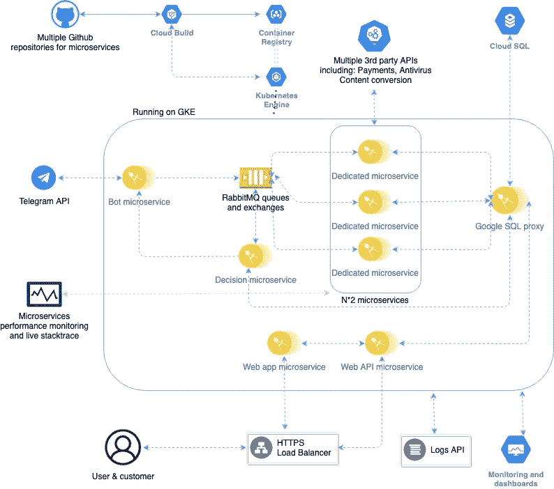
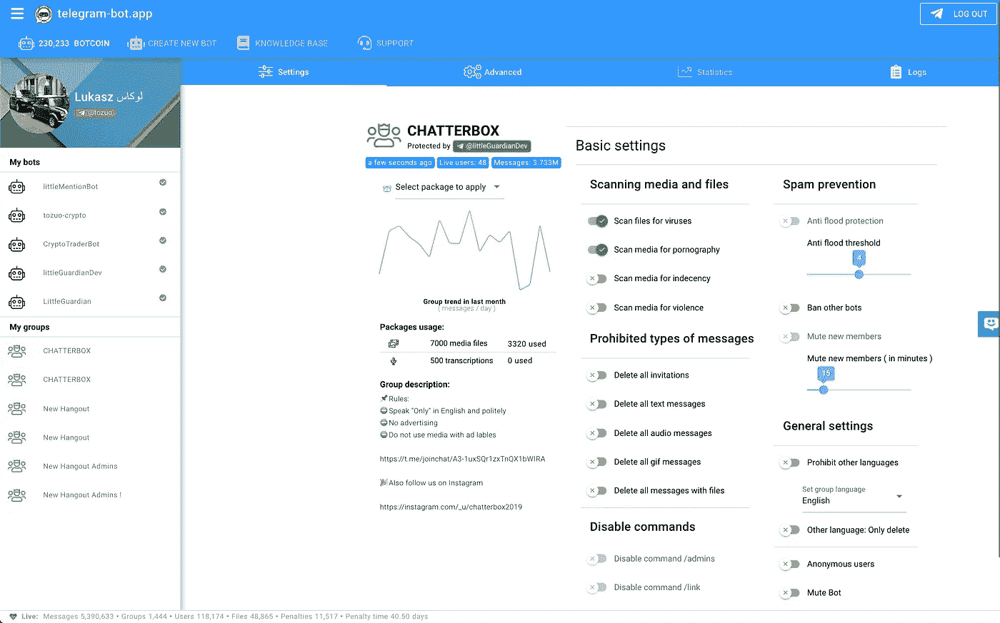

# 大规模管理私人项目

> 原文：<https://itnext.io/managing-private-projects-at-scale-a6ff4bf1dff4?source=collection_archive---------2----------------------->

## 当那个小的网络应用突然像病毒一样传播时该怎么办

不管你是否曾经做过比预期更受欢迎的“朋友和家人”项目，或者你开始计划让你梦想中的创业想法成真。

机器人和自动化统治世界

没有妥协的余地，在本文中，我将向您展示为什么从第一行代码开始计划全球扩展是一个好主意，使用我的一个爱好项目，该项目的受欢迎程度在几个月内出乎意料地飙升，以及我为满足需求所做的工作，因为横向扩展基础架构不是一个选项。

我花了一些时间在世界各地旅行，这给了我一个绝佳的机会去发现新的文化，了解更多关于生活的意义，当然，认识新的人，建立很多联系。为了跟上每个人的进度，不允许因为阅读和不回复信息而受到不尊重，我使用了[电报信使](https://medium.com/u/dca24e3a130c?source=post_page-----a6ff4bf1dff4--------------------------------)组的力量将每个人聚集在一个地方，让讨论流动，让友谊蓬勃发展。不久后，我的朋友们开始添加他们的朋友，他们认为我们的小组足够友好，邀请了他们的朋友，这很快就让我们有超过 2000 人讨论一切，从他们的日常生活和大学斗争到全球经济和政治。像往常一样，在这些情况下，一些流氓分子开始出现，试图破坏和平和友好的性质。是行动的时候了。

# 见见机器人小守护者。

它主要是 PoC，简单的机器人来保护我的一个小组免受讨厌的垃圾邮件发送者。从一开始就没什么特别的，因为它从 30 行逻辑开始，几个月后发展成几百个非优化的 Ruby 代码。一切都保存在内存中，所以每次重启机器人都会失忆，垃圾邮件检测的乐趣又开始了。它被“设计”为只在我的组中工作，并听取硬编码管理员的意见。当人们想在他们的小组中使用它时，这会引起一些问题。因为即使是 PoC 也非常有效——它开始在 Telegram 平台上传播，被群组管理员用来保持对内容的控制。

# 第一课:永远不要硬编码任何东西。

如果你的项目只被你或亲密的朋友使用，或者你不想公开，这都没有关系。总是假设事情会随机变化，你实现的奇妙的解决方案不会覆盖所有的用例和可能性。

**这些问题是我当时应该问自己的。**

*   *如果我添加新管理员会怎么样？添加新管理员需要我重启机器人程序。当我在移动的时候，它远非有效和不可能的。*
*   如果有人不值得信任，我会删除他，那该怎么办？
    同上，只是紧急程度更高，假设在“机器人的大脑”中，管理员总是可以做任何他们想做的事情。
*   *如果有人将机器人添加到一组完全不同的管理员的新组中，该怎么办？*
    在那个阶段，管理员是硬编码的，我不知道 bot 在哪个组上(除了他们的 id)。我无论如何也办不到。

# 第二次机器人迭代

2.0 版本从头开始重写，仍然使用 Ruby，支持 [Google Cloud](https://medium.com/u/4f3f4ee0f977?source=post_page-----a6ff4bf1dff4--------------------------------) Datastore，用于在重启时存储持久信息，并支持多个组。大量的假设和数据存储使得机器人比以前更聪明一点。有了数据的持久存储，我终于能够随意重启 bot，几个组和数百个活跃用户对运行成本没有任何影响——这是功能增长最多的版本。

不断的开发导致了重启，一切都很顺利，至少在活动组和用户数量增加之前是这样，机器人的回复和动作变得很慢。随着越来越多的信息存储在 GCP 数据存储中，每次重启或更改组设置都会导致机器人重新读取所有实体，这直接转化为运行成本。可用功能的数量也在增加，所以我做的下一个决定是建立一个网站，上面有简单的(当时)文档和 FAQ，供人们在问任何问题之前访问。

网站的最新版本可以在这里看到——它作为传统定制机器人支持计划的一部分保留在网上—[https://telegram-bot . in](https://telegram-bot.in)。

**另一部分问题**

*   这种语言适合这项任务并允许我进一步发展吗？我一直喜欢 Ruby，但它有时会有点慢，我当时想要的只是速度，尽可能快地做东西，以保持领先，并创造出每个人都喜欢使用的产品。
*   *流量暴涨时账单会发生什么变化？我明白了电报社区是不可预测的，如果人们喜欢某样东西，他们就会开始使用它。我对 bot 应用的每个更改都需要重启，这导致了从数据存储中加载数据，这要花很多钱。正常的开发(和可能的错误)变得相当昂贵。*
*   用户知道如何使用我的产品吗？
    没有文档，用户不知道如何使用这项服务并从中获得最大收益。我曾在白天或晚上的不同时间收到关于特定命令的问题的私信(由于世界范围内的联系和时区差异)。建立面向用户的文档，使用清晰的描述性语言是必要的。

# 第二课:明智地选择你的工具

尽管我很喜欢 Ruby——但它并不是这项任务的最佳选择。Ruby 作为一种语言，有其自身的缺点，随着代码库的增加，调试会变得非常困难——找到问题的真正根源是一段漫长的旅程。最重要的是，以前提交的每个修补程序都会导致整个数据库的重新启动和重新读取，这成为一个代价高昂的过程，尤其是在繁重的开发时期。

我对第二次迭代中的一个错误负全责——我更关注“*快速解决并赢得*”而不是“*我们有一个起飞*”。听起来耳熟吗？我经常从与我合作的企业那里听到这种说法。此时此地，他们需要一个解决方案—被他们面前的小火弄得措手不及，没有注意到解决方案本身会产生更多的技术债务和成本，当整个世界被烧毁时，公司将需要修复这些债务和成本。

# 第三次迭代

在回答问题和花了无数时间救火后，我决定用 Golang 重写一切。它的速度是众所周知的，实际的编译器让你知道任何潜在的错误，这是一个很好的变化相比，客户告诉你，有些东西不工作。我还添加了基本的统计数据，使用 GCP Stackdriver 来更好地了解流量，消除了少数群体可以忍受的日志噪音，但随着受欢迎程度的增加，变得难以阅读和理解。这个版本充满了初学者的错误和错误的假设，惹恼了客户。那时，数据存储层面没有任何变化，出现了更多收费和免费的功能。这是使用 Docker 的第一个版本，也部署在 GCP 的 Kubernetes 集群上。我已经在 Google Cloud Build 上创建了 CI/CD 管道，因此进行更改就像将新代码推入 Github 库一样简单。

**更多问题**

*   如何关注实际流量？
    日志可能是一个很好的事实来源，但它们很难分析，尤其是每秒钟有数百行在你眼前流动。图表会更好——它们容易理解，你可以设置基线和百分位数，通过快速浏览来识别问题。
*   我正在记录和关注的事情是可行的吗？
    并不是我记录的所有东西都有用。他们制造了不必要的噪音，让我完全忽略了日志。将所有内容都放入 Google 日志系统使得搜索成为可能，但是真的——产生的这些行中有多少带来了价值？
*   *我是否充分利用了所用技术的潜力？*
    这主要是关于我对[谷歌云](https://medium.com/u/4f3f4ee0f977?source=post_page-----a6ff4bf1dff4--------------------------------)平台日益增长的热爱。他们提供的所有 API 都是开发友好的，满足了我对未来扩展的所有需求和计划。我花了几个小时通读他们大多数产品的文档，问自己一个问题——我如何在我的项目中使用它。

# 第四次迭代

这段时间主要集中在代码优化和向 SQL 数据库的迁移上。花了相当长的几天来改变所有必要的查询，以 ping 新的真相来源。从那时起，我可以随意重启一切，所以我把精力集中在代码优化上。来自谷歌的惊人的 Profiler 工具极大地帮助了我完成这项任务——我能够识别所有的瓶颈，并在几周的重新思考和经历不同的策略之后——改进例如图像和文件扫描程序。

在此之前，每张上传的图片或文件都是由 VirusTotal 或 Google Vision 单独扫描的。我想到了一个简单的解决方案，既加快了机器人的响应速度，又减少了 API 调用(同时也降低了成本)。扫描前的每张图像都由 bot 下载，然后 bot 计算其 MD5 哈希，并与 SQL 数据库检查文件是否已知，以立即返回结果。如果是全新的文件，bot 会等待扫描结果，并将其保存在本地数据库中以供将来参考。对于在多个群组上共享多媒体和文档文件的人来说，这尤其有用。我还添加了智能社区过滤器，它可以存储每个用户及其在 bot 所在的所有组中的行为的信息，因此当同一个人加入另一个组时，我们已经知道他是已知的麻烦制造者还是模范用户。

**该阶段的一组问题**

*   *我的代码是否足够优化，可以在高负载下工作？*
    在测试环境或最小流量下，一切都运行良好。当人们对你的程序或系统感兴趣的时候，你的程序或系统会有什么反应？如果高峰永远持续下去呢？
*   我可以在哪些方面改进它的性能？坐下来审查你的代码，一个功能接一个功能是正确的。经常可以看到大量特别的行，它们可以被压缩或完全放弃，而不会对性能产生任何影响。
*   我能让编码、测试和部署变得更容易吗？管道是你的朋友。任何形式的 CI / CD 集成都会在快速扩展或多人参与项目时创造奇迹。随意恢复到之前稳定版本的可能性也不容忽视。

# 第四课:持续改进

是的，在那个阶段一切都正常——我可以很容易地继续添加新的功能，但是正如我在以前的迭代中所学到的那样——代码应该很容易维护。甚至当我自己处理项目时，我总是用我的提交消息来使它更容易回到代码，知道我为什么和什么时候做了改变。我还开始使用 Github 问题跟踪器/看板板和 Todoist 应用程序开发机器人，以记录新功能和改进，供以后使用。从头重写代码库似乎是一个好主意，也是一种练习——避免同样的问题，提出更好的解决方案有助于项目和自我开发。

# 第五个是“我们快到了”

这个机器人最终准备完全公开。我决定再次重写它，使用我在前面步骤中获得的所有知识，添加在提交变更到存储库之前运行的测试，甚至在代码构建端运行更多的测试。我也非常关注收集更多关于机器人的统计数据。为每个功能和动作添加计时器是一个伟大的举动——特别是在电报世界，垃圾邮件发送者可以在几秒钟内大量加入群组并向其发送不想要的内容——我希望更快。在这一阶段，大量的代码优化导致平均 30 毫秒的接收-分析-处理响应时间，击败了所有现有的垃圾邮件发送者，并使垃圾邮件本身对于普通用户来说几乎不可见。巨大的成功，但与此同时越来越受欢迎(在那个阶段几乎有 200 个团体，数千名用户)让我考虑收集一些额外的资金来支付托管(Kubernetes 集群，SQL 数据库服务器)的成本。我别无选择，只能添加高级版本(使用[电报支付](https://core.telegram.org/bots/payments)，因此整个支付过程发生在您的电报应用程序中)并对免费图像扫描设置限制。我还通过使用[多阶段](https://docs.docker.com/develop/develop-images/multistage-build/)构建将 docker 容器大小从 210 MB 减少到 9 MB，这使我能够更快地构建和部署，在存储上花费更少的资金。最重要的是，我最终添加了警报和松弛集成，以使重要信息始终可用，即使容器在 bot segfault 后重新启动，我也能够几乎立即修复底层问题，这样它就不会再发生了。Bot 还获得了[官方公告频道](https://t.me/LittleGuardianBotAnnouncements)，我会随时更新，通知用户新功能，组织新功能的建议池，并保持联系。

# Sixt 版本，当前版本

所有的课程和三年的旅程现在改变了我的观点。对于新项目(在计划阶段)，我会尽一切努力避免错误，节省时间和资金，最重要的是，推动项目成功。

第五个版本运行了一年“还不错”，支付了基础设施和少量外卖。它很容易使用，有适当的文档，但我有更大的计划。微服务是正确的选择——允许我根据需求和使用情况扩大或缩小机器人的独立部分，从而在基础架构上节省更多资源，因为我可以在家庭服务器上执行最消耗资源的任务。展望未来，我看到了巨大的潜力，用户可以使用友好的用户界面浏览他们的设置和分组日志，而不是记住所有的命令。我花了几周的时间进行规划和分析，大约六个月的时间进行开发，并学习了 [Vue.js](https://medium.com/u/9b930cf6db26?source=post_page-----a6ff4bf1dff4--------------------------------) 和 Quasar framework 来整合这些东西。

LittleGuardian 基础设施的当前版本，版本 6.0

在接下来的几个月里，我们将编写共享库来支持 RabbitMQ 和 SQL 连接，为 API 提供微服务来为前端用户呈现精选数据，最后是微服务自己处理消息。

所有这些努力教会了我很多关于项目管理、代码一致性以及作为一个团队夜以继日地工作——仅仅是为了*交付。*

当前版本的机器人，它的面板可以在它的新家[找到。移动应用正在发展，内容(在功能之上)日益增长，用户已经开始迁移到全新的世界(这允许他们开始自己的白色标签版本)。](https://telegram-bot.app)

LittleGuardian 的 Web 界面，组管理视角。

# 第五课:

即使是上市后最小的项目也会让你付出代价，除非你不想把钱花在使用你的东西的人身上——试着想出一个如何让它收回成本的主意。停止开发新的功能来重申已经完成的工作，对于避免潜在的技术债务问题有很大的帮助。使用你所使用的技术中的最新好东西可能会极大地改善你工作流程的某些部分，关注它们并问自己一个问题:“*它对我有什么好处*”。

如果你现在找不到答案，不要担心，将来你会想起来的。尽可能详细地告诉你的用户，以建立信任和声誉。用户和顾客是信息和想法的最佳来源，因为正是他们使用了你的产品。

# 大团圆结局(暂时)

*   从 50 到 19000 行高度优化的代码。
*   最初几个月有 1 到 800 个电报组。写的时候 9000 组。
*   处理了超过 5500 万封邮件。
*   超过 100 万独立用户。
*   7 种语言支持(感谢社区)。
*   高级&定制版本和 [Patreon](https://patreon.com/LittleGuardianBot) 页面来支付费用。