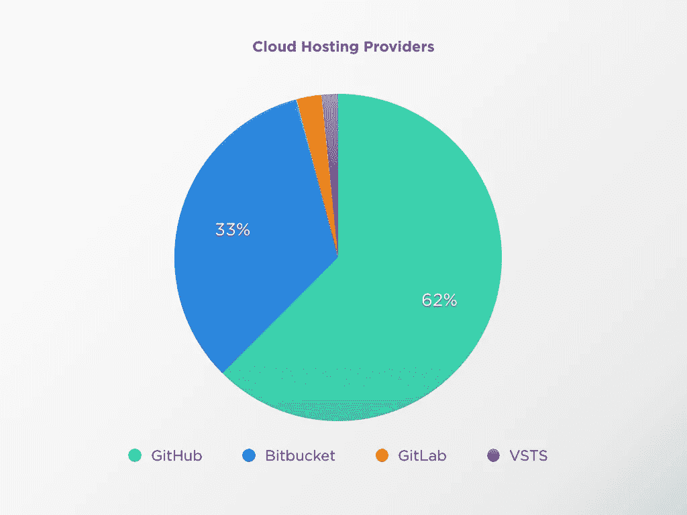

# 使用 dotenv-expand 控制 Node.js 上的环境变量

> 原文：<https://itnext.io/master-environment-variables-on-node-js-with-dotenv-expand-f9724b310bc7?source=collection_archive---------0----------------------->


克里斯汀娜面粉在 [Unsplash](https://unsplash.com?utm_source=medium&utm_medium=referral) 上拍摄的照片

# 介绍

作为开发人员，我们发现自己经常处于这样的情况:我们不仅需要保护某些数据或变量免受潜在的攻击，还需要保护它们免受用户的攻击。当开发一个移动应用程序、一个 web 平台、甚至一个单页面应用程序时，我们使用不同的库或第三方服务(例如用于定位的谷歌地图、用于登录的脸书或谷歌，等等)，以及 API 凭证(在我们自己的服务器或外部服务器上)，和用于远程连接的 SSH-keys。综合来说，我们说的是敏感信息。

为了保证代码的安全，我们可以将代码存放在不同的存储库中，比如最常用的 GitHub、GitLab 和 Bitbucket。最近科技巨头微软对 Github 的[收购，使得大多数用户根据他们需要的功能和他们对每个平台的感受来评估他们正在使用的存储库。下图反映了提供商的实际份额:](https://blogs.microsoft.com/blog/2018/10/26/microsoft-completes-github-acquisition/)



# 什么是环境变量？

环境变量是在描述您的环境的系统中定义的变量。大概你在编辑 **~/的时候已经用过这种变量了。bash_profile** 文件，或者当你做一个**导出路径时。**但这些变量都是系统层面的。我们可以在那里定义我们想要的所有变量，但是想象一下，有多个应用程序，它们有自己的环境变量，可能需要它们的不同工具，如 Android Studio 和 Java 开发工具包，甚至是您过去可能已经定义过的键和快捷键。

## Node.js 的解决方案

除了系统级别，Node.js 还提供了一个现成的解决方案:dotenv。当 Node.js 流程在运行时启动时，它将通过创建一个对象(从现在开始为 env)作为流程全局对象的属性，自动提供对所有现有环境变量的访问。

您可以在 Node.js 中键入以下命令来检查您的 env 变量:

```
console.log(process.env);
```

## . env 文件的重要性

在我们的根文件夹中有一个. env 文件不仅可以让我们更容易地管理变量。利用 gitignore 忽略将要上传到存储库的文件，我们可以隐藏我们的。env 文件只在本地可用，所以它不会出现在您的存储库中。

假设我们正在开发一个 Node.js 项目，该项目包含一个 MongoDB 数据库连接查询，通常如下所示:

```
db.mongoose
.connect(`mongodb://**username**:**password**@**localhost**:**27017**/**my-mongodb-server**`, {
 useNewUrlParser: true,
 useUnifiedTopology: true,
 useCreateIndex: true,
 useFindAndModify: true
 })
```

在本例中，我们公开了我们的用户名、密码、主机及其相应的端口和数据库名称。一个人远程连接到我们的数据库并访问我们的信息所需的所有信息。

建议的解决方案是将所有信息转移到我们的隐藏文件中，格式为 **key=value** 。约定是大写键，值应该是字符串。在您的项目根文件夹中创建(或者修改现有的)一个名为**的文件。env** ，内容如下:

```
MONGODB_USERNAME=testuser
MONGODB_PASSWORD=testpassword
MONGODB_HOST=localhost
MONGODB_PORT=27017
MONGODB_SERVERNAME=my-mongodb-server
```

现在，我们可以将代码更新为以下内容:

```
db.mongoose
.connect(`mongodb://${**process.env.MONGODB_USERNAME}**:${**process.env.MONGODB_PASSWORD}**@${**process.env.MONGODB_HOST}**:${**process.env.MONGODB_PORT}**/${**process.env.MONGODB_SERVERNAME}**`, {
 useNewUrlParser: true,
 useUnifiedTopology: true,
 useCreateIndex: true,
 useFindAndModify: true
 })
```

如果我们正确地添加到。gitignore 文件为**的异常。env** 文件，这个文件不会被推送到我们的存储库，所以如果任何人有机会访问我们的代码，敏感信息将不会出现在代码中。请记住，我们的 env 文件只在我们的系统中可用。如果我们将代码推送到外部服务器，比如 DigitalOcean 或 Amazon Web Services，我们也需要在那里创建 env 文件，以便被使用。

一个好的做法是在源代码存储库中创建并更新一个. sample-env 文件(这个文件是提交和推送的)，这样您就可以跟踪您正在使用的变量。否则，您可能会多次阅读代码，以检查是否遗漏了一个变量。

使用简单环境变量的另一个简单例子是设置 Express.js 应用程序的端口。我们检查我们的。env 文件；如果没有定义端口，我们将默认值设置为 3000:

```
const PORT = process.env.PORT || 3000;

app.listen(PORT, () => {
  console.log(`Listening on PORT: ${PORT}`);
});
```

注意:这也可以通过执行我们的节点应用程序并在同一个命令中发送变量来实现:

```
PORT=3001 node server.js# for multiple env variables:
PORT=3001 MONGODB_USERNAME=testuser node server.js
```

实际上，上述步骤是 Node.js 上环境变量的最简单用法。环境文件、加载失败等。出于这个原因，大多数开发人员选择使用 Node.js 的 [dotenv 工具。](https://github.com/motdotla/dotenv)

# 什么是 dotenv？

Dotenv 是一个零依赖模块，它基于[十二因素应用方法](https://12factor.net/config)将环境变量从. env 文件加载到 process.env 中。它具有一些功能，如预加载、路径配置、编码等等。

在新的或现有的项目中使用它就像用 npm 或 yarn 安装它一样简单:

```
# With NPM
npm install dotenv# With Yarn
yarn add dotenv
```

## 简单用法

正如 12 因素应用程序方法所建议的那样，我们应该将环境变量存储在应用程序的配置中，这些变量在不同的部署之间可能会有所不同，包括:

*   数据库、Memcached 和其他后台服务的资源句柄
*   外部服务的凭证，如亚马逊 S3 或脸书
*   每个部署的值，例如部署的规范主机名

dotenv 的简单用法是要求和配置 Dotenv:

```
require('dotenv').config();
```

使用建议的格式在项目的根目录下创建一个. env 文件:

```
MY_VALUE=my-key
```

我们可以在 Node.js 中使用它:

```
console.log(process.env.MY_VALUE);
```

## 预加载 dotenv

您可以使用—要求命令行选项来预加载 dotenv。通过这样做，您不需要在应用程序代码中要求和加载 dotenv:

```
node -r dotenv/config your_script.js
```

## 利用配置功能

config 将读取您的。env 文件，解析内容，将其分配给 process.env，并返回一个对象，该对象带有包含加载内容的解析键，如果失败，则返回一个错误键。

```
const result = dotenv.config()

if (result.error) {
  throw result.error
}

console.log(result.parsed)
```

拥有一个**配置**的重要性在于我们可以额外传递它选项。我们可以设置自定义路径(选项#1)来指定文件定位时的自定义路径，我们可以指定编码(选项#2)或者我们可以打开日志来帮助调试(选项#3)以及其他功能。

```
# Option 1
require('dotenv').config({ path: '/custom/path/to/.env' });# Option 2
require('dotenv').config({ encofing: 'latin1' });# Option 3
require('dotenv').config({ debug: process.env.DEBUG });
```

# 使用 dotenv-expand 升级到全部功能

[Dotenv-expand](https://github.com/motdotla/dotenv-expand) 是一个 NPM 库，它在我们之前使用的 Dotenv 库的基础上增加了变量扩展。
它允许我们使用动态字符串格式，能够使用如下所示的. env 文件:

```
MONGODB_USERNAME=testuser
MONGODB_PASSWORD=testpassword
MONGODB_HOST=localhost
MONGODB_PORT=27017
MONGODB_SERVERNAME=my-mongodb-server
MONGODB_URI=mongodb://${MONGODB_USERNAME}:${MONGODB_PASSWORD}@${MONGODB_HOST}:${MONGODB_PORT}/${MONGODB_SERVERNAME}
```

正如我们所看到的，我们使用了用户名、密码、主机、端口和服务器名称变量来导出一个 URI 变量，将过去的字符串连接起来。这样我们可以增加复杂性和动态字符串。

# 结论

环境变量存在于应用程序代码之外，一旦 Node.js 进程启动，它们就可用了。它们可以用来将应用程序的配置从代码中分离出来，隐藏秘密的 API 密钥、用户名、密码和敏感数据，以及其他功能。当我们在私人项目以及协作环境(如 work 或开源项目)中工作时，如果您想避免与其他人共享您的数据库登录凭证或您的 Github 数据，这是很有帮助的。使用 dotenv-expand，我们可以轻松地添加动态字符串，以充分利用 dotenv 的全部功能。这只是一个介绍性的教程，我们可以用 dotenv 实现的事情有几种方法，所以请随意使用这个库，看看它如何利用您的代码。