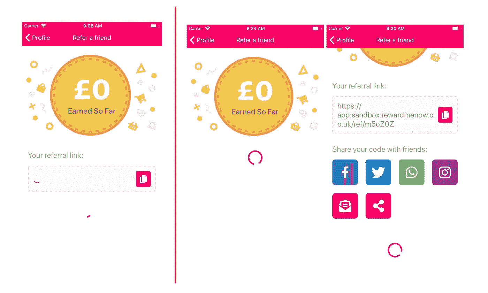
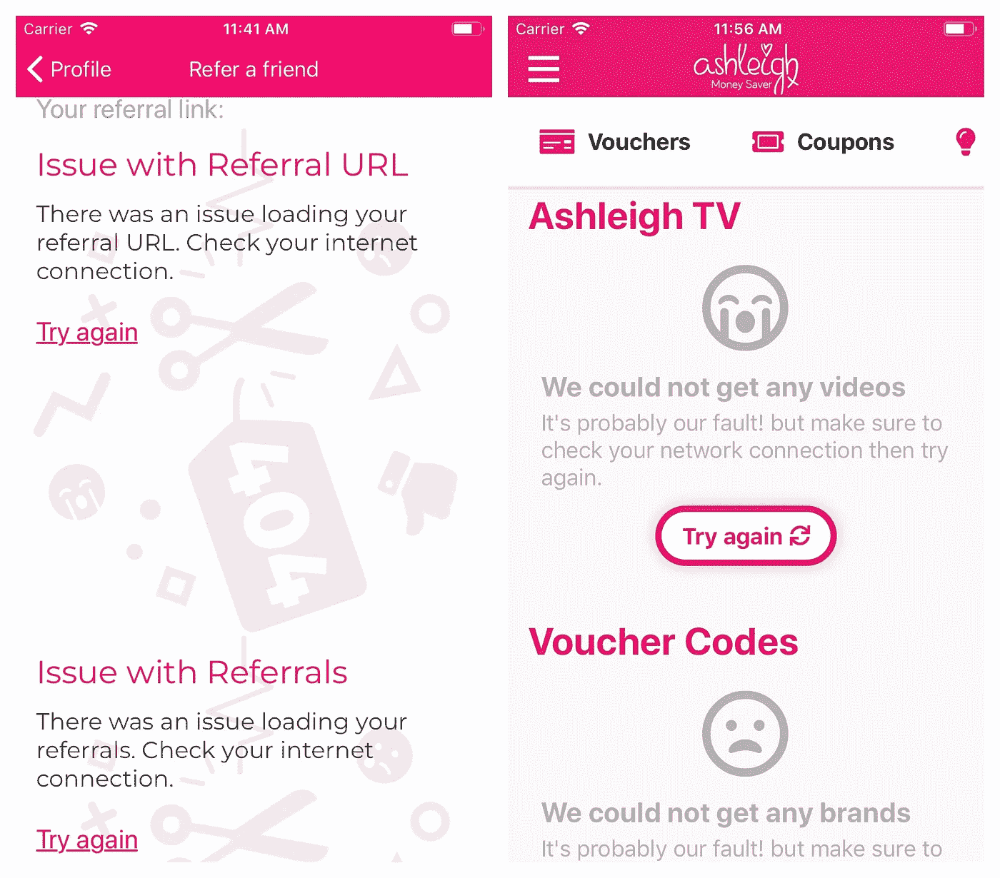
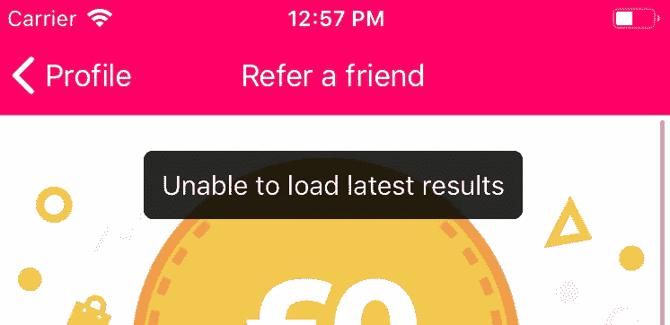

# React Native 中的主列表:列表之外

> 原文：<https://itnext.io/master-lists-in-react-native-beyond-the-list-3a80dcd85522?source=collection_archive---------6----------------------->

在 React Native 的[主列表(第 1 部分)](/master-lists-in-react-native-54b485de56f5)中，我们探讨了在一个不可预见的多状态世界中设计列表的概念。今天，我们将重温和扩展列表状态的概念。每个事实都是半个事实，在幻觉的背后，第一篇文章中概述的数据和无数据列表状态更加复杂。

> 事实上，所有类型的异步请求都存在这些状态。

不可能的异步状态管理

同学们，要解决这个问题，我们必须勾画出问题空间。我们在和什么类型的黑暗势力战斗？**异步请求会产生多种可能的状态，我们的接口需要适应这些状态。**

为了解决这个问题，我们可以看看我们的接口需要处理的可能状态:

*   已完成(大多数情况下都有数据)
*   错误(就像 React Native (Part 1) 中的[主列表一样，有各种类型的错误)](/master-lists-in-react-native-54b485de56f5)
*   正在加载(异步请求正在进行中)
*   空(没有可用数据，但不是因为错误)

现在仔细听工程师、设计师和艺术家们说。问题不在于我们如何处理列表中的这些状态，而在于……我们如何构建一个通用的接口来响应异步请求产生的过多状态？

为了解决这个问题，我们将分析一个手机应用程序中“推荐朋友”的屏幕。

推荐朋友屏幕

这个屏幕由两部分数据组成，一部分是附加到我们的用户对象的引用 URL，另一部分是属于它自己的独立端点的引用列表。要检索该屏幕的数据，必须执行两个异步操作。

# 问题

## 指标爆发

在我看来，当我们遇到屏幕上有多个加载指示器的情况时，体验会受到影响，应用程序的质量也会下降。在某些情况下，这可能是我们想要的，而在其他情况下，它不是。作为开发人员，我们需要控制应用程序这方面的能力。

多个装载指示灯(**左** — **不良** ) /单个指示灯(**右** — **良好**

在上图中，左边是我们试图避免的体验，右边是我们想要建立的体验。

## **iFrame UX**

这个问题被称为 iFrame UX，因为我们在屏幕上有多个回退。如果我们将屏幕的多个部分连接到不同的数据源，就会出现这种情况。反常的是，有时这是我们想要发生的(右例)，而在其他情况下却不是(左例)。

使用相同的技术:回退处理(**左** — **坏**)，回退处理(**右** — **好**)

在上图中，我们看到了每个数据源的回退何时可行，何时不可行的例子。在左图中，整个屏幕的一个回退效果会更好。在右边的图像中，每个部分的后退是我们想要的。作为开发人员，我们需要灵活性来控制这一点。

## 短暂过载

这个问题的出现是因为我们需要跟踪大量的变量来提供有说服力的体验。如果我们使用 REST API，我们的屏幕通常由来自不同端点的各种数据组成。这意味着多重加载、错误和空状态🌀。

[https://gist . github . com/lukebrandonfarrell/558 d0e 758 db 2 a 3d 4c 5 E0 f 86 f 5873 D8 f 6](https://gist.github.com/lukebrandonfarrell/558d0e758db2a3d4c5e0f86f5873d8f6)

上面是我们的 referral 屏幕的一个片段，其中包含一些用于跟踪加载、错误和空状态的变量。当我们添加更多的异步数据源时，这变得更加复杂。

# 解决方法

## 异步边界

为了解决“指示器爆发”和“iFrame UX”问题，我们需要某种包装器组件，它将接受异步操作的当前状态并提供回退。作为开发人员，我们应该能够使用多个这样的包装组件，这样当部分界面准备好了，我们就可以显示它了。我们不希望整个界面都在加载，显示一个错误，空的；如果只有一部分失败了…

但是！在某些情况下，显示完整接口的错误是有意义的，即使它的一部分失败了。

我们需要能让我们做到这一点的东西…悬念…

<asyncboundary>([https://gist . github . com/lukebrandonfarrell/BF3 ad 19 f 0009 fa 0e 052209 f 926 be 2c 53](https://gist.github.com/lukebrandonfarrell/bf3ad19f0009fa0e052209f926be2c53))</asyncboundary>

上面的代码与`[<Suspense />](https://reactjs.org/docs/concurrent-mode-suspense.html)`无关，目前处于实验阶段。使用上面的组件，您能够为错误、空和加载状态提供回退。一个`<AsyncBoundary />`可以有子异步边界，允许您在粒度级别上控制加载指示器和回退。默认情况下，加载和错误不会优先于数据，如第 1 部分所述:*“我们不希望错误和加载优先于我们的数据”*。

阅读上面的代码，看看它是否对你有用，如果需求足够，我会发布详细的文档。

## 状态约束

“短暂过载”的问题不需要用代码来解决。它需要更好地理解我们的接口中与异步操作相关的各种状态和子状态，这样我们就可以在我们的组件之间保持一致性。这些状态可以分为三种类型；**核心状态**、**派生状态**和**跟踪状态**。

**核心状态**

这是任何异步操作的典型状态。

*   数据(我们希望在界面上显示的数据)
*   正在加载(请求正在进行中)
*   isError(请求有错误)

还值得注意的是，我们可以跟踪 HTTP 状态代码，它可以为我们提供有关错误的更多信息，例如 401 未授权-显示登录按钮，500 内部服务器错误-出错回退。

**派生状态**

该状态可以根据您的要求从**核心状态**中的三个变量中导出。

*   isEmpty(数据可用)

如果我们想只在数据可用时显示界面的某个部分，例如“推荐朋友”屏幕上的页脚，这个状态就很重要。

“推荐朋友”页脚

*   isRefreshing(有数据可用时请求正在进行)

在 React Native(第一部分)中的[主列表中，我们了解到可以用下面这个简单的公式来导出列表的刷新状态:`!isEmpty && isLoading`。这是一个很好的指标，表明刷新操作已经发生，但是当我们只使用`isLoading`作为一个指标来导出这个状态时，这可能会变得有点复杂。](/master-lists-in-react-native-54b485de56f5)

让我解释一下。在我们的“推荐朋友”应用程序中，每次打开应用程序时，我们还会发出一个请求来获取推荐列表和用户。意味着当应用程序关闭/打开时，我们的`isLoading`标志将被设置为`true`，我们的`isRefreshing`标志也将被设置为`true`。

如果我们在`isRefreshing`为`true`时在屏幕上显示指示器，那么打开和关闭应用程序将被视为用户下拉列表，因此当他们打开应用程序时会显示一个加载指示器。这是一个小细节，也许你会觉得很舒服。这将我们带到**跟踪状态**。

**跟踪状态**

我们必须明确跟踪每个组件的状态。

*   正在刷新

让我们把我们的`isRefreshing`变量想象成一个表示用户已经开始刷新的值。为了解决上面的问题，当应用程序而不是用户发起请求时应用程序的刷新，我们必须手动跟踪`isRefreshing`状态；`const [isRefreshing, setIsRefreshing] = useState(false)`。当用户执行一个刷新动作时，你想把这个状态设置为`true`，当请求完成时，你想把它设置为`false`。

*   isPaginating(仅用于列表)

就像刷新一样，分页需要被显式地跟踪，当一个用户动作发生时；`const [isPaginating, setIsPaginating] = useState(false)`。这将允许您仅在用户发起分页动作(例如，滚动到底部)时显示加载指示器。

还有许多其他的**跟踪状态**用例，比如在列表的情况下，与项目交互、每个项目的加载状态以及单个项目的回退。这些将在第 3 部分中讨论。

# 结论

您仍然希望将您的接口视为*数据可用* / *数据不可用。*当数据不可用时，您希望显示回退。如果数据可用，那么您希望将问题通知给用户。下面是使用 [React 本地操作提示](https://github.com/lukebrandonfarrell/react-native-action-tips)向用户显示通知的代码片段。例如当刷新失败时。

[https://gist . github . com/lukebrandonfarrell/df 152 B1 e 8416 a 02 CD 976 F3 BD 1240 ab9 a](https://gist.github.com/lukebrandonfarrell/df152b1e8416a02cd976f3bd1240ab9a)

网络错误的操作提示

总有一天会有一个第三方库来缓解这种复杂性，目前，这些问题取决于我们。