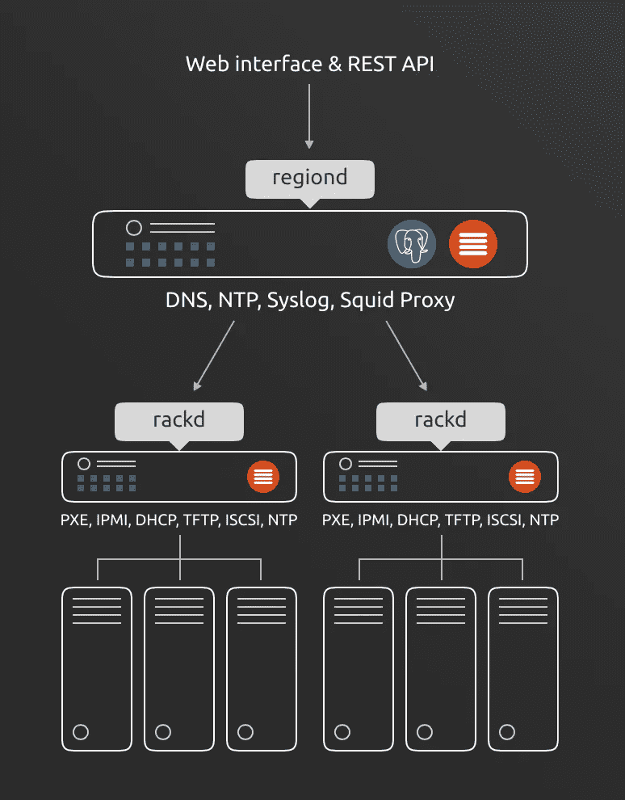

# 金属即服务:MAAS 供应工具简介

> 原文：<https://itnext.io/metal-as-a-service-intro-to-maas-provisioning-tool-f18fc66ad4f0?source=collection_archive---------2----------------------->

“即服务”模式根据企业/用户的需求以不同的形式展现出来。如基础设施即服务(IaaS)、平台即服务(PaaS)、软件即服务(SaaS)。什么是“即服务”模式？简而言之，根据需求租用业务所需的服务(可能是基础设施、平台、软件，有时是功能)。在这一“即服务”系列中，另一个新增产品是“MaaS ”,即金属(裸机)即服务。我们可以根据名字本身很快猜出它是什么。我们从服务提供商那里租赁裸机(真正的物理硬件),而不是自己购买。其优势在于，客户无需花费更高的资本支出成本来购买真正的物理硬件，并且可以降低管理该硬件所需的运营支出成本。

有人可能会问，当我们有其他“即服务”模式时，对 MaaS 的需求是什么？答案很简单，对于您希望在该硬件上使用什么操作系统映像/工具，您没有任何限制。例如，在 PaaS 模型中，提供商可以限制用户仅使用提供商支持的某些图像。从业务角度来看，这种 MaaS 模式分为两种类型，即“自我管理”和“供应商管理”。这种分类是根据谁在管理存储在硬盘中的基本映像、应用程序数据备份和恢复的安装来完成的。与设置我们的家用电脑相比，提供 MaaS 并不那么简单。除了布线之外，它还要做很多事情。例如在投入生产之前对所有机器进行质量测试，发现资源，然后根据需求进行扩展，等等。这就是 MAAS 配置工具的重要性所在。

有人可能会问 IaaS 和 MaaS 之间有什么区别，因为 IaaS 资源是在多租户环境中分配的(共享)，而在 MaaS 中，裸机专用于特定客户。

> MAAS 是一个开源工具，通过提供发现、调试、部署、动态重新配置和测试等功能，帮助管理由单个单元组成的大型网络。

MAAS 供应工具架构

广义上讲，MAAS 有两个主要组件:区域控制器(regiond)和机架控制器(rackd)。“regiond”将负责通过 ReST API 为运营商请求提供服务。“rackd”将负责提供 DHCP、ICMI、PXE 和分布式等服务。“rackd”实际上并不参与用户流量的数据路径。它提供了用于管理放置在机架中的裸机的界面，如发现、部署。MAAS 工具如何与裸机通信/控制？让我们来看看它是如何发现机器并将其资源纳入库存以便进一步分发的。这是在 PXE BMC 的帮助下实现的。

> BMC 是智能平台管理接口[IPMI]的一部分，通常包含在主板中，其职责是监控和报告服务器、计算机或网络设备的状态。状态包括温度、电源、操作系统功能。

> PXE 是网络引导的客户机/服务器标准化[操作系统引导使用来自网络的映像进行检索]。

MAAS 的好处是，它不仅能够管理裸机，还可以通过管理虚拟机来帮助最大限度地提高硬件资源利用率，这些虚拟机将运行在物理机之上，具有为裸机定义的相同 API 集和生命周期。利用 KVM 调配/管理虚拟机(最近支持 ESXi)。这一点增强了 MAAS 在资源有限的边缘计算中的作用。

> KVM 是第 1 类(裸机)虚拟机管理程序。所有管理程序都需要一些组件，如内存管理、进程调度程序、网络堆栈、设备驱动程序。KVM 拥有所有这些组件，因为它是 Linux 内核的一部分。

MAAS 具有以下管理裸机和虚拟资源的生命周期。诸如

*   新:当 MAAS 通过 PXE 引导检测资源。
*   试运行:当 MAAS 检索并更新其关于 CPU、RAM 等信息的清单时。
*   就绪:完成启动/停止机器的基本配置后。
*   已分配:当资源分配给用户用于生产时。
*   部署:当用户启动操作系统映像的全新启动时。
*   释放:当用户完成工作并释放回空闲池时。

此外，MAAS 通过在 cloud-init 函数的帮助下运行测试来确保机器的质量，然后将其标记为生产就绪。最重要的是，您可以使用 Juju、Chef 等工具自动化所有流程。

我希望这篇文章能够对 MAAS 模型和 MaaS 供应工具有一个高层次的概念性理解。

> "帮助别人，即使你知道他们不能帮你回来！"

如前所述，安德鲁·金帮我拿到了一些我不抱任何期望地急切等待的学习资料。谢谢你安德鲁。