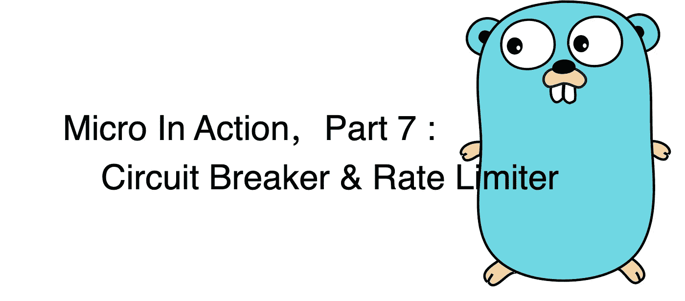

# 微操作，第 7 部分:断路器和限速器

> 原文：<https://itnext.io/micro-in-action-7-circuit-breaker-rate-limiter-431ccff6a120?source=collection_archive---------3----------------------->



微在行动

这是“微在行动”系列文章的第 7 篇，讨论微。我们将从基本概念和主题开始，然后转向高级功能。

今天的话题是断路器和限速器。

断路器和速率限制器是大型系统架构中的重要主题。当我们开始将单片系统分割成分布式微服务时，这些主题变得更加重要。如果没有断路器和速率限制器，系统很容易因单个组件的故障而遭遇“雪崩”效应，从而导致整个系统的崩溃。

在 Micro 的可插拔架构下，可以非常容易地引入上述机制。我们知道 Micro 支持用中间件包装请求。这些中间件中最重要的两个是:

1.  **微。WrapClient，**，用于包装出站请求，也称为客户端包装
2.  **微。WrapHandler，**，用于包装入站请求，也称为服务器端包装

这两类中间件分别适用于断路器和限速器的场景。下面我们举例说明如何使用这些中间件来提高系统的健壮性。

# 断路器

一般来说，这样一个常见的功能并不需要我们自己开发。社区里已经有优秀的开源库，比如 [hystrix-go](https://github.com/afex/hystrix-go/) 、 [gobreaker](https://github.com/sony/gobreaker) 。

此外，Micro 还提供了适配上述库的插件如 [hystrix 插件](https://github.com/micro/go-plugins/tree/master/wrapper/breaker/hystrix)和 [gobreaker 插件](https://github.com/micro/go-plugins/tree/master/wrapper/breaker/gobreaker)。

在这些插件的帮助下，在 Micro 中使用断路器变得非常容易。以 hystrix 为例:

```
import (
...
  **"github.com/micro/go-plugins/wrapper/breaker/hystrix/v2"**
...
)func main(){
...
  // New Service
  service := micro.NewService(
     micro.Name("com.foo.breaker.example"),
     **micro.WrapClient(hystrix.NewClientWrapper())**,
  )
  // Initialise service
  service.Init()
...
}
```

我们所需要做的就是在`service`创建期间分配 hystrix 插件，

从现在开始，所有对远程服务的调用都将被插件跟踪。当请求超时或并发数达到限制时，将立即向调用者返回一个错误。

那么并发和超时的默认限制是什么呢？答案就在 *hystrix-go* 插件的源代码中。查看**github.com/afex/hystrix-go/hystrix/settings.go**你会看到几个包级变量:

```
...
   // DefaultTimeout is how long to wait for command to complete, in milliseconds
   **DefaultTimeout** = 1000
   // DefaultMaxConcurrent is how many commands of the same type can run at the same time
   **DefaultMaxConcurrent** = 10
...
```

所以默认超时是 1 秒，默认并发限制是 10。

注意:除了这两个之外还有更多设置，但是对它们的讨论超出了本文的范围。有兴趣可以去 *hystrix-go* 库的[官网](https://github.com/afex/hystrix-go/)了解详细文档。

如果默认设置不符合我们的要求，您可以按如下方式进行修改:

```
import (
...
 **hystrixGo "github.com/afex/hystrix-go/hystrix"**  "github.com/micro/go-plugins/wrapper/breaker/hystrix/v2"
...
)func main(){
...
  // New Service
  service := micro.NewService(
     micro.Name("com.foo.breaker.example"),
     micro.WrapClient(hystrix.NewClientWrapper()),
  )
  // Initialise service
  service.Init()
  **hystrixGo.DefaultMaxConcurrent = 3**//change concurrrent to 3
  **hystrixGo.DefaultTimeout = 200** //change timeout to 200 milliseconds...
}
```

如代码所示，我们可以更改默认超时和并发限制

你可能对 **DefaultMaxConcurrent** 有疑问:它的范围是什么？假设有 3 个服务，每个服务有 3 种不同的方法。我们想同时调用所有这些方法。是否意味着我们必须将 **DefaultMaxConcurrent** 设置为大于 3*3 的数才能实现完全并发？

要回答这个问题，需要搞清楚两点:

一、 **DefaultMaxConcurrent** 的目标是什么？从 hystrix 文档中可以看到，这是 hystrix 中的**命令**:

> DefaultMaxConcurrent 是同一类型的命令可以同时运行的数量

接下来，你需要知道 hystrix 插件如何处理不同方法和**命令**之间的映射。查看**github . com/micro/go-plugins/wrapper/breaker/hy strix/v2/hy strix . go**，你会发现相关代码如下:

```
import(
  "github.com/afex/hystrix-go/hystrix"
  ...
)
...func (c *clientWrapper) **Call**(ctx context.Context, req client.Request, rsp interface{}, opts ...client.CallOption) error {
   return **hystrix.Do**(**req.Service()+"."+req.Endpoint()**, func() error {
      return c.Client.Call(ctx, req, rsp, opts...)
   }, nil)
}
...
```

注意`req.Service () + “.” + Req.Endpoint ()`，这是 hystrix 的**命令**。并且**命令**不包含节点信息，这意味着对于同一业务，无论是单节点部署还是多节点部署都没有区别，所有节点共享一个限制。

至此，很清楚了:每个服务的每个方法都独立计数，互不影响。 **DefaultMaxConcurrent** 的范围是*方法级*，不考虑节点数。

在实践中，不同的方法可能需要不同的限制。如何实现这一点？从上面的源代码中，我们知道一个服务方法被映射到一个 hystrix **命令**，hystrix 通过`hystrix.ConfigureCommand`支持对不同命令的独立控制:

```
...
hystrix.ConfigureCommand("**com.serviceA.methodFoo**",
   hystrix.CommandConfig{
      MaxConcurrentRequests: 50,
      Timeout:               10,
   })
hystrix.ConfigureCommand("**com.serviceB.methodBar**",
   hystrix.CommandConfig{
      Timeout: 60,
   })
...
```

通过上面的代码，我们为不同的方法设置了不同的限制。如果没有指定`hystrix.CommandConfig`结构的任何字段，将使用系统默认值。

总结:断路器作用于客户端。通过适当的阈值，它可以确保客户机资源不会耗尽。即使它所依赖的服务不健康，客户端也会很快返回一个错误，而不是让调用者等待很长时间。

# 限速器

与断路器类似，限速也是分布式系统中常用的功能。不同的是，速率限制器在服务器端生效，它的作用是保护服务器:一旦请求处理的速度达到预设的限制，服务器就不再接收新的请求，直到正在处理的请求完成。限速器可以避免服务器因大量请求而崩溃。

这里打个比方:假设我们经营一家可以容纳 10 位客人的餐厅。如果 100 位客人同时来吃饭，最好的处理方法是选择前 10 位来服务，并告诉其他 90 位客人:我们目前无法服务，请改天再来。虽然这 90 位客人会不开心，但我们保证至少前 10 位客人能吃到开心餐。

没有限速器，结果就是 100 个客人进餐厅，厨房忙不过来，所有客人都没地方坐。没有人能得到服务。整个餐厅最终陷入瘫痪。

在 Micro 中使用速率限制器也非常简单。我们只需要一行代码就可以实现这一点。目前有两个速率限制器插件可用。本文以[优步速率限制器插件](https://github.com/micro/go-plugins/tree/master/wrapper/ratelimiter/uber)为例(当然，如果现有插件不符合要求，您随时可以自行开发更合适的插件)。让我们修改源文件 **hello-service/main.go** :

```
package mainimport (
...
   **limiter "github.com/micro/go-plugins/wrapper/ratelimiter/uber/v2"**
...
)func main() {
   const *QPS* = 100
   // New Service
   service := micro.NewService(
      micro.Name("com.foo.srv.hello"),
      micro.Version("latest"),
      **micro.WrapHandler(limiter.NewHandlerWrapper(***QPS***)),**
   )...}
```

上述代码为 **hello-service** 添加了服务器端速率限制器，QPS 上限为 100。此限制由该服务中所有处理程序的方法共享。换句话说，这种限制的范围是服务级别的。

# 最后的话

断路器和限速器都很重要。由于 Micro 的可插拔架构，我们可以轻松地应用这两个重要的功能。

断路器的作用是保护客户端不被外部服务问题拖累，始终快速响应(即使出错也比长时间等待好)。始终避免过度消耗资源。

而限速器的作用是保护服务器。只处理其能力范围内的流量，实现过载保护。当流量超过预设限制时，会立即返回错误。

断路器和限速器的组合体现了一种设计哲学:**永远先对自己负责，**一个组件无论外部依赖状态如何，都要保证其鲁棒性。

当这种理念应用到分布式系统的每个组件时，系统将变得非常强大和有弹性，不会被突然的流量高峰淹没。

所以在分布式系统的开发中应该遵循这样一个最佳实践:**给每个服务添加断路器和速率限制器**。在开始，它可以是粗粒度的限制。随着业务的发展，控制可以逐渐细化。最后，每个服务都会得到与之匹配的特定限制策略。

未完待续。

另请参见:

*   [Micro In Action，第 1 部分:入门](/micro-in-action-getting-started-a79916ae3cac)
*   [Micro In Action，第 2 部分:Bootstrap 终极指南](/micro-in-action-part-2-71230f01d6fb)
*   [微操作，第 3 部分:调用服务](/micro-in-action-part-3-calling-a-service-55d865928f11)
*   [微在行动，第 4 部分:发布/订阅](/micro-in-action-part4-pub-sub-564f3b054ecd)
*   [Micro 在行动，第 5 部分:消息代理](/micro-in-action-part-5-message-broker-a3decf07f26a)
*   [微在行动，第 6 部分:服务发现](/micro-in-action-part6-service-discovery-f988988e5936)
*   [微操作，Coda:分布式 Cron 作业](/micro-in-action-coda-distributed-cron-job-a2b577885b24)
*   [微在行动的索引页](https://medium.com/@dche423/micro-in-action-1be29b057f2d)