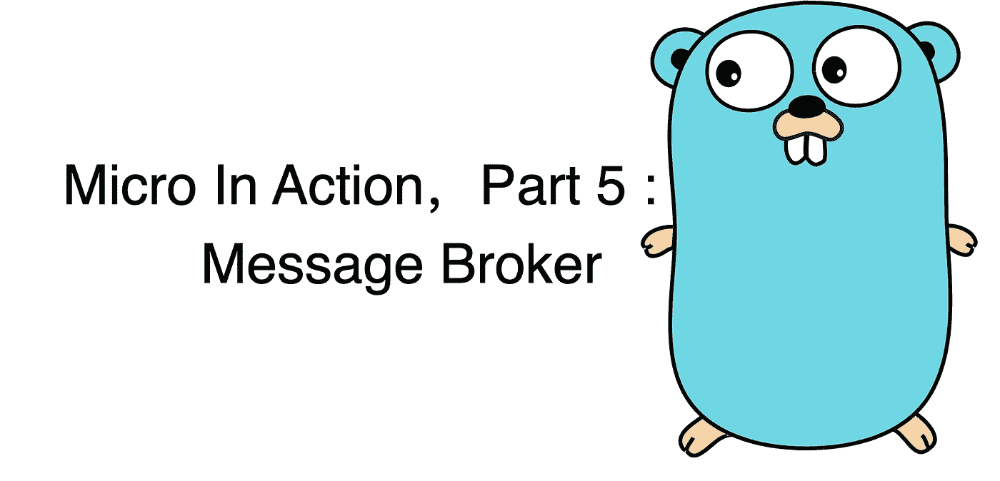

# Micro 在行动，第 5 部分:消息代理

> 原文：<https://itnext.io/micro-in-action-part-5-message-broker-a3decf07f26a?source=collection_archive---------6----------------------->



微在行动

这是“微在行动”系列文章的第 5 篇，讨论[微](https://micro.mu/)。我们将从基本概念和主题开始，然后转向高级功能。

今天的主题是消息代理。

在[上一篇文章](/micro-in-action-part4-pub-sub-564f3b054ecd)中，我们讨论了如何在 Micro 中使用 Pub/Sub。它的优点是简单，缺点是缺乏灵活性。如果您想控制发送和接收消息的底层细节，您将需要接口`github.com/micro/go-micro/v2/broker.Broker`。

这个接口是微处理器中异步消息处理的核心。其实 Pub/Sub 也是建立在上面的。

这是一个优雅的设计。它使得 Micro 像任何其他设计良好的框架一样，具有一个有价值的特性:**提供高层次的抽象，同时允许访问底层 API** 。

高级抽象适用于大多数场景，可以极大地简化问题。低级 API 用于不适合前者的不常见场景，对开发者没有太多限制。

首先，让我们看一个使用`broker.Broker`处理消息的例子。

下面我们将解释代码的关键部分。

# 主要功能

```
func main() {
   // New Service
   service := micro.NewService(
      micro.Name("**com.foo.broker.example**"), // name the client service
   ) // Initialise service
   service.Init(**micro.AfterStart**(func() error {
      **brk** := service.Options().Broker
      if err := brk.**Connect**(); err != nil {
          log.Fatalf("Broker Connect error: %v", err)
      }
      go **sub**(brk)
      go **pub**(brk)
      return nil
   }))service.Run()
}
```

*   首先，创建一个名为 **com.foo.broker.example** 的`micro.Service` 实例
*   然后用选项`micro.AfterStart`初始化`service`实例。我们可以确保只有在服务启动后代理才准备好。
*   在回调函数中，我们获取`broker.Broker`的实例，然后将其传递给函数`sub`和`pub`，这两个函数分别用于接收和发送消息。

# 功能 sub，订阅消息

```
func sub(**brk** broker.Broker) {
   // subscribe a topic with queue specified
   _, err := **brk.Subscribe**(topic, func(p **broker.Event**) error {
      fmt.Println("[sub] received message:", string(p.Message().Body), "header", p.Message().Header)
      return nil
   }, **broker.Queue(topic)**)
   if err != nil {
      fmt.Println(err)
   }
}
```

传入一个`broker.Broker`的实例，然后调用它的方法`Subscribe`。方法签名如下:

```
type **Event** interface {
   Topic() string
   Message() *Message
   Ack() error
}type **Handler** func(**Event**) errortype **Broker** interface {
    ...**Subscribe**(topic string, handler **Handler**, opts ...SubscribeOption) (Subscriber, error)

    ...
}
```

第一个参数是订阅主题。

第二个参数是一个事件处理程序，它是一个回调函数，在接收到新事件时将被执行。这个处理程序的参数是`broker.Event`，从中可以获取主题和消息对象`*broker.Message`。此外，该接口提供了用于手动确认的方法`Ack`(通常与`DisableAutoAck`选项一起使用，这将在下一段中解释)。

第三个参数是`broker.SubscribeOption`，其含义与[上篇](/micro-in-action-part4-pub-sub-564f3b054ecd)中提到的`server.SubscriberOption`一致。Micro 中有三个内置的订阅选项，`broker.DisableAutoAck, broker.Queue, broker.SubscribeContext`，它们与`server.SubscriberOption`也是一致的。不同之处在于，任何代理插件都可以实现额外的`broker.SubscribeOption`，提供特定于插件的功能。

例如， [RabbitMQ 插件](https://github.com/micro/go-plugins/tree/master/broker/rabbitmq)提供了一个名为 **DurableQueue** 的选项来控制队列的持久性:

```
...
import "github.com/micro/go-plugins/broker/rabbitmq"
..._, err := broker.Subscribe(topic, func(p broker.Event) error {
   ...
   p.**Ack**()
   return nil
}, broker.Queue(topic), **broker.DisableAutoAck(),** **rabbitmq.DurableQueue()，**)
```

注意:当使用选项`DisableAutoAck`时，我们也调用`Ack`方法来手动确认。

如[上一篇文章](/micro-in-action-part4-pub-sub-564f3b054ecd)所述，除了 RabbitMQ 插件，还有其他可用的 broker 插件如 Kafka 插件、NSQ 插件等。所有这些插件和选项都可以以同样的方式使用。

在这个例子中，我们遵循前面提到的最佳实践:**总是显式地设置队列名**。所以我们将`broker.Queue (topic)`作为该方法的第三个参数。

到目前为止，函数`sub`已经完成了消息订阅。当收到新消息时，将输出消息头和消息体的日志。

# 功能发布，发布消息

```
func pub(**brk** broker.Broker) {
   i := 0
   for range time.Tick(time.*Second*) {
      // build a message
      msg := **&broker.Message**{
         **Header**: map[string]string{
            "id": fmt.Sprintf("%d", i),
         },
         **Body**: []byte(fmt.Sprintf("%d: %s", i, time.Now().String())),
      }
      // publish it
      if err := **brk.Publish**(topic, msg); err != nil {
         log.Printf("[pub] failed: %v", err)
      } else {
         fmt.Println("[pub] pubbed message:", string(msg.Body))
      }
      i++
   }
}
```

这段代码片段中的核心函数是`brk.Publish`，其签名如下:

```
type **Message** struct {
   Header map[string]string
   Body   []byte
}
type **Broker** interface {
    ...**Publish**(topic string, msg ***Message**, opts ...**PublishOption**) error...
}
```

第一个参数表示消息主题。

第二个是消息对象，类型是`*broker.Message`。每条消息可以包含多个字符串头和一个字节片作为正文。

第三个参数是可选的，类型为`borker.PublishOption`。它表示发送消息时可以提供的附加选项。Micro 没有内置选项，但是一个代理插件可以提供自己的选项，所以这些选项是特定于插件的。

以 RabbitMQ 插件为例，它提供了选项`DeliveryMode`来控制消息持久性。我们可以从以下几个方面使用它(`mode`值的含义来自 RabbitMQ 文档):

```
...
import "github.com/micro/go-plugins/broker/rabbitmq"
...const mode = 2 // Transient (0 or 1) or Persistent (2)
if err := **broker.Publish**(topic, msg, **rabbitmq.DeliveryMode(**mode**)**); err != nil {
         log.Printf("[pub] failed: %v", err)
} else {
         fmt.Println("[pub] pubbed message:", string(msg.Body))
}
...
```

代理插件的所有发布选项都与此相同。

解释完`broker.Publish` 功能后，理解`pub`功能就变得非常容易了。

用`time.Tick`每秒循环一次。在每个循环中，创建一个`*broker.Message`并为其设置一个名为 **id** 的头，将当前时间设置为消息体。然后发出去。

# 跑起来

准备好代码后，我们可以启动示例程序了。然后，我们将看到以下输出，每秒钟都会追加新的日志:

```
$ go run main.go 
2020-04-03 12:34:38  level=info Starting [service] com.foo.broker.example
2020-04-03 12:34:38  level=info Server [grpc] Listening on [::]:53616
2020-04-03 12:34:38  level=info Registry [mdns] Registering node: com.foo.broker.example-d70b788e-344b-45bd-ae6c-4d78d1bd7039
[pub] pubbed message: 0: 2020-04-03 12:34:39.170926 +0800 CST m=+1.152448710
[sub] received message: 0: 2020-04-03 12:34:39.170926 +0800 CST m=+1.152448710 header map[id:0]
[pub] pubbed message: 1: 2020-04-03 12:34:40.169054 +0800 CST m=+2.150609178
[sub] received message: 1: 2020-04-03 12:34:40.169054 +0800 CST m=+2.150609178 header map[id:1]
...
```

虽然在这个例子中`pub`和`sub`在同一个进程中运行，但这不是强制性的，这只是为了演示的方便。Micro 封装了底层的跨进程通信，我们可以在单独的程序中运行它们，而不用考虑通信细节。

注:此示例源自[官方示例](https://github.com/micro/examples/blob/master/broker/main.go)。我们没有使用原来的例子，因为我认为官方的例子不合适，可能会误导开发者。相比之下，你会发现我们的版本更加一致和简单:`micro.Service`始终是中枢，不需要考虑命令行解析问题，也不需要单独处理 broker 连接和初始化。

# 结论

当 Pub/Sub 不能满足你的需求时，你可以随时求助于`broker.Broker`来访问底层 API。

所谓的“低级”意味着我们可以获得对底层消息代理系统的更详细的控制。`broker.Broker`由不同的代理插件实现，适应不同的代理系统，给了我们很大的灵活性。

`broker.Broker`和 Pub/Sub 共同为微开发者提供了一个完整的异步消息处理开发框架。这真是一个聪明而优雅的设计。

未完待续。

另请参见:

*   [Micro 在行动，第 1 部分:入门](/micro-in-action-getting-started-a79916ae3cac)
*   [Micro In Action，第 2 部分:Bootstrap 终极指南](/micro-in-action-part-2-71230f01d6fb)
*   [微在行动，第 3 部分:调用服务](/micro-in-action-part-3-calling-a-service-55d865928f11)
*   [微在行动，第四部分:发布/订阅](/micro-in-action-part4-pub-sub-564f3b054ecd)
*   [微在行动，第 6 部分:服务发现](/micro-in-action-part6-service-discovery-f988988e5936)
*   [微动作，第 7 部分:断路器&限速器](/micro-in-action-7-circuit-breaker-rate-limiter-431ccff6a120)
*   [微操作，Coda:分布式 Cron 作业](/micro-in-action-coda-distributed-cron-job-a2b577885b24)
*   [微在行动的索引页](https://medium.com/@dche423/micro-in-action-1be29b057f2d)