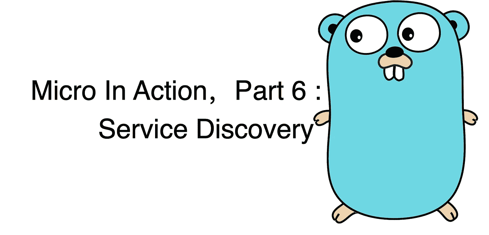

# 微观实践，第 6 部分:服务发现

> 原文：<https://itnext.io/micro-in-action-part6-service-discovery-f988988e5936?source=collection_archive---------2----------------------->



微在行动

这是“微在行动”系列文章的第 6 篇，讨论[微](https://micro.mu/)。我们将从基本概念和主题开始，然后转向高级功能。

今天的主题是服务发现。

在本系列的[第一篇文章](/micro-in-action-getting-started-a79916ae3cac)中，我们提到了 Micro 通过插件支持不同的服务发现系统。默认情况下，服务发现基于多播 DNS (mDNS)机制，这种机制不需要任何配置，在开发环境中非常容易使用。

但是在生产环境中，我们需要更可靠的产品。有不少高可靠的注册表，比如 etcd/consul/zookeeper/eureka 等等。对于这些产品，微都提供了相应的插件。它甚至为 Kubernetes 提供了一个[插件，以便将 Kubernetes 用作注册中心。](https://github.com/micro/go-plugins/tree/master/registry/kubernetes)

在所有这些产品中，etcd 是目前最受欢迎的一款。也是 Micro 内置支持的[官方推荐的](https://medium.com/microhq/deprecating-consul-in-favour-of-etcd-421941a538a6)方案。所以如果你想在 Micro 中使用 etcd，像 mDNS 一样，不需要任何插件就可以使用。

# 连接到 etcd

现在让我们尝试在示例项目中连接 etcd。

etcd 的安装和配置不是本文的重点(更多信息可以在 [etcd 官网](https://etcd.io/)上找到)，姑且假设你已经有了一个三节点 etcd 集群，地址分别是:

*   etcd1.foo.com:2379
*   etcd2.foo.com:2379
*   etcd3.foo.com:2379

由于 Micro 内置了对 etcd 的支持，我们不需要对 **hello-service** 项目的源代码做任何修改，只需在项目启动时提供两个额外的参数:

1.  **注册表**，指定注册表名称。环境变量 **$ MICRO_REGISTRY** 与该参数具有相同的效果
2.  **registry_address** ，指定注册表地址，多个地址用逗号分隔。环境变量**$ MICRO _ REGISTRY _ ADDRESS**与该参数具有相同的效果

结果如下:

```
$ go run main.go plugin.go **--registry=etcd --registry_address=etcd1.foo.com:2379,etcd2.foo.com:2379,etcd3.foo.com:2379**
2020-04-03 17:52:04  level=info Starting [service] com.foo.service.hello
2020-04-03 17:52:04  level=info Server [grpc] Listening on [::]:55300
2020-04-03 17:52:04  level=info Broker [eats] Connected to [::]:55303
2020-04-03 17:52:04  level=info **Registry** [**etcd**] Registering node: com.foo.service.hello-4bf682c8-2114-4f9c-88e0-91f870a17c72
2020-04-03 17:52:04  level=info Subscribing to topic: com.foo.service.hello
```

注意“**注册表** [ **etcd** ]”字样，表示此时与 etcd 集群的连接已经建立！

以同样的方式，运行在本系列第三篇文章的[中创建的客户端项目来完成对服务的调用。](/micro-in-action-part-3-calling-a-service-55d865928f11)

```
$ go run main.go plugin.go **--registry=etcd --registry_address=etcd1.foo.com:2379,etcd2.foo.com:2379,etcd3.foo.com:2379**Hello Bill 4
$
```

注意:除了命令行参数，我们还可以通过环境变量来控制注册表。以上面的程序为例，您也可以如下运行它:

```
$ **MICRO_REGISTRY=etcd MICRO_REGISTRY_ADDRESS=etcd1.foo.com:2379,etcd2.foo.com:2379,etcd3.foo.com:2379** go run main.go plugin.goHello Bill 4
$
```

如你所见，在 Micro 中使用 etcd 非常简单。如果没有特殊原因，etcd 永远是推荐的选择。

此外，由于命令行工具`micro`使用与其他微型项目相同的架构，它可以以相同的方式连接到注册表。例如:

```
**$ micro web** --registry=etcd --registry_address=etcd1.foo.com:2379,etcd2.foo.com:2379,etcd3.foo.com:2379...**$ micro get service com.foo.service.hello** --registry=etcd --registry_address=etcd1.foo.com:2379,etcd2.foo.com:2379,etcd3.foo.com:2379...
```

但这仅限于内置注册表 **etcd** 和 **mdns** 而已。如果要使用其他插件，需要重新编译命令行工具，这显然不是一个好的解决方案。看来我们可以用`micro`在运行时加载插件了。如果这是可行的，这将是理想的方式。与该主题相关的细节将在后续文章中单独讨论。

# 连接领事

虽然 Micro 建议使用 etcd，但您可以随时选择其他选项。下面我们用例子来说明 consul 在 Micro 中的用法。

假设我们有一个三节点 consul 集群，它的地址是:

*   consul1.foo.com:8300
*   consul2.foo.com:8300
*   consul3.foo.com:8300

使用相应的参数运行 **hello-service** :

```
$ go run main.go plugin.go **--registry=consul --registry_address=consul1.foo.com:8300,consul2.foo.com:8300,consul3.f
oo.com:8300**Registry consul not foundNAME:
    com.foo.service.hello - a go-micro serviceUSAGE:
    main [global options] command [command options] [arguments...]COMMANDS:
    help, h  Shows a list of commands or help for one commandGLOBAL OPTIONS:
    --client value Client for go-micro; rpc [$MICRO_CLIENT]
    ...
```

服务没有成功启动。这个错误的原因是我们需要在源代码中导入 **consul 插件**。

正如前面的文章中提到的，我们创建的每个项目都有一个名为 **plugin.go** 的空文件，这是按照 Micro 的约定导入插件的地方。我们修改这个文件来解决上述问题:

```
package mainimport (
   **_ "github.com/micro/go-plugins/registry/consul/v2"**
)
```

当然，我们还需要修改 **go.mod** 文件:

```
module hellogo 1.13require (
   github.com/golang/protobuf v1.3.2
   github.com/micro/go-micro/v2 v2.4.0
   github.com/micro/go-plugins/registry/consul/v2 v2.3.0 // indirect
)
```

注意 **v2.3.0** 很重要。因为这是和微 **v2.4.0** 匹配的插件版本。如果不指定，将会引入其他错误。

修改源代码，然后再次运行:

```
$ go run main.go plugin.go **--registry=consul --registry_address=consul1.foo.com:8300,consul2.foo.com:8300,consul3.foo.com:8300**
2020-04-03 17:45:46  level=info Starting [service] com.foo.service.hello
2020-04-03 17:45:46  level=info Server [grpc] Listening on [::]:54553
2020-04-03 17:45:46  level=info Broker [eats] Connected to [::]:54556
2020-04-03 17:45:46  level=info **Registry** [**consul**] Registering node: com.foo.service.hello-6a2605ad-33bb-42e2-bed3-acf370bcee14
2020-04-03 17:45:46  level=info Subscribing to topic: com.foo.service.hello
2020-04-03 17:45:47  level=info Handler Received message: 2020-04-03 17:45:47.376995 +0800 CST m=+23888.008850100
2020-04-03 17:45:48  level=info Handler Received message: 2020-04-03 17:45:48.379199 +0800 CST m=+23889.011087322
```

至此，我们的程序已经成功连接到 consul 集群。看起来也很简单。

但是你可能想知道为什么`—-**registry**`参数的值是**领事**，而不是 **cnsl** 或其他什么？在哪里可以找到注册表的名称？

这又回到了 Micro 一直做得不好的地方:**缺少文档**。回答以上问题的唯一方法:钻研源代码。

但是我在这里给你一些线索，希望能帮到你一点。以领事插件为例。关键源代码在**github.com/micro/go-plugins/registry/consul/v2/consul.go**:

```
func init() { 
    cmd.DefaultRegistries["**consul**"] = NewRegistry
}
```

一般来说，每个插件都有一个与插件同名的源文件。这是插件的主文件。这个文件中的`init`函数是插件注册自己的地方。你会在这里看到插件的名字。在这种情况下，是**领事**。其他插件遵循这个惯例。

以上两个例子说明了微插件架构的优越性。无论是使用 etcd 还是 consul，**我们几乎没有代码改动**。该框架从业务逻辑中完全隐藏了不同产品的复杂性。由于没有侵入业务代码，我们可以很容易地集成或/和切换不同的注册中心。

当然，Micro 的插件的优点还不止这些，我们会在后续文章中看到更多的例子。

# 结论

Micro 支持市场上几乎所有的注册表产品。本文以 etcd 和 consul 为例进行具体说明。

虽然有几个细节不太完善，但是 Micro 对于服务发现的功能是**完整而优雅的**。

因为有一个统一的概念贯穿整个微生态系统，它让我们能够以一致的方式操作官方的命令行工具和我们自己开发的项目。

如果您曾经从头开始处理过分布式系统中的服务发现，您将会称赞这个框架简化复杂性的能力。

未完待续。

另请参见:

*   [Micro 在行动，第 1 部分:入门](/micro-in-action-getting-started-a79916ae3cac)
*   [Micro In Action，第 2 部分:Bootstrap 终极指南](/micro-in-action-part-2-71230f01d6fb)
*   [微在行动，第 3 部分:调用服务](/micro-in-action-part-3-calling-a-service-55d865928f11)
*   [微在行动，第 4 部分:发布/订阅](/micro-in-action-part4-pub-sub-564f3b054ecd)
*   [Micro 在行动，第 5 部分:消息代理](/micro-in-action-part-5-message-broker-a3decf07f26a)
*   [微动动作，第 7 部分:断路器&限速器](/micro-in-action-7-circuit-breaker-rate-limiter-431ccff6a120)
*   [微在行动，Coda:分布式 Cron 作业](/micro-in-action-coda-distributed-cron-job-a2b577885b24)
*   [微在行动的索引页](https://medium.com/@dche423/micro-in-action-1be29b057f2d)