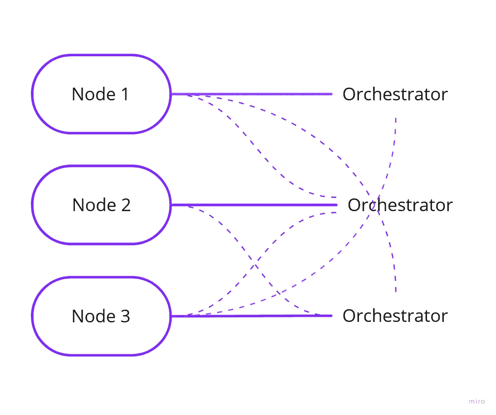

# 微服务，清理定义

> 原文：<https://itnext.io/microservices-clearing-up-the-definitions-f679ebb794cb?source=collection_archive---------1----------------------->

在前一篇文章中，我们研究了松散耦合如何导致更大的复杂性。

 [## 微服务和松耦合的神话

### 在上一篇文章中，我们讨论了什么是微服务，为什么它们看起来是一个好主意，以及直觉的陷阱…

itnext.io](/microservices-and-the-myth-of-loose-coupling-9bbca007ac1a) 

在本文中，我们将尝试建立一种大家都能认同的方法来推理微服务。

根据我的经验，对软件边界的一个非正式定义，比如“按领域去耦合”,是一个圆孔的方钉。这是因为软件正确性标准是正式的，即使我们没有这样写。给定足够的负载，我们最终会遇到我们的软件是否稳定的严峻事实，这些错误通常很难在测试中识别。说到这里，我真诚地写这篇文章，并积极寻找我既定观点的可能替代方案。

由于微服务的构成还没有正式的定义，我们将不得不以文献中出现的内容为基础。我们需要非常自由地对待我们允许的事情，否则有些人会有理由感到被歪曲了。另一方面，我们需要非常严格地定义每个原则的实用性，否则这篇文章在寻找我们正在寻找的真理时不会非常有用。

基于之前的阅读，我收集了一些所有定义的共同主题:

*   多个 10 人以下的独立团队
*   [领域驱动](https://en.wikipedia.org/wiki/Domain-driven_design)职责分离
*   分散的数据(即:没有单一的中心整体)
*   每个参与大型软件的微服务

如果我们要真诚地遵循这些原则，我们需要考虑一些警告，比如日志记录或监控。如果微服务是某个更大的软件实现的一部分，我们需要从“分散数据”需求中原谅可观测性的顾虑。我不认为任何人能够或者应该期望一线支持人员通过挖掘二十几个微服务日志来发现客户请求的问题。我们将把第三点限定为“分散的内部应用程序状态”。

如果微服务作为更大软件的一部分存在，我们还需要定义一些涉及多个微服务的服务。如果做不到这一点，我们将拥有独立的服务，如“报告”、“销售支持”和“簿记”，在这些服务中，需要具有灵活性(和出错倾向)的人工智能将相同的信息输入到多个系统中。这种实践的不可行性在 90 年代末，00 年代初引发了软件集成的概念。接下来，除非我们想回到这一点，否则微服务将需要以某种方式共享一些数据。

这可能通过以下任一方式发生

*   一个服务查询另一个服务，
*   信息子集的共享数据库，或者
*   通过从另一个复制一些信息，

或者这些的某种组合。

我们新的、更正式的定义如下:

*   微服务之间的共享数据(共享、查询或复制)
*   操作(可能)读取和更新多个微服务
*   一些具有原子事件的独立管理的数据存储

通过编排器连接的节点

我肯定有些人已经不同意到目前为止的评估，但我认为我们可以在以下声明上达成一致。

> 为了使软件具有可预测性，我们需要确保从客户的角度来看，单个事件在整个系统中得到反映。

这意味着，如果客户要求一个改变，它的所有方面都需要被系统作为一个单一的包接受或拒绝，我们不能挑选哪些方面要做或不要做，除非我们有一个直观的方式来提示用户我们没有实现什么，并且错误被转移回客户。显而易见，如果我们考虑到这样的失败，我们必须为最终用户设计相应的“翻译”，这意味着了解我们的客户对该系统的能力水平。换句话说，我们可以将一些责任转移给最终用户，但只有那些我们可以期望他们通过提供合适的工具来适当管理的责任。

上面已经阐明了一个有用的框架来推理微服务。我们知道我们

*   维护多个状态存储，
*   在此状态下运行操作，
*   必须能够减轻由此环境引起的特定故障案例

换句话说，我们需要知道整个整体软件(所有微服务的集合)的行为在哪里以及如何与我们在需求中列出的不同。

在下一篇文章中，我们开始正式化一个简单的框架，根据这里建立的定义来推理应用程序的正确性。

[https://andrasgerlits . medium . com/a-micro services-and-how-to-analyze-them-aa 6d 33 F4 DC F6](https://andrasgerlits.medium.com/a-microservices-and-how-to-analyse-them-aa6d33f4dcf6)