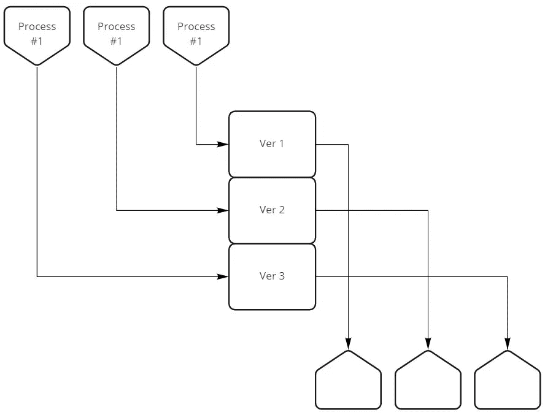

# 微服务，关于边界的推理

> 原文：<https://itnext.io/microservices-reasoning-about-boundaries-8da26c0271cb?source=collection_archive---------2----------------------->

在上一篇文章中，我们讨论了分析微服务应用的正确性需要了解的内容，并得出结论:几乎不可能描绘出所有可能的结果。

 [## 微服务及其分析方法

### 在上一篇文章中，我们定义了一个简单的框架来推理我们需要知道什么来实现一个…

itnext.io](/a-microservices-and-how-to-analyse-them-aa6d33f4dcf6) 

在这篇文章中，我们将开始研究如果我们要构建一个分布式平台，需要什么来稳定我们的软件，以及当我们决定分离时，如何引导我们的手。

大多数定义共有的一个重要规则是，微服务必须由它们的“域模型”边界来分隔。领域模型是企业对其运营世界的看法，考虑独立的会计、CRM、库存微服务。这是一个非正式的定义，其中状态和行为按照其以人为中心的含义被归类在一起。这有助于确保从事这些服务的工程师对公司的这些特定领域有必要的了解，但对解决前一章中确定的数据问题没有帮助。

在定义边界时还会出现另一个需求，那就是避免分布式事务。这更正式，所以我们将遵循这条推理路线。微服务意味着独立的原子更新和读取。如果做不到这一点，如果它们在多个服务之间共享一个事务，它们就应该被称为一个整体。分布式事务是指读取或更新至少两个原子操作的微服务。

我们将暂时忽略潜在的读取一致性问题(在这个定义中包括读取意味着微服务之间没有有意义的交互),并专注于避免更新多个服务的进程。修改任何信息的任何进程必须只在单个微服务上工作，并将这些修改作为单个操作来执行。

应该对多个微服务可用的信息只能由一个服务在每次需要该信息时查询另一个服务来共享。其他任何事情都将违反我们不允许分布式事务的原则。请记住，当我们说“更新”时，我们指的是我们可能直接或间接回读的所有内容。如果我们向外部服务发送更新，可以查询我们写的信息并将结果存储在我们的本地服务中，我们已经违反了这个契约。

我们知道，如果我们不这样做，我们的软件将是不可预测的(从上一章)，但如果我们这样做，它会可靠吗？

通过共享资源序列化的流程

## 锁定类型

当谈到单个多进程计算机上的数据一致性时，我们依赖于一种叫做[同步原语](https://en.wikipedia.org/wiki/Synchronization_(computer_science))的东西。这些由操作系统向编程语言公开，可用于确保进程以某种可预测的顺序(由程序员定义)执行，或者确保计算机上的信息保持同步。在我们的分布式系统中，我们还需要确保某些过程可以顺序执行，以了解是否有人可以合理地期望我们编写可预测的软件。

由于我们已经决定依靠单一微服务进行更新，我们知道可以可靠地订购它们。这类似于我们所说的独石上信息的[排他锁](https://en.wikipedia.org/wiki/Readers%E2%80%93writer_lock)。进程 **A** 被给予对其更新的信息的独占访问权，同时试图访问该信息的其他进程被使得等待，直到 **A** 完成其所有任务并终止。我们现在缺少的就是[共享锁](https://stackoverflow.com/questions/11837428/whats-the-difference-between-an-exclusive-lock-and-a-shared-lock)。共享锁确保它所代表的信息在被查看时不会被修改。这意味着一条信息上可以存在多个共享锁，它的存在只允许更新。

当我们根据之前从数据库中读取的内容决定更新时，共享锁非常有用。例如，在我允许顾客从我的图书馆借书之前，我想检查他们的未清余额。我们不希望另一个进程在存储关于所借书籍的信息时使它们负债，因为我们不允许在负余额的情况下这样做。

在我们的微服务环境中，我们无法做到这一点。我们赖以决定系统更新的信息要么必须允许在更新期间更改，要么必须全部位于同一个微服务中。

简而言之:只有当我们能够保证这一点时，概述的设置才是适当的

*   没有进程会更新多个微服务
*   用于做出更新决策的信息要么从来都不重要(我们可以通过计算它们所有的潜在状态及其连锁效应来证明这一点)，要么在同一个微服务中

从个人经验来说，我从来没有见过一个基于微服务的项目在第一个需求上成功，更不用说第二个了，但是轶事不是统计数据。我确信会有成功的例子。

从所有这些中可以看出，一旦决定使用基于微服务的分布式架构，如果没有彻底的改变，他们不会轻易改变主意。这当然也适用于其他架构，但是微服务有一些独特的痛点，即使对于资深软件工程师来说也不明显。

在下一篇文章中，我们将看看如何超越这些限制，以及如果我们决定实现分布式软件，有什么样的工具可用。