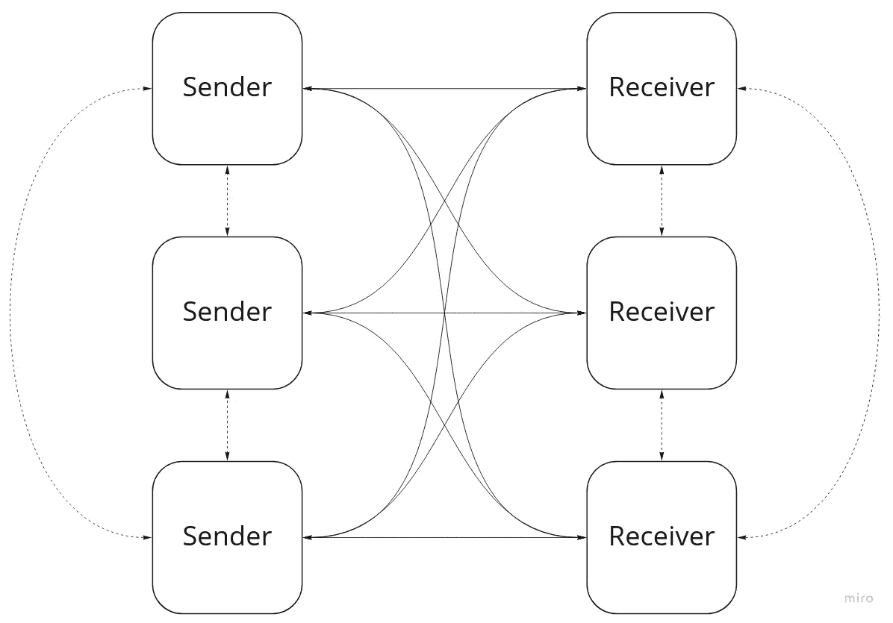
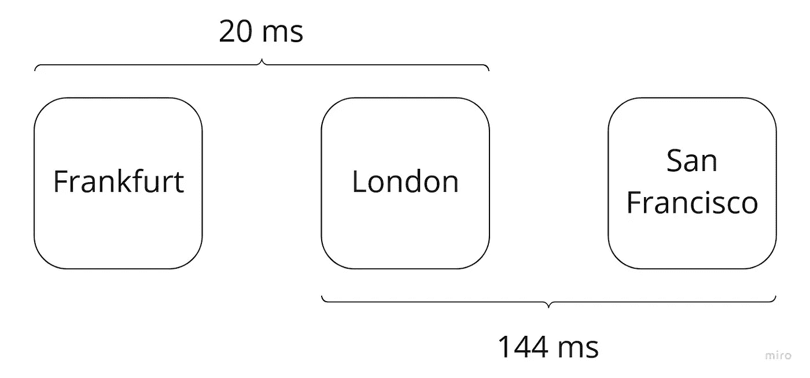

# 微服务:完美的系统会是什么样的#1？

> 原文：<https://itnext.io/microservices-what-would-the-perfect-system-look-like-653a245915b?source=collection_archive---------1----------------------->

在上一篇文章中，我们描述了一个框架，通过讨论空间和时间之间的权衡，我们可以通过这个框架对分布式、一致的系统进行推理。

 [## 微服务:为什么我们认为沟通是错误的

### 在之前的系列文章中，我们已经确定微服务缺乏一致性保证…

itnext.io](/microservices-why-we-think-about-communication-wrong-d7590847cc8d) 

在本文中，我们将开始绘制最佳可能系统的轮廓，它显示了我们前面谈到的所有理想特征。我们将进一步发展我们早期的想法，巩固我们已经确立的界限。我们知道，我们希望以某种方式“驯服”长距离网络通信(即:补偿它们的不可预测性)，创建一个分布式时钟算法和一种方法来补偿在我们等待结果时发生的信息偏差。从前面我们也知道，没有时钟算法，我们就谈不上信息不对称。我们将从讨论网络和时钟开始。

# 网络

众所周知，计算机网络不可靠。事实上，这种不可靠性主导了许多分布式系统文献。最基本的问题是，我们需要计算机相互交流以获取我们要寻找的信息，但这一渠道并不均衡。它可能会聚集成大块，它的一些部分可能会在“交通堵塞”中被阻塞，信息甚至可能会在途中丢失，之后参与通信的任何一方都无法确切知道发生了什么。

换句话说，我们描述通信的模型依赖于一个发送者，一个接收者，以及通过他们之间的通信硬件阵列的信息流。这很直观，而且显然是定义消息发送和接收的唯一方法。这也是不对的。

十多年来，计算机一直在利用一种叫做“共识小组”的技术，这一理论在 30 多年前首次发表。共识组是一组通过网络连接的计算机，它们彼此相距很近，通过共享协议进行通信。当客户端向这些计算机中的任何一台查询“值 X”时，它们中的任何一台要么以相同的值响应，要么以错误响应，说明失败的原因。只要组中的大部分计算机都工作，并且可以相互对话，这个组就可靠。因此，如果共识小组为客户端计算机提供“读”和“写”服务，并且这些计算机中的每一台都有可靠的方法来收集或改变这些信息，那么我们显然也不需要依赖一台计算机来进行通信。由于我们可以选择信息在两台计算机之间的传输位置(例如，通过在计算机之间手动中继数据)，并且我们可以拥有相同信息的多个来源，因此我们不应该依赖单个通道在组之间转发消息(只要我们可以在接收方检测到重复)。

如果我们有多个通道运行在多个平行的路径上，那么它们遇到障碍的机会就会减少。比方说，我们包裹迟到的几率是 1 : 100。这是一个任意的度量，我们可以将这个尺度放在我们喜欢的任何地方，但所谓的“尾部延迟”经常在“P99”的术语中谈论，这正是这个度量。比方说，我们有三个不同的渠道，通过它们信息在两组人之间传递。如果这些渠道是不相关的，那么它们获得同一条信息的几率就变成 1 : 1 000 000。过去每秒钟发生一次的事情，现在大约每 3 小时发生一次。在发送端和接收端都有 3 个节点的情况下，我们可以有 9 个这样的通道。这些都是天文数字的机会，即使每个渠道不会完全与其他渠道无关。

显然，增加更多的冗余会导致更多的成本，但请记住，我们在这里谈论的是数据库，而不是视频流，因此传输的信息量仍然很少。

# 分布式时钟

正如上一章所讨论的，分布式时钟是关于如何排序信息的协议，由参与系统的所有计算机共享。就像在现实世界中一样，我们应该更快地接触到离我们更近的信息，而不是来自更远的信息。这说明了非常遥远和本地之间的滑动比例。因为我们已经确定我们将需要这样的计算机组，这将不得不被分组为块，或者换句话说，一个向量。

因此，显而易见的是，如果我们从系统中的计算机的角度来看，我们需要一个向量来表示位于我们和最远的计算机之间的每一簇计算机。对此的一个显而易见的解释是，如果我们在一个越来越宽的视野中的每一步都在这个向量中有一个条目，我们就可以通过识别我们与远程信息的发起者共享的计算机组来比较更远的信息。换句话说，如果这个神奇的向量可以用来识别每个条目代表哪些组，我们就可以在任何两个这样的向量之间建立一个顺序，只要这两个向量共享至少一个公共组。

让我们采用最简单的实现，看看它会把我们引向何方。我们将需要任何两个组在其向量中共享至少一个组，所以我们将它们构建成一个层次结构。在顶部，我们有一个单独的组，即“根组”。我们在组之间建立父子关系，从根开始。每个父级可以有多个子级，但是任何子级只能有一个父级。

假设每创建一条新信息，每个组就增加一个计数器。这可能是一个新记录，也可能是一个交易，这取决于我们正在谈论的系统的类型，具体细节并不重要。我们如何创建向量？如果孩子将他们的“创建事件”传达给他们的父母，您可以将父母从其孩子那里接收的新信息限定为“新信息”，这可以获得其自己的父母计数器的“滴答”。这在父子组之间建立了关联。由于计数器在每个事件上递增，因此是原子性的，这就在任意两条信息之间拼出了一个顺序。由于这些向量的第一个(或最后一个，取决于你的观点)元素将总是由根组创建，并且由于“最终”所有计数器增量可以向上同步，如果我们可以将这个向量传递给系统中创建的每条信息，我们可以在它们之间有一个全局顺序。

> 注意，我们知道这个系统，如这里所描述的，在实践中是不可行的。这种机制向根组引入了爆炸性的反压力，根组需要在其所有子组上注册所有新信息的创建。对于现有的分布式数据库，这对于最大的计算机来说显然是不可行的。我们使用这个模型来逐步推理一个消除这些瓶颈的模型的理论。

请注意，由于通信延迟，这些群体中的信息将逐渐暴露给它的读者，其速度取决于他们与信息源的相对距离。你可以把它想象成一个“即时”的时间传递系统，它在我们的物理世界中按照可观察性极限的自然、物理顺序流动。

# 摘要

我们在这里取得了一些成就，但这还远远不是一个可行的系统。在下一篇文章中，我们将讨论第一章中介绍的“信息不对称”问题。我们还将考察将单个一致性组作为整个分布式数据库的中心支柱运行的可行性，并对我们刚刚介绍的“单个组”瓶颈进行推理。我们也忽略了这样一个系统的实用性。我们如何在远程组之间复制信息？我们如何找到信息？

我们将在下一篇文章中讨论(至少是部分)这些事情。