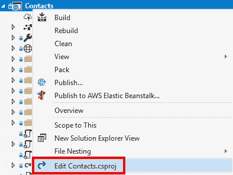

# 从 ASP.NET 核心 2.0 迁移到 2.1

> 原文：<https://itnext.io/migration-from-asp-net-core-2-0-to-2-1-c225d1fe385f?source=collection_archive---------11----------------------->

5 月 30 日[。NET Core 2.1](https://blogs.msdn.microsoft.com/dotnet/2018/05/30/announcing-net-core-2-1/) 发布包括【ASP.NET】Core 2.1 和[实体框架 Core 2.1](https://blogs.msdn.microsoft.com/dotnet/2018/05/30/announcing-entity-framework-core-2-1) 的相应版本。在这篇文章中，我将采用我的 ASP.NET 基础系列中使用的一个项目，并将其从当前的 2.0.x 版本转换为新发布的 2.1 版本。代码的起点可以在这里找到。这都是基于[官方移民指南](https://docs.microsoft.com/en-us/aspnet/core/migration/20_21?view=aspnetcore-2.1)的。

如果您正在查看示例解决方案，那么这篇文章将要处理的就是 Contacts 项目。

## 装置

谢天谢地，下载页面比上次发布时有了很大的改进。头[此处](https://www.microsoft.com/net/download/dotnet-core/)并下载安装。网芯 2.1 SDK。它适用于 Windows、Linux 和 Mac。该链接会将您带到适用于您的操作系统的相应页面。

安装后，打开命令提示符并运行以下命令。如果一切正常，您应该会看到列出的版本 **2.1.300** 。

```
dotnet --list-sdks
```

如果您使用的是 Windows，请确保至少安装了 [Visual Studio 2017 15.7](https://docs.microsoft.com/en-us/visualstudio/releasenotes/vs2017-relnotes) 。

## 项目文件更改

右键单击项目并选择**编辑{项目名称}。菜单中的 csproj** 。



首先，将 **TargetFramework** 改为 **netcoreappp2.1** 。

```
Before:
<TargetFramework>netcoreapp2.0</TargetFramework>

After:
<TargetFramework>netcoreapp2.1</TargetFramework>
```

另一个需要改变的是远离微软。AspNetCore.All 包给无版本**的微软。AspNetCore.App** 包。

```
Before:
<PackageReference Include="Microsoft.AspNetCore.All" Version="2.0.0" />

After:
<PackageReference Include="Microsoft.AspNetCore.App" />
```

我做了更多的挖掘，结果是项目文件可以从我为这个应用程序准备的版本中大大简化。以下是完整的项目文件，将所有不需要的位删除，上述两个变化已经作出。

```
<Project Sdk="Microsoft.NET.Sdk.Web">

  <PropertyGroup>
    <TargetFramework>netcoreapp2.1</TargetFramework>
    <UserSecretsId>Your-Secrests-ID</UserSecretsId>
  </PropertyGroup>

  <ItemGroup>
    <PackageReference Include="Microsoft.AspNetCore.App" />
    <PackageReference Include="Microsoft.VisualStudio.Web.CodeGeneration.Design" Version="2.1.0" PrivateAssets="All" />
    <PackageReference Include="Swashbuckle.AspNetCore" Version="1.0.0" />
  </ItemGroup>

</Project>
```

## 主要变化

为了更好地支持[集成测试](https://docs.microsoft.com/en-us/aspnet/core/test/integration-tests?view=aspnetcore-2.1)，对主函数的外观进行了修改。这是 **Program.cs** 文件中的原始代码。

```
public class Program
{
    public static void Main(string[] args)
    {
        BuildWebHost(args).Run();
    }

    public static IWebHost BuildWebHost(string[] args) =>
        WebHost.CreateDefaultBuilder(args)
            .UseStartup<Startup>()
            .Build();
}
```

下面是新的版本。

```
public class Program
{
    public static void Main(string[] args)
    {
        CreateWebHostBuilder(args).Build().Run();
    }

    public static IWebHostBuilder CreateWebHostBuilder(string[] args) =>
        WebHost.CreateDefaultBuilder(args)
            .UseStartup<Startup>();
}
```

## 启动更改

**Startup.cs** 有一个需要修改的地方，那就是从 Configure 函数中删除下面一行。

```
app.UseBrowserLink();
```

在 ConfigureServices 功能中，如果您想要使用 2.1 中的新功能，请更改服务。AddMvc()设置[兼容版本](https://docs.microsoft.com/en-us/aspnet/core/fundamentals/startup?view=aspnetcore-2.1#setcompatibilityversion)。这允许您升级 SDK 的版本，而不必更改整个应用程序，因为您必须选择您想要的版本。

```
Before:
services.AddMvc();

After:
services.AddMvc().SetCompatibilityVersion(CompatibilityVersion.Version_2_1);
```

如果你查看官方迁移指南，他们还会指出如何启用更多的功能，如 HTTPS 和一些有助于 GDPR 的功能。这两者在这个应用程序中都不需要，所以我在本指南中跳过它们。

## 身份变化

我不得不在 **ManageLogins.cshtml** 中做一个更改，以构建我的项目，因为要将 **AuthenticationScheme** 重命名/移除为 **DisplayName** 。

```
Before:
<button type="submit" class="btn btn-default" name="provider" value="@provider.AuthenticationScheme" title="Log in using your @provider.DisplayName account">@provider.AuthenticationScheme</button>

After:
<button type="submit" class="btn btn-default" name="provider" value="@provider.DisplayName" title="Log in using your @provider.DisplayName account">@provider.DisplayName</button>
```

如果您没有对项目中的身份代码做很多更改，那么您可以考虑使用新的 identity razor 类库。详情[你可以在这里](https://docs.microsoft.com/en-us/aspnet/core/migration/20_21?view=aspnetcore-2.1#changes-to-authentication-code)找到。

## 包扎

随着时间的推移，ASP.NET 核心的版本之间的迁移变得越来越容易，这可以从这些帖子的较短长度中看出。需要注意的一点是，虽然这将使您以 2.1 为目标，获得所有的性能优势和许多新功能，但如果您想以新的 2.1 风格做所有的事情，仍然需要做一些工作。我强烈建议创建一个新的 2.1 应用程序，感受一下您可能希望对现有应用程序进行的其他更改。

所有修改的代码可以在这里[找到。请记住，唯一升级的项目是**联系人**项目。](https://github.com/elanderson/ASP.NET-Core-Basics/commit/0d5b219025e37a50c0df42d41098dccf5ef039fb)

*原载于*[](https://elanderson.net/2018/06/migration-from-asp-net-core-2-0-to-2-1/)**。**