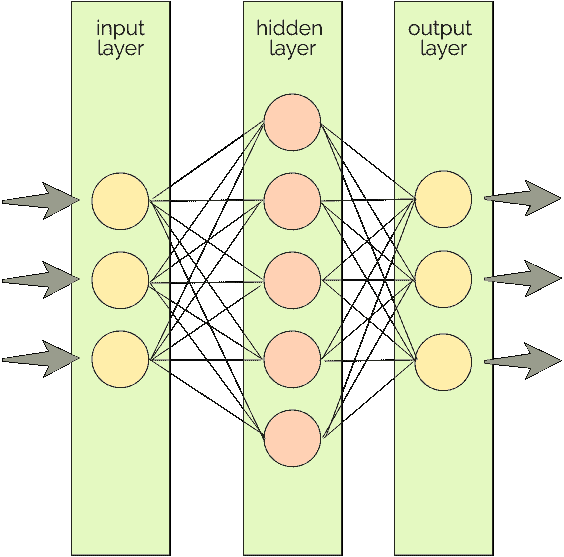
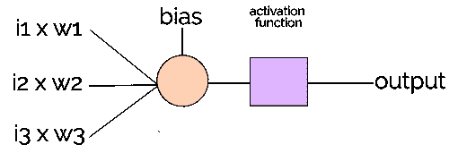

# ML 编程让[太多]变得简单—第 1 部分

> 原文：<https://itnext.io/ml-programming-made-too-much-easy-part-1-cf9171e41dfb?source=collection_archive---------5----------------------->

机器学习(ML)是计算机科学中的一个领域，它从不同的角度看待算法。在常规算法中，对于给定的问题，程序是用 for 循环和 if 语句显式实现的，与之相反，ML 算法试图找出问题所在的单词。对问题世界进行编程通常始于建立一个描述该世界的模型，并用输入和预期输出对其进行训练。例如，为了识别猫的图像，我们用大量不同的猫图像作为输入来训练模型。训练过程很像孩子们训练认识世界上的事物，给他们许多猫的例子，他们可以认识一只新的猫，而不用看它。其结果是一个经过训练的模型，可以以一定的精度求解或预测任何类型的输出。

在 ML 中，我们定义了两种算法:监督学习和非监督学习。监督学习还有两种类型的预测:回归和分类。通过回归给出对输出的预测，通过分类给出对输入进行分类。当训练任务的目标是减少损失函数(预测输出和期望输出之间的误差或距离)时，可以基于给定的输入和期望输出来优化监督学习。无监督学习的数据是未标记的，这意味着没有输入和输出——一切都是输入，任务是找到它们之间的关系。无监督学习没有优化，因为没有变量可以测量。

人工神经网络(ANN)是 ML 算法的一种实现。ANN 试图模仿我们大脑的工作方式(当然非常简单),通过建立一个由边连接的节点层组成的网络。每层都有 1 到多个节点通过边连接到上一层和下一层。第一层是输入层，将拥有尽可能多的节点和输入。最后一层是输出层，具有与输出一样多的节点。所有其他层是提供网络深度的隐藏层，每个层由不同数量的节点组成。层之间的节点可以完全连接或部分连接，例如每个节点可以连接到所有节点或下一层中的一层。

高级人工神经网络

每条边都有来自前一个节点的输出，并基于权重产生一个输入。每个节点都有来自边的输入，一个偏置的初始值和一个产生输出的激活函数。输出为(1nikwk+bias)。

单一人工神经网络节点

偏差是等式的重要部分，因为它允许水平移动激活函数，而权重改变函数的陡度。例如，我们可以将激活函数与线性函数 y = ax + b 进行比较，这里 b 是偏差。如果没有 b 参数，值将总是从原点开始。激活函数可以是任何函数，但最常见的是 sigmoid、relu 和 linear。

为了理解隐藏层的作用，我们需要考虑输入结构。隐藏层通过连接具有不同权重的不同节点来赋予模型“深度”。隐藏层中的每个节点是来自前一层的输入的不同组合，这创建了给予下一层的一组新的变换输入。因此，为了创建正确的结构，我们需要调查输入结构，并了解我们需要哪些转换来获得最佳结果。

梯度下降

在训练阶段，权重和偏差被调整到正确的值，根据具有给定输出的给定训练数据集产生不同的权重和不同的变换。训练阶段通过向模型提供测试数据集来完成，获得预测，找出我们做得有多差，相应地改变权重，并再次检查流程。对训练数据集的每次迭代被称为历元。为了得到正确的结果，我们进行了多次实验。

为了训练，我们使用反向传播，这是梯度下降的叠加应用。梯度下降是寻找损失函数的局部最大值或最小值的过程，它告诉我们离实际结果有多远。损失函数根据输入和期望输出而变化，例如可以是均方误差、软 ma 等。最后的训练步骤是让每个节点学习如何最佳地组合特征，然后结果是每个节点的权重和偏差。

要了解如何使用 python 和 Tensorflow 实现人工神经网络，请访问第二部分。

