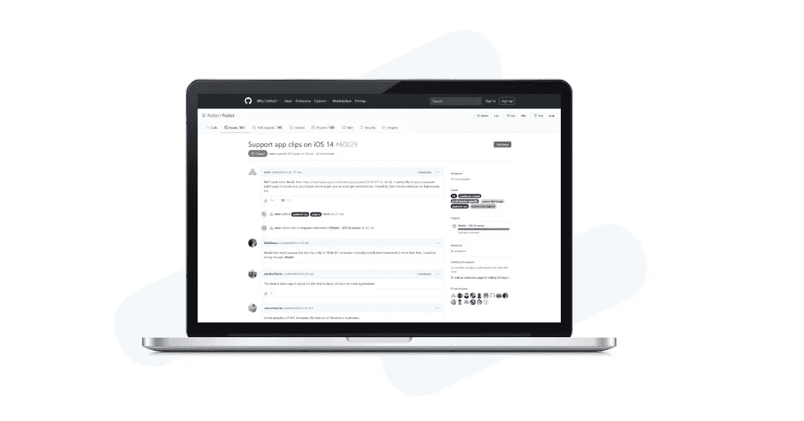

# 移动开发:颤振与本土化

> 原文：<https://itnext.io/mobile-development-flutter-vs-going-native-4c5189df6e83?source=collection_archive---------4----------------------->

你对这个应用程序有一个很棒的想法，在研究移动开发时，一个词引起了你的注意:**。它向你承诺提供一个可以在苹果的 iOS 和谷歌的 Android 系统上运行的应用程序。这似乎正是你所需要的。你希望两个平台都有一个应用，而不是两个。不管怎样，它们差不多都是一样的！合理高效。那么为什么这么多公司把 iOS 和 Android 开发分开呢？为什么不加入这一潮流呢？答案隐藏在一个不同的问题背后:**能胜任并持续地在两个平台上提供高质量的应用吗？****

# **移动开发的圣杯**

**至少十年来，移动开发一直只在两个平台上进行，开发者一直在寻找移动开发的圣杯。**跨平台**解决方案，允许他们**编写一个应用程序，并在两个系统上运行**。有许多候选药物:Ionic、Xamarin、React Native 和现在的 Flutter——这些只是更受欢迎的例子。为了理解颤振，我们需要看一下其中一些的历史，并看看是什么使颤振在比较中独一无二。**

****

# **非本地移动框架生命周期**

**因为所有的跨平台框架都有一个非常相似的生命周期，所以我们只使用一个名字:Framework X。**

# **1.镇上的新玩家**

**在这个阶段，没有人愿意用它来做商业产品。只有处于技术前沿的开发人员和最大的爱好者才愿意学习 x。大多数只是为了好玩或作为自我完善的练习。**

# **2.热门的新玩具**

**在这个阶段，早期采用者已经做出了他们的判断:X 很有趣，很现代，并且能够满足商业产品的业务需求。它不受以前解决方案的所有遗留问题的限制。清淡清新。这是一种前进的方式。**

# **3.稳定**

**足够多的开发人员加入到 X 潮流中来，围绕框架创建一个稳定的生态系统。有了社区的所有累积工作，最终有可能用 x 开发一个商业上可行的产品。**

****

# **4.黄金时代**

**越多的开发者围绕框架开发生态系统，越多的人和企业愿意加入 X 热。这个雪球变成了一个成熟的解决方案。当社区还活着，X 得到了所有的关注，开发者将为每一个新的原生特性创建一个库。X 的可能性与最新的本地特性不相上下。苹果是否创造了通过 Apple Pay 支付的新方式？不用担心，开发者会在 X 中创建一个库，让你可以使用 Apple Pay。苹果昨天宣布的，已经提供原生库了？别担心，X 会在不到一个月的时间里让它投入使用！**

**顺便说一句，这就是我们对颤振的看法。**

# **5.吃自己的尾巴**

**几年后，当尘埃落定时，苹果和谷歌仍在为相同的旧原生框架提供新特性和新库。它们也改变了旧东西的工作方式。x 开发者现在开始努力跟上苹果和谷歌(记住，他们正试图跟上世界上最大的两家公司的步伐)，更不用说增加新功能或修复他们在这一过程中犯下的错误了。在这个阶段，X 变大了，也变重了。现在还有遗留问题。这不是我们当初报名的初衷！**

# **6.城里来了个新玩家。只是不再是 X 了**

**城里来了个新玩家。它是新鲜的，新的，轻量级的，不受大量遗留物的限制。也不是 X X 是旧闻了。所有追逐闪亮新技术并鼓励转向 X 的开发人员都放弃了这条船。只有那些花了太多时间去放弃它的人才会留下来。它们数量不多，而且很贵。**X 里有很多** [**项目**](https://applover.com/projects) **供他们选择，想从事这项技术的人并不多。**他们是这艘沉船的船长，他们可能拿着你的项目索要赎金。您可以遵从它们，也可以从头开始使用 native(或者，如果您没有吸取教训，就加入新的跨平台潮流)。最重要的是，你不能指望 X 会获得 Android 和 iOS 所有最新的原生功能(或者至少:它会一直存在)。x 的光辉岁月一去不复返了。**

**只需对比一下(非常“老”)Xamarin、(老”)React Native 和(最新)Flutter 社区是如何对待最新的 iOS 14 App Clips 功能的。看看这三个人都得到了多少评论和互动。看看 Xamarin 看起来有多糟糕(一些评论甚至建议，由于大小限制，这根本不可能！):**

*   **[https://github . com/react-native-community/discussions-and-proposals/issues/252](https://github.com/react-native-community/discussions-and-proposals/issues/252)**
*   **[https://github.com/flutter/flutter/issues/60029](https://github.com/flutter/flutter/issues/60029)**
*   **[https://github.com/xamarin/xamarin-macios/issues/8932](https://github.com/xamarin/xamarin-macios/issues/8932)**

****

# **追求圣杯还是徒劳无功？**

**用跨平台解决方案取代本地开发现在看来可能是一个可怕的想法。那么人们为什么要这么做呢？因为很多时候它就是有效。当你不需要一个使用本机系统所有功能的复杂应用程序，并且你接受整个框架的限制和生命周期**时，这是一个完美的选择。**跨平台对于原型和检查市场来说是非常出色的。如果你想尽快把你的产品推向市场，并且一旦产品上市(就像任何人都会做的那样……)你可以接受**重写整个东西并从头开始，那么跨平台就是一条路。这是商业风险。以潜在的可维护性为代价的更低的初始成本和更快的迭代，这可能会成倍地增加潜在的维护成本。当创造一个新产品，将保持多年来，本土仍然是一条路要走。这一切都归结于商业理念的生命周期。****

# **但是在跨平台世界中，Flutter 带来了什么呢？**

**但幸运的是，对于旋舞来说，野心并不是故事的结尾。Flutter 是由谷歌开发的，人们对它的希望和期望都很高！**是 Google 的**[**Fuchsia**](https://fuchsia.dev/fuchsia-src/concepts)**操作系统**的原生应用选择。如果你从未听说过它，不要担心，它仍然处于发展的早期阶段。Fuchsia 的目标是在未来取代 Android，所以我们将讨论 iOS 和 Fuchsia 开发，而不是 iOS 和 Android 开发。而且**无论如何你都需要做一个 Flutter 应用**，所以为什么不努力让它也兼容 iOS，**完全消除对 iOS 的需求。虽然看起来很吸引人，但这只是对未来的猜测。也就是说，这是一个巨大的优势，可以保持颤振漂浮，与以前的跨平台尝试相反。****

***原载于 2020 年 10 月 13 日 https://applover.com**的* [*。*](https://applover.com/blog/mobile-development-flutter-vs-going-native)**